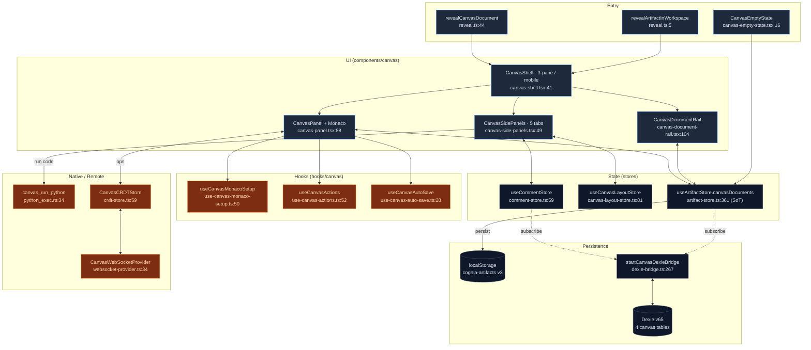
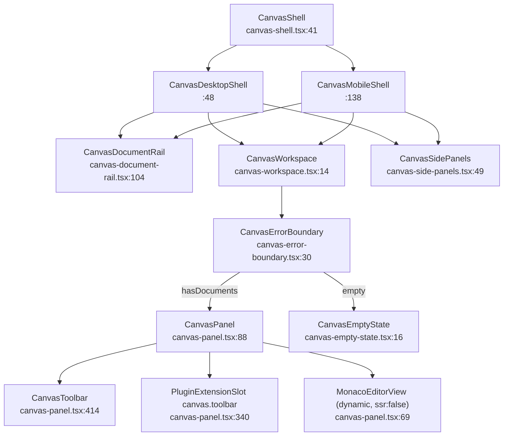

# Canvas

<Status variant="stable" />

<TLDR>
  Canvas is the editable "Workspace" surface of cognia-next: a real Monaco editor mounted directly
  in the React tree, wrapped by an AI action toolbar (review / fix / improve / explain / simplify /
  expand / translate / format) and a five-tab right panel (Suggestions · History · Comments ·
  Collaboration · Execution). Documents are owned by a **single store** —
  `useArtifactStore.canvasDocuments` (`stores/artifact/artifact-store.ts:361`), persisted to
  `localStorage["cognia-artifacts"]` and **write-through mirrored** to four Dexie tables by
  `startCanvasDexieBridge` (`lib/canvas/dexie-bridge.ts:267`). Real-time co-editing is an optional
  CRDT + WebSocket layer; Python runs by spawning a real interpreter on the Rust side
  (`canvas_run_python`, `src-tauri/src/canvas/python_exec.rs:34`).
</TLDR>

<StatGrid>
  <Stat label="Source files" value="~60" hint="lib/components/hooks/stores/types + 2 Rust" />
  <Stat label="Dexie tables" value="4" hint="documents · versions · comments · sessions (v11, schema now v65)" />
  <Stat label="Side-panel tabs" value="5" hint="Suggestions · History · Comments · Collaboration · Execution" />
  <Stat label="AI actions" value="10" hint="ACTION_PROMPTS in canvas-actions.ts:47" />
  <Stat label="Zustand stores" value="6" hint="1 source-of-truth + 5 canvas-specific" />
  <Stat label="Feature flags" value="2" hint="aiWorkbench.v1 · collaboration.v1 (both default on)" />
</StatGrid>

## What It Is

Canvas is Cognia's take on the "Workspace" experience. A user generates a code or document block in
chat, clicks **Open in Canvas**, and a Monaco editor opens in the workspace panel. From there:

- AI can **continue rewriting** the document — every action produces a reviewable diff before it lands.
- Documents have **version history** — any AI change, manual save, or auto-save creates a `CanvasDocumentVersion` snapshot.
- Multiple clients can **co-edit** the same document over WebSocket + a vector-clock CRDT.
- An embedded **Python execution panel** runs code next to the editor (desktop only).
- **Comments + reactions** anchor to line ranges, Google-Docs style.

Canvas and [Artifacts](../artifacts-sandbox) are two distinct paths that share storage:

- **Artifact** — one-shot generated content, rendered in a sandboxed iframe.
- **Canvas** — a document meant for continuous editing, with Monaco mounted directly in the main React tree.

The entry point that "upgrades" an artifact into the workspace is `revealArtifactInWorkspace`
(`lib/artifacts/reveal.ts:5`), triggered by `handleOpenInCanvas` on the chat artifact part
(`components/chat/message-parts/artifact-part.tsx:48`). Its twin `revealCanvasDocument`
(`reveal.ts:44`) does the same for a canvas document that already exists — it activates the
document and switches the shell to the Canvas guild. There is **no** `/canvas/<id>` route: the app
is a static export with no dynamic segments, so the anchor the inline canvas card used to render
404'd on every click.

## Module Map

Each box is a documentation page. Read the per-module page for line-accurate internals.

<Cards>
  <Card title="Editor core" href="./editor-core" description="Monaco mount + offline loader, the 3-pane shell, document rail/tabs, theme sync, symbols, snippets, plugins, large-file chunking, keybindings" />
  <Card title="State & persistence" href="./state-persistence" description="The single source of truth (useArtifactStore), 5 canvas stores, the Dexie write-through bridge, the 4 tables, feature flags" />
  <Card title="AI actions & suggestions" href="./ai-actions" description="The 10 action prompts, diff-review apply pipeline, the structured-suggestion stream, the standalone context-analyzer" />
  <Card title="Collaboration" href="./collaboration" description="Vector-clock CRDT, the WebSocket provider (fixed-interval reconnect + heartbeat), sessions, the /canvas/join flow" />
  <Card title="Execution & comments" href="./execution-comments" description="The Rust canvas_run_python sandbox, the execution panel, line-anchored comment threads, version timeline + diff" />
</Cards>

## Layered Architecture

## The Composition Tree

`CanvasShell` picks a desktop (resizable 3-pane) or mobile (Sheet) layout, then mounts the three
surfaces. The editor itself is wrapped in an error boundary and gated on whether any document exists.

`CanvasDocumentList` (`canvas-document-list.tsx:83`) and `CanvasDocumentTabs`
(`canvas-document-tabs.tsx:37`) are standalone, props-driven surfaces — not part of the shell tree
above, which uses `CanvasDocumentRail` plus the inline tab strip in `CanvasToolbar`.

## What Changed Since the Old Doc

The single-page doc this section replaces drifted from the implementation. Concrete corrections:

| Claim in the old doc | Reality | Source |
| --- | --- | --- |
| "Dexie v15" | Canvas tables were introduced at **v11**; the schema is now at **v65** (tables unchanged since v11) | `lib/db/schema.ts:487`, `:1692` |
| AI actions `generate / refactor / debug` | The real action set is **review · fix · improve · explain · simplify · expand · translate · format** (+ `custom`, `run`) | `lib/ai/generation/canvas-actions.ts:47` |
| "exponential backoff" reconnect | Reconnect uses a **fixed interval** (default 1000 ms), capped at 5 attempts — no backoff | `websocket-provider.ts:310`, `:326` |
| Ambiguous `useCanvasStore` ownership | There is **no** `useCanvasStore`; documents + versions live in `useArtifactStore` | `stores/artifact/artifact-store.ts:361` |
| (implied) context-analyzer feeds the prompts | `ContextAnalyzer` is fully built but **unwired** — both AI hooks send raw document text | `lib/canvas/ai/context-analyzer.ts:79` |
| Python result fields | Result struct is `{ stdout, stderr, exit_code, duration_ms }`; timeout returns `exit_code: 124` | `src-tauri/src/canvas/python_exec.rs:15`, `:81` |

## Sandbox & Trust Boundaries

- **Python execution** spawns a real OS interpreter (`python` on Windows, `python3` elsewhere) with
  piped stdio and `kill_on_drop(true)` — there is **no** firejail/Docker isolation. Canvas assumes a
  trusted local machine; the only hard bound is the 30 s timeout. See [Execution & comments](./execution-comments).
- **Collaboration** never auto-connects: even with `canvas.collaboration.v1` on (default), the
  WebSocket client connects only when the user has configured a server URL in settings.
- **Web mode** (no Tauri) has no Python channel — execution falls back through
  `lib/native/code-execution-strategy` to a browser/simulation path.

## Next

<Cards>
  <Card title="Editor core" href="./editor-core" description="Monaco mount, shell layout, themes, symbols" />
  <Card title="State & persistence" href="./state-persistence" description="useArtifactStore + the Dexie bridge" />
  <Card title="Artifacts / sandbox" href="../artifacts-sandbox" description="The other UI path: iframe-isolated one-shot content" />
  <Card title="Chat & skills" href="../../chat/chat-and-skills" description="Where code blocks get upgraded into Canvas" />
</Cards>
