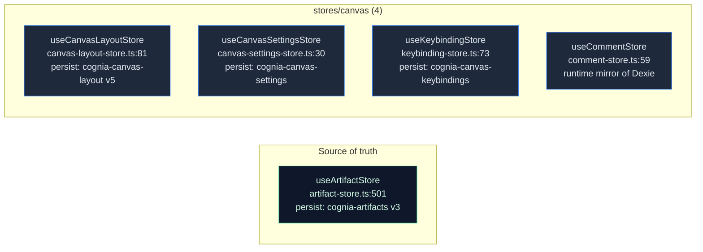
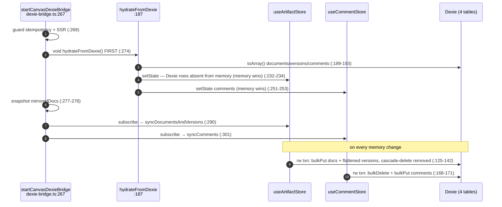

# State & Persistence

<Status variant="stable" />

<TLDR>
  Canvas documents and their nested versions live in **`useArtifactStore`**
  (`stores/artifact/artifact-store.ts:501`), persisted to `localStorage["cognia-artifacts"]` (v3).
  There is **no** `useCanvasStore`. Five smaller stores own layout, settings, runtime chunks,
  comments, and keybindings. `startCanvasDexieBridge` (`lib/canvas/dexie-bridge.ts:267`) mirrors
  documents + flattened versions + comments into four Dexie tables (introduced at v11; schema now
  v65) — **hydrate first, then subscribe**, memory always wins on conflict, and any Dexie write
  failure only warns.
</TLDR>

<StatGrid>
  <Stat label="Source of truth" value="useArtifactStore" hint="canvasDocuments (artifact-store.ts:361)" />
  <Stat label="Persist keys" value="4" hint="cognia-artifacts · -canvas-layout · -canvas-settings · -canvas-keybindings" />
  <Stat label="Dexie tables" value="4" hint="documents · versions · comments · sessions" />
  <Stat label="Runtime-only stores" value="1" hint="comment-store (mirror of Dexie)" />
</StatGrid>

## The Single Source of Truth

`useArtifactStore` holds the canvas document map; versions are nested inside each document (there is
no separate version map for canvas docs):

| Field / action | Line | Notes |
| --- | --- | --- |
| `canvasDocuments: Record<string, CanvasDocument>` | `artifact-store.ts:361` | the document map |
| `activeCanvasId` / `canvasOpen` | `:362` / `:363` | active selection + panel open |
| `createCanvasDocument` | `:879` | returns new id, opens panel, fires plugin create/switch |
| `updateCanvasDocument` | `:922` | merges content/editor context, marks `saveState:"dirty"` |
| `deleteCanvasDocument` | `:1002` | — |
| `saveCanvasVersion` | `:1125` | snapshots a version; applies auto-save retention |
| `restoreCanvasVersion` | `:1159` | auto-saves current first, then restores |
| `addSuggestion` / `applySuggestion` / `updateSuggestionStatus` | `:1038` / `:1079` / `:1060` | AI suggestion lifecycle |

Persistence: name `"cognia-artifacts"`, version 3 (`:1455-1456`); `partialize` persists
`canvasDocuments` **whole** with no LRU/truncation (`:1511`) — the content-truncation + LRU eviction
applies only to one-shot artifacts, not canvas docs. Auto-save version retention keeps at most
`MAX_CANVAS_AUTOSAVE_VERSIONS = 30` (`:51`), pruning oldest auto-saves while keeping manual ones
(`applyCanvasVersionRetention`, `:254`).

Components read this store directly. A `useCanvasDocuments` facade over it (sorted list,
create/open/rename/duplicate/search) used to exist and had no consumer; it was removed rather than
kept as a second way to ask the same question.

## The Four Canvas Stores



- **`useCanvasLayoutStore`** (`canvas-layout-store.ts:81`) — pane sizes, collapse flags, active right
  tab, `pinnedDocIds: Set` (serialized to an array via `partialize`/`merge`, `:150-167`). `setSizes`
  (`:88`) clamps and debounces (`CANVAS_LAYOUT_PERSIST_DEBOUNCE_MS = 150`, `:65`).
- **`useCanvasSettingsStore`** (`canvas-settings-store.ts:30`) — the editor/AI/version/collaboration/
  execution/accessibility settings tree. `updateSettings` (`:62`) validates via `validateSettings`
  before applying; `getEditorOptions` (`:84`) maps settings → Monaco options.
- **`useKeybindingStore`** (`keybinding-store.ts:73`) — `DEFAULT_KEYBINDINGS` is a 40-action map
  (`:15`); conflict detection via `checkConflicts` (`:151`).
- **`useCommentStore`** (`comment-store.ts:59`) — in-memory mirror of the `canvasComments` table; every
  mutation writes memory synchronously then fire-and-forgets a Dexie write through `safeDexieCall`
  (`:53`). Covered in [Execution & comments](./execution-comments#comments).
## The Dexie Write-Through Bridge

`startCanvasDexieBridge` runs once at app startup and returns a disposer. The ordering is the whole
point: **hydrate before subscribing**, so a backup-restore's Dexie rows are not clobbered by an empty
in-memory store.



The write-through path in detail:

1. A UI edit calls `useArtifactStore.updateCanvasDocument` (`artifact-store.ts:922`) — the in-memory
   map mutates and Zustand persists it to `localStorage["cognia-artifacts"]` (the authoritative copy).
2. The bridge's `subscribe` callback fires (`dexie-bridge.ts:290`) → `syncDocumentsAndVersions(docs)`
   (`:87`).
3. That diffs against the `mirroredDocs` snapshot, flattens each document's `versions[]`, and runs a
   single `rw` transaction over all four tables: cascade-delete removed docs' versions/comments/
   sessions, then `bulkPut` document + version upserts and `bulkDelete` removed versions (`:125-142`).
4. The mirror sets (`mirroredDocs`, `mirroredVersionIds`) are updated so the next diff is minimal
   (`:294`, `:144`).

Comments take two write paths into the same `canvasComments` table — the store's own `safeDexieCall`
and the bridge's `syncComments` — both keyed by comment `id`, so the `bulkPut`s are idempotent.
Graceful degradation: every Dexie write is wrapped so a failure only logs; local editing continues
through Zustand.

## The Four Dexie Tables

Introduced at `this.version(11)` (`schema.ts:487`) and re-declared verbatim through v18; the schema
is now at `this.version(65)` (`schema.ts:1692`) with the canvas indexes unchanged:

```ts title="lib/db/schema.ts:501-504 (v11, unchanged through v65)"
canvasDocuments: "id, title, language, type, updatedAt, createdAt"
canvasVersions:  "id, documentId, [documentId+createdAt], isAutoSave"
canvasComments:  "id, documentId, [documentId+createdAt], parentId, resolvedAt"
canvasSessions:  "id, documentId, ownerId, createdAt"
```

CRUD ownership:

- **`canvasDocuments` / `canvasVersions`** — no dedicated CRUD module; the bridge owns these writes
  directly. Row types are in `lib/db/canvas-types.ts` (`CanvasDocumentRow:16`, `CanvasVersionRow:30`).
- **`canvasComments`** — `lib/db/canvas-comments.ts` exposes the full CRUD (`listForDocument:44`,
  `addComment:64`, `replyToComment:133`, `resolveComment:93`, `addReaction:109`, `bulkImport:162`, …).
- **`canvasSessions`** — `lib/db/canvas-sessions.ts` persists collaboration session **metadata only**
  (`upsertSession:74`, `getActiveSessionForDocument:90`, `closeSession:102`, `listRecent:111`); per-op
  CRDT streams are deliberately not persisted.

## Feature Flags

`lib/canvas/feature-flags.ts` resolves two flags, **last source wins**: defaults → env → localStorage
(`getCanvasFeatureFlags`, `:55-60`).

| Flag | Default | Env var | Controls |
| --- | --- | --- | --- |
| `canvas.aiWorkbench.v1` | `true` (`:6`) | `NEXT_PUBLIC_CANVAS_AI_WORKBENCH_V1` (`:37`) | AI toolbar + suggestions |
| `canvas.collaboration.v1` | `true` (`:7`) | `NEXT_PUBLIC_CANVAS_COLLABORATION_V1` (`:38`) | collaboration panel + WS client |

localStorage key `"cognia-canvas-feature-flags-v1"` (`:3`); env strings `"0"`/`"false"` → off,
`"1"`/`"true"` → on (`:40-50`). Because localStorage is last, a Settings-UI override beats both the env
and the default.

## Auto-Save

`CanvasPanel` owns auto-save inline: an interval floored at 10 s (`canvas-panel.tsx:242-259`) reads
the live Monaco buffer, writes it through `updateCanvasDocument`, and snapshots a version via
`saveCanvasVersion(id, "auto-save")`. The interval is rebuilt — and the pending tick cleared — whenever
the active document changes.

A `useCanvasAutoSave` hook implementing a different model (its own `localContent` state plus a
debounce-on-idle timer) also existed, unused. It could not simply replace the panel's version: the
panel treats `editorRef.current.getValue()` as authoritative, and the hook's mirrored state would
fight it. It was removed.

## Next

<Cards>
  <Card title="Editor core" href="./editor-core" description="What writes into this state" />
  <Card title="Execution & comments" href="./execution-comments" description="The comment store + version timeline in depth" />
</Cards>
