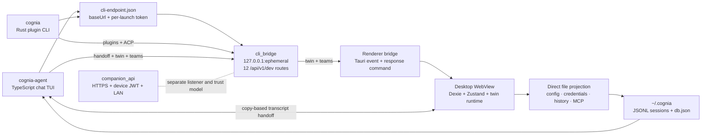

# CLI ↔ App Bridge

<Status variant="stable">12 authenticated loopback routes · two CLI consumers · bidirectional transcript handoff</Status>

<TLDR>
  Cognia has two different local CLIs. `cognia-agent` is the TypeScript chat TUI; `cognia` is the
  Rust plugin-author CLI. Both discover the running Tauri app through
  `cli-endpoint.json`, but they consume different parts of one 12-route loopback server. The
  desktop also projects config, credentials, history, and selected MCP servers directly into the
  standalone agent's home. Session handoff is bidirectional but copy-based: the shells keep
  separate stores and never share a live sidecar session.
</TLDR>

## Boundaries

| Layer | Lives in | Responsibility |
| --- | --- | --- |
| Native server | `src-tauri/src/cli_bridge/` | Listener lifecycle, endpoint publication, authentication, routes, plugin operations, and renderer pending requests |
| Renderer bridge | `lib/cli-bridge/` | Direct file projection, binary detection, renderer-backed twin/team dispatch, and CLI-home helpers |
| Agent CLI clients | `cli/src/handoff/`, `cli/src/team/`, `cli/src/twin/` | Desktop discovery, session handoff, and renderer-backed requests |
| Plugin CLI clients | `crates/cognia-cli/` | Plugin lifecycle and ACP token brokerage |
| User controls | `components/settings/cli-bridge/` | Manual sync and opt-in auto-sync |

The server is not the Companion API. `cli_bridge` uses plain HTTP on IPv4 loopback and a random
per-launch bearer token. `companion_api` is a separately configured HTTPS listener for paired
devices and uses device JWTs. Neither route catalog is mounted into the other.

## Design invariants

- **The two CLIs are not interchangeable.** `cognia-agent` consumes six paths and `cognia`
  consumes seven; authenticated health is their only overlap.
- **Stores are forked; implementation is shared.** The GUI owns browser IndexedDB and keyring
  state. The CLI uses the same `CogniaDB` schema through fake IndexedDB, snapshots it to
  `~/.cognia/db.json`, and stores transcripts as JSONL under `~/.cognia/sessions/`.
- **Synchronization is projection, not shared persistence.** Desktop-owned values are copied to
  CLI files. The CLI remains independently runnable when the desktop is closed.
- **Handoff creates a continuation copy.** Neither direction transfers a live SDK session id.
  Earlier turns are re-injected as transcript context in the receiving shell.
- **Renderer state requires a live WebView.** Twin context and the three team operations use a
  request/response bridge because their authoritative state lives in Dexie, vector storage, or
  Zustand.

> Implementation note: the current native Tauri startup block invokes `cli_bridge::init` without
> an explicit mobile compile-time guard. Renderer listeners and sync UI are desktop/Tauri-gated,
> but documentation must not claim the native listener is excluded from mobile until code enforces
> that boundary.

## Read next

<Cards>
  <Card title="Transport and security" href="./transport-and-security" description="Endpoint discovery, all 12 routes, authentication, consumer ownership, and renderer request/response flow." />
  <Card title="Sync and handoff" href="./sync-and-handoff" description="Direct file projection, credentials and MCP scope, both transcript directions, and the forked-store model." />
</Cards>

## Related decisions

- [ADR-0050 — CLI TUI operation experience](../../adr/0050-cli-tui-operation-experience)
- [ADR-0059 — Cloud deployment and headless brain](../../adr/0059-cloud-deployment-headless-brain)
- [ADR-0077 — TUI external-agent hosting](../../adr/0077-tui-external-agent-hosting)
- [ADR-0078 — CLI ↔ App bridge](../../adr/0078-cli-app-bridge)
