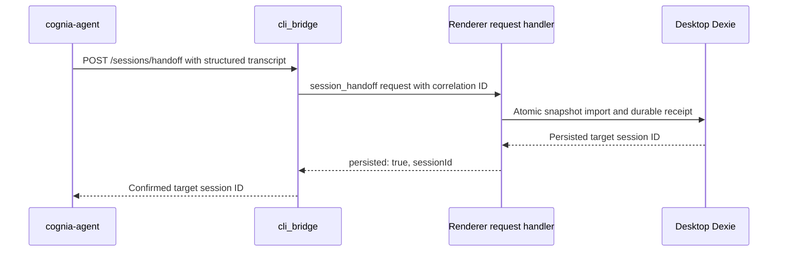

# Sync and handoff

## Desktop → CLI projection

This path does not use the HTTP server. The renderer resolves the same CLI home the native host
uses and writes confined bare filenames through Tauri commands.

| Surface | Destination | Trigger and behavior |
| --- | --- | --- |
| Agent defaults | `~/.cognia/config.json` | Preserves keys the desktop does not own; projects only fields accepted by the CLI's strict schema |
| Provider secrets | `~/.cognia/credentials.json` | Owner-only file; provider API keys and supported subscription credentials |
| Composer history | `~/.cognia/history.json` | Normalizes recent Dexie history into the CLI's oldest-first format |
| MCP servers | `~/.cognia/mcp.json` | Manual sync only; reuses the per-agent MCP projection and consent selection |

Manual **Sync now** pushes all four surfaces. Auto-sync is opt-in and runs on desktop startup or
when enabled; it pushes config, credentials, and history, but leaves MCP selection explicit.
Failures are isolated per item so one unavailable credential source does not block other files.

## GUI → CLI transcript

The desktop writes `<CLI_HOME>/handoff/<encodeURIComponent(sessionId)>.jsonl`. Each entry
retains message IDs, structured parts and metadata alongside a readable text projection. Tool
calls keep their identity, status, inputs and multiline results. Cached media is materialized
before export; missing bytes fail the operation. Historical reasoning is not sent as instructions.
Unknown content is explicitly marked instead of silently disappearing.

The CLI preserves that structured snapshot for a later return and injects historical context into
a fresh runtime. Oversized history requires a successful summary before continuation. Summary
turns have no tools or MCP access; failure stops continuation without writing a partial copy.
External CLI backends that cannot enforce tool-free summaries reject oversized handoffs with an actionable error.
Only the new user prompt is appended to the transcript, avoiding recursively duplicated history.
This does not transfer a desktop SDK session ID, keyring handle, approvals or live stream.

## CLI → GUI transcript

The standalone agent explicitly requests handoff through `cognia-agent handoff`, `run --handoff`,
or the interactive `/handoff` command:

The response confirms renderer persistence, not merely event delivery. An unavailable renderer or
failed transaction returns an error. Native sessions are protected from ID collisions. Retrying an
identical snapshot reopens the same target without overwriting subsequent desktop work; a changed
snapshot creates a separate copy. The persisted receipt associates the source ID and payload digest
with the actual target ID. The imported conversation continues from context because a CLI sidecar
cannot be resumed inside the desktop.

## Live renderer-backed operations

Twin and team calls are the only live coordination plane for `cognia-agent`:

- Twin context is computed in the renderer, redacted, and returned as prompt segments with source
  metadata. Raw chunks stay inside the desktop runtime.
- Team definitions and run state live in renderer stores. The CLI can list teams, start a run, and
  poll status deltas. A run continues in the desktop if the CLI watcher exits.

These operations require a running WebView. The built-in agent and external-agent hosting paths do
not otherwise depend on the desktop process.

## Forked stores, shared code

The CLI installs fake IndexedDB, opens the shared `CogniaDB` schema, and snapshots its own database
to `~/.cognia/db.json`. Its transcripts live under `~/.cognia/sessions/`. The GUI keeps browser
IndexedDB and OS-keyring state. Shared database types and agent assembly reduce behavioral drift,
but no file watcher or bidirectional database replication makes these stores one database.

That separation is intentional: synchronization and handoff are explicit copy operations, and the
standalone agent remains usable with the desktop closed.
