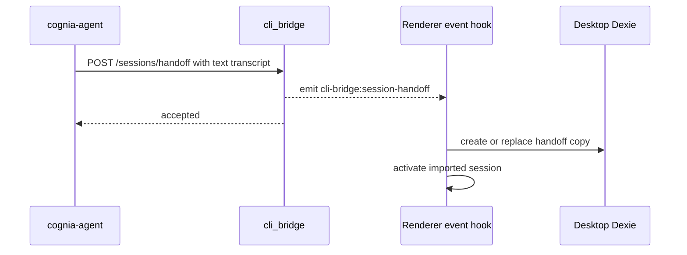

# Sync and handoff

## Desktop → CLI projection

This path does not use the HTTP server. The renderer resolves the same CLI home the native host
uses and writes confined bare filenames through Tauri commands.

| Surface | Destination | Trigger and behavior |
| --- | --- | --- |
| Agent defaults | `~/.cognia/config.json` | Preserves keys the desktop does not own; projects only fields accepted by the CLI's strict schema |
| Provider secrets | `~/.cognia/credentials.json` | Owner-only file; provider API keys and supported subscription credentials |
| Composer history | `~/.cognia/history.json` | Normalizes recent Dexie history into the CLI's oldest-first format |
| MCP servers | `~/.cognia/mcp.json` | Manual sync only; reuses the per-agent MCP projection and consent selection |

Manual **Sync now** pushes all four surfaces. Auto-sync is opt-in and runs on desktop startup or
when enabled; it pushes config, credentials, and history, but leaves MCP selection explicit.
Failures are isolated per item so one unavailable credential source does not block other files.

## GUI → CLI transcript

The desktop serializes message parts in order into
`<CLI_HOME>/handoff/<sessionId>.jsonl`. Text and markdown remain readable; code keeps its fences;
reasoning, tools and results, attachments, images, A2UI, and unknown future parts become bounded
markers rather than disappearing. The CLI reads that drop and injects the earlier conversation as
a text preamble for a fresh agent process.

This is snapshot continuation. It does not transfer a desktop SDK session id, keyring handle, or
live stream.

## CLI → GUI transcript

The standalone agent explicitly requests handoff through `cognia-agent handoff`, `run --handoff`,
or the interactive `/handoff` command:

The importer protects native sessions from id collision by minting a new id, while repeat handoff
of the same CLI copy is idempotent. It seeds a transcript continuation because the CLI sidecar
cannot be resumed inside the desktop. HTTP acceptance precedes renderer persistence.

## Live renderer-backed operations

Twin and team calls are the only live coordination plane for `cognia-agent`:

- Twin context is computed in the renderer, redacted, and returned as prompt segments with source
  metadata. Raw chunks stay inside the desktop runtime.
- Team definitions and run state live in renderer stores. The CLI can list teams, start a run, and
  poll status deltas. A run continues in the desktop if the CLI watcher exits.

These operations require a running WebView. The built-in agent and external-agent hosting paths do
not otherwise depend on the desktop process.

## Forked stores, shared code

The CLI installs fake IndexedDB, opens the shared `CogniaDB` schema, and snapshots its own database
to `~/.cognia/db.json`. Its transcripts live under `~/.cognia/sessions/`. The GUI keeps browser
IndexedDB and OS-keyring state. Shared database types and agent assembly reduce behavioral drift,
but no file watcher or bidirectional database replication makes these stores one database.

That separation is intentional: synchronization and handoff are explicit copy operations, and the
standalone agent remains usable with the desktop closed.
