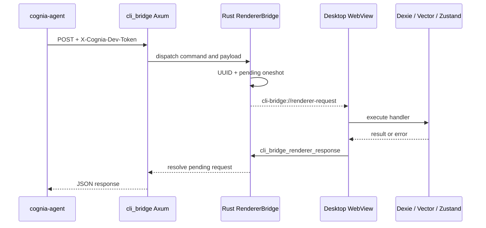

# Transport and security

## Discovery lifecycle

At Tauri startup, `cli_bridge::init` binds `127.0.0.1:0`, generates 32 random bytes, hex-encodes
them into a 64-character token, and writes the following discovery file under the OS config
directory at `cognia/cli-endpoint.json`:

```json
{
  "baseUrl": "http://127.0.0.1:<ephemeral-port>",
  "devToken": "<64-character hex token>"
}
```

Unix permissions are changed to `0600` best-effort after the write; Windows relies on the user
profile ACL. The file can remain after shutdown. Clients therefore treat it as a discovery hint,
not proof of liveness: `cognia-agent` performs an authenticated health probe, while `cognia`
translates connection refusal into a stale-endpoint diagnostic. Each successful restart overwrites
the file and rotates the token.

## Request boundary

- The listener binds only IPv4 loopback, and middleware rejects a non-loopback `ConnectInfo` with
  403 even if the socket configuration changes later.
- Every route, including health, requires `X-Cognia-Dev-Token`.
- Equal-length tokens are compared byte-by-byte without early exit; a length mismatch fails.
- A 4 MiB request-body cap wraps the whole router.
- The channel protects against unrelated local callers that cannot read the endpoint file. It is
  not a security boundary against a malicious process already running as the same OS user.

## Route catalog

There are exactly **22** registered paths. A Rust characterization test in
`src-tauri/src/cli_bridge/server.rs` locks this list and the router's route count. The wire prefix
is `/api/dev/*` (stable, shared with the installed CLIs — it is not a debug-only gate).

| Method and path | Consumer | Execution |
| --- | --- | --- |
| `GET /api/dev/health` | both CLIs | Rust liveness response |
| `GET /api/dev/plugins/installed` | `cognia` | Privacy-safe plugin snapshot |
| `POST /api/dev/plugins/install` | `cognia` | Install bundle |
| `POST /api/dev/plugins/install-directory` | `cognia` | Install unpacked directory |
| `POST /api/dev/plugins/uninstall` | `cognia` | Remove plugin |
| `POST /api/dev/plugins/reload` | `cognia` | Reload or reinstall artifact |
| `POST /api/dev/plugins/session-events` | `cognia` | Dev-session lifecycle events (64 KiB body cap) |
| `POST /api/dev/acp/ticket` | `cognia` | Mint single-use Companion socket ticket for ACP |
| `POST /api/dev/sessions/handoff` | `cognia-agent` | Emit asynchronous renderer import event |
| `POST /api/dev/host-state/snapshot` | `cognia-agent` | Attach/session-state snapshot |
| `POST /api/dev/host-state/submit` | `cognia-agent` | Attach/session-state submit |
| `POST /api/dev/host-state/status` | `cognia-agent` | Attach/session-state status |
| `GET /api/dev/host-state/events` | `cognia-agent` | Long-poll host event stream |
| `GET /api/dev/host-state/agent-events` | `cognia-agent` | Long-poll agent event stream |
| `POST /api/dev/twin/context` | `cognia-agent` | Renderer round-trip |
| `POST /api/dev/teams/list` | `cognia-agent` | Renderer round-trip |
| `POST /api/dev/teams/run` | `cognia-agent` | Renderer round-trip |
| `POST /api/dev/teams/run-status` | `cognia-agent` | Renderer round-trip |
| `GET /api/dev/provider-operations/manifest` | `cognia-agent` | Provider admin manifest (ADR-0163) |
| `POST /api/dev/provider-operations/execute` | `cognia-agent` | Provider admin execution |
| `POST /api/dev/gateway/route-ticket` | `cognia-agent` | Mint LLM-gateway route ticket |
| `POST /api/dev/gateway/route-ticket/revoke` | `cognia-agent` | Revoke a route ticket |

`cognia` uses eight paths (plugins, ACP ticket, and health); `cognia-agent` uses fifteen. Health is
the only shared path, so their union is 22. The installed-plugin projection deliberately excludes
`runtime_state`, and twin context returns redacted prompt segments rather than raw source chunks.

## Renderer request/response

Twin and team routes cannot be answered from Rust alone because their authoritative data lives in
the WebView. They use a real pending-request protocol, not a fire-and-forget event:



Rust expires pending requests after 30 seconds. The agent CLI aborts its fetch after 10 seconds, so
the client returns first while Rust still guarantees eventual pending-map cleanup. By contrast,
`sessions/handoff` acknowledges as soon as Rust emits its renderer event; its HTTP success does not
mean the Dexie import has completed.

## Why Companion API stays separate

| Property | CLI bridge | Companion API |
| --- | --- | --- |
| Audience | Same-user local CLIs | Paired mobile devices |
| Bind | `127.0.0.1:0` | Configurable LAN listener, default port 27890 |
| Transport | HTTP | HTTPS, WebSocket, WebRTC tiers |
| Authentication | Per-launch dev token | Pairing flow and device JWT |
| Discovery | Local endpoint file | Health, mDNS, tunnel, signaling |

See [External API](../companion-api) for the device-facing server.
