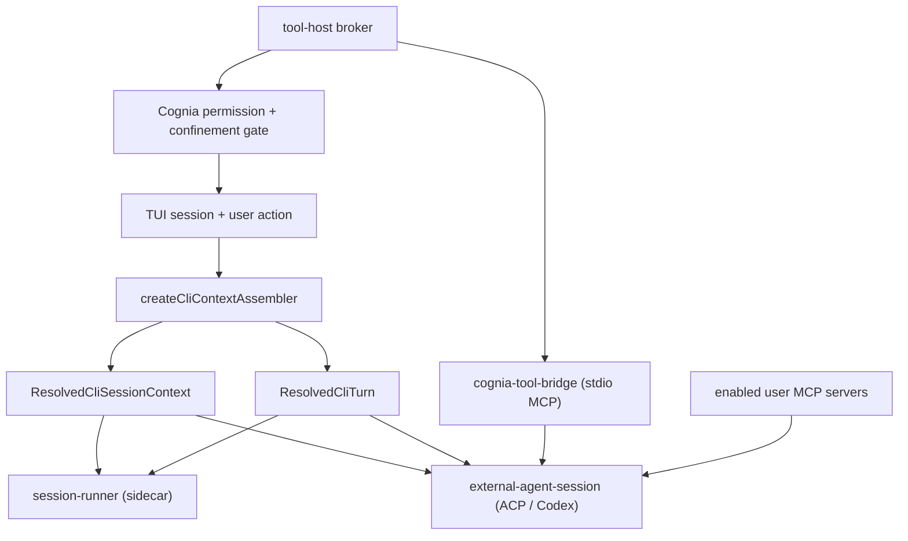

# Cognia Parity

<Status variant="stable">Shared context assembler · authenticated tool bridge · context-versioned sessions</Status>

<TLDR>
  Hosting Codex or Claude Code used to change what a session *meant*, not just how it was
  transported: the external path forwarded `config.systemPrompt` plus four raw config fields, while
  the built-in path resolved project instructions, output style, agent mode, skills, tool policy,
  attachments and twin grounding. Both backends now consume one resolver, and Cognia's own tools
  reach an external agent through an authenticated MCP bridge that Cognia — not the agent —
  authorizes. A session whose resolved context changes is restarted rather than silently continued.
</TLDR>

## The parity contract

```text
effectiveExternalCogniaTools(session) == effectiveBuiltinCogniaTools(session)

externalVisibleTools = externalNativeTools + effectiveCogniaTools + enabledUserMcpTools
```

Parity means *effective* parity. The external agent receives every Cognia-owned tool the built-in
backend would receive for the same session, after applying category toggles, agent-mode filters,
`allowedTools` / disabled-tool overlays, workspace confinement, plan/accept-edits/bypass semantics,
and runtime availability. It never means force-enabling a category the user turned off.

## One resolver, two transports



`cli/src/agent/session-context.ts` owns the meaning of a session; `toBuildContext` →
`resolveSendOptions` remains the source of truth behind it. Each backend only translates the result:
the built-in mapper feeds sidecar `SendOptions`, the external mapper feeds `session/new` metadata
plus prompt content.

Two fields deliberately stay on the raw config for an external backend:

| Field | Why |
| --- | --- |
| `model` | The contract is "the model the user explicitly asked this BACKEND for" — an agent-owned id. `sendOptions.model` is Cognia's provider catalog talking; substituting it would rewrite which model Codex actually runs. |
| `allowedTools` | The ACP field pre-approves the agent's OWN tools, in its native vocabulary. Cognia's resolved policy is expressed in `mcp__cognia-*__` names the agent cannot act on, and governs the projected tools at the broker instead. |

## The tool host

Cognia's tools are hosted, not copied. Two processes are involved:

- **The broker** (`cli/src/agent/tool-host/broker.ts`) runs in the CLI process and owns session
  identity, the effective manifest, workspace confinement, the approval overlay, host-tool execution
  and cancellation. It listens on an owner-only local socket and mints a per-attempt token.
- **The bridge** (`sidecar/cognia-tool-bridge.mjs`) is spawned by the external agent as an ordinary
  stdio MCP server. It lives in the sidecar bundle because that is where the real tool definitions
  and handlers already are; duplicating them CLI-side would have meant a second schema source.

Two MCP servers are attached, not one, so the `mcp__cognia-tools__*` and
`mcp__cognia-plugin-tools__*` prefixes match the built-in backend exactly.

| Plane | Executed by | Why |
| --- | --- | --- |
| `cognia-tools` built-ins | the bridge, after Cognia authorizes | their handlers need process-local state (read tracker, background shells, task graph, LSP and code-graph resolvers) |
| `cognia-plugin-tools` (plugins, web, `ask_user`, `load_skill`, `dispatch_agent`) | the broker | their handlers live in the CLI process — the plugin runtime, the TUI elicitation overlay, the skill store, the subagent dispatcher |
| User MCP servers | the agent | unchanged; additive and independently toggleable |

### Authorization

1. The model calls `mcp__cognia-tools__<name>` or `mcp__cognia-plugin-tools__<name>`.
2. The external agent may emit its own permission request. Cognia auto-acknowledges it **only** for
   these two namespaces — that acknowledgement is not an execution approval, it exists so one Cognia
   call never produces two prompts.
3. The bridge asks the broker to authorize the call.
4. The broker revalidates visibility, re-checks path confinement (including credential paths, and
   even when the agent is sandboxed), and prompts through Cognia's own overlay when required.
5. Only then does the handler run; the result is reported back so the call renders in the same tool
   cell as a built-in one.

Native agent tools continue to use the ACP permission request normally.

The endpoint and token travel in **environment variables, never argv** — argv is world-readable via
`ps`, and the token authorises tool execution against a live Cognia session.

## Context versions and restarts

ACP and the Codex app-server consume instructions, roots, model, permission mode and the MCP/tool
surface once, at `session/new`. `cli/src/agent/context-version.ts` fingerprints exactly those fields
(credentials and per-turn transport knobs are excluded), and every turn compares it.

| Field | Applies at |
| --- | --- |
| Twin context, attachments | per turn |
| Permission mode, model | live on the session when the adapter supports it |
| System prompt, agent mode, skills, output style, MCP servers, Cognia tools, plugin tools, working roots | session recreation |
| Thinking level, external skill roots | reconnect (Codex reads them when the process is registered) |

A session-layer change recreates the external protocol session and shows one notice saying the
transcript is kept but the agent starts fresh. Appending a second system prompt to a live session
was rejected as an alternative: it leaves the agent with two conflicting instruction sets and makes
resume non-deterministic.

A recorded resume link carries the context version it was created under, so `/resume` never hands an
agent back a conversation whose settings have since changed. A link written before versions existed
carries none, and unknown is not a match.

## Compatibility

An agent that cannot accept an MCP server at `session/new` is **incompatible** under the default
parity contract, not "ready with fewer tools" — every Cognia tool visible in `/tools` would be
uncallable. The connect flow fails before the composer opens rather than letting that surface one
silent tool call at a time.

`/status` and `/doctor` report what was actually achieved: the live context version, the Cognia
built-in and host tool counts under the current policy, the user MCP count, bridge health, and which
settings restart the agent's context.

## Verified against real agents

`pnpm smoke:external-parity` drives the REAL agent — not a stub — through the
real manager, the real sandbox launcher, the real broker and the real bridge,
and gates on the agent invoking a read-only AND a mutating Cognia tool with a
verified side effect on disk.

| Backend | Result | Notes |
| --- | --- | --- |
| `codex-app-server` | PASS | 46 built-in + 4 host tools projected; `read` and `write` both executed through the bridge |
| `codex` (ACP shim) | PASS | same surface over the `@zed-industries/codex-acp` transport |
| `claude-code` | not verified here | `claude-agent-acp` fails `session/new` with `spawn Unknown system error -88` **even with zero MCP servers attached**, so the failure is inside that agent's own Claude launch, not the projection |

Two findings the smoke surfaced, both of which only became reachable once the
tools were actually projected:

- **Codex ignored attached MCP servers.** Codex has no per-session `mcpServers`
  parameter — it reads them from config — so the adapter silently dropped every
  server the caller attached. They now ride `thread/start`'s per-thread
  `config` overrides (`lib/ai/agent/external/codex-mcp-config.ts`). Before this
  the bridge reported healthy while Codex answered that
  `mcp__cognia-tools__*` was unavailable.
- **The `git` tool category does not work through the bridge under the strict
  launcher sandbox.** The git subprocess executes but reports "not a git
  repository" for a workspace that `git` reads fine unsandboxed. This is a
  launcher-sandbox × git-tools interaction, independent of the bridge, and is
  reported by the smoke rather than gated on.

## Files

| Concern | Lives in |
| --- | --- |
| Shared session/turn resolution | `cli/src/agent/session-context.ts`, `cli/src/agent/turn-dispatch.ts` |
| Context fingerprint | `cli/src/agent/context-version.ts` |
| Tool-host broker, policy, spawn config | `cli/src/agent/tool-host/` |
| MCP bridge | `sidecar/cognia-tool-bridge.mjs` |
| External transport mapping | `cli/src/agent/external-agent-session.ts` |
| Capability + diagnostics truth | `cli/src/tui/runtime/backend-capabilities.ts`, `cognia-parity-report.ts` |
| Field lifecycle table | `cli/src/tui/runtime/context-lifecycle.ts` |
| Backend lifecycle owner | `cli/src/tui/runtime/backend-lifecycle.ts` |
