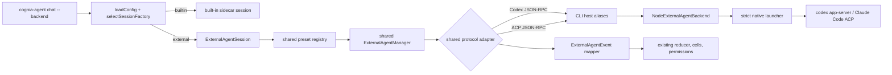

# Agent CLI External Hosting

<Status variant="stable">Codex and Claude Code verified · macOS and Linux · strict sandbox required</Status>

<TLDR>
  `cognia-agent chat --backend codex` and `--backend claude-code` replace only the turn session
  factory. Presets, ACP/Codex adapters, `ExternalAgentManager`, credential overlays, and protocol
  events are reused from the desktop implementation. CLI-only build aliases connect those shared
  modules to a Node process backend, which validates command, cwd, and environment before launching
  the child through a native Seatbelt or bubblewrap sandbox. External events then enter the existing
  TUI reducer, permission overlay, usage display, and transcript store. The desktop app is not
  required.
</TLDR>



## What is reused

| Layer | Implementation | CLI treatment |
| --- | --- | --- |
| Presets and executable selection | `lib/ai/agent/external/presets.ts` | reused unchanged |
| ACP and Codex protocol clients | `acp-client.ts`, `codex-app-server-client.ts` | reused unchanged |
| Lifecycle and execution | `ExternalAgentManager` | reused with its health interval disabled for short-lived CLI processes |
| Credential overlay | `env-builder.ts` | reused; CLI credentials are supplied as the explicit base environment |
| Process/event host | Tauri on desktop | replaced by CLI build aliases and `NodeExternalAgentBackend` |
| Presentation | desktop chat reducer | adapted to the existing Agent CLI TUI reducer |

Only three host-bound imports are redirected by `scripts/build/cli-external-agent-aliases.mjs`:
the native external-process API, the host capability branch, and agent hooks. There is no second ACP
or Codex implementation under `cli/`.

## Supported entry points

```bash
# Existing behavior
cognia-agent chat --backend builtin

# Prefer native `codex app-server`; fall back to the Codex ACP shim
cognia-agent chat --backend codex

# Claude Code through the Zed ACP adapter
cognia-agent chat --backend claude-code

# Persist the selection in ~/.cognia/config.json
cognia-agent config set agentBackend codex
```

The `codex` alias checks for the official `codex` executable. If present, it materializes the native
`codex-app-server` preset; otherwise it uses `npx -y @zed-industries/codex-acp`. Claude Code uses
`npx -y @zed-industries/claude-code-acp`. Although the flag accepts a preset id, the CLI process host
also applies an executable/package allowlist; Codex and Claude Code are the verified v1 targets.

## Reading order

<Cards>
  <Card title="Runtime and events" href="./runtime-and-events" description="Session selection, shared-manager lifecycle, event mapping, permissions, and transcript behavior." />
  <Card title="Security, auth, and operations" href="./security-auth-and-operations" description="Strict sandbox boundaries, credential precedence, native login fallback, doctor checks, and platform limits." />
  <Card title="ADR-0077" href="../../adr/0077-tui-external-agent-hosting" description="The hybrid-host decision and the recorded D1–D4 outcomes." />
</Cards>

## Verification status

On 2026-07-16, real strict-sandbox turns completed through both paths:

- `codex-cli 0.144.4 app-server` streamed `PHASE4_CODEX_OK` using native Codex login fallback.
- `@zed-industries/claude-code-acp@0.16.2` streamed `PHASE4_CLAUDE_OK` and shut down cleanly.

The implementation note is retained in
`docs/plans/2026-07-16-tui-external-agent-hosting.md` so later adapter upgrades can repeat the same
smoke protocol.
