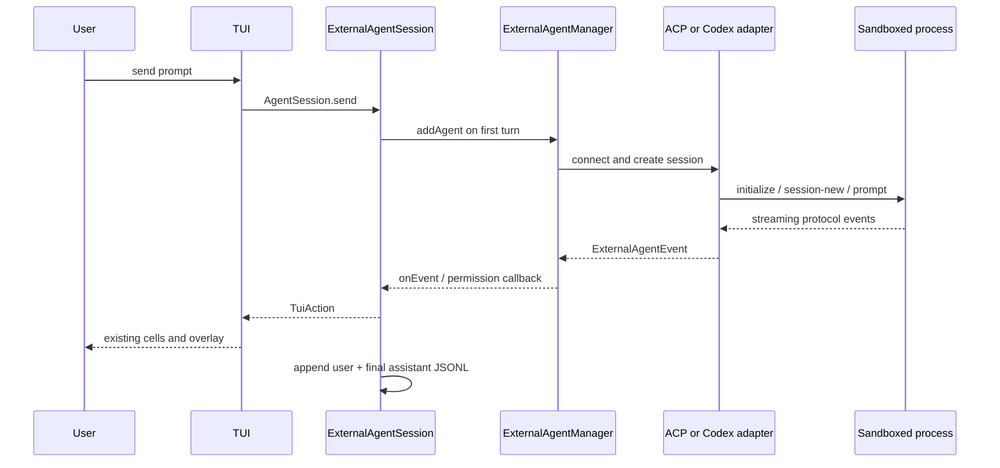

# Runtime and Events

## Session selection

`chatCommand` resolves all normal configuration layers first. `selectSessionFactory` keeps
`createAgentSession` for `builtin` and selects `createExternalAgentSession` for any external preset.
The same choice is passed to the rich Ink TUI and the piped/readline fallback, so non-TTY smoke runs
exercise the real hosting path too.

An external session is lazy: the first turn resolves the preset, creates one agent id, overlays cwd
and credentials, and adds it to the shared manager. Later turns pass the returned external session id
back to `manager.execute`, preserving model context for the life of the TUI session. Closing cancels
an active external session, removes the agent, and waits for process teardown.

ACP `session/new` always receives an explicit empty `mcpServers` list. The CLI does not leak the
built-in sidecar's unrelated MCP configuration into the external child.

## Event projection

| External event | TUI projection |
| --- | --- |
| message text | streaming assistant text |
| thinking | existing thinking region |
| tool start/result | existing tool cards |
| plan update | synthetic `TodoWrite` card |
| diff | synthetic `Edit` call and result |
| token usage | existing usage reducer |
| recoverable error | warning notice |
| fatal error | turn error |
| permission request | no transcript cell; routes directly to the permission gate |

The mapper dispatches `TuiAction` directly. This is intentional: plan and diff events do not fit the
built-in `CaptureStreamEvent` union, while the TUI reducer already has the richer cell vocabulary.
Hook start/end events become status notices rather than protocol-specific UI.

## Permissions

The adapter converts an ACP permission request into the existing CLI `PermissionRequestEvent`, then
converts the user's decision back to the option id advertised by the external agent:

- Allow once → `allow_once`
- Allow always → `allow_always`
- Deny → `reject_once`

Concurrent requests use the existing FIFO gate, so one overlay cannot replace another. Changing the
TUI permission mode updates a live external session through `setSessionMode` when the adapter
supports it.

## Transcript behavior

External and built-in sessions share `~/.cognia/sessions/<sessionId>.jsonl`. Each external turn writes
the user prompt and final assistant response; assistant metadata includes backend, optional model,
and usage. Tool, diff, and plan cells remain visible during the live turn but are not separately
serialized by the external session adapter.

`/resume` restores the local transcript display and id, but starts a new external process/session. It
does not replay the historical messages into the external model context. Multi-turn context is
preserved only while the original external session remains live.

## Capability boundary

The CLI host advertises external-agent and filesystem callbacks but deliberately advertises ACP
terminal support as unavailable. File reads/writes use Node. Terminal RPC methods fail explicitly;
an adapter cannot silently escape into a desktop-only Tauri terminal implementation.
