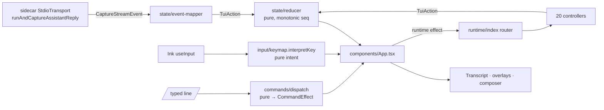

# Agent CLI TUI

<Status variant="stable" />

<Callout type="warn" title="Not the plugin-author CLI">
  This page documents the **`cognia-agent`** TypeScript coding agent and its interactive terminal UI
  (`cli/src/tui/`). It is a different program from the Rust **`cognia`** plugin-author CLI documented
  under [Cognia CLI](./cognia-cli) (scaffold / lint / build / sign). They share neither a binary nor a
  code path.
</Callout>

<TLDR>
  `cognia-agent` runs the **same** agent loop as the desktop app (`resolveSendOptions` +
  `runAndCaptureAssistantReply` over a `StdioTransport` to the Node sidecar), but renders to the
  terminal through an **Ink/React** UI. The UI is a pure **reducer** (`state/reducer.ts`, no
  `Date.now`/`Math.random`) fed by a streaming **event-mapper**; a **slash-command** layer
  (registry → dispatcher → pure handlers → effects) that the App interprets; ~20 **runtime
  controllers** behind those commands (goal / workflow / team / mcp / memory / plugins / skills /
  permissions / plan / limits / doctor / …); a stack of **overlays** (help, settings, permission,
  plan-approval, pager, pickers); and a **composer** with command history, `/`-palette, `@`-mentions,
  large-paste collapsing, and rebindable readline-style editing chords. Config comes from `~/.cognia/`
  + env + flags — never the desktop's IndexedDB or keyring.
</TLDR>

<StatGrid>
  <Stat label="TUI source files" value="~175" hint="cli/src/tui/**/*.ts(x), excluding tests" />
  <Stat label="Top-level slash commands" value="45+" hint="commands/registry.ts + feature clusters" />
  <Stat label="Runtime controllers" value="19" hint="runtime/*-controller.ts" />
  <Stat label="Overlays" value="14" hint="components/overlays/*.tsx (incl. AskUserDialog)" />
  <Stat label="Built-in themes" value="7" hint="cognia (default) · dark · light · 2× daltonized · ansi · mono" />
  <Stat label="Rebindable editor chords" value="13" hint="input/keybindings.ts KEYBINDABLE_ACTIONS" />
</StatGrid>

## Where it lives

```
cli/src/tui/
  mount.tsx · render/context.tsx        # Ink render root + enable bracketed paste
  components/
    App.tsx                             # the root: composes overlays/modes, owns global keys
    Input.tsx · Transcript.tsx · …      # composer + scrollback + footer/banner/indicators
    overlays/                           # Help, Settings, Permission, PlanApproval, pager, pickers
  state/                                # pure store: reducer · types · initial · selectors · event-mapper
  commands/                             # registry · dispatch · matcher · per-feature command clusters
  runtime/                              # the 20 controllers behind the commands + their doc/timeline helpers
  input/                                # buffer · keymap · keybindings · history · bracketed/collapse paste
  format/                               # transcript · tools · status-bar · usage · charts · export · …
  markdown/ · mention/ · theme/         # markdown render (CJK-aware) · @-mentions · palettes
  hooks/                                # turn-engine · useAgentSession · useTerminalSize
```

## Architecture — one streaming loop, four pure layers



1. **State** — `state/reducer.ts` is the single source of truth. The streaming sidecar emits
   `CaptureStreamEvent`s; `event-mapper.ts` translates each into `TuiAction`s; the reducer accumulates
   inflight text/reasoning and commits them to immutable cells at tool boundaries. IDs come from a
   monotonic `seq`, never `Date.now`/`Math.random`, so the whole store replays deterministically in
   tests.
2. **Commands** — a typed `/line` flows `registry.getCommand` → `dispatch.dispatchCommand` (pure) →
   a `CommandEffect`. The App is the only interpreter of effects (the one place side effects happen).
   Bare command → run / open a form / list subcommands; first token a subcommand → that handler; a
   declared-but-missing arg → a `FormOverlay`.
3. **Runtime** — effects of kind `runtime` route through `runtime/index.ts` to one of 20 controllers.
   Controllers are thin: they read `~/.cognia` state, call the shared libs, and dispatch `TuiAction`s
   back into the reducer. Most desktop subsystems have a read-or-act CLI controller here; a few
   actions are deliberately desktop-only (e.g. `/team run`, semantic memory recall) and say so.
4. **Input** — `input/keymap.interpretKey` is a pure function from a raw Ink key event to a high-level
   editor *intent*; `input/buffer.ts` applies intents to an immutable multiline buffer. Both unit-test
   without rendering Ink. The composer adds a `/`-palette, `@`-mentions, history, and large-paste
   collapsing on top.

## Layout — fixed regions vs native scrollback

The TUI has two layout models, selected by `config.layout` and switchable at
runtime with **`/layout`** (see [ADR-0052](../adr/0052-cli-tui-fixed-region-layout)):

- **`fullscreen`** (default) takes over the terminal's *alternate screen buffer*
  (`tui/screen.ts`) and pins a **fixed banner** to the top and the **composer** to
  the bottom, with a dedicated **scroll viewport** in between (`ScrollView` +
  `hooks/useScroll` + the pure `components/scroll-view-state`). History renders in
  `live` mode (no `<Static>`); the view sticks to the bottom and re-pins on submit
  / `/clear`. `PgUp` / `PgDn` page the viewport, the **mouse wheel** scrolls it by
  a few lines (SGR mouse tracking is enabled in fullscreen so the wheel no longer
  forges arrow keys the composer would eat as history), and a `↑ N more lines
  below` hint shows while scrolled up. The fixed banner carries a live status line
  (mode · context · session tokens) since it stays on screen all session.
- **`scrollback`** keeps the historic model: committed cells are written once into
  the terminal's **native scrollback** via Ink's `<Static>`, the banner is the
  first scrollback row (scrolls away), and the live frame (composer + footer) sits
  below it. This preserves native scrolling / selection / copy.

`tui/layout-mode.resolveLayoutMode` is the pure gate: it forces `scrollback`
whenever the terminal can't support fullscreen — a non-TTY stdout/stdin (CI,
pipes) or `TERM=dumb` — so the default is safe everywhere. `COGNIA_LAYOUT`
overrides per run. The trade-off (fullscreen gives up native scrollback) and the
SGR mouse-wheel scrolling that resolves the wheel-vs-history conflict are recorded
in ADR-0052.

## Streaming reliability — multi-turn context & idle timeout

Two failure modes specific to non-Anthropic providers (any OpenAI-compatible relay, including
OpenCode-style endpoints) are handled here:

- **Multi-turn context retention.** The Anthropic path rebuilds context every turn via the SDK's
  `resume` (server-side session store), so the host can discard its in-memory session after each turn.
  The generic (`ai-sdk`) path has no `resume` — the conversation lives **only** in the dispatcher's
  in-process `conversation[]`. The sidecar therefore keeps that dispatcher alive across turns: its
  session is tagged `multiTurn` and is retired **only** on an explicit close (`session_closed`), never
  on a per-turn `session_ended` (`sidecar/claude-host.mjs` `makeWrappedEmit`, `sidecar/dispatch/ai-sdk.mjs`).
  An interrupt ends the current turn but keeps the session, so the next message continues the
  conversation. Without this, every turn on a non-Anthropic provider started from an empty history.
- **Agentic step budget (manual agent loop).** The Anthropic path runs an unbounded agentic loop
  inside the Claude Agent SDK. The `ai-sdk` path drives `streamText` directly, which stops after the
  `stopWhen` step cap — historically a single 16-step leg, so any task needing more tool calls
  **silently stopped mid-flight** on every non-Anthropic provider. `dispatchAiSdk` now runs the AI
  SDK-blessed _manual agent loop_: each leg streams up to a 16-step chunk, and when a leg finishes
  with `finishReason === "tool-calls"` (the model hit the leg cap with more tools pending) it
  continues automatically — re-streaming the accumulated conversation and **compacting between legs**
  so a long loop can't overflow the context window — until the model naturally stops or the
  per-turn budget is reached. The budget is `maxStepsBudget` = an explicit `maxTurns` (subagents /
  `/goal`) ▸ the configurable `aiSdkMaxSteps` ▸ `256`. Reaching the budget while still calling tools
  appends a visible "send another message to continue" note instead of stopping silently. Configure
  via `aiSdkMaxSteps` in `config.json` (default `256`).
- **Idle (read) watchdog.** A streaming turn that stalls mid-flight — the socket stays open but the
  provider stops sending bytes — would otherwise hang until the 5-minute wall-clock cap. The capture
  loop (`lib/claude/run-and-capture.ts`) arms an idle timer that resets on every streamed event;
  after `streamIdleTimeoutMs` of silence it interrupts the turn and fails with a **recoverable**
  error, so the conversation stays intact and the next message just continues. The watchdog arms only
  **after** the first streamed event (a slow cold start is bounded by the wall-clock timeout, not this
  one) and **pauses** whenever the turn is legitimately waiting rather than stalled: while a permission
  prompt or tool-result review awaits the user, **and while a tool is executing** (a long local tool —
  e.g. a 90s build — is not a provider stall). It re-arms the moment the tool returns or the
  permission/review decision is dispatched. Configure via `streamIdleTimeoutMs` in `config.json`
  (default `60000`; `0` disables).
- **Per-tool execution deadline (read-only built-ins).** Because the idle watchdog *pauses* while a
  tool runs, a tool that never returns would still hang the turn until the 5-minute wall-clock. The
  ai-sdk tool bridge (`sidecar/dispatch/ai-sdk-tools.mjs`) therefore bounds each **read-only** built-in
  handler (`content_search`, `file_search`, `glob`, `grep`, `read`, the git read tools, `lsp_*`) — these
  walk the workspace with no internal deadline, so a huge / cyclic tree makes them hang. On timeout the
  handler is abandoned and surfaced as a recoverable `tool-error` (the model can react), which re-arms
  the idle watchdog so the session keeps moving. Exec tools (`bash` / shell / process) self-bound with
  their own timeout and are excluded. Configure via `toolExecutionTimeoutMs` in `config.json` (default
  `120000`; `0` disables).
- **Recoverable vs fatal errors.** `runTurn` classifies turn failures: a timeout, idle stall, provider
  error, or user interrupt is *recoverable* (the session is kept), whereas a dead sidecar
  (`sidecar_exited`) is fatal (the session is dropped and respawned). Only fatal errors reset the
  conversation.

## The composer & editing model

The composer (`components/Input.tsx`) renders the multiline buffer with an inverse-video cursor cell
and, above it, at most one popup (`/` slash palette **or** `@` mention palette — never both). All
decision logic is pure:

- **Keymap** (`input/keymap.ts`) maps each key to an intent: `insert`, `backspace`, `delete-word`,
  `kill-to-start` / `kill-to-end`, `move` (with `home`/`end`/`word-left`/`word-right`), `history`,
  `popup-*`. Semantic keys (Return, Esc, Tab, arrows, Backspace) are hardcoded; the Ctrl-chord
  editing actions are **rebindable**.
- **Buffer** (`input/buffer.ts`) — pure multiline ops: insert/backspace, word-aware `deleteWordLeft`,
  `moveWordLeft`/`moveWordRight`, and the line kills `deleteToLineStart` (Ctrl+U) /
  `deleteToLineEnd` (Ctrl+K).
- **Undo/redo** — the reducer keeps an undo/redo stack in `input` state, snapshotting the buffer on
  each *text* change (cursor-only moves don't snapshot). `Ctrl+Z` / `Ctrl+Y` (rebindable) step it;
  a fresh edit clears the redo stack. Recovers a mistaken Ctrl+U/paste/history-recall.
- **Markdown width** (`markdown/width.ts`) — a comprehensive East-Asian-width table so CJK / fullwidth
  glyphs measure 2 columns; tables and the transcript align correctly.
- **Command mode** — the first character of the draft selects a distinct submit path, and the composer
  recolors to make it unmistakable: `!` (shell-out) tints the border + prompt glyph `secondary` and
  shows a `shell mode` hint; `/` (slash command) tints them `info`. `bypassPermissions` still wins the
  border (loud `warning`). A `!command` streams its stdout/stderr **live** into the running cell
  (`run-shell.ts` `onChunk` → `BASH_APPEND`), then the final `BASH_RESULT` reflows it to the clean
  formatted form with an exit-code note. Output bytes are decoded auto-detecting
  the console encoding (`agent/console-encoding.ts`): strict UTF-8 when valid,
  else the active Windows OEM code page (e.g. cp936 / GBK), so Chinese/Japanese/…
  `cmd` output no longer mojibakes. The same auto-decode backs the model-facing
  `bash` tool in the sidecar (`builtin-tools/shared/console-decode.mjs`).
- **History recall** — `↑`/`↓` cycle command history; a recalled entry that is itself a bare `/cmd` or
  `@skill` is marked *dismissed* so the slash/mention palette stays closed for it. Without that, the
  palette would re-open and capture the arrows, stranding the user mid-cycle.

### Editing keys

| Key | Action | Notes |
| --- | --- | --- |
| `Ctrl+A` / `Ctrl+E` | Move to line start / end | rebindable `lineHome` / `lineEnd` |
| `Ctrl+←` / `Ctrl+→` | Move by word | degrades to single-column move if the terminal drops the modifier |
| `Ctrl+W` | Delete word left | rebindable `deleteWord` |
| `Ctrl+U` / `Ctrl+K` | Delete to line start / end | rebindable `lineKillToStart` / `lineKillToEnd` |
| `Ctrl+Z` / `Ctrl+Y` | Undo / redo a text edit | rebindable `undo` / `redo`; snapshots on text change only |
| `Backspace` / `Del` | Delete previous character | intentionally conflated — many terminals report the Backspace key as `key.delete` (0x7F) |
| `↑` / `↓` | History (on the first/last line) or cursor move | |
| `Shift`/`Alt`+`Enter` | Newline | bare `Enter` submits |
| `PgUp` / `PgDn` | Page the scroll viewport (fullscreen layout) | `PgDn` at the bottom re-engages follow mode |
| Mouse wheel | Scroll the viewport a few lines (fullscreen layout) | SGR tracking; `Shift`+drag still selects text |
| Mouse click | Move the cursor to the clicked position in the composer | `scroll` mouse mode only; maps the click to a buffer (row, col) via the Yoga layout, CJK-width-aware |

<Callout type="info" title="Rebinding chords">
  `/keybind` lists the 13 rebindable actions and their current keys; `/keybind <action> <key>` rebinds
  one (e.g. `/keybind inspect ctrl+j`), `/keybind <action> default` resets it. A rebind that would
  collide with another action's key is **refused** with a message naming the conflict, so the first
  action in the table can never silently win a shared key.
</Callout>

## Slash commands

`commands/registry.ts` holds ~45 top-level descriptors grouped by category; feature clusters
(`cognia-commands`, `mcp-commands`, `plugin-commands`, `skill-commands`, `parity-commands`, …) declare
their subcommands and pure handlers. Discovery is a 3-tier fuzzy match (prefix → fuzzy → description
keyword) in `matcher.ts`, surfaced by the `/`-palette; partially-typed commands show an inline usage
hint from `command-hint.ts` driven by each subcommand's `argumentHint`. Bare `/help` opens the
category-grouped overlay; **`/help <command>`** opens a focused detail document
(`command-help.ts:buildCommandHelpDocument` — description · aliases · usage · arguments · subcommands)
so you can drill into one command without scanning the whole list.

Representative surface: `/goal`, `/workflow`, `/agents`, `/team`, `/memory`, `/plan`, `/loop`,
`/tasks`, `/status`, `/limits`; `/mcp …`, `/plugin …`, `/skill …`; `/permissions list|remove|clear`,
`/doctor`, `/init`, `/export`, `/hooks`, `/view`; and config commands `/model`, `/provider`, `/mode`,
`/think`, `/theme`, `/output-style`, `/agent-mode`, `/statusbar`, `/mascot`, `/keybind`, `/layout`.

### Agent modes (`/agent-mode`)

Parity with the desktop's mode dropdown. `/agent-mode` opens a picker of the
tool-less built-in modes (`general`, `plan`, `build`, `writing`) plus any custom
modes discovered from `.cognia/modes/*.json` (file stem = mode id; project root
wins over `~/.cognia` on a collision). `/agent-mode <id>` switches directly;
`/agent-mode none` returns to plain chat. The resolved mode is threaded into the
**shared** `resolveSendOptions` as `BuildOptionsContext.agentMode`
(`config/agent-mode.ts` → `to-build-context.ts`), so its system-prompt append,
tool allow-list, model override, and permission ruleset apply exactly as on the
desktop — no CLI-specific option assembly. A mode's `permissionMode` (e.g. `plan`
⇒ read-only) folds onto the session only when the user hasn't explicitly chosen
one via `/mode`. A custom-mode JSON accepts `{ name, description?, systemPrompt?,
tools?, permissionMode?, model?, … }`; tool-bearing **built-in** desktop modes
(code-gen, research, …) are intentionally withheld because their tools
(`execute_code`, `academic_search`, …) don't exist in the CLI and would
whitelist phantom tools.

## Overlays & footer

While a `/goal`, `/loop`, or `/workflow run` is in flight the footer shows a live **activity pill**:
the driver (`runtime/driven-turns.ts`) fills `ActivityState.max` (loop `--n` / goal `maxTurns`) for a
determinate progress bar, and a `note` carrying run-scoped token consumption (plus an interval loop's
"next in 30s"), so a long run shows its budget at a glance.

Overlays are a single active `state.overlay` rendered by `App.tsx`; while one is open it owns the keys.
The pure `overlayLength()` reports a list overlay's row count so `OVERLAY_MOVE` can wrap selection. The

**Elicitation (`ask_user`).** When the agent calls the side-effect-free `ask_user` tool to pause and ask
a structured question, the call round-trips through the plugin-tool wire into the shared
`useAskUserStore` (the same store the desktop dialog uses). `hooks/use-ask-user-overlay.ts` mirrors the
active prompt into a `kind: "askUser"` overlay and `components/overlays/AskUserDialog.tsx` collects the
answer (radio/checkbox options + optional free text), resolving the blocked tool call so the turn
continues. Without this bridge the tool call never resolved and the turn hung — the historical defect.
It works identically on the Anthropic and ai-sdk paths and inside subagents (the store queues concurrent
prompts), and is permitted in **plan mode** (it is read-only) so the agent can clarify before it plans.

footer (`format/status-bar.ts`) renders an ordered, customizable segment list — `model`, `provider`,
`mode` (with a loud `⚠` for `bypassPermissions`), `tokens`, `ctx`, `cache`, `cost`, `cwd`, `git`,
`thinking`, and `ratelimit` (`🚦` tightest remaining API headroom, opt-in) — each hidden when it has
nothing to show.

**Single active-model source.** Every model surface — banner, footer `model`/`ctx`, `/about`,
`/context`, `/status`, `/doctor`, `/usage` — reads `resolveActiveModel(config)` (the active provider's
remembered model → its catalog default → a legacy top-level pin), never the raw top-level `config.model`.
A bare top-level pin otherwise bleeds across providers, so a model id left over from one provider (e.g. a
DeepSeek id) would display no matter which provider is active. Resolving keeps the display in lock-step
with what the sidecar actually dispatches (`to-build-context` reads the same helper).

### Usage, limits & context

- **`/usage`** renders per-turn / session rows plus three sparkline sections: a **token trend**, a
  **cost trend** (per-turn USD, from `costHistory`), and the prompt **composition** + top-tools bars.
- **`/limits`** (alias `/subscription`) shows subscription/account windows **and** a live **API
  rate-limits** block: the sidecar's `fetch-interceptor` emits every `anthropic-ratelimit-*` response
  header as a `usage_headers` message, which `format/rate-limits.ts` folds into per-window remaining +
  reset countdowns (the `ratelimit` footer segment summarizes the tightest one). `buildCliLimits`
  enumerates every credentialed provider, but the **active provider is always surfaced** (pinned first,
  badged `● active`) — even with no usable source it renders a provider-aware hint (`noDataHint`), so the
  panel never collapses to "only the credit provider that happened to return data". OpenCode Zen/Go bill
  from a real credit balance but expose **no usage API** (console-only), so their hint points at
  `opencode.ai` instead of a bare "no data". A pure credit balance shows just its figure (no meaningless
  full-width bar), and a depleted/negative balance reads `depleted` rather than e.g. `¥-0.01 left`.
- **`/context`** estimates the window from the catalog, then routes through the runtime to append the
  SDK's **authoritative** live breakdown via the `getContextUsage` control round-trip (system prompt /
  tools / MCP / memory / agents), falling back to the estimate off the Anthropic path.
- **Inline images** — a tool result carrying base64 image blocks renders as a real inline image on a
  graphics-capable terminal (iTerm2 / kitty / WezTerm, `format/terminal-graphics.ts`), or a compact
  `🖼 image (type, size)` placeholder elsewhere — never a base64 wall (`format/result-images.ts`).

### Interactive MCP & Skills panels

`/mcp` and `/skill` (bare, no subcommand) open **live, keyboard-driven panels** rather than the
old plain-text list — modelled on OpenCode's single-picker pattern but specialised per domain. Both
panels own only their filter query + highlight locally (like `MarketplaceBrowser`); everything
visible flows from a pure model (`runtime/mcp-panel-model.ts`, `runtime/skill-panel-model.ts`) and a
shared fuzzy scorer (`runtime/fuzzy-filter.ts`), so the status taxonomy and metadata layout unit-test
without a render.

- **`/mcp` panel** (`components/McpPanel.tsx`) is a **status board**: each server shows a
  coloured-bullet badge (● connected / ● needs-auth / ● failed / ○ disabled) that lights up **live**
  as the controller probes every enabled server **concurrently** — a `MCP_STATUS_PATCH` action patches
  each row as its probe resolves and a spinner runs until the last one lands, so the board never blocks
  on the slowest server. Each row carries a self-documenting affordance, and **Enter is
  context-sensitive**: connected → open the per-tool list, needs-auth → run the OAuth flow, failed →
  reconnect, disabled → enable. `Space` toggles a server, `Ctrl+N` opens the add form, `Ctrl+X`
  removes a user-owned server (a `ConfirmOverlay` guards it; servers from a project `.mcp.json` or a
  plugin are refused). Drilling into a connected server (`components/McpToolsPanel.tsx`) lists its
  tools with a per-tool `Space` toggle — **a real disable**, not cosmetic: the toggle writes a
  `disabledTools` overlay to `mcp-state.json` that `session-runner` unions into the SDK's
  `disallowedTools`, so a disabled tool stops reaching the model on the next turn.
- **`/skill` panel** (`components/SkillPanel.tsx`) surfaces the rich `Skill` metadata the old flat
  list hid — origin (claude / codex / project / …), category, usage count, and a `⚠` marker for
  frontmatter **validation errors** — with an enabled badge. `Space` toggles for the session
  (`SKILL_ROW_TOGGLE` keeps the badge in sync), `Enter` opens the detail pager, `Ctrl+N` scaffolds a
  new custom skill via a guided form, and `Ctrl+X` deletes a custom one (built-in and on-disk skills
  are refused — delete their folder instead). **`Ctrl+A` / `Ctrl+D` bulk-enable / disable every row
  the current filter shows** (全开全关) in one persisted write (`setManyEnabled` →
  `SKILL_ROWS_SET_MANY`) — filter first to flip a subset, or flip everything with no filter. The
  `/skill enable-all` / `/skill disable-all` subcommands do the same non-interactively. `Ctrl+T`
  cycles the **skill load mode** (below); the header shows the current mode (`load: name-only` /
  `load: full`).

Both panels filter as you type, window long lists with `↑ N more` / `↓ N more` hints, and clear the
filter on the first `Esc` before closing on the second. The text `/mcp list` and `/skill list`
subcommands remain for a non-interactive dump.

### Name-only skill loading (progressive disclosure)

By default the CLI loads skills **name-only** (`skillLoadMode: "name"`, the OpenCode/Anthropic
"discover, then load on demand" model). Instead of appending every enabled skill's whole body to the
system prompt each turn — which made enabling a dozen skills bloat the context — `toBuildContext`
passes `skillRenderMode: "name"` into the shared `resolveSendOptions`, which renders only a compact
**catalog** (`renderSkillsCatalog`: one `` - `id` — name: description `` line per skill) under an
"Available skills" heading. The agent pulls a skill's full instructions on demand by calling the
**`load_skill`** tool (`agent/skill-load-tool.ts`), which rides the same `plugin_tool_exec`
round-trip as `dispatch_agent` and resolves the body from the CLI-local Dexie
(`session-runner` appends its manifest whenever name-mode + ≥1 enabled skill; `makeCliPluginToolHandle`
routes the call). Set `skillLoadMode: "full"` (config, the `/settings` → Tools "Skill loading" enum
row, or the panel's `Ctrl+T`) to restore the legacy whole-body append. Desktop callers leave
`skillRenderMode` absent, so their behaviour is unchanged.

### Subagent dispatch (synchronous + async/background)

The non-Anthropic (ai-sdk) channel has no SDK-native `Task`/`agents` tool, so a model on
OpenAI/DeepSeek/OpenCode/… can't delegate the way the Anthropic channel does. The CLI closes that gap by
advertising the SAME provider-agnostic **`dispatch_agent`** plugin tool the desktop uses — it rides the
`plugin_tool_exec` wire the ai-sdk bridge already supports. `session-runner` appends its manifest
(`buildCliSubagentToolManifest`, seeded with the discovered `.cognia/agents/*.md`) whenever no SDK-native
agents are present, and `makeCliPluginToolHandle` routes the call to `agent/subagent-dispatch.ts`, which
runs the named subagent over the **live sidecar** the chat session already spawned (`runCliSubagent`) — a
single, safe level of delegation (the child never re-surfaces `dispatch_agent`, so it can't recurse). The
TUI shows a running dispatch as a `◆ <agent>` footer chip.

By default a dispatch is **synchronous**: the tool blocks and returns the subagent's reply inline.
Passing `background: true` (single form) **detaches** the run — the tool returns a `runId` immediately and
the subagent keeps progressing over the live sidecar across turn boundaries (it captured the spawning
turn's gate/signal, and a turn's `AbortSignal` only fires on user interrupt, never on normal completion).
The parked result lives in `agent/subagent-background-registry.ts` (a module-level map, independent of the
per-turn dispatch context that is cleared at turn end), and the model collects it later — typically in a
**subsequent turn** — with `dispatch_agent({ collect: "<runId>" })`. A `⧗ N bg` footer chip counts the
detached runs still in flight. This mirrors the desktop's `lib/claude/agents/background-registry.ts`, but
parks the already-formatted CLI result string rather than a structured dispatch envelope.

### Auto-compaction

The CLI used to ship only a manual `/compact`; a long session crept toward the window limit with no
relief. It now **auto-compacts between turns** (OpenCode parity): an idle-time `App` effect drives the
pure `shouldAutoCompact` decision (`agent/auto-compact.ts`) off the latest usage + the per-model
window, and once the fill crosses `autoCompactThreshold` (default `0.85`, clamped to `[0.5, 0.98]`) it
fires the existing `agent.compact()` control message. It is armed off the usage fraction so it triggers
once per crossing and re-arms after a compaction drops the fill back under the threshold. Disable with
`autoCompact: false`.

## Markdown rendering

Assistant text renders through a custom pipeline (`markdown/tokenize.ts` → `MdLine[]` →
`components/Markdown.tsx`) rather than an off-the-shelf terminal renderer: a `marked` lexer flattens
the document into display lines, fenced code is syntax-highlighted via `cli-highlight`
(`markdown/highlight.ts`), and the renderer maps each line to Ink `<Box>`/`<Text>`. Beyond the basics
(headings, emphasis, tables, task lists) the renderer aims for a natural, readable layout:

- **Hanging indents** — list items, blockquotes, and **code body lines** lay their body out in a flex
  column beside the marker/gutter, so a wrapped line hangs under the text instead of resetting to
  column 0.
- **Six heading levels** — h1 (accent + underline), h2, h3 (all bold), h4 (italic), h5/h6 (dim) are
  each visually distinct; a heading also gets a blank row above it (unless the source already
  separated it).
- **Clickable links** — on a terminal with confirmed OSC-8 support (`markdown/hyperlink.ts`:
  iTerm2 / WezTerm / kitty / ghostty / Windows Terminal / VTE ≥ 5000 / VS Code, or `FORCE_HYPERLINK`),
  links render as a real clickable hyperlink showing only the label; elsewhere they fall back to the
  underlined label plus a dimmed `(url)`.
- **Inline code & quotes** — inline `code` is a distinct foreground colour with **no** heavy
  background by default (cleaner and more consistent across terminals; a theme may opt into a subtle
  `inlineCodeBg`); blockquote bodies are italic in the quote colour, not merely dimmed.
- **Tables that stay aligned** — column widths are CJK-aware, and when a table would overflow the
  terminal it is width-clamped (over-long cells truncate with `…`). Without OSC-8, a cell's link is
  rendered as `label[n]` with the URLs collected into a footnote below the table, so a long URL never
  misaligns the column.
- **Full-width rules** — a `---` divider spans the available terminal width.

**Streaming performance & feel.** The live answer is memoized so a growing reply stays cheap:
`markdown/render-cache.ts` LRU-caches tokenization (by source) and code highlighting (by
content + theme), so a completed code block is O(1) to re-render on each token flush instead of being
re-highlighted every time. On an interactive TTY the answer is also revealed at a gentle,
word-snapped "typing" cadence (`render/use-paced-reveal.ts`), which smooths bursty model output;
disable it with the `streamReveal` render pref (it is inert in CI / non-interactive output).

CJK / fullwidth glyphs measure two columns throughout (`markdown/width.ts`) so tables and code frames
stay aligned.

## Tool invocation

Tool calls render as compact cards (`components/CellView.tsx`); the substance lives in pure
`format/*` modules so the cards unit-test without a render.

- **Live status** — a running tool shows an animated spinner and a `· Ns` elapsed hint
  (`render/use-elapsed-seconds.ts`); on completion it switches to `✓` / `✗`. Status transitions
  re-render in place because tool cells live in the live region until the next commit boundary.
- **Tool-aware result hints** — the collapsed header shows a count that fits the tool ("12 matches"
  for grep, "3 files" for glob, "8 entries" for ls — `format/tools.ts:resultCountLabel`) instead of a
  raw line count, an error preview for a failed call, or a diffstat (`+N/-N`) for an edit.
- **Diff preview on approval** — an edit/write **permission prompt** previews the proposed change
  inline (capped) via the shared `components/DiffView.tsx`, so you approve a concrete diff, not just a
  tool name and path. The same component renders the diff on the tool card. The diff predicate +
  renderer (`format/tools.ts:isDiffTool`, `markdown/diff.ts`) are **namespace-aware** via
  `bareToolName`, so the cognia builtin edit/write tools that arrive namespaced on the ai-sdk path
  (`mcp__cognia-tools__edit`) render a diff just like the bare SDK-native `Edit`/`Write` on the
  Anthropic path — previously the inline tool card showed no diff for namespaced edits.
- **Context-tool folding** — in the fullscreen live transcript, an adjacent burst of *completed*
  context-gathering tools (read / grep / glob / ls) folds into one summary row ("⚙ 3 reads, 2
  searches", `format/context-group.ts`); running and errored tools stay visible, and verbose mode
  unfolds everything. The classic `<Static>` scrollback keeps per-tool rows by design — it is
  append-only, so a growing fold would corrupt already-written rows.
- **Robust result correlation** — a `tool-result` pairs to its card by exact key, then by tool name;
  a nameless/keyless result only completes the **sole** running tool, never guessing among several
  concurrent tools of different names.

## Relationship to the desktop app

The TUI reuses the desktop's option assembly and agent loop verbatim; it diverges only where a feature
genuinely needs the Tauri runtime. Known desktop-only gaps the CLI surfaces honestly: `/team run`
(executors need Tauri), semantic memory recall (`/memory list` shows stored memories only), and task
execution (`/tasks` is CRUD + pause/resume, not run). Everything else — goal runs, workflow
run/inspect/replay, MCP/plugin/skill management, plan capture, limits, doctor — has a working CLI path.

## Testing

Every pure module under `input/`, `state/`, `commands/`, `runtime/`, `format/`, `markdown/`, and
`mention/` has a co-located `*.test.ts`; Ink components are tested with `ink-testing-library`. Run the
suite with `pnpm cli:test`.
