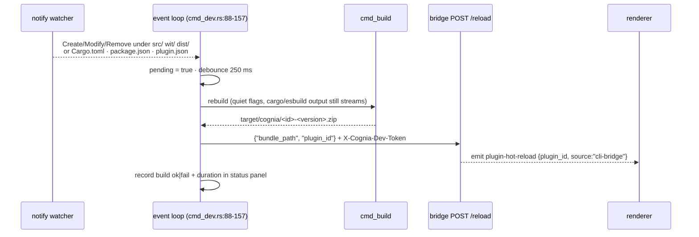

# Bridge client — `install` / `uninstall` / `dev`

<TLDR>
  Three commands talk to a running cognia. Discovery reads
  `<config_dir>/cognia/cli-endpoint.json` — `{"baseUrl": "http://127.0.0.1:<port>", "devToken":
  "<64-hex>"}` — written by the desktop on every launch (`http_client.rs:55-87`; absence yields
  a directed "start the desktop app" error, never a hang). All requests are synchronous `ureq`
  with the `X-Cognia-Dev-Token` header (`http_client.rs:94-176`). `install` preflights a
  GET of installed plugins and prompts before replacing an existing id; `uninstall --purge-data`
  shows an irreversibility warning box; `dev` watches `src/ · wit/ · dist/ · Cargo.toml ·
  package.json · plugin.json` with `notify`, debounces 250 ms, rebuilds via `cmd_build`, and
  POSTs `/api/v1/dev/plugins/reload` — degrading gracefully to rebuild-only when no app runs.
</TLDR>

## Endpoint discovery

```rust
// crates/cognia-cli/src/http_client.rs:55-62
pub fn endpoint_file_path() -> Result<PathBuf> {
    if let Ok(p) = std::env::var("COGNIA_CLI_ENDPOINT_FILE") { return Ok(p.into()); } // tests
    let dirs = directories::BaseDirs::new().ok_or(…)?;
    Ok(dirs.config_dir().join("cognia").join("cli-endpoint.json"))
}
```

| OS | Path |
| --- | --- |
| Windows | `%APPDATA%\cognia\cli-endpoint.json` |
| macOS | `~/Library/Application Support/cognia/cli-endpoint.json` |
| Linux | `~/.config/cognia/cli-endpoint.json` (XDG-aware) |

`load_endpoint()` (`http_client.rs:67-87`) bails on three conditions with exact guidance:

```text
no running cognia detected: expected <path> to exist.
 Start the cognia desktop app (it writes this file on launch),
 or enable the CLI bridge in Settings → Plugins → Developer.
```

plus JSON-parse failures and present-but-empty fields (`… missing baseUrl / devToken —
re-launch cognia to refresh.`). Transport-level failures after discovery go through
`unreachable_bridge_error()` (`http_client.rs:131-144`), which adds a stale-file hint — the file
can outlive a crashed app.

## The HTTP client

`ureq` was chosen over reqwest to keep the CLI tokio-free (`http_client.rs:4-5`). `get_json` /
`post_json` (`http_client.rs:94-176`) set `X-Cognia-Dev-Token` on every call, append the path to
a trailing-slash-trimmed base, deserialize 2xx JSON, and surface non-2xx as
`POST <url> → HTTP <code>` plus the first 20 body lines. The endpoint table mirrors the
[server routes](./bridge-server):

| Method · path | Body | Response |
| --- | --- | --- |
| `GET /api/v1/dev/health` | — | `{"ok": true}` |
| `GET /api/v1/dev/plugins/installed` | — | `{"ok", "plugins": [{pluginId, version, status, installPath}]}` |
| `POST /api/v1/dev/plugins/install` | `{"bundle_path"}` | `{"ok", "pluginId", "warnings"[]}` |
| `POST /api/v1/dev/plugins/uninstall` | `{"plugin_id", "purge_data"}` | `{"ok", "pluginId"}` |
| `POST /api/v1/dev/plugins/reload` | `{"bundle_path", "plugin_id"}` | `{"ok", "pluginId"}` |

<Callout type="info" title="The bundle travels by path, not by upload">
  Install sends `{"bundle_path": "<absolute path>"}` and the desktop reads the file from disk
  itself (`cmd_install.rs:8-11`) — no multipart, no base64 body. That's why the server's 4 MiB
  body cap never constrains bundle size, and why the bridge is inherently local-only: a remote
  caller's path would be meaningless.
</Callout>

## install

`cmd_install.rs:56-156`:

1. canonicalize the bundle path; best-effort unzip of `plugin.json` for `{id, version}`
   (malformed → continue, the server re-validates)
2. **collision preflight** — `GET /plugins/installed`; if the id exists:
   `⚠ <id> is already installed (v<old> → v<new>).` then
   `Replace existing <id> v<old> with v<new>?` (default No; `--yes` skips; declining bails with
   `install aborted: <id> v<old> kept (no changes made)`)
3. `POST /plugins/install`; success prints `✓ installed <id> from <path>` plus any
   server-returned warnings indented as `⚠ …`; failure prints
   `install rejected by cognia: <error>`

## uninstall

`cmd_uninstall.rs:50-138`. Plain mode posts straight away. With `--purge-data`, a warning box is
rendered first (versions and install path fetched best-effort from the list endpoint):

```text
⚠ <id> will be uninstalled and its data PERMANENTLY DELETED.
  version:      <v>
  install dir:  <path>
  data scope:   plugin Dexie tables + plugin keyring entries
  reversible:   no — Dexie wipe is one-way
```

then `Permanently delete <id>'s data?` (default No). The actual Dexie wipe happens in the
renderer when it receives the `cli-bridge:plugin-uninstalled` event with `purge_data: true` —
the Rust handler only removes the install directory and runtime registration
(`handlers.rs:374-397`).

## dev — the watch loop



Mechanics (`cmd_dev.rs`):

- **watcher** — `notify::recommended_watcher()` (inotify / FSEvents / ReadDirectoryChangesW);
  recursive on `src/`, `wit/`, `dist/`, non-recursive on the three manifests (`:71-86`); only
  Create/Modify/Remove count (`should_rebuild`, `:160-165`); `DEBOUNCE = 250 ms` (`:37`)
- **endpoint resolution** (`resolve_reload_endpoint`, `:200-213`) — `--reload-url` overrides the
  discovered base (token still read from the endpoint file when present); no endpoint at all →
  **rebuild-only mode**, reload silently skipped
- **Ctrl-C** — an `AtomicU8` three-state machine via the `ctrlc` crate (`:39-43`): first press
  prints `⚠ Press Ctrl+C again to quit`, second press exits the loop — protecting against the
  reflexive Ctrl-C that would kill a long cargo build
- **status panel** (`StatusPanel`, `:248-419`) — on a TTY, a sticky 5-line `MultiProgress` block
  (title, `Status`, `Endpoint`, `Last build <secs>s @HH:MM:SS ok|fail`, `Rebuilds n`); on CI, a
  plain `[HH:MM:SS] rebuild #n ok|FAILED in <secs>s` line per build

A failed rebuild is reported above the panel (`✗ rebuild failed: …`) and the loop keeps
watching — the dev loop never dies on a compile error.
