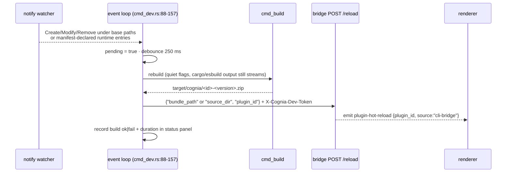

# Bridge client — `status` / `install` / `uninstall` / `list` / `reload` / `dev`

<TLDR>
  Six plugin-author commands talk to a running cognia. Discovery reads
  `<config_dir>/cognia/cli-endpoint.json` — `{"baseUrl": "http://127.0.0.1:<port>", "devToken":
  "<64-hex>"}` — written by the desktop on every launch (`http_client.rs:55-87`; absence yields
  a directed "start the desktop app" error, never a hang). All requests are synchronous `ureq`
  with the `X-Cognia-Dev-Token` header (`http_client.rs:94-190`). `status` probes
  `/api/v1/dev/health` and emits token-free JSON; `list` exposes the installed plugin snapshot as
  a table or `schemaVersion: 1` JSON; `reload` POSTs a hot-reload request for a
  plugin id, rebuilt bundle, or unpacked directory; `install` accepts either a built `.zip` or a directory containing
  `plugin.json`, preflights installed plugins, and prompts before replacing an existing id; `uninstall --purge-data` shows an irreversibility warning box; `dev` watches the base source/build paths plus manifest-declared runtime entries
  (`main`, `pythonMain`, `vscodeMain`, `styles`, `bundle_include[]`) with `notify`, debounces 250 ms, rebuilds via `cmd_build`, and
  POSTs `/api/v1/dev/plugins/reload` — degrading gracefully to rebuild-only when no app runs.
</TLDR>

## Endpoint discovery

```rust
// crates/cognia-cli/src/http_client.rs:55-62
pub fn endpoint_file_path() -> Result<PathBuf> {
    if let Ok(p) = std::env::var("COGNIA_CLI_ENDPOINT_FILE") { return Ok(p.into()); } // tests
    let dirs = directories::BaseDirs::new().ok_or(…)?;
    Ok(dirs.config_dir().join("cognia").join("cli-endpoint.json"))
}
```

| OS | Path |
| --- | --- |
| Windows | `%APPDATA%\cognia\cli-endpoint.json` |
| macOS | `~/Library/Application Support/cognia/cli-endpoint.json` |
| Linux | `~/.config/cognia/cli-endpoint.json` (XDG-aware) |

`load_endpoint()` (`http_client.rs:67-87`) bails on three conditions with exact guidance:

```text
no running cognia detected: expected <path> to exist.
 Start the cognia desktop app (it writes this file on launch),
 or enable the CLI bridge in Settings → Plugins → Developer.
```

plus JSON-parse failures and present-but-empty fields (`… missing baseUrl / devToken —
re-launch cognia to refresh.`). Transport-level failures after discovery go through
`unreachable_bridge_error()` (`http_client.rs:131-144`), which adds a stale-file hint — the file
can outlive a crashed app.

## The HTTP client

`ureq` was chosen over reqwest to keep the CLI tokio-free (`http_client.rs:4-5`). `get_json` /
`post_json` (`http_client.rs:94-176`) set `X-Cognia-Dev-Token` on every call, append the path to
a trailing-slash-trimmed base, deserialize 2xx JSON, and surface non-2xx as
`POST <url> → HTTP <code>` plus the first 20 body lines. The endpoint table mirrors the
[server routes](./bridge-server):

| Method · path | Body | Response |
| --- | --- | --- |
| `GET /api/v1/dev/health` | — | `{"ok": true}` |
| `GET /api/v1/dev/plugins/installed` | — | `{"ok", "plugins": [{pluginId, version, status, installPath}]}` |
| `POST /api/v1/dev/plugins/install` | `{"bundle_path"}` | `{"ok", "pluginId", "warnings"[]}` |
| `POST /api/v1/dev/plugins/install-directory` | `{"source_dir"}` | `{"ok", "pluginId", "warnings"[]}` |
| `POST /api/v1/dev/plugins/uninstall` | `{"plugin_id", "purge_data"}` | `{"ok", "pluginId"}` |
| `POST /api/v1/dev/plugins/reload` | `{"plugin_id"}` or `{"bundle_path"}` or `{"source_dir"}` | `{"ok", "pluginId", "warnings"[]}` |
| `POST /api/v1/dev/sessions/handoff` | `{"sessionId", "title"?, "messages", "meta"?}` | `{"ok", "sessionId"}` — owned by `cognia-agent`, not the plugin-author CLI |

<Callout type="info" title="Install inputs travel by path, not by upload">
  Bundle install sends `{"bundle_path": "<absolute path>"}`; unpacked-directory install sends
  `{"source_dir": "<absolute path>"}`. The desktop reads the file tree from disk itself — no
  multipart, no base64 body. That's why the server's 4 MiB body cap never constrains bundle size,
  and why the bridge is inherently local-only: a remote caller's path would be meaningless.
</Callout>

## install

`cmd_install.rs`:

1. canonicalize the input path and classify it as either a file bundle or a plugin directory
2. best-effort read `plugin.json` for `{id, version}` — unzip for bundles, direct read for
   directories (malformed → continue, the server re-validates)
3. **collision preflight** — `GET /plugins/installed`; if the id exists:
   `⚠ <id> is already installed (v<old> → v<new>).` then
   `Replace existing <id> v<old> with v<new>?` (default No; `--yes` skips; declining bails with
   `install aborted: <id> v<old> kept (no changes made)`)
4. `POST /plugins/install` for bundles or `/plugins/install-directory` for directories; success
   prints `✓ installed <id> from <path>` plus any server-returned warnings indented as `⚠ …`; failure prints
   `install rejected by cognia: <error>`

In `--json` mode, install/reload/uninstall all keep stdout structured for endpoint discovery
failures, bridge envelopes (`{"ok": false, "error": "..."}`), and raw HTTP/transport failures from
`post_json`. The payloads use `schemaVersion: 1`, `ok: false`, the command `action`,
`stage: "endpoint"` or `"bridge"`, command inputs, and the actionable error string; stderr stays
empty because `JsonFailureExit` suppresses the generic error renderer.

## uninstall

`cmd_uninstall.rs:50-138`. Plain mode posts straight away. With `--purge-data`, a warning box is
rendered first (versions and install path fetched best-effort from the list endpoint):

```text
⚠ <id> will be uninstalled and its data PERMANENTLY DELETED.
  version:      <v>
  install dir:  <path>
  data scope:   plugin Dexie tables + plugin keyring entries
  reversible:   no — Dexie wipe is one-way
```

then `Permanently delete <id>'s data?` (default No). The actual Dexie wipe happens in the
renderer when it receives the `cli-bridge:plugin-uninstalled` event with `purge_data: true` —
the Rust handler only removes the install directory and runtime registration
(`handlers.rs:510-531`).

## list

`cmd_list.rs` wraps the same `GET /api/v1/dev/plugins/installed` bridge route that `install` and
`uninstall --purge-data` already use for preflight previews. Human output is a compact table with
plugin id, version, status, and install path. `--json` emits:

```json
{
  "schemaVersion": 1,
  "ok": true,
  "action": "list",
  "plugins": [
    {
      "pluginId": "demo",
      "version": "1.2.3",
      "status": "installed",
      "installPath": "/path/to/plugin"
    }
  ]
}
```

If endpoint discovery or the bridge request itself fails in JSON mode (for example a missing/stale
endpoint file, auth rejection, or non-2xx bridge response), stdout remains machine-readable and the
command exits non-zero. `stage` is `"endpoint"` before an HTTP request exists and `"bridge"` after a
request reaches the client:

```json
{
  "schemaVersion": 1,
  "ok": false,
  "action": "list",
  "stage": "bridge",
  "error": "GET http://127.0.0.1:4567/api/v1/dev/plugins/installed -> HTTP 500\nresponse: ..."
}
```

The bridge intentionally exposes only this privacy-safe snapshot subset; runtime state and
plugin-owned secrets never leave the desktop process.

## status

`cmd_status.rs` wraps `GET /api/v1/dev/health` through `http_client::probe_health()`. Human
output shows whether the bridge is running, plus the endpoint file path and base URL when known.
`--json` emits a script-friendly report and exits non-zero when `running` is `false`:

```json
{
  "schemaVersion": 1,
  "ok": true,
  "action": "status",
  "running": true,
  "endpointFile": "C:/Users/dev/AppData/Roaming/cognia/cli-endpoint.json",
  "baseUrl": "http://127.0.0.1:4567",
  "error": null
}
```

An unavailable bridge keeps the same envelope and leaves stderr empty:

```json
{
  "schemaVersion": 1,
  "ok": false,
  "action": "status",
  "running": false,
  "endpointFile": "C:/Users/dev/AppData/Roaming/cognia/cli-endpoint.json",
  "baseUrl": null,
  "error": "no running cognia detected: expected C:/Users/dev/AppData/Roaming/cognia/cli-endpoint.json to exist"
}
```

The report deliberately excludes `devToken`; tests assert that a loaded endpoint containing a
secret token cannot serialize it into the status payload.

## reload

`cmd_reload.rs` wraps `POST /api/v1/dev/plugins/reload` for scripts that want the hot-reload
behavior without starting the file watcher. It accepts either `--plugin-id <id>`,
`--bundle <zip-or-directory>`, or both. Path inputs are canonicalized and classified before
crossing the bridge: file inputs send `bundle_path`; directory inputs send `source_dir`.

```bash
cognia plugin reload --plugin-id hello
cognia plugin reload --path target/cognia/hello-0.1.0.zip
cognia plugin reload --path .
```

The response envelope mirrors install: `{ok, pluginId, warnings[]}`. In human mode, non-2xx
transport failures still use the generic `http_client::post_json` diagnostics; in `--json` mode,
reload wraps those errors into the same `ok: false`, `stage: "bridge"` payload shape used for
bridge-level rejections.

## dev — the watch loop

`cognia plugin dev --once` reuses the same build + optional reload pipeline without starting the
file watcher. It is intended for CI, editor tasks, and "does this plugin still build and reload?"
smokes. `--json` is accepted only with `--once`, so stdout is always one complete JSON document:

```json
{
  "schemaVersion": 1,
  "ok": true,
  "action": "dev",
  "mode": "once",
  "pluginId": "hello-python",
  "version": "0.1.0",
  "pluginType": "python",
  "bundle": "target/cognia/hello-python-0.1.0.zip",
  "reload": {
    "attempted": false,
    "skippedReason": "no-endpoint"
  }
}
```

If the bridge responds with `{ "ok": false, "error": "..." }`, the command exits non-zero and keeps
the build metadata in the failure payload with `stage: "reload"` and
`"reload": { "attempted": true, "ok": false }`.



Mechanics (`cmd_dev.rs`):

- **watcher** — `notify::recommended_watcher()` (inotify / FSEvents / ReadDirectoryChangesW);
  starts from `src/`, `wit/`, `dist/`, `Cargo.toml`, `package.json`, and `plugin.json`, then adds safe manifest-declared paths from `main`, `pythonMain`, `vscodeMain`, `styles`, and `bundle_include[]`; only
  Create/Modify/Remove count (`should_rebuild`, `:160-165`); `DEBOUNCE = 250 ms` (`:37`)
- **endpoint resolution** (`resolve_reload_endpoint`, `:200-213`) — `--reload-url` overrides the
  discovered base (token still read from the endpoint file when present); no endpoint at all →
  **rebuild-only mode**, reload silently skipped
- **Ctrl-C** — an `AtomicU8` three-state machine via the `ctrlc` crate (`:39-43`): first press
  prints `⚠ Press Ctrl+C again to quit`, second press exits the loop — protecting against the
  reflexive Ctrl-C that would kill a long cargo build
- **status panel** (`StatusPanel`, `:248-419`) — on a TTY, a sticky 5-line `MultiProgress` block
  (title, `Status`, `Endpoint`, `Last build <secs>s @HH:MM:SS ok|fail`, `Rebuilds n`); on CI, a
  plain `[HH:MM:SS] rebuild #n ok|FAILED in <secs>s` line per build

A failed rebuild is reported above the panel (`✗ rebuild failed: …`) and the loop keeps
watching — the dev loop never dies on a compile error.

## acp — stdio to WebSocket bridge

`cognia acp` is a top-level utility command rather than a `cognia plugin` subcommand. Editors that
speak the Agent Client Protocol over newline-delimited stdio can configure
`{"command": "cognia", "args": ["acp"]}`; the CLI resolves a companion WebSocket endpoint and then
forwards stdin JSON-RPC lines to WebSocket text frames, printing server frames back to stdout.

Target resolution (`cmd_acp.rs`) is intentionally strict:

1. `COGNIA_ACP_URL` + `COGNIA_ACP_TOKEN` override discovery only when both are non-empty.
   Supplying just one of them fails immediately with a message naming the missing variable.
2. Without an override, the command reads the normal `cli-endpoint.json` and POSTs
   `/api/v1/dev/acp/token` to mint a scoped token and receive the `ws://` / `wss://` URL.
3. Broker-issued URLs must be loopback (`localhost`, `127.0.0.1`, or `::1`). Non-loopback URLs are
   accepted only through the explicit env override.

Status text goes to stderr so stdout remains a clean ACP JSON-RPC stream, and `--quiet`
suppresses that status line for editor integrations that treat stderr as a signal.

The bridge serves stable ACP v1 with the v1.21 schema. Preview capabilities are absent unless the
matching Cognia server setting and host runtime support are both active; ACP v2 is not advertised.

### Opt-in live agent smoke

`pnpm smoke:acp-live` uses the official TypeScript SDK client against installed agent commands.
The command skips safely when no target is configured. Supply one or more commands as JSON argv
arrays so no shell parsing is involved:

```bash
ACP_GEMINI_COMMAND='["gemini", "<ACP args>"]' pnpm smoke:acp-live
ACP_CODEX_COMMAND='["codex", "<ACP args>"]' pnpm smoke:acp-live
ACP_CLAUDE_COMMAND='["claude", "<ACP args>"]' pnpm smoke:acp-live
```

Use the ACP invocation supported by the locally installed agent version. The smoke initializes,
creates a confined session, sends a no-tool prompt, records updates and the authoritative stop
reason, rejects any unexpected permission request, and terminates the child process.
The child receives only a minimal process environment. If authentication requires environment
credentials, select them explicitly with the matching `ACP_GEMINI_ENV`, `ACP_CODEX_ENV`, or
`ACP_CLAUDE_ENV` JSON object; unrelated ambient secrets are never forwarded.

### Manual editor interoperability

For a release candidate, run the same bounded workspace fixture in both editors:

1. Start Cognia desktop, confirm the Companion endpoint is healthy, and configure the editor agent
   command as `cognia acp --quiet`.
2. In Zed, create a session, send a text prompt, approve and reject one tool call, cancel one active
   turn, then close, resume, load, and delete the session. Confirm load replays history and resume
   does not.
3. In a JetBrains IDE with ACP support, repeat the lifecycle and verify a named resource link,
   base64 image, additional root, model config change, usage, and session title/activity updates.
4. In both editors, verify stdio MCP propagation and confirm HTTP/SSE MCP is rejected when Cognia
   does not advertise it. Preview provider, dynamic MCP, compaction, and NES controls must remain
   absent with their flags off.
5. Inspect stderr/logs for secrets: provider headers, MCP environment values, transport tickets,
   and terminal-auth environment values must never be printed.
