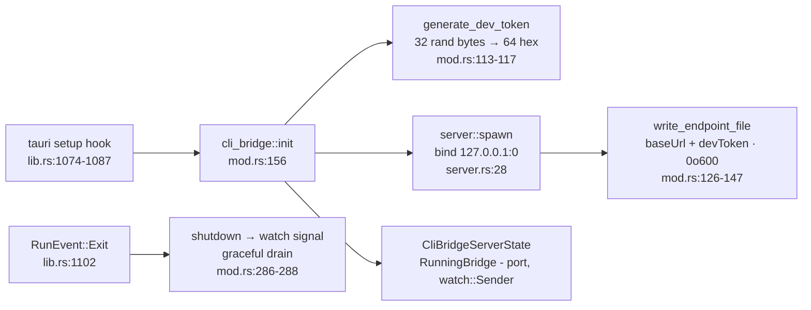

# Bridge server — `src-tauri/src/cli_bridge`

<TLDR>
  `cli_bridge::init()` (`mod.rs:156-180`) runs in a spawned task inside Tauri's `setup()` hook:
  generate a 32-byte / 64-hex dev token, `server::spawn()` an axum router bound to
  **`127.0.0.1:0`** (OS-assigned ephemeral port), write `cli-endpoint.json` (`0o600` on Unix),
  and stash `RunningBridge {bound_port, shutdown}` in managed state for graceful shutdown on app
  exit (`lib.rs:1102-1104`). Every request passes one middleware (`server.rs:80-107`):
  non-loopback peers get 403 `remote_blocked`; a wrong/missing `X-Cognia-Dev-Token` gets 401
  `bad_dev_token` after a constant-time comparison. Handlers mutate `PluginRuntimeState`
  directly and notify the renderer via fire-and-forget Tauri events.
</TLDR>

## Lifecycle



Startup is **best-effort**: an endpoint-file write failure is logged, not fatal, and a bridge
start failure logs `cli_bridge auto-start failed` without blocking the app. The token rotates
every launch; the file is rewritten each boot, so a stale file from a crashed session simply
carries a dead port + token. The bridge is desktop-only — on mobile it never spawns and
`cli_bridge_status` reports `running: false`.

## Auth middleware

```rust
// src-tauri/src/cli_bridge/server.rs:80-107 (abridged)
async fn auth_middleware(State(state), ConnectInfo(addr), request, next) -> Response {
    if !is_loopback(&addr) {                       // mod.rs:183 — 127.0.0.1 or ::1
        return error_response(StatusCode::FORBIDDEN, "remote_blocked",
            "the cli bridge accepts loopback (127.0.0.1) connections only");
    }
    let header = request.headers().get("X-Cognia-Dev-Token")…;
    if !constant_time_eq(header.as_bytes(), state.dev_token.as_bytes()) {  // server.rs:119
        return error_response(StatusCode::UNAUTHORIZED, "bad_dev_token",
            "X-Cognia-Dev-Token header missing or incorrect");
    }
    next.run(request).await
}
```

`constant_time_eq` (`server.rs:119-128`) XOR-accumulates over all bytes — no early exit, no
timing oracle. The middleware wraps **all** routes, including `health`, via
`from_fn_with_state` (`server.rs:72`), under a 4 MiB `RequestBodyLimitLayer` (`server.rs:26`).

## Routes

```rust
// src-tauri/src/cli_bridge/server.rs:55-75
Router::new()
    .route("/api/v1/dev/health",            get(handlers::health))
    .route("/api/v1/dev/plugins/installed", get(handlers::list_installed))
    .route("/api/v1/dev/plugins/install",   post(handlers::install))
    .route("/api/v1/dev/plugins/uninstall", post(handlers::uninstall))
    .route("/api/v1/dev/plugins/reload",    post(handlers::reload))
```

All responses share the envelope `{"ok": true, "pluginId"?, "warnings"?: []}` /
`{"ok": false, "error", "code"?}`. Failures from handlers are 422; missing required fields in
`reload` are 400.

| Handler | Core logic | Lines |
| --- | --- | --- |
| `health` | `{"ok": true}` liveness probe | `handlers.rs:75-77` |
| `list_installed` | read-locked snapshot of `PluginRuntimeState.plugins`, projected to `pluginId / version / status / installPath` only — never `runtime_state`, so secrets can't leak through the bridge | `handlers.rs:104-122` |
| `install` | `install_inner` → emit `cli-bridge:plugin-installed` | `handlers.rs:125-158` |
| `uninstall` | `uninstall_inner` → emit `cli-bridge:plugin-uninstalled` | `handlers.rs:160-189` |
| `reload` | two modes (below) → emit hot-reload events | `handlers.rs:191-261` |

### install_inner (`handlers.rs:267-293`)

Validate the bundle path (must be absolute and exist) → read the zip → extract the manifest for
`plugin_id` → wipe any previous version of the plugin dir → extract → `register_installed_plugin`
into `PluginRuntimeState`. Extraction defends against **zip-slip**: entries resolving outside
the target directory are skipped (test `extract_zip_into_skips_path_traversal_entries`,
`handlers.rs:590-616`).

### reload's two modes (`handlers.rs:191-261`)

| Mode | Trigger | Behavior |
| --- | --- | --- |
| A — reinstall | body has `bundle_path` | full `install_inner`, then hot-reload events with `via: "install"` — this is what `cognia plugin dev` uses |
| B — hot-reload only | body has `plugin_id` only | no file work; events with `via: "reload"` ask the renderer to re-read the artifact already on disk |

Each success emits **two** events: the per-plugin channel `plugin-hot-reload:<plugin_id>` with
`{"source": "cli-bridge"}` (legacy subscribers that already know their id) and the global
`plugin-hot-reload` with `{"plugin_id", "source": "cli-bridge", "via"}` (the centralized
hot-reload history store).

## State & concurrency

```rust
// src-tauri/src/cli_bridge/mod.rs:62-71
pub struct CliBridgeState { dev_token: String, app_handle: AppHandle }   // Arc<…> = SharedState
```

The token is immutable per launch — no lock. Server lifecycle lives in
`CliBridgeServerState { inner: parking_lot::Mutex<Option<RunningBridge>> }` (`mod.rs:75-110`),
held only for insert/take. Plugin mutations go through `PluginRuntimeState`'s per-field
`Arc<RwLock<HashMap<…>>>` (`plugin_api/mod.rs:91-108`) — requests are independent; there is no
single-flight guard, matching the single-developer-loopback threat model.

## Renderer round-trip

Events are **fire-and-forget** — no pending-request map, no response events, no timeouts. The
renderer's `use-cli-bridge-events` hook subscribes once and reacts:

| Event | Payload | Renderer action |
| --- | --- | --- |
| `cli-bridge:plugin-installed` | `{plugin_id}` | refresh plugin manager list |
| `cli-bridge:plugin-uninstalled` | `{plugin_id, purge_data}` | drop from list; `purge_data: true` triggers the Dexie wipe (TS owns plugin tables) |
| `plugin-hot-reload` (+ per-id channel) | `{plugin_id, source, via}` | unload + reload the plugin artifact |

## Adjacent Tauri commands

Registered alongside the HTTP bridge (`lib.rs:435-439`): `cli_bridge_status` (renderer status
probe), `plugin_install_from_directory` + `preview_local_manifest` (the DevTools "load unpacked"
path, sharing the same manifest/extraction helpers — `copy_dir_recursive` tested at
`handlers.rs:568-587`), `detect::detect_binary`, and `download::download_cognia_cli`
([next page](./detection-and-managed-install)).

18+ in-file tests cover token shape/uniqueness (`mod.rs:290-307`), loopback detection
(`:309-317`), endpoint-file round-trips (`:319-346`), `constant_time_eq` (`server.rs:131-148`),
manifest-from-zip extraction and rejection paths, and the zip-slip defense
(`handlers.rs:481-617`).
