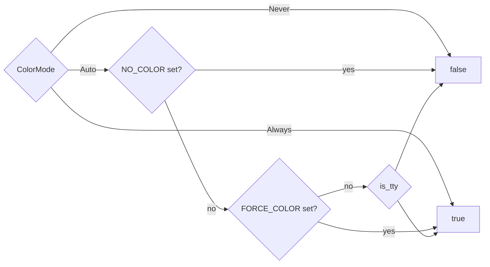

# CLI core & terminal UI

<TLDR>
  `main.rs` (`crates/cognia-cli/src/main.rs`, 465 lines) parses one nested clap-derive tree —
  `Cli` → `TopCommand::Plugin` → an 11-variant `PluginCommand` enum — resolves a `ColorMode`,
  builds a `RuntimeUi` (`ui/runtime.rs:60`), and routes through `dispatch_plugin()`
  (`main.rs:288`). Every interactive touchpoint goes through the **`Prompter` trait**
  (`ui/prompter.rs:82`) with three implementations: `DialoguerPrompter` on a TTY,
  `NoninteractivePrompter` that refuses with an actionable flag hint, and `MockPrompter` for
  deterministic tests. Errors flow `anyhow` → `eyre` (`anyhow_to_eyre`, `main.rs:277`) so
  color-eyre renders the full cause chain; exit codes are 0 / 1 / 2 (clap) / 101 (panic).
</TLDR>

## Crate identity

`crates/cognia-cli/Cargo.toml` — crate `cognia-cli` 0.1.0, **binary name `cognia`**, edition 2021,
`rust-version = "1.82"`. Key dependencies:

| Dep | Role |
| --- | --- |
| `clap 4` (`derive`, `wrap_help`) | command tree |
| `eyre` + `color-eyre 0.6` | colored error reports with cause chains |
| `dialoguer 0.11` | Confirm / Input / Select prompts (`ColorfulTheme`) |
| `indicatif 0.17` | spinners (`MultiProgress` for the dev panel) |
| `owo-colors 4` (`supports-colors`) | palette with global override |
| `is-terminal 0.4` | TTY probe at startup |
| `ed25519-dalek`, `sha2`, `base64`, `hex` | signing surface |
| `zip 2`, `wasmparser 0.221` | bundle packing + custom-section parse |
| `ureq 2` (`json`) | sync HTTP to the bridge — no tokio in the CLI |
| `notify 6`, `ctrlc 3` | dev-loop watcher + double-Ctrl-C quit |
| `directories` | cross-platform `config_dir()` for endpoint discovery |

## The command tree

```rust
// crates/cognia-cli/src/main.rs:83-115
struct Cli {
    --color <auto|always|never>   // default auto          (main.rs:88)
    --no-color                    // wins over --color     (main.rs:91)
    -q, --quiet                   // suppress non-error    (main.rs:94)
    -v, --verbose                 // repeatable, max -vv   (main.rs:97)
    -y, --yes                     // pre-confirm; CI mode  (main.rs:101)
    command: TopCommand,
}

enum TopCommand {
    Plugin { #[command(subcommand)] command: PluginCommand },   // main.rs:108-115
}
```

The 11 `PluginCommand` variants (`main.rs:117-241`) and their dispatch sites in
`dispatch_plugin()` (`main.rs:288-346`):

| Variant | Flags | Dispatch |
| --- | --- | --- |
| `New` | `--dir` `--kind` `--author` `--author-email` `--description` `--with-keygen` | `main.rs:298` |
| `Lint` | `--path .` `--json` | `main.rs:310` (sets `ui.flags.json` first) |
| `Build` | `--path .` `--out` `--skip-build` | `main.rs:316` |
| `Info` | `--json` `--detailed` | `main.rs:323` |
| `Sign` | `--key` (required) `--out` | `main.rs:325` |
| `Verify` | `--public-key` `--signature` `--json` | `main.rs:333` |
| `Keygen` | `--out-dir .cognia` | `main.rs:335` |
| `Install` | — | `main.rs:336` |
| `Uninstall` | `--purge-data` | `main.rs:340` |
| `Dev` | `--path .` `--reload-url` | `main.rs:341` |
| `EmbedVersion` | `--out` | `main.rs:343` → `cmd_embed_version` (`main.rs:348`) |

### main() in nine lines

```rust
// crates/cognia-cli/src/main.rs:243-272 (abridged)
let cli = Cli::parse();
let color_mode = if cli.no_color { ColorMode::Never }
                 else { ColorMode::parse(&cli.color)? };
let flags = UiFlags { color: color_mode, quiet: cli.quiet,
                      verbose: cli.verbose, yes: cli.yes, json: false };
let mut ui = RuntimeUi::new(flags);
ui.apply_color_override();          // owo_colors::set_override
ui::error::install()?;              // idempotent color-eyre hook
let result = match cli.command {
    TopCommand::Plugin { command } => dispatch_plugin(command, &mut ui),
};
result.map_err(anyhow_to_eyre)?;
```

Commands return `anyhow::Result`; `anyhow_to_eyre()` (`main.rs:277-286`) re-wraps the chain in
reverse so color-eyre prints innermost-first with full context.

## RuntimeUi — per-invocation state

```rust
// crates/cognia-cli/src/ui/runtime.rs:60-169
pub struct RuntimeUi {
    pub is_tty: bool,                 // stdout.is_terminal() at construction
    pub color: bool,                  // resolved from ColorMode + env
    pub flags: UiFlags,
    prompter: Box<dyn Prompter>,      // Dialoguer on TTY, Noninteractive otherwise
}
```

Color resolution (`compute_color`, `runtime.rs:171-185`) follows the industry convention:



Helper methods commands rely on: `prompter()` (`runtime.rs:124`), `show_progress()` =
`!quiet` (`runtime.rs:129`), and `confirm_overwrite(path, flag_hint)` (`runtime.rs:155-168`) —
returns `true` immediately when the path doesn't exist or `--yes` is set, otherwise prompts with
default **No**. `keygen`, `sign`, and `new` all gate destructive writes through it.

## The Prompter trait — three implementations

```rust
// crates/cognia-cli/src/ui/prompter.rs:82-131
pub trait Prompter: Send {
    fn confirm(&mut self, message: &str, default: bool, flag_hint: &str) -> Result<bool, PromptError>;
    fn input(&mut self, message: &str, default: Option<&str>, flag_hint: &str) -> Result<String, PromptError>;
    fn input_optional(&mut self, message: &str, flag_hint: &str) -> Result<Option<String>, PromptError>;
    fn select(&mut self, message: &str, items: &[&str], default_index: usize, flag_hint: &str) -> Result<usize, PromptError>;
    fn multi_select(&mut self, message: &str, items: &[&str], defaults: &[bool], flag_hint: &str) -> Result<Vec<usize>, PromptError>;
}
```

| Impl | Behavior | Lines |
| --- | --- | --- |
| `DialoguerPrompter` | wraps `dialoguer` `Confirm`/`Input`/`Select`/`MultiSelect` with `ColorfulTheme`; trims input | `prompter.rs:137-232` |
| `NoninteractivePrompter` | `confirm`/`input`/`select` → `PromptError::Noninteractive`; `input_optional` → `Ok(None)`, `multi_select` → `Ok(vec![])` silently | `prompter.rs:238-299` |
| `MockPrompter` | `VecDeque<Answer>` queue + `recorded_prompts` transcript; type-mismatch and empty-queue are hard errors | `prompter.rs:305-444` |

The non-interactive error is deliberately actionable — every call site supplies a `flag_hint`:

```text
non-interactive shell: prompt `<prompt>` requires input — pass `<flag_hint>` to skip
```

(`prompter.rs:38-47`). This is why `--yes` is described as "required for CI" in the help text: CI
runs are non-TTY, so any prompt that would block instead fails fast with the exact flag to add.

## Progress, palette, error rendering

- **`make_spinner(ui, msg)`** (`ui/progress.rs:22-38`) — hidden when not a TTY or `--quiet`;
  visible template `"{spinner:.cyan} {msg}"` with Braille ticks at 80 ms.
  `make_spinner_in_multi` / `make_multi_progress` (`progress.rs:46-73`) exist for nested flows —
  the `dev` status panel builds on `MultiProgress` directly.
- **Palette** (`ui/style.rs:15-74`) — `ok` bold-green, `error` bold-red, `warn` bold-yellow,
  `hint` bold-cyan, `dim`, `bold`; prefix helpers `success_prefix()` "✓ ", `error_prefix()` "✗ ",
  `warn_prefix()` "⚠ ", `hint_prefix()` "→ try: ". Every helper routes through
  `owo_colors::if_supports_color(Stream::Stdout, …)` so the single global override set in
  `main()` governs all output.
- **`ui::error::install()`** (`ui/error.rs:21-33`) — idempotent color-eyre panic + error hook;
  swallows the "already installed" error so tests can call it repeatedly.

## Exit codes

| Code | Meaning |
| --- | --- |
| 0 | command returned `Ok(())` |
| 1 | any `Err` — rendered by color-eyre with the full cause chain |
| 2 | clap parse/usage error |
| 101 | panic (color-eyre panic hook) |

`lint` is the one command that exits 1 by explicit `std::process::exit(1)` when the report
contains errors (`cmd_lint.rs:226-230`) — warnings alone keep exit 0.

## Integration tests

`crates/cognia-cli/tests/integration.rs` spawns the compiled binary via `CARGO_BIN_EXE_cognia`
with `NO_COLOR=1`, `CI=true`, and stdin nulled. The 10 tests pin the public contract: `--help` /
`--version` shape, lint exit codes on clean vs broken manifests, `lint --json` carrying
`schemaVersion: 1`, `info --json` round-tripping with `signature.status = "no-sidecar"`,
`new` failing on non-TTY without a name (with an actionable hint) and succeeding with explicit
args, unknown-subcommand errors, and `NO_COLOR` stripping every ANSI escape from output.
