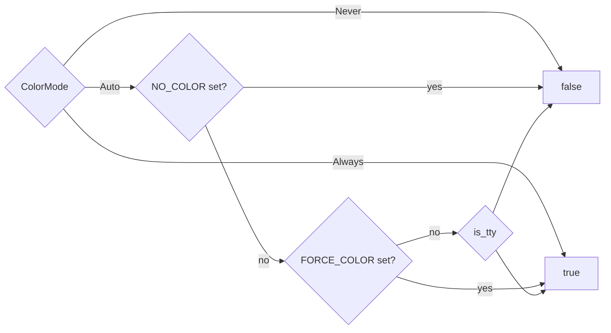

# CLI core & terminal UI

<TLDR>
  `main.rs` (`crates/cognia-cli/src/main.rs`) parses one clap-derive tree —
  `Cli` → `TopCommand` (`plugin`, `acp`, `release-key`, `release-verify`) with a 14-variant
  `PluginCommand` enum under `plugin` — resolves a `ColorMode`, builds a `RuntimeUi`
  (`ui/runtime.rs`), and routes plugin commands through `dispatch_plugin()`.
  Every interactive touchpoint goes through the **`Prompter` trait**
  (`ui/prompter.rs`) with three implementations: `DialoguerPrompter` on a TTY,
  `NoninteractivePrompter` that refuses with an actionable flag hint, and `MockPrompter` for
  deterministic tests. Errors flow `anyhow` → `eyre` (`anyhow_to_eyre`) so
  color-eyre renders the full cause chain; exit codes are 0 / 1 / 2 (clap) / 101 (panic).
</TLDR>

## Crate identity

`crates/cognia-cli/Cargo.toml` — crate `cognia-cli` 0.1.0, **binary name `cognia`**, edition 2021,
`rust-version = "1.82"`. Key dependencies:

| Dep | Role |
| --- | --- |
| `clap 4` (`derive`, `wrap_help`) | command tree |
| `eyre` + `color-eyre 0.6` | colored error reports with cause chains |
| `dialoguer 0.11` | Confirm / Input / Select prompts (`ColorfulTheme`) |
| `indicatif 0.17` | spinners (`MultiProgress` for the dev panel) |
| `owo-colors 4` (`supports-colors`) | palette with global override |
| `is-terminal 0.4` | TTY probe at startup |
| `ed25519-dalek`, `sha2`, `base64`, `hex` | signing surface |
| `zip 2`, `wasmparser 0.221` | bundle packing + custom-section parse |
| `ureq 2` (`json`) | sync HTTP to the bridge — no tokio in the CLI |
| `notify 6`, `ctrlc 3` | dev-loop watcher + double-Ctrl-C quit |
| `directories` | cross-platform `config_dir()` for endpoint discovery |

## The command tree

```rust
// crates/cognia-cli/src/main.rs (abridged)
struct Cli {
    --color <auto|always|never>   // default auto
    --no-color                    // wins over --color
    -q, --quiet                   // suppress non-error
    -v, --verbose                 // repeatable, max -vv
    -y, --yes                     // pre-confirm; CI mode
    command: TopCommand,
}

enum TopCommand {
    Plugin { #[command(subcommand)] command: PluginCommand },
    Acp,
    ReleaseKey { json: bool },
    ReleaseVerify { artifact, checksums, artifact_name, signature, json },
}
```

The 14 `PluginCommand` variants and their dispatch sites in `dispatch_plugin()`:

| Variant | Flags | Dispatch |
| --- | --- | --- |
| `New` | `--dir` `--kind` `--author` `--author-email` `--description` `--with-keygen` `--json` | `dispatch_plugin()` sets `ui.flags.json`, logs verbose context, then calls `cmd_new::run` |
| `Lint` | `--path .` `--json` | `dispatch_plugin()` sets `ui.flags.json` first |
| `Build` | `--path .` `--out` `--skip-build` `--json` | `dispatch_plugin()` |
| `Info` | `--json` `--detailed` | `dispatch_plugin()` |
| `Sign` | `--key` (required) `--out` `--json` | `dispatch_plugin()` |
| `Verify` | `--public-key` `--signature` `--json` | `dispatch_plugin()` |
| `Keygen` | `--out-dir .cognia` `--json` | `dispatch_plugin()` |
| `Install` | `<path>` bundle or directory `--json` | `dispatch_plugin()` |
| `Uninstall` | `--purge-data` `--json` | `dispatch_plugin()` |
| `List` | `--json` | `dispatch_plugin()` |
| `Reload` | `--path` (visible alias for `--bundle`) `--plugin-id` `--json` | `dispatch_plugin()` |
| `Status` | `--json` | `dispatch_plugin()` sets `ui.flags.json` first |
| `Dev` | `--path .` `--reload-url` `--once` `--json` | `dispatch_plugin()` |
| `EmbedVersion` | `--out` `--json` | `dispatch_plugin()` → `cmd_embed_version` |

### main() in nine lines

```rust
// crates/cognia-cli/src/main.rs (abridged)
let cli = Cli::parse();
let color_mode = if cli.no_color { ColorMode::Never }
                 else { ColorMode::parse(&cli.color)? };
let flags = UiFlags { color: color_mode, quiet: cli.quiet,
                      verbose: cli.verbose, yes: cli.yes, json: false };
let mut ui = RuntimeUi::new(flags);
ui.apply_color_override();          // owo_colors::set_override
ui::error::install()?;              // idempotent color-eyre hook
let result = match cli.command {
    TopCommand::Plugin { command } => dispatch_plugin(command, &mut ui),
    TopCommand::Acp => { ui.verbose("running acp"); cmd_acp::run(&ui) },
    TopCommand::ReleaseKey { json } => cmd_release_key::run(json, &mut ui),
    TopCommand::ReleaseVerify { .. } => cmd_release_verify::run(...),
};
if let Err(err) = result {
    if err.is::<cmd_lint::LintError>() || err.is::<JsonFailureExit>() {
        std::process::exit(1);
    }
    return Err(anyhow_to_eyre(err));
}
```

Commands return `anyhow::Result`; bounded `--json` failures print a schema-versioned payload on
stdout and return `JsonFailureExit`, so `main()` exits 1 without color-eyre stderr noise. Lint
errors similarly keep their report in the command output and exit 1 through `LintError`. Other
errors go through `anyhow_to_eyre()`, which re-wraps the chain in reverse so
color-eyre prints innermost-first with full context.

## RuntimeUi — per-invocation state

```rust
// crates/cognia-cli/src/ui/runtime.rs:60-169
pub struct RuntimeUi {
    pub is_tty: bool,                 // stdout.is_terminal() at construction
    pub color: bool,                  // resolved from ColorMode + env
    pub flags: UiFlags,
    prompter: Box<dyn Prompter>,      // Dialoguer on TTY, Noninteractive otherwise
}
```

Color resolution (`compute_color`, `runtime.rs:171-185`) follows the industry convention:



Helper methods commands rely on: `prompter()` (`runtime.rs:124`), `show_progress()` =
`!quiet` (`runtime.rs:129`), `show_verbose()` / `verbose(...)` for human-only stderr diagnostics,
and `confirm_overwrite(path, flag_hint)` (`runtime.rs:155-168`) — returns `true` immediately when
the path doesn't exist or `--yes` is set, otherwise prompts with default **No**. `verbose(...)`
prints only when `-v/--verbose` is set and both `--quiet` and per-command `--json` are off, so JSON
stdout stays parseable and quiet success output stays silent. `keygen`, `sign`, and `new` all gate
destructive writes through `confirm_overwrite`.

## The Prompter trait — three implementations

```rust
// crates/cognia-cli/src/ui/prompter.rs:82-131
pub trait Prompter: Send {
    fn confirm(&mut self, message: &str, default: bool, flag_hint: &str) -> Result<bool, PromptError>;
    fn input(&mut self, message: &str, default: Option<&str>, flag_hint: &str) -> Result<String, PromptError>;
    fn input_optional(&mut self, message: &str, flag_hint: &str) -> Result<Option<String>, PromptError>;
    fn select(&mut self, message: &str, items: &[&str], default_index: usize, flag_hint: &str) -> Result<usize, PromptError>;
    fn multi_select(&mut self, message: &str, items: &[&str], defaults: &[bool], flag_hint: &str) -> Result<Vec<usize>, PromptError>;
}
```

| Impl | Behavior | Lines |
| --- | --- | --- |
| `DialoguerPrompter` | wraps `dialoguer` `Confirm`/`Input`/`Select`/`MultiSelect` with `ColorfulTheme`; trims input | `prompter.rs:137-232` |
| `NoninteractivePrompter` | `confirm`/`input`/`select` → `PromptError::Noninteractive`; `input_optional` → `Ok(None)`, `multi_select` → `Ok(vec![])` silently | `prompter.rs:238-299` |
| `MockPrompter` | `VecDeque<Answer>` queue + `recorded_prompts` transcript; type-mismatch and empty-queue are hard errors | `prompter.rs:305-444` |

The non-interactive error is deliberately actionable — every call site supplies a `flag_hint`:

```text
non-interactive shell: prompt `<prompt>` requires input — pass `<flag_hint>` to skip
```

(`prompter.rs:38-47`). This is why `--yes` is described as "required for CI" in the help text: CI
runs are non-TTY, so any prompt that would block instead fails fast with the exact flag to add.

## Progress, palette, error rendering

- **`make_spinner(ui, msg)`** (`ui/progress.rs:22-38`) — hidden when not a TTY or `--quiet`;
  visible template `"{spinner:.cyan} {msg}"` with Braille ticks at 80 ms.
  `make_spinner_in_multi` / `make_multi_progress` (`progress.rs:46-73`) exist for nested flows —
  the `dev` status panel builds on `MultiProgress` directly.
- **Palette** (`ui/style.rs:15-74`) — `ok` bold-green, `error` bold-red, `warn` bold-yellow,
  `hint` bold-cyan, `dim`, `bold`; prefix helpers `success_prefix()` "✓ ", `error_prefix()` "✗ ",
  `warn_prefix()` "⚠ ", `hint_prefix()` "→ try: ". Every helper routes through
  `owo_colors::if_supports_color(Stream::Stdout, …)` so the single global override set in
  `main()` governs all output.
- **`ui::error::install()`** (`ui/error.rs:21-33`) — idempotent color-eyre panic + error hook;
  swallows the "already installed" error so tests can call it repeatedly.

## Exit codes

| Code | Meaning |
| --- | --- |
| 0 | command returned `Ok(())` |
| 1 | any `Err` — rendered by color-eyre with the full cause chain |
| 2 | clap parse/usage error |
| 101 | panic (color-eyre panic hook) |

`lint` is the one command that exits 1 by explicit `std::process::exit(1)` when the report
contains errors (`cmd_lint::run`) — warnings alone keep exit 0.

## Integration tests

`crates/cognia-cli/tests/integration.rs` spawns the compiled binary via `CARGO_BIN_EXE_cognia`
with `NO_COLOR=1`, `CI=true`, and stdin nulled. The suite pins the public contract: `--help` /
`--version` shape, lint exit codes on clean vs broken manifests, JSON payloads for every bounded
plugin command including `dev --once --json`, `info --json` round-tripping with bundle and
directory inputs, scaffold creation for every template kind, release-key and release-verify
reports, unknown-subcommand errors, `--quiet` suppressing non-error human output while preserving
side effects and ACP protocol stdout, and `NO_COLOR` stripping every ANSI escape from output.
Bridge-client smoke checks keep
`plugin install --help`, `plugin info --help`, `plugin list --help`, `plugin reload --help`, and
`plugin status --help` wired through clap so these non-TUI bridge surfaces cannot silently
disappear.
