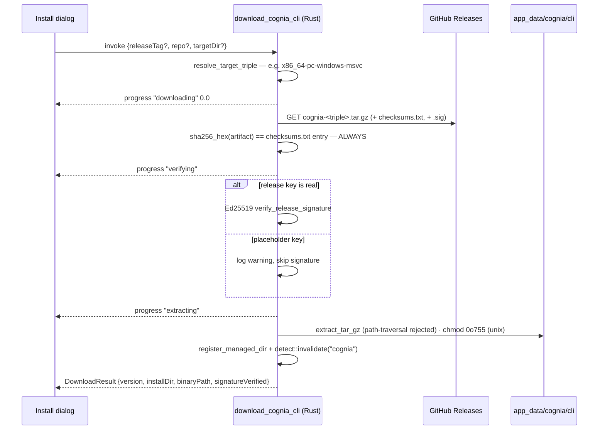

# Detection & managed install

<TLDR>
  `detectCli("cognia")` (`lib/cli-bridge/detect-cli.ts:37-56`) invokes the Tauri command
  `detect_binary`, which checks a 300-second cache, prefers **app-managed directories** (binaries
  the app downloaded itself), then probes `PATH` by running `cognia --version`
  (`src-tauri/src/cli_bridge/detect.rs:230-265`). The managed download
  (`download_cognia_cli`, `download.rs:200-309`) resolves the platform triple, fetches
  `cognia-<triple>.tar.gz` (+ `.sig` + `checksums.txt`) from GitHub Releases, **always enforces
  SHA-256**, verifies Ed25519 against the embedded release key unless it's still the placeholder,
  extracts traversal-safely to `<app_data>/cognia/cli/<version>`, chmods on Unix, registers the
  dir, and invalidates the detection cache so the UI flips to "installed" immediately. On web
  and mobile every entry point short-circuits to "unsupported".
</TLDR>

## Detection

```ts
// lib/cli-bridge/detect-cli.ts:18-23
export interface BinaryDetectionResult {
  available: boolean
  version: string | null   // first stdout line of `cognia --version`
  path: string | null      // best-effort `which` / `where`
  error: string | null     // "web" outside Tauri; IPC errors degrade, never throw
}
```

The Rust side (`detect.rs:230-265`):

1. cache lookup keyed `(name, version_arg)`, TTL 300 s (`detect.rs:21`)
2. `find_in_managed_dirs(name)` — LIFO over directories registered by past downloads
   (`register_managed_dir`, `detect.rs:61-69`; the snapshot also feeds PATH injection for
   [terminal launches](./devtools-ui))
3. fallback: spawn `name --version` from `PATH`; version = trimmed first stdout line
   (`:118-122`); path resolved via `which`/`where` (`:168-182`)
4. cache the result; `invalidate("cognia")` drops it after a download (`download.rs:308`)

`getCliBridgeStatus()` (`lib/cli-bridge/status.ts:26-49`) is the sibling probe for the
[bridge](./bridge-server): `{running, boundPort, endpointFile}`, returning a safe
`NOT_AVAILABLE` snapshot on web or IPC failure — the contract pinned by `status.test.ts` is
**never throw**.

## Managed download



Key mechanics (`src-tauri/src/cli_bridge/download.rs`):

- **URL construction** (`:224-231`) — canonical repo `MaxQian888/cognia-next` (`:29`),
  `releases/latest/download/<artifact>` or `releases/download/<tag>/<artifact>`; artifact
  `cognia-<triple>.tar.gz` with triples `{x86_64,aarch64}-{pc-windows-msvc,apple-darwin,unknown-linux-gnu}`
  (`resolve_target_triple`, `:65-78`)
- **checksums.txt** (`checksum_for`, `:107`) — `<sha256hex>  <filename>` (asterisk-prefixed
  filenames accepted); mismatch is a hard error with both digests in the message
- **signature** (`:256-275`) — `.sig` accepted as raw 64 bytes or base64
  (`normalize_signature`, `:313-324`); placeholder key ⇒ skip with
  `release signing key is a placeholder; skipping Ed25519 verification (SHA-256 enforced)`;
  real key ⇒ failure aborts the install
- **offline check** — `cognia release-verify <artifact> --checksums <checksums.txt> [--signature <sig>] [--json]`
  applies the same checksum and release-key policy without downloading or installing anything.
  When the release key is real, it reads `<artifact>.sig` by default; `--signature` only overrides
  that sidecar path. JSON reports both digests, `checksumVerified`, `signatureStatus`, and the
  release-key fingerprint. Missing local artifact/checksum files are reported through the same JSON
  payload with `ok: false`, `checksumVerified: false`, `signatureStatus: "not-checked"`, and an
  actionable `error` string.
- **install dir** (`:282-291`) — `<app_data>/cognia/cli/<version_label>` (Roaming AppData /
  Application Support / `~/.config`), overridable per call via `targetDir`
- **extraction** (`extract_tar_gz`, `:154-189`) — gzip + tar walk, **rejects path-traversal
  entries**, creates intermediate dirs, `chmod 0o755` on the Unix binary; binary name
  `cognia` / `cognia.exe` (`:88-92`)

The TS wrapper (`lib/cli-bridge/download-release.ts:46-77`) subscribes to
`download_cognia_cli_progress` for the duration of the call and relays
`{stage: "downloading" | "verifying" | "extracting" | "done", progress: number | null, message}`
to the caller's `onProgress`; the listener is torn down in a `finally`. Outside Tauri it throws
`requires the desktop app`.

## The release-key mirror, renderer side

`lib/cli-bridge/embedded-pubkey.ts:13-14` exports `EMBEDDED_COGNIA_RELEASE_PUBKEY` and
`isPlaceholderReleaseKey()` — the third copy in the
[release-key sync story](./signing-and-keys#the-release-key--three-copies-one-source). The UI
uses it for honest copy: the install dialog footer says "Downloads are SHA-256 verified.
Signature verification when key is configured."

<Callout type="warn" title="Trust model while the placeholder key ships">
  Until a real release key is published, authenticity rests on GitHub Releases TLS + the SHA-256
  manifest fetched from the same origin — integrity against corruption, not against a
  compromised release pipeline. The Ed25519 path is fully built and self-arms the moment
  `RELEASE_PUBLIC_KEY_BASE64` stops being all-zero; `scripts/release-sync-keys.mjs --check`
  keeps all three copies in lockstep in CI.
</Callout>

## Behavior contracts (tests)

- `detect-cli.test.ts` — `detect_binary` invoked with `versionArg: null`; non-Tauri returns
  `{available: false, error: "web"}`; IPC failures degrade to unavailable;
  `satisfiesMinVersion()` is lenient on unparseable versions
- `download-release.test.ts` — command name, progress relay, non-Tauri throw, listener teardown
  on error
- Rust: triple resolution, checksum parsing, tar traversal rejection are unit-tested in
  `download.rs`; detection cache TTL and managed-dir preference in `detect.rs`
