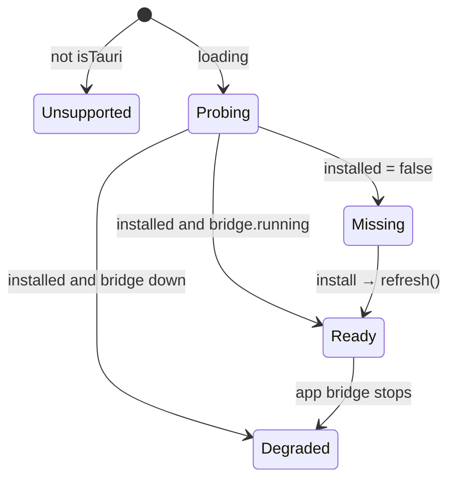
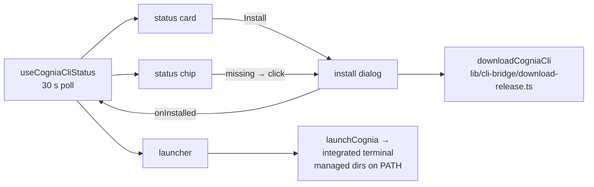

# DevTools UI

<TLDR>
  One hook feeds four components. `useCogniaCliStatus()`
  (`hooks/plugins/use-cognia-cli-status.ts:40-81`) probes `detectCli("cognia")` and
  `getCliBridgeStatus()` in parallel every **30 s** while mounted and exposes
  `{loading, installed, version, path, detection, bridge, supported, refresh}`. The **status
  card** (first card in the DevTools pane) renders probing / installed / missing states and opens
  the **install dialog** — Download (managed, with progress) · Build from source (copyable cargo
  command) · Release tarball tabs. The **launcher** runs `cognia plugin build/dev/lint/new/install`
  in a real terminal tab with managed dirs injected into PATH, and the **status chip** condenses
  everything into a green/amber/gray dot.
</TLDR>

## The status hook

```ts
// hooks/plugins/use-cognia-cli-status.ts:24-38
export interface CogniaCliStatus {
  loading: boolean                          // first probe in flight
  installed: boolean                        // detection.available
  version: string | null
  path: string | null
  detection: BinaryDetectionResult | null   // carries the error string
  bridge: CliBridgeStatus | null            // running ⇒ install/dev reload work
  supported: boolean                        // isTauri() — false on web/Capacitor
  refresh: () => void                       // immediate re-probe (post-download)
}
```

Internals (`:47-65`): `probe()` = `Promise.all([detectCli("cognia"), getCliBridgeStatus()])`,
guarded by a mounted-ref so a late resolve can't set state after unmount; `POLL_INTERVAL_MS =
30_000` (`:22`); the interval only exists while a consumer is mounted. The derived UI state
machine:



## Status card — `cognia-cli-status-card.tsx`

First card mounted in `plugin-devtools-pane.tsx:25`. Four renders: desktop-only hint
(`!supported`), spinner + `probing` (`loading`), `InstalledState` (`:78-119`) — green
check badge with the version, a bridge badge (green `bridgeRunning` / red `bridgeDown`), the
selectable monospace binary path, and **Reveal** / **Docs** buttons — or `MissingState`
(`:121-139`) with the install CTA. i18n namespace: `plugins.cliStatus`.

## Install dialog — `cognia-cli-install-dialog.tsx`

Props `{open, onOpenChange, onInstalled?}` — the parent passes `status.refresh` as
`onInstalled` so a successful download immediately re-probes.

| Tab | Content |
| --- | --- |
| Download (Tauri only, `:104-132`) | progress bar driven by `onProgress` stages, error text inline, success toast distinguishing `Downloaded. Signature verified.` from `Downloaded. SHA-256 verified.` |
| Build from source (`:135-151`) | copy-button command: `cargo install --locked --git https://github.com/MaxQian888/cognia-next cognia-cli` |
| Release tarball (`:153-163`) | deep link to GitHub Releases |

The footer (`:166-169`) carries the honest verification note keyed to the
[placeholder release key](./detection-and-managed-install#the-release-key-mirror-renderer-side).
i18n namespace: `plugins.cliInstall`.

## Launcher — `cognia-cli-launcher.tsx`

Runs real CLI commands in an integrated-terminal tab via `launchCognia()`
(`lib/terminal/run-cognia`), which sets `cwd` to the picked project and injects the managed CLI
dirs into PATH — so the button works even when `cognia` isn't on the user's own PATH.

| Button | argv | Needs bridge? |
| --- | --- | --- |
| `build` | `plugin build` | no |
| `dev` | `plugin dev` | **yes** — warns first when down |
| `lint` | `plugin lint` | no |
| `new` | `plugin new` | no |
| `install` | `plugin install "<picked .zip>"` | **yes** |

Gating (`:142-219`): desktop-only check, a project picker (commands are project-relative), a
`needsCli` hint when the binary is missing, an amber bridge-down warning, and a `busyKey` latch
so only one command runs at a time. i18n namespace: `plugins.cliLauncher`.

## Status chip — `cli-status-chip.tsx`

The toolbar-sized condensation (`data-testid="cli-status-chip"`, `data-tone` attribute):

```ts
tone = !status.installed ? "missing"
     : status.bridge?.running ? "ready"      // emerald dot
     : "degraded"                            // amber dot — installed, bridge down
```

Installed → passive tooltip with version; missing → click opens the install dialog. i18n keys
`chipReady` / `chipBridgeDown` / `chipMissing` under `plugins.cliStatus`.

## Component wiring



<Callout type="info" title="Why polling instead of events?">
  Binary presence and bridge liveness are external facts (the user can `cargo install` or quit
  the app at any time) with no native change feed, so the hook polls at a deliberately lazy 30 s
  and exposes `refresh()` for the moments the app itself causes the change — right after a
  managed download. The download path additionally invalidates the Rust-side detection cache so
  that refresh sees fresh truth, not the 300 s cached miss.
</Callout>
