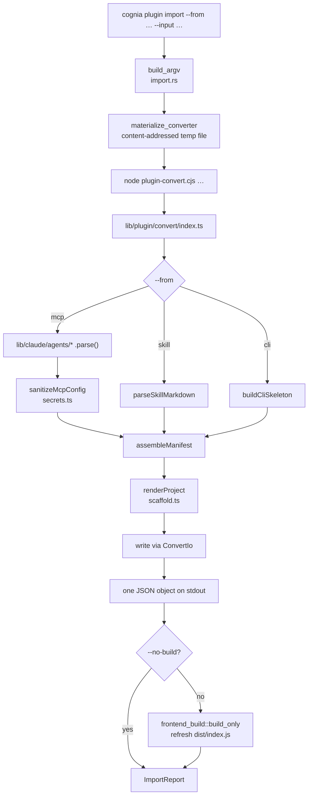

# Importing — `cognia plugin import`

<TLDR>
  `commands/import.rs` shells out to a bundled Node converter
  (`lib/plugin/convert/**`, embedded with `include_str!` from
  `crates/cognia-cli/assets/plugin-convert.cjs`) that turns one MCP server entry, one
  SKILL.md folder, or one CLI binary name into a complete plugin project — manifest,
  empty-shell entry, **pre-generated `dist/index.js`**, README, and build config. Nothing
  from the source is executed and no value from it is copied: every credential and
  machine-specific path becomes a declared, user-filled preset field.
</TLDR>

## Why a Node converter inside a Rust CLI

The three source formats already have parsers in this repository:

| Source   | Existing parser                                                        |
| -------- | ---------------------------------------------------------------------- |
| MCP      | thirteen agent adapters in `lib/claude/agents/*` (`parse()` per agent)  |
| Skill    | `parseSkillMarkdown` in `lib/claude/skills-io.ts`                       |
| CLI      | — (nothing to parse; see [The CLI skeleton](#the-cli-skeleton))         |

Each MCP adapter encodes one editor's quirks: VS Code stores servers under `servers`
rather than `mcpServers`, Windsurf uses `serverUrl`, Gemini splits SSE and HTTP across
`url` and `httpUrl`, Roo Code calls streamable HTTP `streamable-http`. Re-deriving that in
Rust would be a second surface to keep in sync — the same defect class that left
`cmd_lint.rs` with four hand-copied parity lists, one of which drifted silently for months.

So the converter is TypeScript, bundled to a single self-contained CommonJS file and
embedded in the binary. `cognia` stays one file, the Node-free `cargo test -p cognia-cli`
CI job keeps working, and `pnpm plugin-convert:check` fails the build if the checked-in
bundle drifts from its sources.



## Usage

```bash
# See what the input offers
cognia plugin import --from mcp --input ~/.cursor/mcp.json --list

# Convert one entry
cognia plugin import --from mcp --input ~/.cursor/mcp.json --pick github

# A skill folder (or the SKILL.md directly)
cognia plugin import --from skill --input ~/.claude/skills/code-review

# A CLI binary — produces a skeleton, not a finished tool
cognia plugin import --from cli --input rg

# Add a second contribution to a plugin you already have
cognia plugin import --from mcp --input ~/.cursor/mcp.json --pick playwright --into ./my-plugin
```

`--pick` is required only when the input holds more than one candidate; a skill folder and
a CLI binary each hold exactly one, so it can be omitted there.

## Complete plugin bundles

Whole-plugin conversion uses `lib/plugin/convert/ecosystem.ts`, the same canonical converter used by the
in-app GitHub preview and the Agent conversion skill:

```bash
# Claude Code, Codex, or Gemini CLI plugin → Cognia
cognia plugin import --from plugin --input ./foreign-plugin --dir ./cognia-plugin

# Cognia → another supported ecosystem
cognia plugin export --input ./cognia-plugin --to codex --dir ./codex-plugin
```

The converter detects `.claude-plugin/plugin.json`, `.codex-plugin/plugin.json`, `gemini-extension.json`, or
Cognia `plugin.json`; translates structured skills, agents, MCP definitions, and supported metadata; preserves
binary resources byte-for-byte; and returns an explicit fidelity report. Claude Code, Codex, or Gemini CLI →
Cognia and Cognia → any of those three are supported. Foreign → foreign conversion is rejected.

Conversion is fail-closed. Hooks, imperative runtime behavior, permissions, or contribution kinds without a
safe target contract produce blocking issues instead of a partial plugin.

### Agent-driven conversion in Cognia

The seeded `plugin-conversion` prompt skill exposes `inspect_plugin_conversion` and
`apply_plugin_conversion` to a Cognia Agent in desktop workspace chat. Inspection is read-only and returns an
expiring plan bound to the source snapshot. Apply rechecks the snapshot, refuses non-empty or overlapping
output directories, requires desktop approval, and writes only deterministic converter output. The tools are
not exposed to IM, web, or mobile sessions.

## Nothing is executed

No MCP server is spawned, no `--help` is run, nothing is fetched. Conversion reads text and
writes text.

That is a deliberate limit, not an oversight. Spawning the server would let the converter
enumerate its real tool list — and would also mean `cognia plugin import` executes an
arbitrary `npx -y <package>` line out of a config file the user may not have written. The
generated description states only what the config states.

## No value is ever copied

A real `mcp.json` routinely holds live tokens and absolute paths from one machine. The
generated project is meant to be committed and shared, so `sanitizeMcpConfig`
(`lib/plugin/convert/secrets.ts`) replaces every user-specific value with a declared field,
matching the convention the curated `MCP_PRESETS` table already uses:

| In the source config        | In the generated preset                                        |
| --------------------------- | -------------------------------------------------------------- |
| `env: { GITHUB_TOKEN: "…" }` | `config.env.GITHUB_TOKEN = ""` + `placement: "env", secret: true` |
| `args: ["/Users/me/Docs"]`  | `args: ["<DOCS>"]` + `placement: "arg-replace", token: "<DOCS>"`  |
| `headers: { Authorization }` | header field; the map is dropped from `config` entirely         |
| a URL carrying a credential | `placement: "url"` field; the URL is removed                     |
| a plain remote URL          | kept — it identifies the server, not the user                    |

Not as a value, not as a default, not as a placeholder. Copying values with a printed
warning is the same class of mistake as the scaffold that once staged its own Ed25519
private key.

The description is built from the **sanitized** config for the same reason: the raw
invocation string embeds the very paths that were just tokenized, and the description is
copied into `plugin.json`, `package.json`, and `README.md`.

## What gets generated

```
<plugin-id>/
├── plugin.json       — the manifest; the ONLY place contributions are declared
├── src/index.ts      — empty shell; imports plugin.json, registers nothing
├── dist/index.js     — build output, generated directly (see below)
├── package.json      — esbuild + SDK types, no runtime dependency
├── tsconfig.json
├── .gitignore        — does NOT ignore dist/
└── README.md         — per-source field reference and next steps
```

### The entry is an empty shell

All three converted capabilities are dispatched from the manifest by the host —
`mcp-server-preset` and `skills` through `OVERLAY_REGISTRY_CAPABILITIES`
(`lib/plugin/contracts/capability-bridge-map.ts`), `cliTools` in `PluginManager` — so no
imperative registration is needed. `PluginDefinition.manifest` is still required by the
type, and the entry satisfies it by **importing `plugin.json`** rather than pasting a second
copy of the manifest into the source. `plugin.json` stays the one place a contribution is
declared, which matters because that is the file the author edits.

Every import in the entry is type-only or the manifest JSON, so the project has **no
runtime dependency** and esbuild can bundle it from a freshly created directory with
nothing installed.

### `dist/index.js` is generated, and committed

`manifest.main` points at `dist/index.js`, so without it the project is not installable.
Relying on the trailing esbuild step to produce it would make the whole command depend on
`npx --no-install esbuild` resolving in a directory created moments ago that has no
`node_modules` — which it never does. So the converter emits the built file directly. That
is safe precisely because the entry is ours and has no runtime dependency: the only thing
esbuild does is erase a type-only import and inline `plugin.json`. `scaffold.test.ts` pins
the equivalence by running the real esbuild over the generated entry and comparing the two
loaded modules.

`.gitignore` deliberately omits `dist/`: the in-app GitHub installer
(`lib/plugin/package/github-source.ts`) performs a **build-free** install, so a repository
without the built file clones into an uninstallable plugin. The wasm-only git installer does
build; frontend plugins have no such path.

The trailing esbuild step still runs when the toolchain is available, so the generated file
is a floor, not a replacement for the build. When esbuild is unreachable the command reports
that plainly and keeps the generated file.

## Runtime compatibility is derived, not guessed

| Contribution           | browser | tauri | mobile |
| ---------------------- | ------- | ----- | ------ |
| stdio MCP preset       | blocked | ok    | blocked |
| http / sse MCP preset  | ok      | ok    | ok      |
| inline skill           | ok      | ok    | ok      |
| `local-bundle` skill   | blocked | ok    | blocked |
| cli tools              | blocked | ok    | blocked |

The blocked rows are facts: a stdio server is spawned as a host process,
`resolveSkillMarkdown` reads bundle skills through `@tauri-apps/plugin-fs`, and `cliTools`
execute host binaries.

## Skills: inline or bundle

Selection is driven by content, not by a flag.

- **No sibling resources** → `inline`. The body lives in the manifest and resolves in every
  shell, because `resolveSkillMarkdown` returns inline markdown without touching a
  filesystem.
- **Sibling `scripts/` / `references/` / `assets/`** → `local-bundle`, with the folder
  copied under `skills/<id>/` inside the plugin.

The bundle path is written **plugin-dir-relative** (`skills/code-review`). The host anchors
it against the plugin's install directory at registration time
(`lib/plugin/utils/rebase-skill-source.ts`), the same way `main`, `wasmMain`, and
`cliTools[].binary.relPath` already work. A path that would escape the plugin directory is
refused, and the overlay dispatch loop isolates the failure to that one skill.

## The CLI skeleton

`--from cli` produces `capabilities: ["cli-tools"]`, `permissions: ["cli:execute"]`,
`requires.binaries`, and an **empty** `cliTools` array.

It stops there on purpose. A usable `cliTools` entry needs to know, per flag, whether it
takes a value, whether it repeats, what the exit codes mean, and how output should be
parsed. A binary's `--help` states almost none of that — no help text says that ripgrep's
exit code 1 means "no matches, which is success" — and the converter executes nothing. A
guessed parameter table would lint green and misbehave, which is worse than an obviously
unfinished one.

The empty table is already reported by the host validator as
`manifest.capability.field_missing`, so `cognia plugin lint` marks the plugin unfinished with
no new rule, and `cognia plugin lint -W` gates on it in CI. The generated `README.md` carries
the full argv DSL reference and points at `plugins/ripgrep-tools`.

## `--into`: merging into an existing plugin

The merge is deliberately narrow. It unions the capability into `capabilities[]`, appends the
contribution to its manifest array, and adds any permission the contribution genuinely needs.
It does not bump `version`, does not touch `src/`, and does not reorder or reformat beyond
what a JSON round-trip implies (key insertion order is preserved; indentation becomes two
spaces).

An id collision is an error — never a silent overwrite and never an auto-rename. `--id`
renames the *imported contribution* in this mode (the plugin id is fixed by the target
directory), which is how the collision is resolved.

Runtime compatibility is **reported, not rewritten**: adding a stdio preset to a plugin that
advertises browser support makes that claim wrong, but silently narrowing a host plugin's
declared reach could disable unrelated contributions it already ships. The author is told
exactly what to change.

`--into` is rejected for `--from cli`, whose skeleton contributes no entries.

## Identity and signing

Nothing is signed and no key is generated. Signing is a distribution concern, and an author
who wants it runs `cognia plugin keygen` deliberately — the default scaffold that generated a
key without being asked is how a private key once ended up staged on the first `git add -A`.

Everything else is derived and overridable:

| Field           | Default                                   | Override             |
| --------------- | ----------------------------------------- | -------------------- |
| `id`            | `<slugified entry name>-<mcp\|skill\|tools>` | `--id`               |
| `name`          | the source entry's name                   | `--name`             |
| `description`   | derived from the sanitized config         | `--description`      |
| `version`       | `0.1.0`                                   | `--plugin-version`   |
| `author.name`   | `git config user.name`                    | `--author`           |
| `license`       | `MIT`                                     | `--license`          |
| `minAppVersion` | `0.1.0`                                   | `--min-app-version`  |

The id suffix is not doubled: an MCP entry literally named `playwright-mcp` stays
`playwright-mcp`.

## The wire contract

The Node side prints exactly one JSON object to stdout and never any prose, so a locale or
colour setting cannot corrupt the protocol. Failures use the same shape plus a non-zero exit:

```json
{ "ok": false, "error": "--pick is required: this input holds more than one MCP server" }
```

`cognia plugin import --json` wraps that in the command report:

```json
{
  "schemaVersion": 1,
  "ok": true,
  "action": "import",
  "mode": "create",
  "pluginId": "github-mcp",
  "dir": "/home/u/github-mcp",
  "files": ["plugin.json", "src/index.ts", "dist/index.js", "..."],
  "candidates": [],
  "todos": ["env GITHUB_TOKEN is a credential — its value was NOT copied; …"],
  "warnings": [],
  "build": "built"
}
```

`build` is `built`, `skipped` (`--no-build`, or list / merge mode), or `unavailable`
(esbuild could not run; the generated `dist/index.js` was kept).

## Limits

- **Single-entry MCP import and whole-plugin conversion have different inputs.** `--from mcp` still consumes
  the supported agent config formats; Codex plugin TOML belongs to the whole-plugin path (`--from plugin`).
- **`--list` never writes anything**, so it is safe to run against any file.
- **A non-empty target directory is refused.** `--into` is the explicit, narrow way to touch
  an existing plugin.

## Maintaining the bundle

```bash
pnpm plugin-convert:bundle       # rebuild crates/cognia-cli/assets/plugin-convert.cjs
pnpm plugin-convert:check        # fail if the checked-in artifact is stale
pnpm plugin-convert:check:test   # the same check as a node --test suite
```

The bundle build refuses to include `@tauri-apps/*` or `dexie`: they sit on an import path
the converter touches but never executes, and bundling them would drag a browser database and
the Tauri IPC layer into a plain Node script. They are replaced by stubs that state the truth
for a CLI (`isTauri()` really is `false` there). Adding a new host import that reaches one of
them fails the bundle build with the importing module named.
