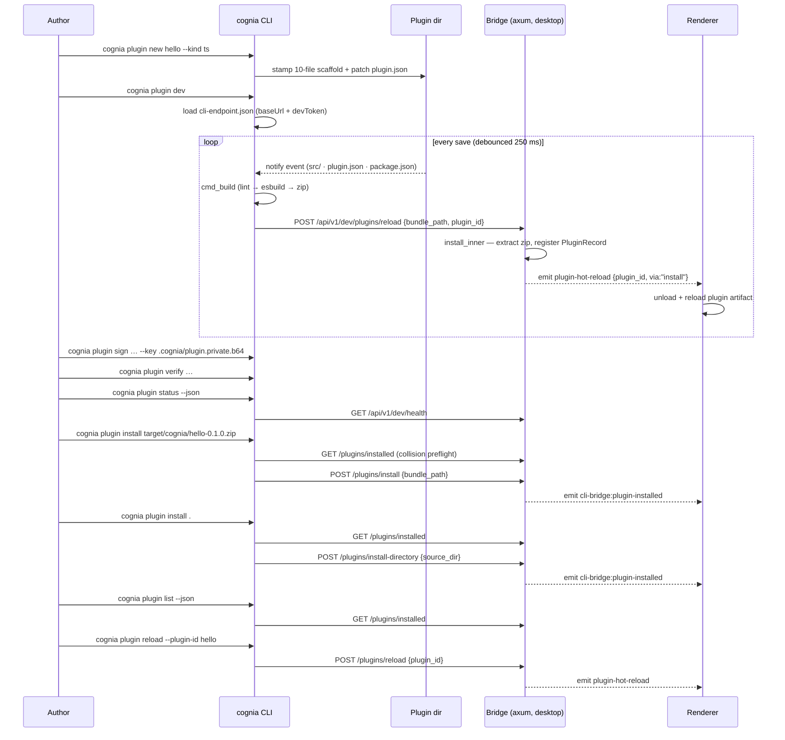

# Cognia CLI

<Status variant="stable">cognia-cli 0.1.0 · binary `cognia` · MSRV 1.82</Status>

<TLDR>
  `cognia` is a separate Rust crate (`crates/cognia-cli/`, ~8.5k lines + UI layer) shipping **14
  plugin subcommands** under `cognia plugin …` — scaffold (`new`), validate (`lint`, 60 diagnostic codes), build
  (`build` — cargo-component for WASM, esbuild for TypeScript, existing-entry packaging for
  Python/hybrid/VS Code-extension plugins), sign (`keygen`/`sign`/`verify`,
  Ed25519 over raw bundle bytes), inspect (`info` for `.zip` bundles or unpacked directories),
  and live-develop (`dev`, 250 ms-debounced watch → rebuild → hot-reload). `install` handles both
  `.zip` bundles and unpacked directories.
  The `status`/`install`/`uninstall`/`list`/`reload`/`dev`
  commands reach a running desktop
  through a **loopback-only axum bridge** (`src-tauri/src/cli_bridge/server.rs:28`) bound to an
  ephemeral `127.0.0.1` port, discovered via `<config_dir>/cognia/cli-endpoint.json` and gated by a
  per-launch 64-hex dev token compared in constant time. The renderer detects, downloads
  (SHA-256 + optional Ed25519-verified), and launches the CLI from Plugin DevTools. Top-level
  utilities cover `cognia acp`, `cognia release-key`, and `cognia release-verify`.
</TLDR>

<StatGrid>
  <Stat label="Plugin commands" value="14" hint="PluginCommand enum — crates/cognia-cli/src/main.rs" />
  <Stat label="Lint codes" value="60" hint="distinct diagnostic codes — cmd_lint::validate_manifest" />
  <Stat label="Permissions / capabilities" value="45 / 45" hint="hard-coded whitelists, parity-tested against TS — cmd_lint.rs" />
  <Stat label="Bridge routes" value="7" hint="health · installed · install · install-directory · uninstall · reload · handoff — server.rs:57-80" />
  <Stat label="Rust source" value="~8.5k lines" hint="crates/cognia-cli/src (28 files) + src-tauri/src/cli_bridge (6 files)" />
  <Stat label="Renderer surface" value="4 + 4" hint="lib/cli-bridge (4 modules) + DevTools status card / install dialog / launcher / status chip" />
</StatGrid>

The CLI exists so plugin authors can work **outside** the GUI: stamp a starter project, iterate
with a file-watching dev loop that hot-reloads a running cognia, and produce a signed, verifiable
`.zip` bundle. It is installable independently of the app (`cargo install --locked --path
crates/cognia-cli`) and versioned independently of the host. This section documents the current
implementation module by module; the user-facing install guide lives at
[CLI Prerequisites](../../dev/cli-prerequisites).

## The four layers


## Where it lives

```
crates/cognia-cli/                  # the standalone binary (Cargo.toml: bin name `cognia`)
  src/main.rs                       # clap derive CLI + dispatch_plugin() router
  src/cmd_new.rs · template.rs      # scaffolding (templates embedded via include_str!)
  src/cmd_lint.rs                   # 60-code manifest linter (largest module, 1 926 lines)
  src/cmd_build.rs · build_ts.rs · packaging.rs   # wasm/frontend builds + existing-entry zip bundles
  src/cmd_sign.rs · cmd_verify.rs · cmd_keygen.rs · signing.rs   # Ed25519 author signing
  src/cmd_info.rs                   # bundle/directory inspection (manifest, files, signature, api-version)
  src/cmd_status.rs · cmd_install.rs · cmd_uninstall.rs · cmd_list.rs · cmd_reload.rs · cmd_dev.rs · http_client.rs   # bridge client
  src/cmd_acp.rs                    # stdio <-> companion ACP WebSocket bridge
  src/cmd_release_key.rs · cmd_release_verify.rs · release_key.rs   # release key inspection + artifact verification
  src/ui/                           # RuntimeUi, Prompter trait, spinners, palette, color-eyre
  tests/integration.rs              # spawns the compiled binary (96 tests)

crates/cognia-plugin-template/      # WASM scaffold source (include_str! into the binary)
crates/cognia-plugin-template-ts/   # TypeScript scaffold source
crates/cognia-plugin-template-python/   # Python scaffold source
crates/cognia-plugin-template-hybrid/   # hybrid scaffold source
crates/cognia-plugin-template-vscode-extension/   # VS Code-extension scaffold source

src-tauri/src/cli_bridge/           # desktop side
  mod.rs                            # init() / shutdown(), dev-token gen, endpoint-file write
  server.rs                         # axum router + auth middleware + 4 MiB body limit
  handlers.rs                       # health/installed/install/install-directory/uninstall/reload/handoff + Tauri event emission
  detect.rs · download.rs · release_key.rs   # binary detection + managed download + key mirror

lib/cli-bridge/                     # renderer TS
  detect-cli.ts · status.ts         # invoke detect_binary / cli_bridge_status
  download-release.ts               # invoke download_cognia_cli + progress events
  embedded-pubkey.ts                # release-key TS mirror

hooks/plugins/use-cognia-cli-status.ts   # polling status hook (30 s)
components/plugins/devtools/cognia-cli-{status-card,install-dialog,launcher}.tsx
components/plugins/cli-status-chip.tsx
scripts/release-sync-keys.mjs       # 3-copy release-key sync (--check in CI)
```

## Command surface

Plugin-author operations nest under `cognia plugin <cmd>` (`TopCommand::Plugin` in
`crates/cognia-cli/src/main.rs`), with top-level utility commands such as `cognia acp`,
`cognia release-key`, and `cognia release-verify` beside that group. Global flags apply everywhere:
`--color auto|always|never`, `--no-color`, `-q/--quiet`, `-v/--verbose` (max `-vv`),
`-y/--yes` (pre-confirm every prompt; required for CI). Verbose mode emits a
single parsed-command diagnostic to stderr for human runs; `--quiet` and per-command `--json`
suppress it.

| Command | What it does | Module | Talks to app? |
| --- | --- | --- | --- |
| `new [name] [--dir DIR] [--kind wasm\|ts\|python\|hybrid\|vscode-extension] [--author NAME] [--author-email EMAIL] [--description TEXT] [--with-keygen true\|false] [--json]` | Stamp a starter project (interactive wizard on TTY) | `cmd_new.rs` + `template.rs` | no |
| `lint [--path .] [--json]` | 60-code manifest validation; exit 1 on errors | `cmd_lint.rs` | no |
| `build [--path .] [--out P] [--skip-build] [--json]` | Lint → cargo-component / esbuild / existing-entry packaging → zip | `cmd_build.rs` / `build_ts.rs` / `packaging.rs` | no |
| `info <bundle.zip\|directory> [--detailed] [--json]` | Manifest, file table, bundle signature status or directory `not-applicable`, `cognia:api-version` | `cmd_info.rs` | no |
| `keygen [--out-dir .cognia] [--json]` | Ed25519 keypair → `.cognia/plugin.{private,public}.b64` | `cmd_keygen.rs` | no |
| `sign <bundle> --key <priv> [--out sig] [--json]` | Sign raw zip bytes → `<bundle>.sig` unless `--out` is provided | `cmd_sign.rs` | no |
| `verify <bundle> [--public-key b64] [--signature sig] [--json]` | Verify `.sig` against `author.publicKey` or an explicit key | `cmd_verify.rs` | no |
| `install <bundle.zip\|directory> [--json]` | Preflight collision check → POST bundle or unpacked-directory install | `cmd_install.rs` | **yes** |
| `uninstall <id> [--purge-data] [--json]` | Confirmed removal (purge warns: one-way Dexie wipe) | `cmd_uninstall.rs` | **yes** |
| `list [--json]` | Print the running desktop bridge's installed-plugin snapshot | `cmd_list.rs` | **yes** |
| `reload [--plugin-id ID] [--path P] [--json]` | POST a hot-reload request for an installed plugin id, rebuilt bundle, or unpacked directory; `--bundle` remains accepted for existing scripts | `cmd_reload.rs` | **yes** |
| `status [--json]` | Probe `/api/v1/dev/health`; JSON is token-free and exits non-zero when unavailable | `cmd_status.rs` | **yes** |
| `dev [--path .] [--reload-url URL] [--once] [--json]` | Watch → debounce 250 ms → rebuild → POST reload; `--once` builds/reloads once and exits with optional JSON | `cmd_dev.rs` | **yes** (graceful without) |
| `embed-version <wasm> <ver> [--out wasm] [--json]` | Re-inject the `cognia:api-version` custom section | `main.rs::cmd_embed_version` + `packaging.rs` | no |
| `release-key [--json]` | Inspect the embedded CLI release public key, fingerprint, placeholder status, and signature policy | `cmd_release_key.rs` + `release_key.rs` | no |
| `release-verify <artifact> --checksums <checksums.txt> [--artifact-name NAME] [--signature PATH] [--json]` | Offline-check a downloaded CLI release artifact against `checksums.txt` and the release-key policy | `cmd_release_verify.rs` + `release_key.rs` | no |

## An authoring session, end to end



## Security posture in one table

| Concern | Mechanism | Where |
| --- | --- | --- |
| Remote access to the bridge | Hard `is_loopback(addr)` reject (403 `remote_blocked`) before anything else | `src-tauri/src/cli_bridge/server.rs:94`, `mod.rs:189` |
| Token theft / replay | 32 random bytes → 64-hex `X-Cognia-Dev-Token`, rotated every app launch, constant-time compare | `mod.rs:115`, `server.rs:127` |
| Endpoint file exposure | `cli-endpoint.json` written `0o600` on Unix | `mod.rs:128-150` |
| Oversized payloads | 4 MiB `RequestBodyLimitLayer` | `server.rs:81` |
| Zip-slip on install | Path-traversal entries rejected during extraction (tested) | `handlers.rs:592-608`, `handlers.rs:741-766` |
| Directory install escape | Load-unpacked directory copy skips symlinks and requires `plugin.json` in the selected source dir | `handlers.rs:439-477`, `handlers.rs:569-588` |
| Bundle authenticity | Ed25519 over raw zip bytes, author key in `plugin.json author.publicKey` | `signing.rs:61-82` |
| CLI binary authenticity | SHA-256 always; Ed25519 release-key check once the placeholder key is replaced | `download.rs:200-309`, `release_key.rs:25` |

<Callout type="info" title="The bridge is not the companion API">
  The CLI bridge (ephemeral loopback port, per-launch dev token) is a separate listener from the
  mobile-pairing companion API (port 7890, JWT auth). Neither has LAN/WAN reach for plugin
  endpoints by design — see [Companion API](../companion-api).
</Callout>

## Reading order

| Page | Covers |
| --- | --- |
| [CLI core & terminal UI](./cli-core) | clap structure, `RuntimeUi`, `Prompter` trait, color/TTY model, exit codes |
| [Scaffolding](./scaffolding) | `new` wizard, embedded templates, WASM / TypeScript / Python / hybrid / VS Code-extension scaffold trees, substitution |
| [Manifest linter](./lint) | the 60-code catalog, whitelists, JSON report, Rust↔TS parity test |
| [Build pipeline](./build-pipeline) | type dispatch, toolchain preflight, existing-entry packing, custom-section embed, zip layout |
| [Signing & keys](./signing-and-keys) | Ed25519 scheme, keygen/sign/verify, `info`, release-key 3-copy sync |
| [Bridge client](./bridge-client) | endpoint discovery, ureq client, status/install/uninstall/list/reload flows, dev watch loop |
| [Bridge server](./bridge-server) | axum spawn, auth middleware, the 7 routes, Tauri event fan-out |
| [Detection & managed install](./detection-and-managed-install) | `detect_binary`, GitHub Releases download, checksum + signature verify, `release-verify` |
| [DevTools UI](./devtools-ui) | status hook, status card, install dialog, launcher, status chip |
