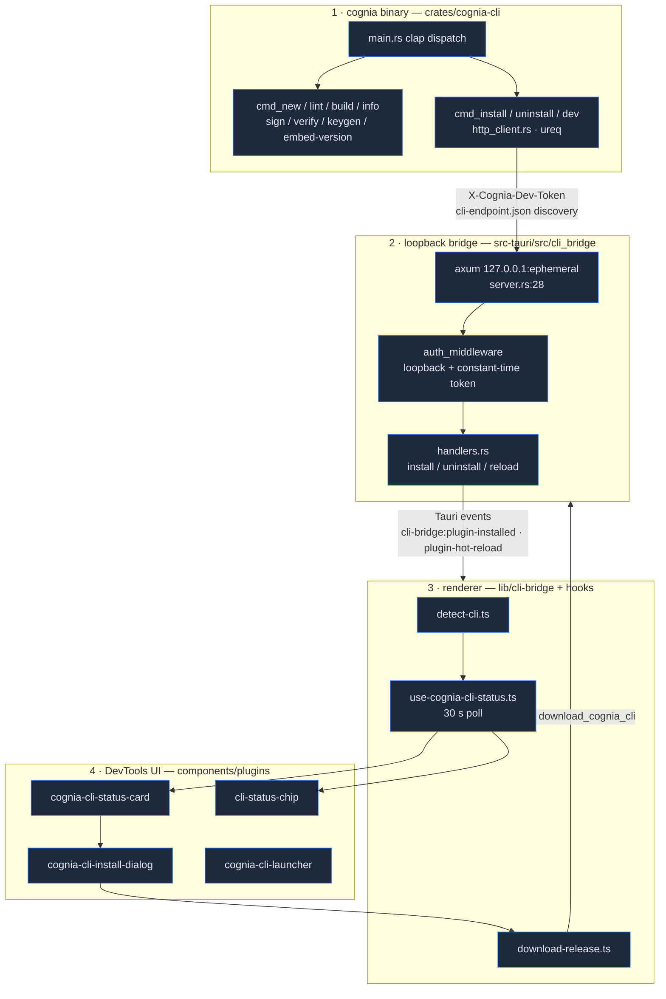
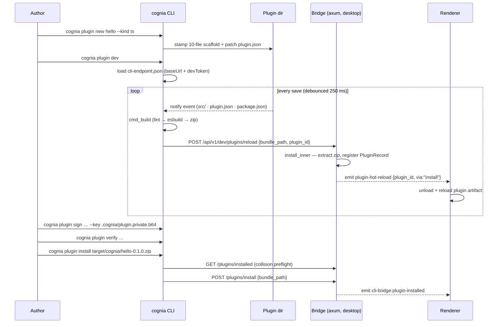

# Cognia CLI

<Status variant="stable">cognia-cli 0.1.0 · binary `cognia` · MSRV 1.82</Status>

<TLDR>
  `cognia` is a separate Rust crate (`crates/cognia-cli/`, ~4.5k lines + UI layer) shipping **11
  subcommands** under `cognia plugin …` — scaffold (`new`), validate (`lint`, 37 rules), build
  (`build` — cargo-component for WASM, esbuild for TypeScript), sign (`keygen`/`sign`/`verify`,
  Ed25519 over raw bundle bytes), inspect (`info`), and live-develop (`dev`, 250 ms-debounced
  watch → rebuild → hot-reload). The `install`/`uninstall`/`dev` commands reach a running desktop
  through a **loopback-only axum bridge** (`src-tauri/src/cli_bridge/server.rs:28`) bound to an
  ephemeral `127.0.0.1` port, discovered via `<config_dir>/cognia/cli-endpoint.json` and gated by a
  per-launch 64-hex dev token compared in constant time. The renderer detects, downloads
  (SHA-256 + optional Ed25519-verified), and launches the CLI from Plugin DevTools.
</TLDR>

<StatGrid>
  <Stat label="Subcommands" value="11" hint="PluginCommand enum — crates/cognia-cli/src/main.rs:117-241" />
  <Stat label="Lint rules" value="37" hint="distinct diagnostic codes — cmd_lint.rs:289-679" />
  <Stat label="Permissions / capabilities" value="45 / 34" hint="hard-coded whitelists, parity-tested against TS — cmd_lint.rs:26-116" />
  <Stat label="Bridge routes" value="5" hint="health · installed · install · uninstall · reload — server.rs:55-75" />
  <Stat label="Rust source" value="~7.8k lines" hint="crates/cognia-cli/src (23 files) + src-tauri/src/cli_bridge (6 files)" />
  <Stat label="Renderer surface" value="4 + 4" hint="lib/cli-bridge (4 modules) + DevTools status card / install dialog / launcher / status chip" />
</StatGrid>

The CLI exists so plugin authors can work **outside** the GUI: stamp a starter project, iterate
with a file-watching dev loop that hot-reloads a running cognia, and produce a signed, verifiable
`.zip` bundle. It is installable independently of the app (`cargo install --locked --path
crates/cognia-cli`) and versioned independently of the host. This section documents the current
implementation module by module; the user-facing install guide lives at
[CLI Prerequisites](../../dev/cli-prerequisites).

## The four layers



## Where it lives

```
crates/cognia-cli/                  # the standalone binary (Cargo.toml: bin name `cognia`)
  src/main.rs                       # clap derive CLI + dispatch_plugin() router
  src/cmd_new.rs · template.rs      # scaffolding (templates embedded via include_str!)
  src/cmd_lint.rs                   # 37-rule manifest linter (largest module, 1 279 lines)
  src/cmd_build.rs · build_ts.rs · packaging.rs   # wasm/frontend builds + zip bundles
  src/cmd_sign.rs · cmd_verify.rs · cmd_keygen.rs · signing.rs   # Ed25519 author signing
  src/cmd_info.rs                   # bundle inspection (manifest, files, signature, api-version)
  src/cmd_install.rs · cmd_uninstall.rs · cmd_dev.rs · http_client.rs   # bridge client
  src/release_key.rs                # embedded release public key (canonical copy)
  src/ui/                           # RuntimeUi, Prompter trait, spinners, palette, color-eyre
  tests/integration.rs              # spawns the compiled binary (10 tests)

crates/cognia-plugin-template/      # WASM scaffold source (include_str! into the binary)
crates/cognia-plugin-template-ts/   # TypeScript scaffold source

src-tauri/src/cli_bridge/           # desktop side
  mod.rs                            # init() / shutdown(), dev-token gen, endpoint-file write
  server.rs                         # axum router + auth middleware + 4 MiB body limit
  handlers.rs                       # install/uninstall/reload + Tauri event emission
  detect.rs · download.rs · release_key.rs   # binary detection + managed download + key mirror

lib/cli-bridge/                     # renderer TS
  detect-cli.ts · status.ts         # invoke detect_binary / cli_bridge_status
  download-release.ts               # invoke download_cognia_cli + progress events
  embedded-pubkey.ts                # release-key TS mirror

hooks/plugins/use-cognia-cli-status.ts   # polling status hook (30 s)
components/plugins/devtools/cognia-cli-{status-card,install-dialog,launcher}.tsx
components/plugins/cli-status-chip.tsx
scripts/release-sync-keys.mjs       # 3-copy release-key sync (--check in CI)
```

## Command surface

All commands nest under one top-level group: `cognia plugin <cmd>`
(`TopCommand::Plugin` — `crates/cognia-cli/src/main.rs:108`). Global flags apply everywhere:
`--color auto|always|never`, `--no-color`, `-q/--quiet`, `-v/--verbose` (max `-vv`),
`-y/--yes` (pre-confirm every prompt; required for CI) — `main.rs:83-106`.

| Command | What it does | Module | Talks to app? |
| --- | --- | --- | --- |
| `new <name> [--kind wasm\|ts]` | Stamp a starter project (interactive wizard on TTY) | `cmd_new.rs` + `template.rs` | no |
| `lint [--path .] [--json]` | 37-rule manifest validation; exit 1 on errors | `cmd_lint.rs` | no |
| `build [--path .] [--out] [--skip-build]` | Lint → toolchain preflight → cargo-component / esbuild → zip | `cmd_build.rs` / `build_ts.rs` | no |
| `info <bundle.zip> [--json] [--detailed]` | Manifest, file table, signature status, `cognia:api-version` | `cmd_info.rs` | no |
| `keygen [--out-dir .cognia]` | Ed25519 keypair → `.cognia/plugin.{private,public}.b64` | `cmd_keygen.rs` | no |
| `sign <bundle> --key <priv> [--out]` | Sign raw zip bytes → `<bundle>.sig` | `cmd_sign.rs` | no |
| `verify <bundle> [--public-key] [--signature] [--json]` | Verify `.sig` against `author.publicKey` | `cmd_verify.rs` | no |
| `install <bundle.zip>` | Preflight collision check → POST install | `cmd_install.rs` | **yes** |
| `uninstall <id> [--purge-data]` | Confirmed removal (purge warns: one-way Dexie wipe) | `cmd_uninstall.rs` | **yes** |
| `dev [--path .] [--reload-url URL]` | Watch → debounce 250 ms → rebuild → POST reload | `cmd_dev.rs` | **yes** (graceful without) |
| `embed-version <wasm> <ver> [--out]` | Re-inject the `cognia:api-version` custom section | `main.rs:348` + `packaging.rs` | no |

## An authoring session, end to end



## Security posture in one table

| Concern | Mechanism | Where |
| --- | --- | --- |
| Remote access to the bridge | Hard `is_loopback(addr)` reject (403 `remote_blocked`) before anything else | `src-tauri/src/cli_bridge/server.rs:86`, `mod.rs:183` |
| Token theft / replay | 32 random bytes → 64-hex `X-Cognia-Dev-Token`, rotated every app launch, constant-time compare | `mod.rs:113`, `server.rs:119` |
| Endpoint file exposure | `cli-endpoint.json` written `0o600` on Unix | `mod.rs:126-147` |
| Oversized payloads | 4 MiB `RequestBodyLimitLayer` | `server.rs:26` |
| Zip-slip on install | Path-traversal entries rejected during extraction (tested) | `handlers.rs:590-616` |
| Bundle authenticity | Ed25519 over raw zip bytes, author key in `plugin.json author.publicKey` | `signing.rs:61-82` |
| CLI binary authenticity | SHA-256 always; Ed25519 release-key check once the placeholder key is replaced | `download.rs:244-275`, `release_key.rs:25` |

<Callout type="info" title="The bridge is not the companion API">
  The CLI bridge (ephemeral loopback port, per-launch dev token) is a separate listener from the
  mobile-pairing companion API (port 7890, JWT auth). Neither has LAN/WAN reach for plugin
  endpoints by design — see [Companion API](../companion-api).
</Callout>

## Reading order

| Page | Covers |
| --- | --- |
| [CLI core & terminal UI](./cli-core) | clap structure, `RuntimeUi`, `Prompter` trait, color/TTY model, exit codes |
| [Scaffolding](./scaffolding) | `new` wizard, embedded templates, both scaffold trees, substitution |
| [Manifest linter](./lint) | the 37-rule catalog, whitelists, JSON report, Rust↔TS parity test |
| [Build pipeline](./build-pipeline) | type dispatch, toolchain preflight, custom-section embed, zip layout |
| [Signing & keys](./signing-and-keys) | Ed25519 scheme, keygen/sign/verify, `info`, release-key 3-copy sync |
| [Bridge client](./bridge-client) | endpoint discovery, ureq client, install/uninstall flows, dev watch loop |
| [Bridge server](./bridge-server) | axum spawn, auth middleware, the 5 routes, Tauri event fan-out |
| [Detection & managed install](./detection-and-managed-install) | `detect_binary`, GitHub Releases download, checksum + signature verify |
| [DevTools UI](./devtools-ui) | status hook, status card, install dialog, launcher, status chip |
