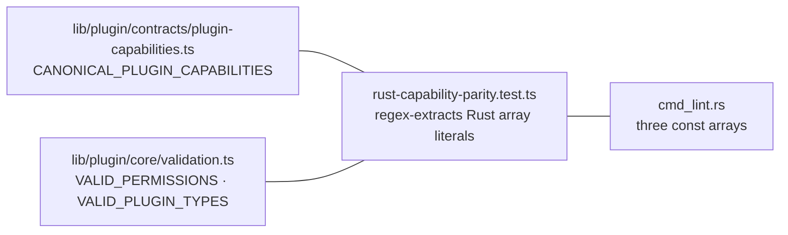

# Manifest linter — `cognia plugin lint`

<TLDR>
  `cmd_lint.rs` (1 926 lines — the CLI's largest module) runs **60 distinct diagnostic codes** over
  `plugin.json` and emits either styled prose or a `schemaVersion: 1` JSON report. Severity is
  two-level: **errors** fail the run (`exit 1`, and they block `build` through `cmd_build::build_inner`),
  **warnings** don't. Three whitelists are hard-coded in Rust — 45 permissions
  (`VALID_PERMISSIONS`), 45 capabilities (`VALID_CAPABILITIES`), 5 plugin types
  (`VALID_PLUGIN_TYPES`) — and a Jest test
  (`lib/plugin/contracts/rust-capability-parity.test.ts`) regex-extracts them from the Rust
  source and asserts set-equality with the host's canonical TS lists, so the CLI can never
  silently drift from what the desktop actually accepts.
</TLDR>

## Invocation & report shape

`cognia plugin lint [--path .] [--json]`. The manifest is located by `read_plugin_manifest`
in `main.rs` — `plugin.json` at the root, falling back to `manifest/plugin.json`.

```rust
// crates/cognia-cli/src/cmd_lint.rs (abridged)
pub enum Severity { Error, Warning }            // serialized lowercase

pub struct Diagnostic {
    pub severity: Severity,
    pub field: String,        // e.g. "id", "tools[0].name", "wasm.apiVersion"
    pub code: String,         // e.g. "manifest.id.invalid_format"
    pub message: String,
    pub hint: Option<String>, // omitted from JSON when None
}

pub struct LintReport {
    pub schema_version: u32,  // "schemaVersion": 1 — version-pin for consumers
    pub ok: bool,             // mirrors valid for CI-safe envelopes
    pub action: &'static str, // "lint"
    pub manifest_path: PathBuf,
    pub valid: bool,          // no Error-severity diagnostics
    pub diagnostics: Vec<Diagnostic>,
}
```

`valid` is computed as `!diagnostics.iter().any(|d| d.severity == Severity::Error)`
inside `LintReport`. Two consumption modes:

- **CLI** (`cmd_lint::run`): human output via `print_human` —
  `[ERROR] field: message`, hints prefixed `→ try:`, summary line `N error(s), M warning(s)` —
  then `exit(1)` if invalid.
- **Library** (`cmd_lint::validate_at`): returns the report; this is what `build`
  calls before doing anything else.

## The rule catalog

All rules live in one pass, `validate_manifest()`, plus focused
sub-validators for the `wasm`, `dexie`, and `cliTools[]` blocks.

### Identity & required fields

| Code | Severity | Constraint |
| --- | --- | --- |
| `manifest.invalid_type` | error | root must be a JSON object |
| `manifest.id.missing` / `.invalid_format` | error | non-empty; `^[a-z0-9]([a-z0-9-_.]*[a-z0-9])?$` |
| `manifest.name.missing` / `.long` | error / warning | non-empty; warn over 50 chars |
| `manifest.version.missing` / `.invalid_format` | error | semver `MAJOR.MINOR.PATCH[-prerelease]` |
| `manifest.description.missing` / `.long` | error / warning | non-empty; warn over 500 chars |
| `manifest.minAppVersion.invalid` | error | semver when present |

### Type & entry points

`type` must be one of `frontend · python · hybrid · wasm · vscode-extension`
(`manifest.type.invalid`), and each type demands its entry field:

| Type | Required field | Extra |
| --- | --- | --- |
| `frontend` | `main` | |
| `python` | `pythonMain` | |
| `wasm` | `wasmMain` | must end `.wasm` (`manifest.wasmMain.invalid_extension`); `wasm` block validated |
| `vscode-extension` | `vscodeMain` | |

### The `wasm` block (`validate_wasm_block`)

| Code | Constraint |
| --- | --- |
| `manifest.wasm.required` | wasm plugins must declare the block with at least `apiVersion` |
| `manifest.wasm.apiVersion.invalid` | strict `^\d+\.\d+\.\d+$` — **no prerelease** (`is_wasm_api_version`) |
| `manifest.wasm.memoryLimitMb.invalid` | number in (0, 4096] |
| `manifest.wasm.callTimeoutMs.invalid` | number in (0, 600000] |

### Capabilities ↔ contribution parity

Beyond membership in the 45-entry whitelist (`manifest.capabilities.invalid`, error), the linter
cross-checks declarations against content using the 41-entry `CAPABILITY_FIELDS` map
(`cmd_lint.rs`) — e.g. `"a2ui" → ["a2uiComponents", "a2uiTemplates"]`,
`"scheduler" → ["scheduledTasks"]`, `"workflow-trigger" → ["workflows"]`, and
`"cli-tools" → ["cliTools"]`:

```rust
// cmd_lint.rs — declared but empty → warning
for (cap, fields) in CAPABILITY_FIELDS {
    if declared.contains(cap) && !fields.iter().any(|f| is_populated_array(f)) {
        out.push(Diagnostic { severity: Warning, code: "manifest.capability.field_missing", … });
    }
}
```

The inverse (`manifest.capability.field_undeclared`) warns when a contribution array
has entries but none of its mapped capabilities is declared. Both directions are warnings — the
host loads such plugins, but the contribution is dead weight or silently ignored.

### Contribution arrays, permissions, misc

| Area | Codes | Notes |
| --- | --- | --- |
| `permissions` | `manifest.permissions.unknown` — **warning** | unknown permission strings don't block; the host's grant flow simply never offers them |
| `tools[]` | `name` / `description` required per entry | |
| `cliTools[]` | 24 `manifest.cliTools.*` codes (`lint_cli_tools`) | requires `cli:execute`, validates binary provenance, argv tokens, parameter references, cwd/stdin/env policies, numeric knobs, output parsing, success codes, and version args |
| `commands[]` | `id` / `name` required | |
| `modes[]` | `id` / `name` / `icon` required | |
| `activationEvents` / `activateOnStartup` | array of strings / boolean | |
| `dexie` block | 8 rules (`validate_dexie_block`) | `tables` non-empty array, ≤ 20 tables, names `^[a-z][a-zA-Z0-9_]{0,30}$`, unique, each with a non-empty `schema` string |

## The three whitelists and the parity contract

```text
VALID_PERMISSIONS   45 entries   cmd_lint.rs
VALID_CAPABILITIES  45 entries   cmd_lint.rs
VALID_PLUGIN_TYPES   5 entries   cmd_lint.rs
```

The permission list spans 17 namespaces — `filesystem:* network:* clipboard:* shell process
database:* settings:* session:* agent:* python secrets:* terminal:* (5) git:* goal:*
subscription:read perf:read connectors:* (3) share:* backup:* automation:* (6) companion:* (3)`
plus bare `notification`.



`rust-capability-parity.test.ts:26-61` reads `cmd_lint.rs` as text, extracts each
`const NAME = [...]` with a quoted-string regex, and asserts **set equality** against the TS
canonical lists. Add a permission on either side without the other and `pnpm test` fails — this
is the only thing keeping a plain string list in a separate crate honest.

<Callout type="info" title="Why warnings for unknown permissions but errors for unknown capabilities?">
  A capability tag changes how the host wires the plugin (registries, loaders, slots) — an
  unknown one means the manifest targets a newer host, so it's a hard error. An unknown
  permission is merely never grantable; the plugin still functions minus that API, so the linter
  flags it without blocking.
</Callout>

## Worked example

```json
{
  "schemaVersion": 1,
  "ok": false,
  "action": "lint",
  "manifest_path": "/work/my-plugin/plugin.json",
  "valid": false,
  "diagnostics": [
    { "severity": "error", "field": "id", "code": "manifest.id.missing",
      "message": "Missing or invalid \"id\" field" },
    { "severity": "warning", "field": "capabilities", "code": "manifest.capability.field_missing",
      "message": "Capability \"tools\" is declared but its contribution field(s) \"tools\" are empty.",
      "hint": "Add the contribution entries, or drop the capability tag." }
  ]
}
```

43 in-file unit tests (`cmd_lint.rs`) pin minimal-valid manifests, every format rule,
both parity directions, `cliTools[]`, the dexie constraints, and JSON serialization.
