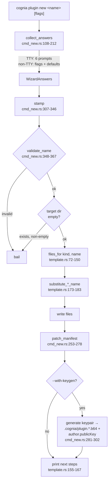

# Scaffolding — `cognia plugin new`

<TLDR>
  `cmd_new::run()` (`crates/cognia-cli/src/cmd_new.rs:40-104`) collects answers (interactive
  wizard on a TTY, flags + defaults otherwise), **stamps** an embedded template
  (`template.rs:72-150` — every file ships inside the binary via `include_str!` from
  `crates/cognia-plugin-template{,-ts}/`), **patches** the wizard answers into the generated
  `plugin.json` (`cmd_new.rs:253-278`), and optionally **embeds a fresh Ed25519 public key**
  (`cmd_new.rs:281-302`). Substitution is two plain `String::replace` calls per file — the
  template id and its humanized title. The target directory is refused if non-empty.
</TLDR>

## Flow



## Inputs and defaults

| Input | Flag | TTY wizard | Non-TTY default |
| --- | --- | --- | --- |
| name | positional | prompted (CWD basename suggested if valid) | **required** — bails with hint (`cmd_new.rs:123`) |
| kind | `--kind wasm\|ts` | select, 0 = wasm | `wasm` (`cmd_new.rs:136`) |
| dir | `--dir <path>` | — | `./<name>` (`cmd_new.rs:309`) |
| description | `--description` | prompted with suggestion | `"A cognia {kind} plugin"` (`cmd_new.rs:153`) |
| author | `--author` | `git config user.name` as default (`cmd_new.rs:165-177`) | `"Anonymous"` |
| author email | `--author-email` | optional prompt | `None` |
| keygen | `--with-keygen true\|false` | confirm, default **true** | `false` (`cmd_new.rs:192`) |

`TemplateKind::parse` (`template.rs:19-25`) also accepts `typescript` / `frontend` as aliases for
`ts`.

### Name validation

`validate_name` (`cmd_new.rs:348-367`): ≤ 64 chars, ASCII alphanumeric start, then alphanumeric
plus `-`, `_`, `.`. Exact failures:

```text
plugin name is empty                                       (cmd_new.rs:350)
plugin name must be ≤ 64 characters                        (cmd_new.rs:353)
plugin name must be lowercase alphanumeric plus -_. (got `…`)  (cmd_new.rs:364)
```

`"0plugin"` and `"foo.bar_1"` pass; `"has space"` and `"!banged"` fail (unit tests at
`cmd_new.rs:375-386`).

## Templates are real crates, embedded at compile time

The template sources live as two **buildable sibling crates** — `crates/cognia-plugin-template/`
(WASM) and `crates/cognia-plugin-template-ts/` — and are pulled into the binary with
`include_str!` (`template.rs:28-60`). The CLI ships no template directory; scaffolds work
offline.

Substitution is intentionally dumb (`template.rs:173-197`):

```rust
fn substitute_wasm_name(content: &str, target_name: &str) -> String {
    content
        .replace("cognia-plugin-template", target_name)
        .replace("Cognia Plugin Template", &humanize(target_name))
}
// humanize: "my-cool-plugin" → "My Cool Plugin" (split -_ → Title Case)
```

Description / author / publicKey are **not** template placeholders — they are patched into the
generated `plugin.json` afterwards by `patch_manifest` (`cmd_new.rs:253-278`), which re-reads,
mutates, and pretty-prints the JSON.

## What each kind generates

| WASM (6 files — `template.rs:74-99`) | TypeScript (10 files — `template.rs:100-148`) |
| --- | --- |
| `Cargo.toml` (substituted) | `package.json` (substituted) |
| `src/lib.rs` (substituted) | `tsconfig.json` · `jest.config.cjs` |
| `wit/world.wit` | `src/index.ts` · `src/index.test.ts` (substituted) |
| `plugin.json` (substituted) | `src/__shims__/types/plugin.ts` |
| `README.md` · `.gitignore` | `src/__shims__/lib/chat/slash-command-registry.ts` |
| | `plugin.json` (substituted) · `README.md` · `.gitignore` |

### WASM scaffold highlights

The manifest pins the contract the host routes on:

```json
{
  "type": "wasm",
  "wasmMain": "cognia_plugin_template.wasm",
  "wasm": { "apiVersion": "0.1.0", "memoryLimitMb": 16, "callTimeoutMs": 5000 },
  "permissions": ["notification"],
  "engines": { "cognia": ">=0.4.0" }
}
```

`src/lib.rs` implements the full `Guest` trait from the WIT world — `init`, `on_event`,
`tool_execute`, `workflow_node_execute` — each logging through the host's `logger` import and
echoing payloads back, so a fresh scaffold is observable end-to-end. The `Cargo.toml` carries the
`[package.metadata.component]` block (`package = "cognia:plugin"`, `world = "cognia-plugin"`) and
a size-tuned release profile (`opt-level = "s"`, `lto = true`, `codegen-units = 1`).

### TypeScript scaffold highlights

`plugin.json` declares `type: "frontend"`, `capabilities: ["tools", "commands"]`,
`main: "dist/index.js"`, `engines.cognia: ">=0.1.0"`, plus one registered tool
(`template_echo`) and one slash command (`template-greet`). `src/index.ts` exports a
`PluginDefinition` whose `activate` registers both — exactly the two contribution kinds the
manifest claims, so `lint`'s capability-parity check passes out of the box.

The build script in `package.json` mirrors what `cognia plugin build` runs:

```json
"build": "esbuild src/index.ts --bundle --format=cjs --platform=neutral --target=es2022
          --outfile=dist/index.js --external:@/types/plugin --external:@/lib/*"
```

Host modules (`@/types/plugin`, `@/lib/chat/slash-command-registry`) are mapped to local
`src/__shims__/` copies in both `tsconfig.json` `paths` and `jest.config.cjs`
`moduleNameMapper`, so the scaffold type-checks and its jest tests pass before the plugin ever
meets a running cognia.

## Post-stamp output

Printed next steps (`template.rs:155-167`):

```text
# wasm                                   # ts
cd <dir>                                 cd <dir>
rustup target add wasm32-wasip2          pnpm install
cargo install --locked cargo-component   pnpm test
cognia plugin build                      cognia plugin lint
                                         cognia plugin build
```

With `--with-keygen`, the key block (`cmd_new.rs:85-100`) confirms
`✓ embedded author.publicKey (…)` and points at `.cognia/plugin.private.b64` — the same files
[`keygen`](./signing-and-keys) would create.

<Callout type="warn" title="Existing directories are never merged">
  `stamp()` bails with `"<path> already exists and is not empty"` (`cmd_new.rs:316`). There is no
  --force; pick a new directory or empty the target first.
</Callout>
