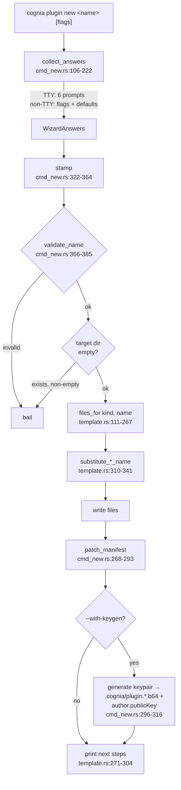

# Scaffolding — `cognia plugin new`

<TLDR>
  `cmd_new::run()` (`crates/cognia-cli/src/cmd_new.rs:43-103`) collects answers (interactive
  wizard on a TTY, flags + defaults otherwise), **stamps** an embedded template
  (`template.rs:111-267` — every file ships inside the binary via `include_str!` from the five
  sibling template source directories), **patches** the wizard answers into the generated
  `plugin.json` (`cmd_new.rs:268-293`), and optionally **embeds a fresh Ed25519 public key**
  (`cmd_new.rs:296-316`). Substitution is two plain `String::replace` calls per file — the
  template id and its humanized title. The target directory is refused if non-empty.
</TLDR>

## Flow



## Inputs and defaults

| Input | Flag | TTY wizard | Non-TTY default |
| --- | --- | --- | --- |
| name | positional | prompted (CWD basename suggested if valid) | **required** — bails with hint (`cmd_new.rs:123`) |
| kind | `--kind wasm\|ts\|python\|hybrid\|vscode-extension` (`vscode` alias accepted) | select, 0 = wasm | `wasm` (`cmd_new.rs:134`) |
| dir | `--dir <path>` | — | `./<name>` (`cmd_new.rs:324`) |
| description | `--description` | prompted with suggestion | `"A cognia {kind} plugin"` (`cmd_new.rs:165`) |
| author | `--author` | `git config user.name` as default (`cmd_new.rs:177-188`) | `"Anonymous"` |
| author email | `--author-email` | optional prompt | `None` |
| keygen | `--with-keygen true\|false` | confirm, default **true** | `false` (`cmd_new.rs:208`) |

`TemplateKind::parse` (`template.rs:23-34`) also accepts `typescript` / `frontend` as aliases for
`ts`, `py` as an alias for `python`, and `vscode` / `vs-code` as aliases for
`vscode-extension`.

### Name validation

`validate_name` (`cmd_new.rs:366-385`): ≤ 64 chars, lowercase ASCII alphanumeric start and end,
with lowercase alphanumeric plus `-`, `_`, `.` in between. Exact failures:

```text
plugin name is empty                                       (cmd_new.rs:368)
plugin name must be ≤ 64 characters                        (cmd_new.rs:371)
plugin name must be lowercase alphanumeric plus -_. (got `…`)  (cmd_new.rs:382)
```

`"0plugin"` and `"foo.bar_1"` pass; `"has space"`, `"!banged"`, `"Uppercase"`, and
`"trailing-"` fail (unit tests at
`cmd_new.rs:393-404`).

## Templates are embedded sibling sources

The template sources live as sibling directories — `crates/cognia-plugin-template/` (WASM),
`crates/cognia-plugin-template-ts/` (TypeScript), `crates/cognia-plugin-template-python/`,
`crates/cognia-plugin-template-hybrid/`, and
`crates/cognia-plugin-template-vscode-extension/` — and are pulled into the binary with
`include_str!` (`template.rs:38-104`). The CLI ships no template directory; scaffolds work
offline.

Substitution is intentionally dumb (`template.rs:310-341`):

```rust
fn substitute_wasm_name(content: &str, target_name: &str) -> String {
    content
        .replace("cognia-plugin-template", target_name)
        .replace("Cognia Plugin Template", &humanize(target_name))
}
// humanize: "my-cool-plugin" → "My Cool Plugin" (split -_ → Title Case)
```

Description / author / publicKey are **not** template placeholders — they are patched into the
generated `plugin.json` afterwards by `patch_manifest` (`cmd_new.rs:268-293`), which re-reads,
mutates, and pretty-prints the JSON.

## What each kind generates

| Kind | Files |
| --- | --- |
| WASM (6 files — `template.rs:113-137`) | `Cargo.toml`, `src/lib.rs`, `wit/world.wit`, `plugin.json`, `README.md`, `.gitignore` |
| TypeScript (10 files — `template.rs:139-186`) | `package.json`, `tsconfig.json`, `jest.config.cjs`, `src/index.ts`, `src/index.test.ts`, shims, `plugin.json`, `README.md`, `.gitignore` |
| Python (4 files — `template.rs:188-204`) | `plugin.json`, `main.py`, `README.md`, `.gitignore` |
| Hybrid (6 files — `template.rs:206-230`) | `plugin.json`, `frontend/index.js`, `backend/main.py`, `styles.css`, `README.md`, `.gitignore` |
| VS Code extension (6 files — `template.rs:232-267`) | `plugin.json`, `package.json`, `extension/out/extension.js`, `styles.css`, `README.md`, `.gitignore` |

### WASM scaffold highlights

The manifest pins the contract the host routes on:

```json
{
  "type": "wasm",
  "wasmMain": "cognia_plugin_template.wasm",
  "wasm": { "apiVersion": "0.1.0", "memoryLimitMb": 16, "callTimeoutMs": 5000 },
  "permissions": ["notification"],
  "engines": { "cognia": ">=0.4.0" }
}
```

`src/lib.rs` implements the full `Guest` trait from the WIT world — `init`, `on_event`,
`tool_execute`, `workflow_node_execute` — each logging through the host's `logger` import and
echoing payloads back, so a fresh scaffold is observable end-to-end. The `Cargo.toml` carries the
`[package.metadata.component]` block (`package = "cognia:plugin"`, `world = "cognia-plugin"`) and
a size-tuned release profile (`opt-level = "s"`, `lto = true`, `codegen-units = 1`).

### TypeScript scaffold highlights

`plugin.json` declares `type: "frontend"`, `capabilities: ["tools", "commands"]`,
`main: "dist/index.js"`, `engines.cognia: ">=0.1.0"`, plus one registered tool
(`template_echo`) and one slash command (`template-greet`). `src/index.ts` exports a
`PluginDefinition` whose `activate` registers both — exactly the two contribution kinds the
manifest claims, so `lint`'s capability-parity check passes out of the box.

The build script in `package.json` mirrors what `cognia plugin build` runs:

```json
"build": "esbuild src/index.ts --bundle --format=cjs --platform=neutral --target=es2022
          --outfile=dist/index.js --external:@/types/plugin --external:@/lib/*"
```

Host modules (`@/types/plugin`, `@/lib/chat/slash-command-registry`) are mapped to local
`src/__shims__/` copies in both `tsconfig.json` `paths` and `jest.config.cjs`
`moduleNameMapper`, so the scaffold type-checks and its jest tests pass before the plugin ever
meets a running cognia.

### Python scaffold highlights

`plugin.json` declares `type: "python"`, `capabilities: ["tools", "python"]`,
`pythonMain: "main.py"`, `engines.cognia: ">=0.1.0"`, and one registered tool
(`template_echo`). `main.py` imports the Python SDK surface with `from cognia import tool, log`,
decorates `template_echo`, logs the received text, and returns `{"ok": True, "echoed": text}`.

There is no build step for the Python scaffold. `cognia plugin build` packages the declared
`pythonMain` and any `bundle_include[]` files directly, while `cognia plugin lint` validates that
the manifest type and entrypoint agree before packaging.

### Hybrid scaffold highlights

`plugin.json` declares `type: "hybrid"`, `capabilities: ["tools", "python"]`,
`main: "frontend/index.js"`, `pythonMain: "backend/main.py"`, and `styles: "styles.css"`.
The frontend entry is plain CommonJS, so it can be syntax-checked with `node --check` and loaded
without an npm install. The Python backend registers `template_echo`, letting the fresh scaffold
exercise both halves of the hybrid loader while keeping packaging build-free.

### VS Code-extension scaffold highlights

`plugin.json` declares `type: "vscode-extension"`, `vscodeMain:
"extension/out/extension.js"`, optional `styles`, and `bundle_include: ["package.json"]`.
The entrypoint exports CommonJS `activate` / `deactivate` functions and registers one VS Code
command through `require("vscode")`, matching the sidecar's extension-runner contract.

## Post-stamp output

Printed next steps (`template.rs:271-304`):

```text
# wasm                                   # ts                                      # python
cd <dir>                                 cd <dir>                                  cd <dir>
rustup target add wasm32-wasip2          pnpm install                              python -m py_compile main.py
cargo install --locked cargo-component   pnpm test                                 cognia plugin lint
cognia plugin build                      cognia plugin lint                        cognia plugin build
                                         cognia plugin build

# hybrid                                 # vscode-extension
cd <dir>                                 cd <dir>
node --check frontend/index.js           node --check extension/out/extension.js
python -m py_compile backend/main.py     cognia plugin lint
cognia plugin lint                       cognia plugin build
cognia plugin build
```

With `--with-keygen`, the key block (`cmd_new.rs:78-98`) confirms
`✓ embedded author.publicKey (…)` and points at `.cognia/plugin.private.b64` — the same files
[`keygen`](./signing-and-keys) would create.

<Callout type="warn" title="Existing directories are never merged">
  `stamp()` bails with `"<path> already exists and is not empty"` (`cmd_new.rs:331`). There is no
  --force; pick a new directory or empty the target first.
</Callout>
