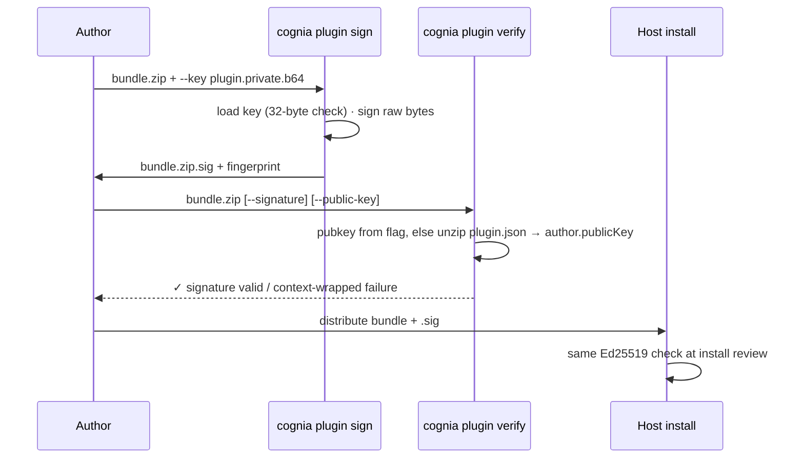
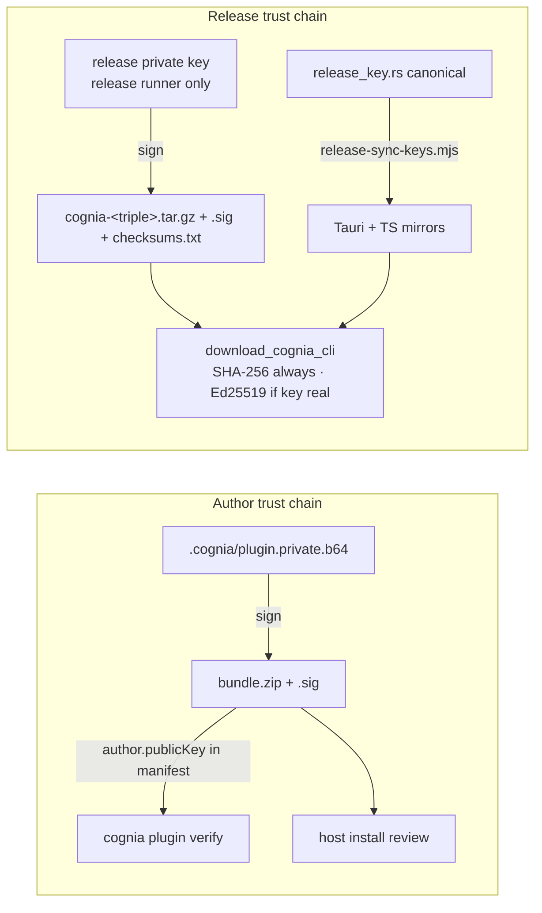

# Signing & keys

<TLDR>
  Two independent trust chains share one primitive. **Author keys** (per plugin, generated by
  `keygen` into `.cognia/plugin.{private,public}.b64`) sign the **raw bundle zip bytes** with
  `ed25519-dalek` (`signing.rs:61-63`); the detached base64 signature lives in `<bundle>.zip.sig`
  and verifies against `plugin.json author.publicKey`. The **release key**
  (`RELEASE_PUBLIC_KEY_BASE64`, canonical in `crates/cognia-cli/src/release_key.rs:25`, currently
  an all-zero placeholder) signs CLI release tarballs and is mirrored into the Tauri downloader
  and a TS module by `scripts/release-sync-keys.mjs` (CI runs `--check`). Identity everywhere is
  the SHA-256 hex fingerprint of the raw 32 public-key bytes (`signing.rs:55-59`).
</TLDR>

## The primitive

| Property | Value |
| --- | --- |
| Algorithm | Ed25519 (`ed25519-dalek` 2) |
| Key encoding | raw 32 bytes → standard base64 (44 chars) |
| Signed payload | the **entire zip file bytes** — no digest indirection, matching the host's `plugin_verify_detached_signature_command` (`signing.rs:3-6`) |
| Signature file | `<bundle>.zip.sig`, base64 text of the 64-byte signature |
| Fingerprint | `hex(sha256(pubkey_bytes))` — 64 lowercase hex chars (`signing.rs:55-59`) |

```rust
// crates/cognia-cli/src/signing.rs:61-63
pub fn sign_bundle(signing_key: &SigningKey, bundle: &[u8]) -> String {
    let sig: Signature = signing_key.sign(bundle);
    b64_encode(&sig.to_bytes())
}
```

`verify_bundle` (`signing.rs:66-82`) decodes both sides with hard length checks — `public key
must be 32 bytes (got N)`, `signature must be 64 bytes (got N)` — and maps a dalek failure to
`signature verification failed: …`.

## keygen

`cognia plugin keygen [--out-dir .cognia]` (`cmd_keygen.rs`):

- writes `plugin.private.b64` and `plugin.public.b64` (`cmd_keygen.rs:19-20`); both files pass
  through `confirm_overwrite` (default **No**, `--yes` to force — `:24-37`)
- prints the fingerprint, a copy-pasteable `"author"` block for `plugin.json`, the exact `sign`
  command, and the warning `⚠ keep <path> safe — anyone with that file can sign as you.`
  (`:47-74`)
- no special file permissions are set — the private key relies on the directory being yours
  (`.cognia/` is in the scaffold's `.gitignore`)

`new --with-keygen` produces the same files and embeds `author.publicKey` automatically
(`cmd_new.rs:78-98` and `cmd_new.rs:296-316`).

## sign / verify



`sign` (`cmd_sign.rs:17-59`) defaults the output to `<bundle>.sig`, creates parent directories
for a custom `--out`, and gates overwrite. `verify` (`cmd_verify.rs`) resolves the public key in
priority order — explicit `--public-key`, else extracted from the bundle's own `plugin.json`
(`extract_public_key_from_bundle`, `cmd_verify.rs:111-127`; empty/missing →
`plugin.json has no author.publicKey; pass --public-key explicitly`). Failures are wrapped with
the remediation `re-sign the bundle with the matching private key, or pass --public-key
explicitly`. `--json` emits `{schemaVersion: 1, ok, bundle, signature, publicKey, fingerprint,
error?}` (`cmd_verify.rs:97-109`).

<Callout type="warn" title="Verify trusts the bundle's own key by default">
  Without `--public-key`, verification proves *internal consistency* — the bundle was signed by
  whoever controls the key embedded in it — not authorship by a specific party. Pin the expected
  key (or compare fingerprints out-of-band) when provenance matters.
</Callout>

## info — bundle and directory inspection

`cognia plugin info <bundle.zip|directory> [--json] [--detailed]` (`cmd_info.rs`) reports:

- manifest summary — id, name, version, type, description, capabilities, permissions
  (`cmd_info.rs:65-173`)
- input kind — `bundle` for immutable zip bundles, `directory` for unpacked plugin sources
- size + sorted file table (zip entries with directory entries skipped, or recursive directory
  files with symlinks skipped)
- embedded `cognia:api-version` — read from the `wasmMain` entry via a tolerant custom-section
  walk that returns `None` on corruption instead of erroring
- signature status. Bundle inputs use sidecar verification; directory inputs report
  `not-applicable` because there are no immutable zip bytes to verify:

| Status | Meaning |
| --- | --- |
| `not-applicable` | unpacked directory input; bundle signatures do not apply |
| `no-sidecar` | no `<bundle>.sig` next to the file |
| `no-public-key` | `.sig` exists but the manifest has no `author.publicKey` |
| `valid` | Ed25519 verifies — reported with public key + fingerprint |
| `invalid` | verification failed — reason string included |

`--json` mirrors all of it under `{schemaVersion: 1, inputKind, path, sizeBytes, manifest, files[],
signature{status, publicKey?, fingerprint?, reason?}, wasmApiVersion?}` (`cmd_info.rs:65-173`).

## The release key — three copies, one source

Author keys authenticate *plugins*; the **release key** authenticates *the CLI binary itself*
when the desktop app downloads it from GitHub Releases
([Detection & managed install](./detection-and-managed-install)).

| Copy | File | Consumer |
| --- | --- | --- |
| canonical | `crates/cognia-cli/src/release_key.rs:25` | the CLI (future self-update surface) |
| Rust mirror | `src-tauri/src/cli_bridge/release_key.rs:11` | `download.rs` Ed25519 check (`download.rs:200-309`) |
| TS mirror | `lib/cli-bridge/embedded-pubkey.ts:13` | renderer display / `isPlaceholderReleaseKey()` |

All three currently hold the all-zero placeholder
`"AAAAAAAAAAAAAAAAAAAAAAAAAAAAAAAAAAAAAAAAAAA="`; `is_placeholder_key()`
(`release_key.rs:27-30`) lets the downloader **skip Ed25519 (with a logged warning) while still
enforcing SHA-256**. Publishing a real key flips verification to mandatory with no code change.

`scripts/release-sync-keys.mjs` keeps the mirrors honest: it regex-extracts the constant from the
canonical file (`release-sync-keys.mjs:31-39`), rewrites both mirrors (`:41-62`), and in
`--check` mode (`:68-75`) exits non-zero on drift — the CI guard. The private release key never
enters the repo; it lives on the release runner.


