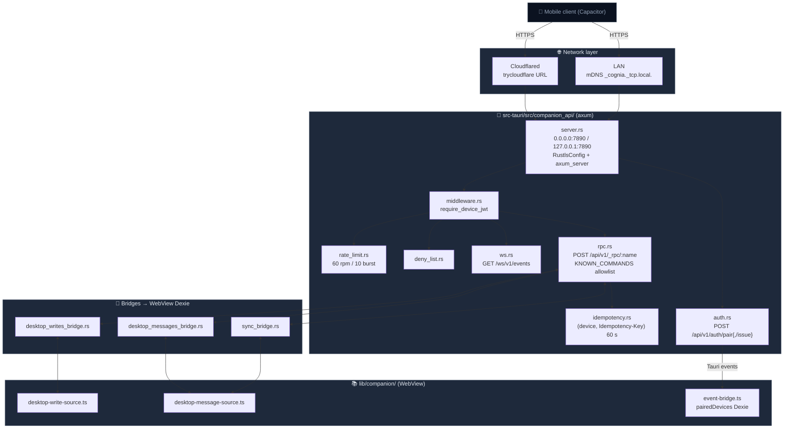

# Companion API

<Status variant="beta">beta · M2 complete</Status>

<TLDR>
  The Tauri desktop app launches an axum HTTPS service (default port 7890) that
  exposes a curated subset of Tauri commands to paired mobile clients via
  `POST /api/v1/_rpc/<name>`. Pairing follows a "scan QR → paste pair JWT →
  server issues device JWT" flow. Events are pushed in real time over
  `GET /ws/v1/events`. Devices on the same LAN discover the server via mDNS;
  remote access uses a Cloudflared tunnel.
</TLDR>

<StatGrid>
  <Stat label="HTTP routes" value="3" hint="/auth/pair · /auth/pair/issue · /_rpc/:name" />
  <Stat label="WS endpoint" value="1" hint="/ws/v1/events" />
  <Stat label="Allowed RPC commands" value="~40" hint="hand-written allowlist" />
  <Stat label="Default port" value="7890" hint="adjustable in Settings" />
</StatGrid>

Companion API is the "Server" branch of cognia-next — the desktop becomes the
server, and mobile devices become clients. The design is grounded in three ADRs:

- [ADR-0012](../adr/0012-transport-abstraction) — The `Transport` abstraction
  in `lib/tauri.ts` lets the same frontend code run on desktop (IPC) and mobile
  (HTTP/WS) without changes.
- [ADR-0013](../adr/0013-command-manifest) — Why `/api/v1/_rpc` is a hand-written
  allowlist instead of macro-generated.
- [ADR-0014](../adr/0014-capacitor-mobile-shell) — Why the mobile app uses a
  Capacitor shell instead of RN / Flutter / native.

## Code locations

```
src-tauri/src/companion_api/
  mod.rs                    # SharedState / CompanionServerState container
  commands.rs               # 20+ Tauri commands (lifecycle, TLS, push …)
  server.rs                 # axum router + Rustls TLS
  auth.rs                   # /api/v1/auth/pair{,/issue}
  rpc.rs                    # /api/v1/_rpc/:name (hand-written dispatch + KNOWN_COMMANDS)
  ws.rs                     # GET /ws/v1/events
  middleware.rs             # require_device_jwt
  jwt.rs                    # HS256 pair (5 min) / device (90 d)
  secret.rs                 # HS256 signing key (OS keyring)
  redemption_lru.rs         # pair JWT single-use enforcement
  idempotency.rs            # 60 s write-command cache keyed by (device, key)
  rate_limit.rs             # 60 rpm / 10 burst token bucket
  deny_list.rs              # revoked device ids
  push.rs / push_creds.rs   # APNs + FCM push
  event_bus.rs              # Tauri events → WS broadcast + replay
  sync_bridge.rs            # WebView Dexie pull bridge
  desktop_messages_bridge.rs
  desktop_writes_bridge.rs
  sync_registry.rs          # table-name allowlist
  mdns.rs                   # _cognia._tcp.local. broadcast
  tunnel.rs                 # cloudflared child process
  tls.rs                    # self-signed cert + SPKI fingerprint
  spec_parity.rs            # OpenAPI consistency test

lib/companion/
  desktop-message-source.ts # Dexie-side message_update / delete / list responses
  desktop-write-source.ts   # Wave 2 write-command responses
  event-bridge.ts           # device-paired / device-seen → Dexie pairedDevices
```

## Architecture overview



## Pairing flow

The desktop is the server; the phone is the client. Pairing is the only moment
when bilateral identity is established:

<Steps>
<Step>
**Desktop opens Settings → Mobile Companion** and taps "Generate QR". The
frontend calls `companion_issue_pair_jwt`. Rust uses the HS256 signing key
(service `com.cognia.companion-secret`, account `default`) to generate a
**5-minute, single-use** `scope: "pair"` JWT; `jti` is a UUIDv4.
</Step>
<Step>
**QR generation** — the frontend encodes `{ baseUrl, pair_jwt, server_version }`
into a QR image. `baseUrl` is the desktop's actual reachable URL:
- LAN mode: `https://<lan ip>:7890`
- Tunnel mode: `https://<trycloudflare>.com`
- Loopback: `https://127.0.0.1:7890` (same-machine debugging only)
</Step>
<Step>
**Phone scans** — `POST /api/v1/auth/pair` body contains:
```json
{ "pair_jwt": "...", "device_label": "iPhone 16",
  "device_platform": "ios", "device_pubkey": "...", "app_version": "..." }
```
</Step>
<Step>
**Server validation** — `auth.rs::pair_handler` runs `verify(pair_jwt, "pair")`,
then uses `RedemptionLru::redeem(jti)` to enforce single use (a second request
with the same jti returns 410 Gone).
</Step>
<Step>
**Device JWT issued** — after validation, a `scope: "device"` 90-day JWT is
generated; `device_id` is a UUIDv4. Response:
```json
{ "device_id": "...", "device_jwt": "...", "server_version": "..." }
```
</Step>
<Step>
**Desktop persistence** — `auth.rs` emits a Tauri event
`companion://device-paired` after the response is sent. WebView's
`event-bridge.ts` receives the event and calls `addPairedDevice` to write a row
to Dexie `pairedDevices`. The Settings UI "Paired devices" table updates
immediately.
</Step>
</Steps>

### JWT scopes

```rust title="src-tauri/src/companion_api/jwt.rs"
const PAIR_TTL_SECS: i64 = 5 * 60;             // 5 minutes
const DEVICE_TTL_SECS: i64 = 90 * 24 * 3600;   // 90 days
```

The `pair` token is not bound to a `device_id` (the phone has no id before
pairing); the `device` token carries no `jti` (single-use semantics are
unnecessary). All subsequent requests carry `Authorization: Bearer <device_jwt>`;
WebSocket uses the `?token=` query string because browser support for custom
headers over WS is unreliable.

## RPC command manifest

`KNOWN_COMMANDS` is the hand-written allowlist decided by
[ADR-0013](../adr/0013-command-manifest). The core reasons for **hand-writing
instead of macro generation**:

1. **The allowlist IS the API** — every command the phone can call is searchable
   right here; nothing is exposed by accident.
2. **Security auditability** — reviewers read 40 lines, not 200.
3. **Per-command shape control** — `tauri::State` / `AppHandle` ergonomic args are
   "automatically" injected on the IPC path, but must be manually bound on the
   HTTP path; the shim layer handles this translation.

Allowed commands fall into four groups:

| Group        | Representative commands                                                                                  |
| ------------ | -------------------------------------------------------------------------------------------------------- |
| Claude SDK   | `claude_send` · `claude_interrupt` · `claude_approve` · `claude_close_session` · `claude_sidecar_status` |
| Credentials  | `claude_sub_save_token` · `claude_set_api_key` · `claude_set_oauth_bearer` · `claude_set_provider_env`   |
| Skills / MCP | `skills_load_registry` · `skills_scan_native` · `mcp_server_status` · `test_mcp_server`                  |
| Mobile-only  | `sync_pull` · `message_update` · `message_delete` · `session_list` · `register_push_token`               |
| Wave 2 write | `character_upsert` · `skill_set_enabled` · `plugin_set_enabled` · `app_settings_update`                  |

### Idempotency

```text
POST /api/v1/_rpc/character_upsert
Authorization: Bearer <device-jwt>
Idempotency-Key: <client-uuid>
{ ...args... }
```

Write commands carrying `Idempotency-Key` are cached for 60 s (keyed by
`(device_id, Idempotency-Key)`). A second identical request returns the cached
response body **without re-execution**. `READ_ONLY_COMMANDS` (e.g.
`claude_sidecar_status`, `sync_pull`) skip the cache — they are structurally
idempotent, and re-running them is cheap.

### Rate limiting

`rate_limit.rs` is an in-house token bucket: 60 rpm / 10 burst, bucketed by
`DeviceContext::device_id`. It runs **after** the JWT middleware — meaning the
pair endpoint and unauthenticated requests are not rate-limited. Rejection
returns `429` with `Retry-After`.

## WebSocket events

`GET /ws/v1/events?token=<jwt>&since=<seq>`:

<Steps>
<Step>
The middleware validates the JWT from the query `token`, injecting `DeviceContext`.
</Step>
<Step>
After a successful handshake, the server checks `since` — if the requested
sequence number is older than the event_bus ring buffer, it sends a frame
`{ "type": "resync_required" }` and closes the connection, forcing the phone
to pull the full dataset again.
</Step>
<Step>
Otherwise, it replays all buffered frames with `seq > since` (in order).
</Step>
<Step>
After replay, it forwards new frames in real time; server pings every 25 s,
client idle disconnect after 90 s of no message.
</Step>
</Steps>

`event_bus.rs` handles two responsibilities: (a) bridging Tauri events → WS
broadcast, and (b) maintaining a ring buffer so reconnecting clients can "look
back" at events from the past few minutes.

## WebView bridges

Axum handlers run in Rust, but the data to read / write lives in the WebView's
Dexie. Three bridge sets solve this:

| Bridge                       | Direction        | Purpose                                          |
| ---------------------------- | ---------------- | ------------------------------------------------ |
| `sync_bridge.rs`             | Rust → TS → Rust | `sync_pull` pulls incremental Dexie table data   |
| `desktop_messages_bridge.rs` | Rust → TS → Rust | `message_update` / `delete` / `session_list`     |
| `desktop_writes_bridge.rs`   | Rust → TS → Rust | Wave 2 write commands for character/skill/plugin |

All bridges share the same protocol shape: Rust emits
`companion://<kind>-request` with a `request_id`; the WebView processes it and
returns the result via a `companion_*_response` Tauri command carrying
`request_id + result`; the Rust side's `oneshot::Receiver` resolves, and the
HTTP handler writes the result into the response. **30-second timeout** — enough
time for a sleeping desktop to wake up and finish the Dexie scan.

## Discovery + remote access

### mDNS (same LAN)

`mdns.rs` broadcasts `_cognia._tcp.local.` with TXT records for server_version +
TLS SHA-256 fingerprint. Phones on the same network can discover the server and
skip manual baseUrl entry. **Off by default** — the user must enable it in
Settings.

### Cloudflared tunnel (remote)

`tunnel.rs` spawns a `cloudflared tunnel --url https://127.0.0.1:7890 --no-tls-verify`
child process (`--no-tls-verify` because of the self-signed certificate). It
parses stderr to extract `https://<random>.trycloudflare.com`; the QR code uses
this URL instead of the LAN IP. **cloudflared binary is NOT bundled** — users
must install it themselves.

### TLS

`tls.rs` generates a self-signed certificate + SPKI fingerprint on first launch,
stored in the app data directory. The fingerprint is delivered to the phone
along with the QR code; the mobile client performs certificate pinning — so
"self-signed" is not a problem for the phone, but desktop browsers visiting the
baseUrl will show a security warning.

## Auth failure error codes

```json
{ "code": "missing_token",      "message": "..." }      // 401
{ "code": "invalid_token",      "message": "..." }      // 401
{ "code": "device_revoked",     "message": "..." }      // 401
{ "code": "unknown_command",    "message": "..." }      // 404
{ "code": "malformed_request",  "message": "..." }      // 400
{ "code": "validation_failed",  "message": "..." }      // 400
{ "code": "rate_limited",       "message": "..." }      // 429
{ "code": "internal_error",     "message": "..." }      // 500
```

All responses share a uniform envelope: on success the JSON body is returned
directly; on failure it is wrapped in an `RpcError` using the codes above.

## Push (APNs + FCM)

`push.rs` is a lightweight in-house dispatcher; it does not pull in `fcm-rust`
or `a2-rs`:

- `PushTokenRegistry` — maintains APNs / FCM tokens per `device_id`, persisted to
  `<app_data>/cognia/companion/push-tokens.json`.
- When the server wants to push — it first checks whether the device has an
  active WS session; if so, it skips the push (WS events already cover it).
  Otherwise it goes through the dispatcher.
- Credentials: FCM service-account JSON + APNs `.p8` key, written to the OS
  keyring by `push_creds.rs`.

## Settings UI

`components/settings/companion/companion-section.tsx` renders three cards:

<Cards>
  <Card
    title="Server status"
    description="Main toggle + bind mode (loopback / LAN) + live 'running on …' status line."
  />
  <Card
    title="Pair a new device"
    description="Generate a one-time pair JWT → QR + 5-minute countdown."
  />
  <Card
    title="Paired devices"
    description="`useLiveQuery(listPairedDevices)`; each row has a revoke button that updates both Dexie and the Rust deny-list."
  />
</Cards>

## Related subsystems

<Cards>
  <Card
    title="Mobile architecture"
    href="../ui/mobile-architecture"
    description="Server-client view: Capacitor shell + LAN/tunnel + JWT pairing."
  />
  <Card
    title="Remote control"
    href="./remote-control"
    description="The same device JWT also drives the desktop ↔ desktop remote-control channel."
  />
</Cards>

## Related ADRs

- [ADR-0012 — Transport Abstraction](../adr/0012-transport-abstraction) — Why the
  frontend must have a `Transport` abstraction before Capacitor can run the same
  code.
- [ADR-0013 — Companion API Command Manifest](../adr/0013-command-manifest) —
  Detailed trade-off record for allowlist vs macro generation vs codegen.
- [ADR-0014 — Capacitor Mobile Shell](../adr/0014-capacitor-mobile-shell) —
  Mobile shell selection comparison (Capacitor vs RN vs Flutter vs PWA).
- [ADR-0015 — Mobile V2 Completion](../adr/0015-mobile-v2-completion) —
  Completion checklist for the V2 mobile implementation.

## Known limitations

- **Single signing key** — the HS256 secret is shared at process scope;
  multi-account / multi-vault scenarios require a service-name version bump
  (`com.cognia.companion-secret/v2`).
- **Cloudflared not bundled** — users must manually `brew install cloudflared` /
  `winget install cloudflare.cloudflared` / apt. We only orchestrate the child
  process.
- **Self-signed cert + SPKI pinning** — desktop browsers visiting the baseUrl
  from the QR code will reject it; this only works on the phone's pinning path.
  Letting users directly visit the baseUrl is an anti-pattern.
- **mDNS usually blocked on corporate networks** — most enterprise LANs filter
  multicast; remote access must go through Cloudflared.
- **Limited replay window** — the event_bus buffer is a fixed ring size; a phone
  offline longer than the window will always receive `resync_required` and must
  pull the full Dexie dataset again.
- **No OpenAPI codegen** — `spec_parity.rs` tests only assert that
  `KNOWN_COMMANDS` and the OpenAPI spec paths are one-to-one, but neither is
  generated from the other. Any dispatch change must be manually synced to the
  spec.
