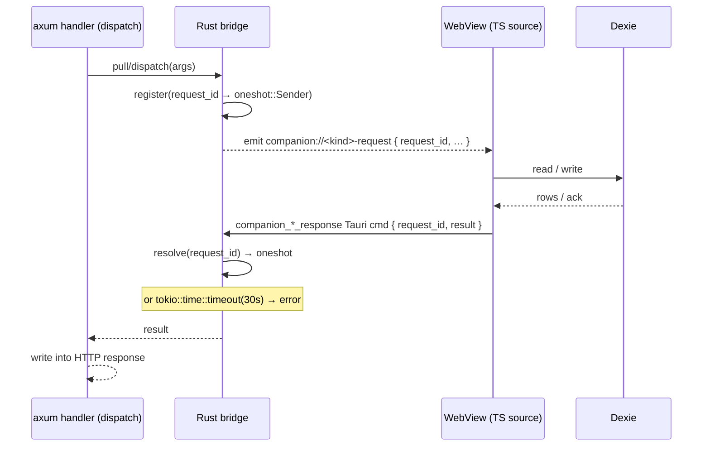

# Data Plane & WebView Bridges

<Status variant="beta" />

<TLDR>
  The Companion API handlers run in Rust, but the data a phone wants — characters, messages,
  sessions, settings — lives in the **WebView's** IndexedDB (Dexie), which Rust cannot read directly.
  Three bridges close the gap with the same shape: Rust emits a `companion://<kind>-request` Tauri
  event carrying a `request_id`, registers a `oneshot::Sender` keyed by that id, and waits up to
  **30 seconds**; a TS listener processes the request against Dexie and replies via a
  `companion_*_response` Tauri command; Rust resolves the oneshot and writes the result into the HTTP
  response. In Headless mode the same bridge protocol runs over `/internal/bridge` to the Node Brain;
  the direct SQLite `AppStore` is only a bounded degraded fallback while no Brain is connected.
</TLDR>

<StatGrid>
  <Stat label="Bridges" value="3" hint="sync · messages · writes" />
  <Stat label="Bridge timeout" value="30 s" hint="enough to wake a sleeping desktop" />
  <Stat label="Sync tables" value="22" hint="sync_registry allowlist" />
  <Stat label="Write commands" value="~40" hint="one unified writes bridge" />
</StatGrid>

## The bridge pattern

All three bridges share one request/response dance. Rust is the initiator even though the data lives
in TS, because the *call* originates from an HTTP request the Rust side is holding open.



### The three bridges

| Bridge | Request event | Response command | Timeout | Used by |
| --- | --- | --- | --- | --- |
| `sync_bridge.rs` | `companion://sync-pull-request` (`:34`) | `companion_sync_pull_response` (`commands.rs:164`) | 30 s (`:35`) | `sync_pull` |
| `desktop_messages_bridge.rs` | 9 message/session/transcript events | `companion_message_response` | 30 s | message CRUD, session listing, transcript capability/timeline/detail/media reads |
| `desktop_writes_bridge.rs` | one unified `companion://desktop-write-request` `{ request_id, command, payload }` (`:35`) | `companion_desktop_write_response` (`commands.rs:231`) | 30 s (`:36`) | all ~40 Wave-2/4 mutating commands |

The messages bridge fans out nine distinct event names but shares one request registry and response
resolver. The writes bridge takes the opposite tack: a
**single** event carrying the command name in its payload, dispatched in `dispatch()` (`:68`) — that
is why the RPC manifest can collapse 40 write commands into one OR-pattern arm (`rpc.rs:1072`).

## TS bridge sources

The WebView half lives in `lib/companion/`. Each `install*` function subscribes at startup and answers
the matching event:

| File | Role | Entry |
| --- | --- | --- |
| `desktop-message-source.ts` | Answers the 5 message/session events from Dexie via `messageRepository` | `installDesktopMessageSource()` (`:91`); `readSessionPage` (`:234`), `readMessagesPage` (`:277`), `persistIncomingMessage` (`:307`) |
| `desktop-write-source.ts` | `switch (command)` over ~40 write commands, replies via the writes response | `installDesktopWriteSource()` (`:88`); inner `dispatchCommand()` (`:129`) |
| `event-bridge.ts` | Subscribes to `device-paired` / `device-seen` and writes the `pairedDevices` Dexie row | `installCompanionEventBridge()` (`:59`) |
| `remote-attach-registry.ts` | In-memory map of attached remote watchers + per-session approval backstops | `attachSession` (`:37`), `armApprovalBackstop` (`:82`); `DEFAULT_APPROVAL_BACKSTOP_MS = 120_000` (`:34`) |
| `needs-input-notifier.ts` | Emits `companion://needs-input` so Rust fans out a push | `notifyRemoteNeedsInput()` (`:28`) |

## The sync-table allowlist

`sync_pull` is the bulk read path — a phone pulls table deltas at startup and on invalidation. Which
tables it may pull is itself an allowlist, `SyncTableRegistry` (`sync_registry.rs:34`), seeded by
`with_defaults()`. The **22** default tables are:

```text
characters · skills · sessions · messages · workflows · workflowRuns · executionRuns
twinProfile · plugins · adapterInstances · settings · conversationOverrides · goals · memories
mcpServers · terminalHistory · agentTeamBoard · agentTasks · agentTaskAttempts
templateDefinitions · templatePackages · templateInstances
```

`contains()` (`sync_registry.rs:58`) gates `sync_pull` at `rpc.rs:993`; an off-list table name is
rejected, not silently returned empty. The client's sync handlers ([Sync & offline](../../ui/mobile-architecture/sync-offline))
are the mirror image — one handler per allowed table.

## The headless DataPlane

The Companion API code is reused by a headless `cognia-server` binary that has **no WebView**.
`DataPlane` abstracts both the transport and the degraded fallback:

```rust title="src-tauri/src/companion_api/data_plane.rs"
enum DataPlane {
    Bridge { bridge, transport },       // socket Brain or desktop WebView
    Direct(Arc<dyn AppStore>),          // degraded SQLite fallback
}
```

`pick()` resolves in strict order: connected socket Brain, desktop WebView, then the process-global
`HEADLESS_STORE`. This is the implemented ADR-0059 D3 rule: the Brain's Dexie remains authoritative;
SQLite serves a limited degraded surface during Brain startup or restart and must not shadow a live
Brain. Desktop behavior is unchanged because the WebView transport wins when present.

## Why 30 seconds

The bridge timeout (`tokio::time::timeout`, e.g. `sync_bridge.rs:98`) is deliberately generous. The
desktop WebView may be backgrounded or the machine asleep when a phone request arrives; 30 seconds
is enough for the OS to wake the process and for a Dexie scan to complete, while still bounding a wedged
request so the HTTP handler doesn't hang forever. A timeout surfaces as a `service_unavailable`-class
error to the phone, which retries.

## Related pages

<Cards>
  <Card title="RPC command manifest" href="./rpc-manifest" description="The commands that drive these bridges, and the OR-pattern arm that routes all writes through one bridge." />
  <Card title="Mobile: sync & offline" href="../../ui/mobile-architecture/sync-offline" description="The client's per-table sync handlers and cursor store that consume sync_pull." />
  <Card title="Events, WebSocket & push" href="./events-ws-push" description="The push path that needs-input-notifier triggers." />
</Cards>
