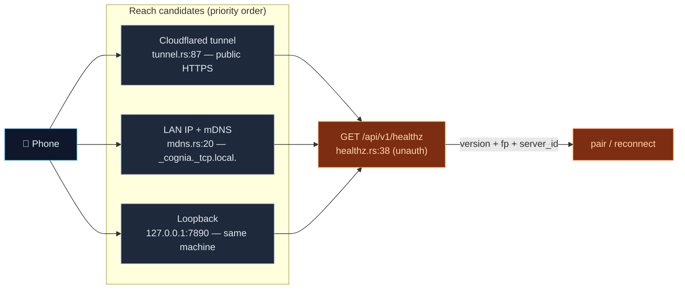

# Discovery, Tunnel & TLS

<Status variant="beta" />

<TLDR>
  A phone needs a `baseUrl` and a TLS fingerprint before it can pair. Three Rust pieces provide them:
  `mdns.rs` broadcasts `_cognia._tcp.local.` with the version + fingerprint in TXT records so a phone
  on the same LAN can auto-discover the desktop; `healthz.rs` serves an **unauthenticated**
  `GET /api/v1/healthz` that returns version + fingerprint + a stable `server_id` so a probing phone
  can confirm "this is a Cognia server" and pin TLS; and `tunnel.rs` spawns a cloudflared child
  process (quick or named) to give the desktop a public HTTPS URL when LAN won't reach. The fingerprint
  that ties it all together is the SHA-256 of the 10-year self-signed certificate's public key.
</TLDR>

<StatGrid>
  <Stat label="mDNS service" value="_cognia._tcp.local." hint="mdns.rs:20" />
  <Stat label="Discovery route" value="GET /api/v1/healthz" hint="unauthenticated — healthz.rs:38" />
  <Stat label="Tunnel" value="cloudflared" hint="quick + named — tunnel.rs" />
  <Stat label="server_id" value="SHA-256(secret)[..16]" hint="healthz.rs:54" />
</StatGrid>

## The reach problem

The same `baseUrl` resolution underlies pairing and reconnection. The desktop can be reachable three
ways, in priority order — and `companion_issue_pair_jwt` (`commands.rs:510-520`) bakes that priority
into the QR it generates: **tunnel > named tunnel > LAN IP > loopback**.

## healthz — the discovery handshake

`healthz_handler` (`healthz.rs:38`) is the **only** unauthenticated route on the Companion API. It
exists so a phone scanning the LAN can confirm a candidate IP is a Cognia server *before* sending any
credential, and so a paired phone can probe reachability cheaply. It returns:

- `version` — the app version,
- the TLS SHA-256 `fingerprint`,
- `server_id` — `SHA-256(secret)[..16]` as 32 hex chars (`healthz.rs:54-57`), a stable identifier
  derived from the signing secret that lets a phone tell two desktops apart without exposing the secret
  itself.

Deliberately, it reveals nothing actionable: no session data, no command surface, just enough to pin
TLS and recognize the server. (The LAN scanner on the client actually probes `GET /api/v1/whoami` and
treats a `401` as proof-of-Cognia, then enriches with `healthz` for the fingerprint — see [discovery &
pairing](../../ui/mobile-architecture/discovery-pairing).)

## mDNS

`mdns.rs` broadcasts the service type `_cognia._tcp.local.` (`SERVICE_TYPE`, `mdns.rs:20`) with TXT
records (`mdns.rs:67-69`):

| Key | Value |
| --- | --- |
| `ver` | app version |
| `fp` | TLS SHA-256 fingerprint |
| `path` | `/api/v1` |

`Broadcaster::start` (`mdns.rs:63`) registers a `ServiceInfo` (`:71`); `start_auto` (`:122`) resolves
the LAN IP via `local-ip-address`. It is **off by default** — the user enables it in Settings —
because most corporate networks filter multicast, and it is unregistered on drop. The Tauri commands
are `companion_mdns_start` (`commands.rs:610`), `companion_mdns_stop` (`commands.rs:636`), and
`companion_mdns_status` (`commands.rs:642`).

## Cloudflared tunnel

`tunnel.rs` gives the desktop a public HTTPS URL by orchestrating a `cloudflared` child process. The
binary is **not bundled** — the user installs it (`brew` / `winget` / apt). Two modes:

- **Quick tunnel** (`tunnel.rs:87-94`) — `cloudflared tunnel --no-autoupdate --url <local>`, adding
  `--no-tls-verify` because the origin is the self-signed HTTPS server. The ephemeral
  `https://<random>.trycloudflare.com` URL is parsed from stderr with a regex
  (`(https://[a-z0-9-]+\.trycloudflare\.com)`, `:113-124`).
- **Named tunnel** (`tunnel.rs:151-156`) — `cloudflared tunnel --no-autoupdate --token <token>` for a
  stable custom hostname; liveness is detected by the `Registered tunnel connection` log line
  (`:175-186`).

`TunnelError` distinguishes `NotInstalled` (ENOENT → actionable "install cloudflared" message),
`Io`, and `Timeout` (`tunnel.rs:23-31`). `TunnelState` (`:209`) waits up to 20 s for the URL. The
commands are `companion_tunnel_start` (`commands.rs:656`), `companion_tunnel_stop` (`:696`),
`companion_tunnel_current` (`:702`), plus the named-config commands below.

### Named-tunnel persistence

`tunnel_config.rs` persists the named-tunnel setup the same way credentials are split: the **token**
goes to the OS keyring (service `"com.cognia.companion-tunnel/v1"`, account `"token"`,
`tunnel_config.rs:17-18`), while the **mode + hostname** go to a JSON file
`<data_dir>/cognia/tunnel-config.json` (`:19-20,59`). `save_token` / `load_token` / `clear_token`
(`:80-101`); `summarize` (`:148`) optimistically reports the token as present on Windows to dodge the
Credential-Manager read delay. The commands are `companion_tunnel_save_named_config` (`commands.rs:709`),
`companion_tunnel_get_config` (`:725`), `companion_tunnel_set_mode` (`:734`), `companion_tunnel_clear_named`
(`:761`).

## TLS & the fingerprint

The certificate that all of this pins is described in [Server &
authentication](./server-and-auth#tls-self-signed-pinned-stable): a 10-year self-signed cert
(`tls.rs:30`) whose SPKI SHA-256 is the fingerprint. The fingerprint is computed once (`mod.rs:160`),
embedded in the mDNS TXT `fp` record, returned by `healthz`, and baked into the QR pairing payload —
three delivery channels for the same value, so however the phone reaches the desktop it can verify it
is talking to the right one. The phone then performs certificate pinning on every subsequent request
(`pinned-fetch` on the client side), which is why a self-signed certificate is safe here even though a
desktop browser would reject it.

## Reachability diagnostics

`companion_test_local_reachability` (`commands.rs:879`) probes each candidate host's
`…/api/v1/auth/pair/issue` with a 5-second timeout (`commands.rs:895`) and returns a
`Vec<CompanionReachability>` so the Settings UI can show which reach paths are currently live before
the user generates a QR.

## Related pages

<Cards>
  <Card title="Server & authentication" href="./server-and-auth" description="The certificate, the fingerprint, and how the QR bakes in the resolved baseUrl." />
  <Card title="Mobile: discovery & pairing" href="../../ui/mobile-architecture/discovery-pairing" description="The client side — mDNS subscribe, LAN scan, connection-strategy candidate walk, TLS pinning." />
  <Card title="WebRTC signaling plane" href="./signaling-webrtc" description="The fourth reach path for when neither LAN nor tunnel works." />
</Cards>
