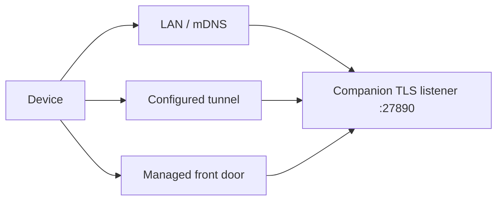

# Discovery, Tunnel & TLS

<Status variant="beta" />

<TLDR>
  The Companion listener defaults to TLS on port `27890`. LAN discovery advertises the listener and
  certificate identity; `GET /healthz` confirms the process, while `/livez` and `/readyz` separate
  liveness from dependency readiness. Tunnel or managed front doors preserve the same canonical
  `/api/*` and `/ws/*` paths. The old `/api/v1/healthz` path is not the canonical discovery route.
</TLDR>

## Probe endpoints

| Route | Authentication | Purpose |
| --- | --- | --- |
| `GET /healthz` | None | Basic server identity and health discovery |
| `GET /livez` | None | Process liveness |
| `GET /readyz` | None | Readiness of required runtime dependencies |
| `GET /.well-known/agent-card.json` | None | Agent capability discovery |

Probes intentionally expose no session or command data. After discovery, a device must still finish
device registration and the DPoP token flow.

## Reachability order

The advertised base URL changes with deployment, but the contract paths do not. A reverse proxy must
forward WebSocket upgrades and preserve the request path used by DPoP verification and socket-ticket
binding.

## TLS identity

The native runtime owns the certificate and exposes its fingerprint through discovery metadata. A
client should pin or otherwise validate that identity according to its deployment policy before
sending registration material. A tunnel's public certificate does not implicitly authorize a
different Companion instance.

## Compatibility note

Released v1 RPC and socket aliases are documented compatibility endpoints. Discovery should still
return the canonical base URL; clients choose the legacy paths only because of their transport
version, not because the server advertises a `/api/v1` base path.
