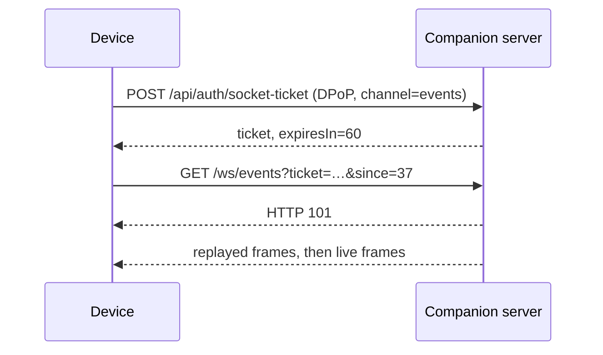

# Events, WebSockets & Push

<Status variant="beta" />

<TLDR>
  Canonical WebSockets never carry the five-minute DPoP token in the URL. A device authenticates an
  HTTP request to `POST /api/auth/socket-ticket`, then spends the returned 60-second single-use
  ticket on the exact event, terminal, browser, or ACP path. Event connections may send `since` to
  replay the retained sequence gap. No query-string bearer socket is mounted.
</TLDR>

## Ticket flow

Tickets are single-use and path-bound. A ticket minted for events cannot open a terminal or browser
channel. If connection setup fails after the ticket is consumed, request a new ticket.

## Canonical channels

| Channel | Route | Notes |
| --- | --- | --- |
| Events | `GET /ws/events?ticket=…&since=…` | Sequence replay and `resync_required` when the gap is outside retention |
| Terminal create | `GET /ws/terminal/new?ticket=…` | Creates a resumable remote PTY session |
| Terminal resume | `GET /ws/terminal/{session_id}?ticket=…` | Reattaches to a live terminal session |
| Browser | `GET /ws/browser/{session_id}?ticket=…` | Browser session channel |
| ACP | `GET /ws/acp?ticket=…` | Agent Client Protocol bridge |

The event bus stores monotonically sequenced frames in a bounded ring and also broadcasts new frames
to live subscribers. A reconnect supplies its last observed sequence. When that cursor is too old,
the server sends `resync_required`; the client must refresh authoritative state through RPC before
resuming incremental processing.

## Push delivery

Push notification registration and revocation are RPC commands governed by the same command
manifest. Push is an offline hint, not an authoritative state channel. When a device already has an
active event socket, the server suppresses redundant push delivery.

Legacy `/ws/v1/*?token=…` sockets are intentionally not mounted. Clients from before the `cgnp3`
upgrade must re-pair and use single-use socket tickets.

## High-frequency performance frames

Performance frames use targeted ephemeral `companion_perf_frame` delivery to the
device owning the lease. They are intentionally excluded from durable replay so
diagnostic cadence cannot evict business events. Reconnect recovery reads the
lease-bound performance snapshot, merges by host instance, sampling session and
sequence, and records any unrecoverable sequence range as a `PerfGap`.
