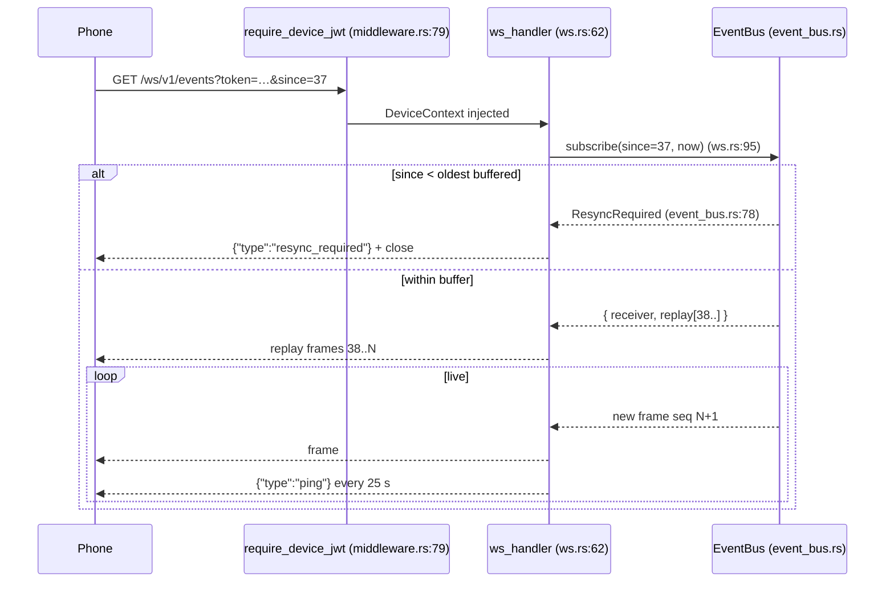

# Events, WebSocket & Push

<Status variant="beta" />

<TLDR>
  The desktop pushes state to a phone in real time over `GET /ws/v1/events` (`ws.rs:62`). An
  `EventBus` (`event_bus.rs`) bridges Tauri `app.emit` events into a tokio `broadcast` channel and a
  **200-frame ring buffer** with a monotonic `seq`; a reconnecting phone sends `?since=<seq>` and
  either replays the gap or is told `resync_required` if it fell behind the buffer. A second socket,
  `GET /ws/v1/terminal` (`ws_terminal.rs:235`), bridges a remote PTY with resumable sessions. When a
  phone is offline (no live WS), `push.rs` delivers FCM/APNs notifications — and **suppresses** the
  push if a WebSocket for that device is already open.
</TLDR>

<StatGrid>
  <Stat label="Ring buffer" value="200 frames" hint="event_bus.rs:46" />
  <Stat label="Retention" value="60 s" hint="event_bus.rs:49" />
  <Stat label="WS heartbeat" value="25 s" hint="ws.rs:34 — idle close 90 s" />
  <Stat label="Terminal resume TTL" value="5 min" hint="ws_terminal.rs:66" />
  <Stat label="Push providers" value="2" hint="FCM + APNs — dispatchers.rs" />
</StatGrid>

## The event bus

`EventBus` (`event_bus.rs`) has two jobs: fan Tauri events out to every connected WebSocket, and keep
a short backlog so a phone that blips offline can catch up without a full resync.

- **Ring buffer** — `BUFFER_CAPACITY = 200` frames (`event_bus.rs:46`), pruned both by capacity and
  by a `RETENTION_MS = 60_000` (`:49`) age window in `publish` (`:117-149`).
- **Broadcast channel** — `BROADCAST_CAPACITY = 256` (`:53`); live subscribers receive new frames as
  they are published.
- **seq cursor** — an `AtomicU64` (`:99`) incremented to start at 1 on the first `publish` (`:118`).
- **Tauri bridge** — `register_tauri_event(app, bus, channel)` (`:227`) calls `app.listen(channel, …)`,
  parses the payload JSON, and republishes it into the bus, so any desktop subsystem that emits a
  Tauri event reaches the phone for free.

The wire shape, `EventFrame` (`:60-71`), serializes its `event_type` field as `"type"`:

```json
{ "type": "claude://session-event", "seq": 42, "payload": { … }, "ts_ms": 1700000000000 }
```

## /ws/v1/events — replay & resync

`ws_handler` (`ws.rs:62`) is reached only after `require_device_jwt` has validated the `?token=` query
(WebSockets can't reliably carry custom headers) and injected `DeviceContext`; the handler itself just
reads that context (`ws.rs:69-73`). `handle_socket` (`ws.rs:83`) then runs the replay protocol:

<Steps>
<Step>
**Subscribe with a cursor** — `event_bus.subscribe(since, now_ms)` (`ws.rs:95`). `since = None` anchors
at the current high-water mark (only future frames); `since = Some(0)` replays everything still
buffered; any other `since` replays frames newer than it.
</Step>
<Step>
**Resync if behind** — if `since` is older than the oldest buffered frame, `subscribe` returns
`SubscribeResult::ResyncRequired` (`event_bus.rs:78`); the handler sends `{ "type": "resync_required" }`
and closes (`ws.rs:95-103`). The phone must then re-pull the full Dexie dataset via `sync_pull`.
</Step>
<Step>
**Replay the gap** — otherwise the buffered frames newer than `since` are serialized and sent in order
(`ws.rs:106-117`).
</Step>
<Step>
**Stream live + heartbeat** — new frames forward in real time; the server pings every
`HEARTBEAT_SECS = 25` (`ws.rs:34`) and closes a connection idle past `IDLE_TIMEOUT_SECS = 90`
(`ws.rs:37`, checked `:187-199`). A `broadcast::error::RecvError::Lagged` (subscriber too slow) also
closes the socket (`ws.rs:143-146`).
</Step>
</Steps>



## /ws/v1/terminal — the remote PTY

`ws_terminal_handler` (`ws_terminal.rs:235`) bridges a phone to the desktop's [integrated
terminal](../../adr/0031-integrated-terminal). It spawns a PTY via `terminal::session::spawn_session_with_sink`
(`ws_terminal.rs:274`) whose events feed an mpsc `(seq, TerminalEvent)` channel. The spawn request
(`build_spawn_request`, `:486`) forces `origin = SessionOrigin::Remote`, `force_utf8 = true`, and
`enable_shell_integration = false`.

- **Wire frames** — binary frames carry raw PTY stdin/stdout; text control frames (`ControlFrame`,
  `:518`) carry `ready` / `integration` / `exit` / `resize` / `kill` / `error`
  (`handle_control_frame`, `:530`).
- **Resumable (Wave 2)** — reconnect with `?sessionId=&resumeFrom=` (`:220-229`); ownership is checked
  against the device, then `session.replay().since(resume_from)` re-streams missed output
  (`:346-364`). A process-wide `WsTerminalRegistry` (`:73`, static `:179`) tracks live sessions; a
  reaper (`:187`) reclaims sessions idle past `RESUME_TTL = 5 min` (`:66`), and a hard
  `IDLE_TIMEOUT = 15 min` (`:71`) caps a connection.
- **CLI PATH** — `build_remote_cli_path_injection` (`:561`) injects the managed binary dirs +
  `target/{release,debug}` + `~/.cargo/bin` so a remote shell finds the bundled tooling.

## Push delivery

When a phone has no live WebSocket, `push.rs` delivers a notification. It is a lightweight in-house
dispatcher — no `fcm-rust` / `a2-rs`:

- **Suppress when connected** — `dispatch_to_device` (`push.rs:244`) checks `has_websocket(device_id)`
  first; if a WS is open it returns `SuppressedWebsocketActive` rather than double-notifying. The
  per-device counter is maintained by `note_websocket_open/close` (`:209-235`).
- **Token registry** — `PushTokenRegistry` maps `device_id` → APNs/FCM tokens, persisted to
  `<data_dir>/cognia/companion/push-tokens.json` (`PUSH_TOKENS_FILE`, `push.rs:33`; path `:141-155`).
- **Dispatcher set** — `DispatcherSet` (`:287`) holds the FCM and APNs slots; the trait is
  `PushDispatcher` (`:82`) with a `NoopDispatcher` fallback. The real clients live in
  `dispatchers.rs`: `FcmDispatcher` (FCM HTTP v1) and `ApnsDispatcher` (APNs HTTP/2 token auth).
- **Offline broadcast** — `broadcast_to_offline` (`:263`) iterates every registered token, each
  through `dispatch_to_device` (so connected devices are still skipped).

### Credentials

`push_creds.rs` persists the provider credentials under keyring service
`"com.cognia.companion-push/v1"`, accounts `"fcm"` / `"apns"` (`push_creds.rs:24-26`), with a
file-backend fallback (`push-credentials.fcm.json` / `.apns.json`, mode `0o600` on unix, `:27-28`).
`reinstall_persisted_dispatchers` (`:243-266`) loads them at startup and wires the dispatcher set.
The Tauri commands that configure them are `companion_push_configure_fcm` (`commands.rs:777`),
`companion_push_configure_apns` (`commands.rs:792`), and the matching `clear`/`status` commands.

## Related pages

<Cards>
  <Card title="Data plane & WebView bridges" href="./data-plane-bridges" description="needs-input-notifier emits the event that triggers an offline push." />
  <Card title="WebRTC signaling plane" href="./signaling-webrtc" description="The DataChannel also pumps EventBus frames to the phone over the RTC tier." />
  <Card title="Integrated terminal" href="../../adr/0031-integrated-terminal" description="The PTY subsystem that /ws/v1/terminal bridges." />
</Cards>
