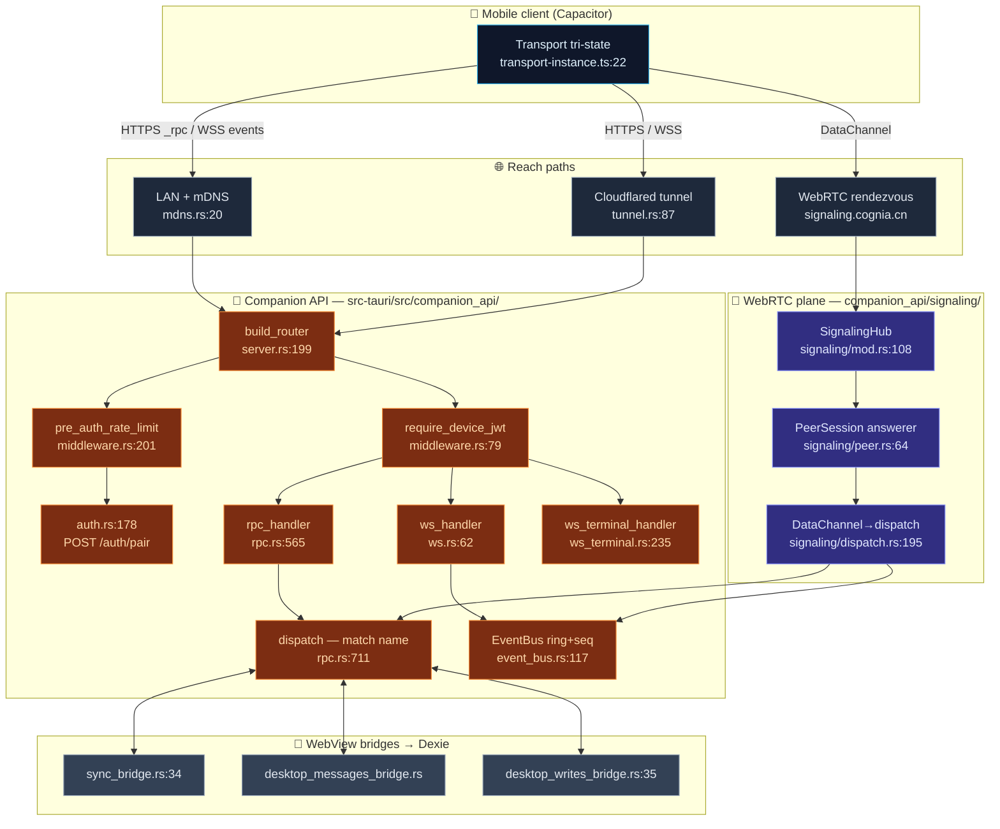

# External API

<Status variant="beta">beta · companion M2 / WebRTC M-RTC complete</Status>

<TLDR>
  Cognia's desktop is not only an app — it is a **server**. The Tauri shell starts up to
  **three independent axum listeners**, each a distinct external surface with its own auth model:
  the **Companion API** (`companion_api/server.rs:199`) is an HTTPS + WebSocket service that paired
  phones drive through `POST /api/v1/_rpc/<name>` over **110** allowlisted commands; **Remote
  Control** (`remote_control/server.rs:72`) is a loopback bearer-token webhook receiver for scripts;
  and the **MCP / External Bridge** (`mcp_server/http_server.rs:67`) forwards JSON-RPC to a Node
  sidecar that exposes Cognia's knowledge to external coding agents. The Companion API is the only
  one that binds off-loopback and the only one that uses device JWTs; it also carries a **WebRTC
  DataChannel tier** (`companion_api/signaling/`) so a phone behind NAT can reach the desktop over a
  brokered peer connection when LAN and tunnel are both unavailable.
</TLDR>

<StatGrid>
  <Stat label="axum listeners" value="3" hint="companion_api · remote_control · mcp_server — separate ports" />
  <Stat label="RPC commands" value="110" hint="KNOWN_COMMANDS allowlist — rpc.rs:163" />
  <Stat label="HTTP/WS routes" value="8" hint="companion_api router — server.rs:199" />
  <Stat label="Transport tiers" value="4" hint="ws-lan · ws-tunnel · rtc-direct · rtc-relay" />
  <Stat label="Default companion port" value="27890" hint="server.rs — DEFAULT_PORT, adjustable" />
  <Stat label="Device JWT TTL" value="90 d" hint="jwt.rs:29 — pair JWT is 5 min" />
</StatGrid>

## What It Is

An **external API** in Cognia is any HTTP/WS/WebRTC surface served by the Tauri Rust backend to a
caller that is *not* the in-process WebView. Because `next.config.ts` forces `output: "export"`,
`app/api/` does not exist at runtime — every server endpoint is Rust ([axum](https://docs.rs/axum)),
not a Next.js route. Three listeners cover three audiences:

| Server | Lives in | Bind | Port | Auth | Audience |
| --- | --- | --- | --- | --- | --- |
| **Companion API** | `src-tauri/src/companion_api/` | `127.0.0.1` **or** `0.0.0.0` (toggle) + TLS | `27890` default | **device JWT** (HS256) | the mobile companion app |
| **Remote Control** | `src-tauri/src/remote_control/` | `127.0.0.1` only | `47821` default | bearer token + IPv4 CIDR allowlist | local scripts / CI |
| **MCP / External Bridge** | `src-tauri/src/mcp_server/` | `127.0.0.1` only | OS-assigned | bearer token | external coding agents |

These are **three independent axum instances on three sockets** — they do not share a router. The
MCP server additionally opens a fourth, internal-only loopback socket (`automation_proxy.rs:177`) so
its Node sidecar can call back into desktop automation without contending with the JSON-RPC pipe.

This section documents the **Companion API** in depth — it is the largest surface, the only
multi-transport one, and the server half of the [Mobile Companion](../../ui/mobile-architecture)
client. Remote Control and the MCP bridge have their own pages: [Remote
Control](../remote-control) and [External Bridge](../external-bridge).

## Why It Exists

- **Static export has no server.** Spawning a listener, terminating TLS, signing JWTs, and brokering
  WebRTC all require a real process; that is the Tauri Rust backend. The phone runs the *same* `out/`
  bundle as the desktop but connects back to these endpoints instead of calling Tauri IPC.
- **The allowlist is the API.** Desktop registers 200+ Tauri commands; exposing all of them to a
  paired phone would be a security regression. `KNOWN_COMMANDS` (`rpc.rs:163`) is a hand-written
  list of exactly the ~110 a phone may call ([ADR-0013](../../adr/0013-command-manifest)).
- **One frontend, three transports.** The client's `Transport` abstraction
  ([ADR-0012](../../adr/0012-transport-abstraction)) lets the *same* `transport.call(name, args)`
  resolve to Tauri IPC on desktop, HTTPS `_rpc` on mobile-over-LAN, or a WebRTC DataChannel when the
  phone is on cellular. The server side must therefore answer the same RPC over both HTTP
  (`rpc.rs:565`) and the DataChannel (`signaling/dispatch.rs:195`).

## Architecture at a Glance

A paired phone reaches the desktop over one of four transport tiers; every tier funnels into the
same `rpc::dispatch` and the same event bus. Each box is annotated with the file and line where the
work happens.

## The Router

`build_router` (`server.rs:199`) merges three sub-routers, layered so each route gets exactly the
middleware it needs. The body-limit layer (`RequestBodyLimitLayer`, 64 KiB at `server.rs:47`) and
`.with_state` wrap the whole tree at `server.rs:250-251`.

| Sub-router | Route | Handler | Where | Guard |
| --- | --- | --- | --- | --- |
| metered pre-auth (`server.rs:203`) | `POST /api/v1/auth/pair/issue` | `issue_handler` | `auth.rs:119` | per-IP token bucket |
| | `POST /api/v1/auth/pair` | `pair_handler` | `auth.rs:178` | per-IP token bucket |
| | `POST /api/v1/auth/pair/redeem-code` | `redeem_code_handler` | `auth.rs:211` | per-IP token bucket |
| unmetered public (`server.rs:220`) | `GET /api/v1/healthz` | `healthz_handler` | `healthz.rs:38` | none (discovery) |
| protected (`server.rs:234`) | `GET /api/v1/whoami` | `whoami_handler` | `auth.rs:389` | device JWT |
| | `POST /api/v1/_rpc/{name}` | `rpc_handler` | `rpc.rs:565` | device JWT |
| | `ANY /ws/v1/events` | `ws_handler` | `ws.rs:62` | device JWT (`?token=`) |
| | `ANY /ws/v1/terminal` | `ws_terminal_handler` | `ws_terminal.rs:235` | device JWT (`?token=`) |

The two middleware layers do not overlap: `pre_auth_rate_limit` (`middleware.rs:201`) guards only the
three pairing routes (it meters by peer IP because no device exists yet), while `require_device_jwt`
(`middleware.rs:79`) guards only `whoami` / `_rpc` / both WebSockets. `healthz` is intentionally
unauthenticated so a scanning phone can confirm "this is a Cognia server" before pairing.

## The Module Map

Read the per-module page for line-accurate internals. Each card is one documentation page.

<Cards>
  <Card title="Server & authentication" href="./server-and-auth" description="The axum bootstrap, the TLS self-signed cert, the middleware stack, and the full pairing pipeline: pair JWT vs device JWT, the 6-digit code path, single-use redemption, deny-list and remote-control allow-list." />
  <Card title="RPC command manifest" href="./rpc-manifest" description="rpc.rs: the 110-command KNOWN_COMMANDS allowlist, READ_ONLY and CONTROL command sets, the dispatch match, Tauri State injection, idempotency, the per-device rate limiter, and the OpenAPI parity test." />
  <Card title="Data plane & WebView bridges" href="./data-plane-bridges" description="How a Rust handler reads and writes data that lives in the WebView's Dexie: the three oneshot bridges, the sync-table allowlist, and the headless DataPlane that swaps in a SQLite store when there is no WebView." />
  <Card title="Events, WebSocket & push" href="./events-ws-push" description="The event bus ring buffer and seq cursor, the /ws/v1/events replay + resync protocol, the resumable remote terminal over /ws/v1/terminal, and FCM/APNs push with WebSocket-active suppression." />
  <Card title="WebRTC signaling plane" href="./signaling-webrtc" description="The desktop answerer: SignalingHub, the rendezvous WSS client, the webrtc-rs peer, the DataChannel→dispatch pump, the HMAC-signed canonical envelope, and the per-device connection tier FSM (ADR-0021)." />
  <Card title="Discovery, tunnel & TLS" href="./discovery-tunnel" description="mDNS broadcast of _cognia._tcp.local., the cloudflared quick/named tunnel launcher, the healthz discovery endpoint, the 10-year self-signed certificate, and the SPKI fingerprint that the phone pins." />
</Cards>

## The Sibling Servers

The Companion API is one of three external surfaces. The other two share the same design DNA
(loopback axum + constant-time bearer auth + body limit) but serve different callers:

<Cards>
  <Card title="Remote Control" href="../remote-control" description="A loopback-only webhook receiver: POST a task-run or event from a script/CI, plus HMAC-signed outbound webhooks. Bearer token + IPv4 CIDR allowlist + fixed-window rate limit." />
  <Card title="External Bridge (MCP)" href="../external-bridge" description="A bearer-authenticated HTTP front door that forwards JSON-RPC to a Node sidecar exposing Cognia's wiki/RAG/runtime/connectors/computer-use to external coding agents over MCP." />
</Cards>

## Design Invariants

- **The allowlist is the entire write surface.** Nothing reaches a Tauri command unless its name is
  in `KNOWN_COMMANDS` (`rpc.rs:163`); `CONTROL_COMMANDS` (`rpc.rs:408`) adds a second gate for
  session-control verbs, enforced again at the top of `dispatch` (`rpc.rs:724`) so the WebRTC path
  is gated identically to HTTP.
- **One dispatch, every transport.** HTTP `rpc_handler` (`rpc.rs:565`) and the DataChannel pump
  (`signaling/dispatch.rs:195`) both call the same `dispatch(name, params, state, app, device_id)`
  (`rpc.rs:711`). A new command is written once.
- **The signing key is the identity.** A single 32-byte HS256 secret in the OS keyring
  (`secret.rs:21`) signs every pair and device JWT and seeds the WebRTC rendezvous HMAC; the
  `server_id` published by `healthz` is `SHA-256(secret)[..16]` (`healthz.rs:54`).
- **Fail toward discovery, not exposure.** Only `healthz` is unauthenticated, and it deliberately
  reveals just version + fingerprint + server_id so a phone can pin TLS before it ever sends a
  credential.

## Related ADRs

- [ADR-0012 — Transport Abstraction](../../adr/0012-transport-abstraction)
- [ADR-0013 — Companion API Command Manifest](../../adr/0013-command-manifest)
- [ADR-0014 — Capacitor Mobile Shell](../../adr/0014-capacitor-mobile-shell)
- [ADR-0015 — Mobile V2 Completion](../../adr/0015-mobile-v2-completion)
- [ADR-0021 — WebRTC DataChannel WAN Transport](../../adr/0021-webrtc-datachannel-wan-transport)
