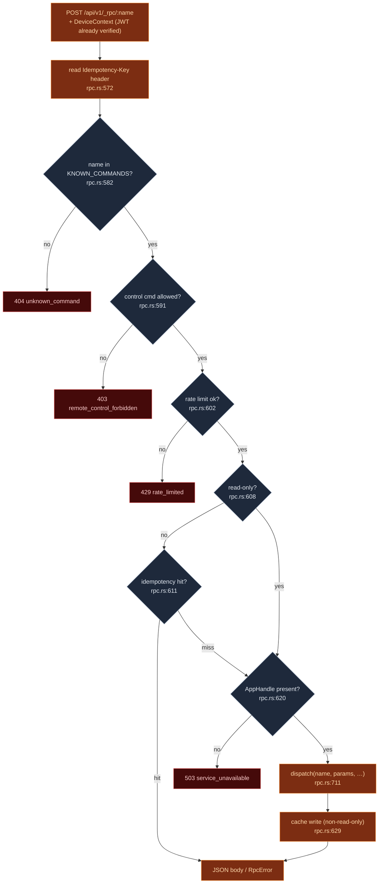

# RPC Command Manifest

<Status variant="beta" />

<TLDR>
  Every phone command is `POST /api/v1/_rpc/<name>`, handled by `rpc_handler` (`rpc.rs:565`). The
  name must be in `KNOWN_COMMANDS` — a hand-written `&[&str]` of **110** entries (`rpc.rs:163`) — or
  the request is `404`. The handler then runs a control-capability gate, a per-device token-bucket
  rate limiter (`rpc.rs:602`), and an idempotency-cache lookup, before calling the one big
  `dispatch` match (`rpc.rs:711`). `dispatch` is shared verbatim with the WebRTC DataChannel path, so
  a command is written exactly once and reachable over both transports. Tauri `State`/`AppHandle`
  ergonomics, which IPC injects automatically, are pulled manually per-arm with `app.state()`.
</TLDR>

<StatGrid>
  <Stat label="Allowlisted commands" value="110" hint="KNOWN_COMMANDS — rpc.rs:163" />
  <Stat label="Read-only (skip cache)" value="set" hint="READ_ONLY_COMMANDS — rpc.rs:333" />
  <Stat label="Control-gated" value="set" hint="CONTROL_COMMANDS — rpc.rs:408" />
  <Stat label="Rate limit" value="60 / min" hint="10 burst, per device — rate_limit.rs:51" />
  <Stat label="Idempotency TTL" value="60 s" hint="cap 1000 — idempotency.rs:58" />
</StatGrid>

## Why hand-written

[ADR-0013](../../adr/0013-command-manifest) chose a hand-written allowlist over macro generation for
three reasons that still hold:

1. **The allowlist *is* the API.** Every command a phone can call is one searchable list; nothing is
   exposed by accident. A reviewer reads ~110 lines, not 200 command bodies.
2. **Per-command shape control.** On the IPC path, Tauri injects `tauri::State` and `AppHandle`
   ergonomically; on the HTTP path those must be bound by hand. Each dispatch arm does its own
   `app.state()` lookup.
3. **It is verified, not generated.** `spec_parity.rs` asserts the allowlist and the OpenAPI spec
   stay one-to-one in both directions, but neither is generated from the other — a change is a
   deliberate edit in two places, caught by the test if you forget one.

## The handler pipeline

`rpc_handler` (`rpc.rs:565`) runs a fixed gauntlet before any dispatch:



The order matters: the rate limiter sits **after** the JWT middleware (so `device_id` exists) and the
control gate, but **before** the idempotency lookup — a cache hit must not burn a token
(`rpc.rs:599` comment).

## The three command sets

| Set | Where | Purpose |
| --- | --- | --- |
| `KNOWN_COMMANDS` | `rpc.rs:163` (ends `:321`) | the 110-name allowlist; `known_commands()` accessor at `:327` |
| `READ_ONLY_COMMANDS` | `rpc.rs:333` (ends `:390`) | structurally idempotent reads; skip the idempotency cache entirely (`is_read_only` at `:608`) |
| `CONTROL_COMMANDS` | `rpc.rs:408` (ends `:461`) | elevated session-control verbs; `is_control_command()` at `:464`, gated by the [control allow-list](./server-and-auth#revocation-deny-list-and-control-allow-list) |

A fourth, narrower allowlist — `APP_SETTINGS_MOBILE_ALLOWED_KEYS` (`rpc.rs:490`, accessor `:548`) —
restricts which settings keys `app_settings_update` may patch from a phone, so a paired device cannot
flip arbitrary desktop settings.

## Command groups

The 110 commands fall into recognizable families. A representative sample, with the dispatch-arm
line:

| Group | Examples (verbatim names) |
| --- | --- |
| Chat session | `claude_send` (`:742`) · `claude_interrupt` (`:753`) · `claude_approve` (`:762`) · `claude_close_session` (`:782`) · `claude_sidecar_status` (`:791`) |
| Provider / OAuth env | `claude_set_api_key` (`:818`) · `claude_set_oauth_bearer` (`:809`) · `claude_set_provider_env` (`:825`) · `claude_restart_sidecar` (`:845`) |
| Skills / MCP | `skills_scan_native` (`:878`) · `skills_load_registry` (`:888`) · `mcp_server_status` (`:923`) · `test_mcp_server` (`:1192`) |
| Sync / push | `sync_list_tables` (`:968`) · `sync_pull` (`:986`) · `register_push_token` (`:931`) · `revoke_push_token` (`:962`) |
| Messages / sessions | `message_update` (`:1018`) · `message_delete` (`:1028`) · `session_list` (`:1037`) · `message_get_by_session` (`:1047`) · `message_send` (`:1057`) |
| Source control | `git_is_repo` (`:1212`) … `git_merge_abort` (`:1467`) |
| Filesystem | `read_text_file` (`:1480`) · `write_text_file` (`:1488`) · `fs_search_workspace` (`:1512`) · `fs_write_workspace_file` (`:1536`) |
| Terminal | `terminal_list_all` (`:1552`) · `terminal_kill` (`:1565`) · `terminal_exec` (`:1572`) |
| Plugins | `plugin_list` (`:1588`) · `plugin_install` (`:1603`) · `plugin_install_from_github` (`:1617`) |
| Control (gated) | `session_attach` · `goal_pause` · `automation_consent_respond` (`:1136`) · `app_settings_update` (`:1158`, key-allowlisted) |

Many mutating commands collapse into a single OR-pattern arm (`rpc.rs:1072-1116`) that routes through
the [desktop-writes bridge](./data-plane-bridges) — `character_upsert`, `workflow_create`, `twin_*`,
`backup_*`, and friends all share one bridge path rather than 40 hand-written arms.

## State injection

`dispatch` (`rpc.rs:711`) takes `app: &tauri::AppHandle`; each arm that needs a managed state pulls it
explicitly with `use tauri::Manager as _` (`rpc.rs:718`):

```rust
let sidecar_state: tauri::State<'_, SidecarState> = app.state();   // rpc.rs:746
let api_key_state: tauri::State<'_, ApiKeyState> = app.state();    // rpc.rs:811
let mcp_state: tauri::State<'_, McpServerState> = app.state();     // rpc.rs:924
let terminal_state: tauri::State<'_, TerminalState> = app.state(); // rpc.rs:1553
```

This is the "shim" ADR-0013 refers to: the IPC macro would inject these automatically, but on the HTTP
path the arm does it by hand. The fallthrough arm returns `RpcError::unknown_command` (`rpc.rs:1665`).

## Idempotency

`IdempotencyCache` (`idempotency.rs`) keys cached responses by the tuple `(device_id, Idempotency-Key)`
into a `HashMap` (`idempotency.rs:38`). The TTL and capacity are literals inside `new()` —
`with_capacity(1_000, Duration::from_secs(60))` (`idempotency.rs:58`):

```text
POST /api/v1/_rpc/character_upsert
Authorization: Bearer <device-jwt>
Idempotency-Key: <client-uuid>
{ ...args... }
```

`get` (`idempotency.rs:75`) returns the cached body if present and unexpired (lazy expiry on read);
`put` (`idempotency.rs:93`) overwrites in place and evicts oldest-first at capacity. Read-only
commands never enter the cache — re-running them is cheap and structurally safe.

## Rate limiting

`rate_limit.rs` is an in-house **token bucket** with fractional refill (`Bucket { tokens: f64,
last_refill: Instant }`, `rate_limit.rs:26`). The default config — `capacity: 10.0`, `refill_per_sec:
1.0` (`rate_limit.rs:51-53`) — is **60 rpm with a 10-request burst**, bucketed by `device_id`
(`rate_limit.rs:60,92`). `check_at` (`rate_limit.rs:89`) refills proportionally to elapsed wall-clock,
deducts one token on `Accept`, and on `Reject` returns a `retry_after` ceiled to whole seconds (min 1s).
This is the **per-device** limiter, distinct from the per-IP pre-auth limiter on the pairing routes.

## Error envelope

All failures share `RpcError { code, message }` (`rpc.rs:69`):

```json
{ "code": "unknown_command",          "message": "..." }  // 404
{ "code": "malformed_request",        "message": "..." }  // 400
{ "code": "validation_failed",        "message": "..." }  // 400
{ "code": "remote_control_forbidden", "message": "..." }  // 403
{ "code": "rate_limited",             "message": "..." }  // 429
{ "code": "service_unavailable",      "message": "..." }  // 503
{ "code": "internal_error",           "message": "..." }  // 500
```

Helpers: `unknown_command` (`rpc.rs:83`), `malformed` (`:93`), `service_unavailable` (`:100`),
`internal` (`:107`), `forbidden` (`:119`), `rate_limited` (`:129`), `validation_failed` (`:146`).

## OpenAPI parity

`spec_parity.rs` is a test-only module that pins the allowlist to the published OpenAPI document
(`include_str!("../../../docs/api/mobile-companion-api.openapi.yaml")`, `spec_parity.rs:21`). It
asserts two invariants:

- **Forward** — every `KNOWN_COMMANDS` entry has a `/api/v1/_rpc/<name>` path in the spec
  (`spec_parity.rs:49`).
- **Reverse** — every spec-listed RPC path has a dispatch arm (`spec_parity.rs:98`).

So adding a command without documenting it (or vice-versa) fails CI.

## Related pages

<Cards>
  <Card title="Data plane & WebView bridges" href="./data-plane-bridges" description="How the mutating commands actually read/write Dexie data that lives in the WebView." />
  <Card title="WebRTC signaling plane" href="./signaling-webrtc" description="The DataChannel path that reuses this exact dispatch." />
  <Card title="Mobile: transport layer" href="../../ui/mobile-architecture/transport-layer" description="The client side — how CompanionTransport builds these _rpc requests and mints Idempotency-Keys." />
</Cards>
