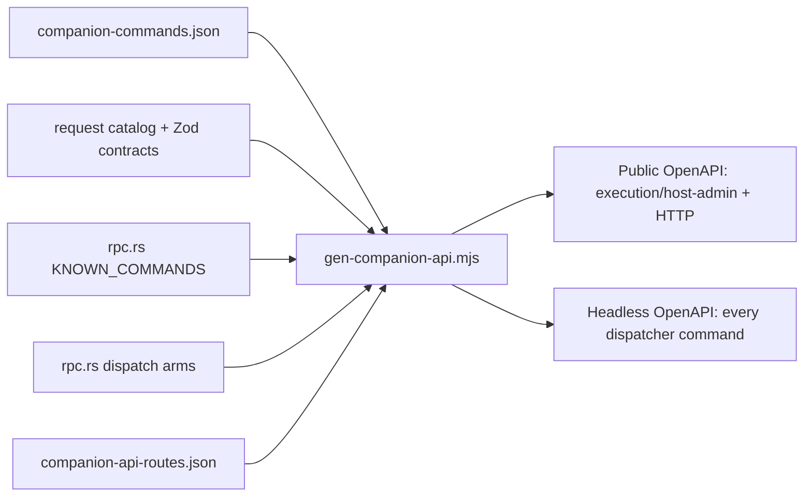

# RPC Command Manifest

<Status variant="beta" />

<TLDR>
  RPC dispatch is mounted once per trust boundary: `POST /api/_rpc/{name}` for paired devices and
  `POST /internal/_rpc/{name}` for the local Headless Brain. `KNOWN_COMMANDS` remains the runtime
  allowlist, while `protocol/companion-commands.json` supplies target, transport, capability, risk,
  approval, idempotency, and schema metadata. The generator intersects those sources instead of
  maintaining a third hand-written OpenAPI command list.
</TLDR>

<StatGrid>
  <Stat label="Runtime dispatcher" value="generated" hint="KNOWN_COMMANDS" />
  <Stat label="Public device subset" value="generated" hint="execution/host-admin + HTTP" />
  <Stat label="Manifest schema" value="v2" hint="protocol/companion-commands.json" />
  <Stat label="Generated specs" value="2" hint="public device + Headless service" />
</StatGrid>

## Classification



A command appears in the public device specification only when all conditions hold:

1. the Rust dispatcher accepts the command;
2. the manifest has a descriptor for it;
3. its target is `execution` or `host-admin`;
4. its transports include `http`.

Service and client-only descriptors are excluded even if similarly named code exists. The Headless
spec includes every dispatcher command because it is protected by a loopback-only service token.

## Request shape

Concrete generated paths make command discovery and parity review possible, while the runtime uses
the wildcard handler:

```http
POST /api/_rpc/session_list HTTP/1.1
Authorization: DPoP <access-token>
DPoP: <signed-proof>
Content-Type: application/json

{
  "limit": 20,
  "offset": 0
}
```

The Headless equivalent is `/internal/_rpc/session_list` with
`Authorization: Bearer <service-token>`. Descriptor policy still applies; the internal plane does
not erase command-level validation, idempotency, or approval rules.

The generator resolves each generic manifest input from the explicit request catalog, a recursive
Zod contract, or the direct Rust dispatch arm. `x-cognia-request-schema-source` records `contract`,
`zod-contract`, `runtime-inferred`, or `manifest`. A coverage gate rejects generic fallbacks,
arrays without `items`, and unconstrained objects that would create Apifox placeholder fields.

## Updating the contract

When a dispatcher or descriptor changes, regenerate and validate both specs:

```bash
pnpm companion-api:gen
pnpm companion-api:check
pnpm companion-api:lint
```

`companion-api:check` fails on generated drift. `spec_parity.rs` then checks both directions at the
Rust layer: every expected command must have a concrete generated path, and every concrete path must
exist in the matching runtime set.

Do not manually add a service command to the public YAML. Change the descriptor only when the trust
and transport semantics genuinely changed, then let the generator update the artifact.
