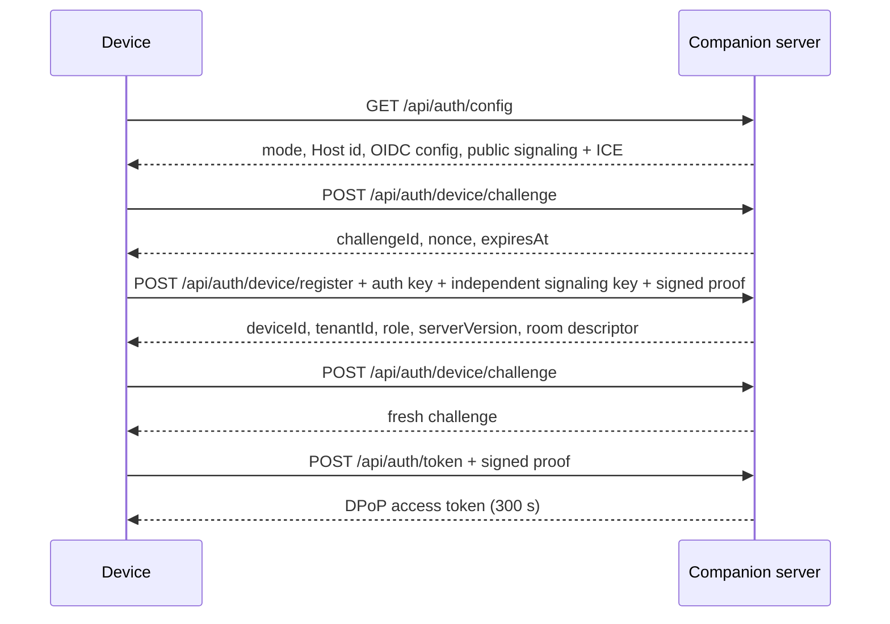

# Server & Authentication

<Status variant="beta" />

<TLDR>
  The canonical device API no longer treats a long-lived bearer token as the normal credential.
  A device registers a public key, signs a one-minute challenge, exchanges it for a five-minute
  DPoP-bound access token, and mints a 60-second single-use ticket for each WebSocket connection.
  Headless mode uses a separate loopback-only service token and never enters the device flow.
</TLDR>

## Listener boundary

The desktop-managed Companion listener uses loopback unless LAN access is enabled. The standalone
`cognia-server serve` entry point binds `0.0.0.0:27890` for deployment use; the development launcher
adds `--bind-loopback` when `pnpm dev:headless --local-debug` is selected. TLS is terminated in Rust,
request bodies are bounded, and middleware classifies the request before it reaches a handler.

| Route family | Credential |
| --- | --- |
| `/healthz`, `/livez`, `/readyz`, agent card | None |
| `GET /api/auth/config` | None; deployment-safe discovery only |
| `/api/auth/device/challenge`, `/api/auth/device/register` | Signed device challenge plus invitation or configured OIDC authority |
| `/api/auth/token` | Registered device signature over the challenge |
| Canonical `/api/*` | `Authorization: Bearer <access-token>` plus matching `DPoP` proof header |
| Canonical `/ws/*` | Path-bound ticket from `POST /api/auth/socket-ticket` |
| `/internal/*`, `/ide/content*` | Loopback service token |

## Device bootstrap



The `cgnp3` payload declares either `owner-invitation` or `oidc`. Only the former contains a one-time
invitation. Managed mode validates Logto issuer, resource/audience, Web client, and organization
before registering the device. Authentication and signaling private keys remain in Browser Vault or
system secure storage; the target book contains only public metadata.

## Calling canonical HTTP routes

Each protected request sends the five-minute access token and a signed proof bound to its token
identifier, HTTP method, and request path:

```http
POST /api/_rpc/session_list HTTP/1.1
Authorization: Bearer eyJ…
DPoP: eyJ…
Content-Type: application/json

{}
```

High-risk commands also follow the capability, approval, rate-limit, and idempotency policy stored
in `protocol/companion-commands.json`.

## WebSocket tickets

Call `POST /api/auth/socket-ticket` with a valid DPoP request and the target channel. The returned
ticket expires after 60 seconds, is single-use, and is bound to the intended socket path. Pass it as
the `ticket` query parameter; never put the DPoP access token in a WebSocket URL.

## Breaking-upgrade policy

The server mounts only the unversioned canonical routes. A target record without a P-256 device key
is invalidated and shown as requiring a fresh `cgnp3` pairing; long-lived bearer device JWTs are not
accepted or migrated.

## Developer credentials

For renderer-free local debugging, prefer automatic process-scoped authentication:

```bash
pnpm dev:headless --local-debug --skip-build
```

The launcher forces a loopback bind and writes a temporary Apifox/Postman environment. It does not
disable authentication. Use `pnpm --silent dev:headless token` only when a 24-hour service JWT is
required across restarts. See [Headless service plane](./headless-service-plane).
