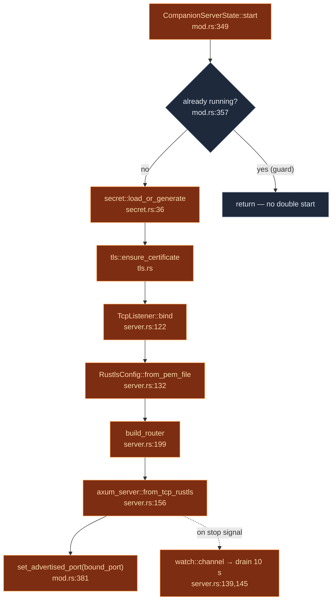
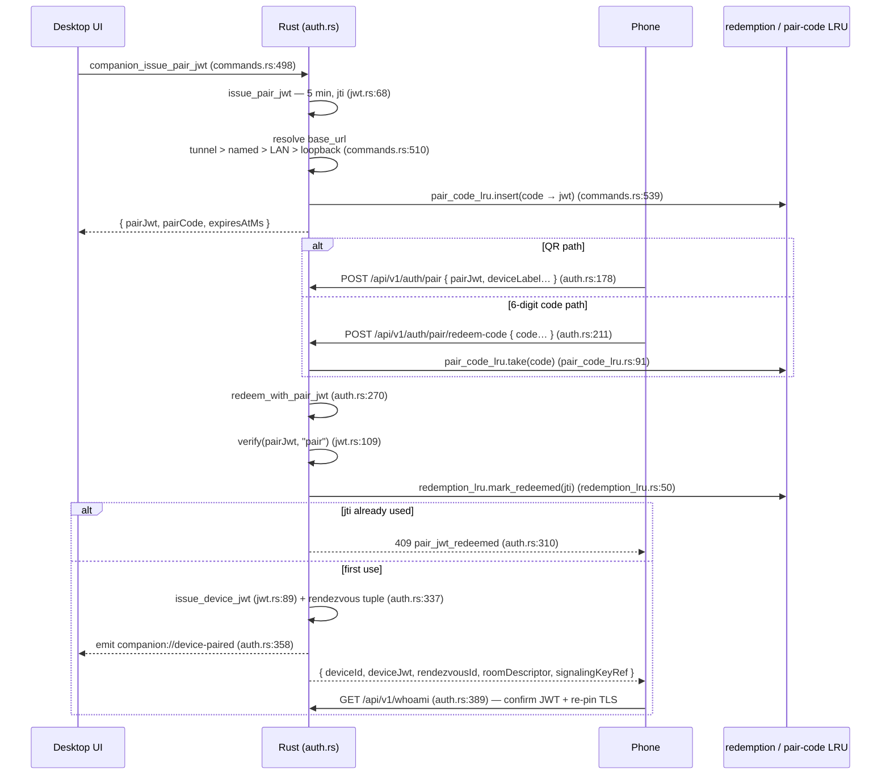

# Server & Authentication

<Status variant="beta" />

<TLDR>
  `CompanionServerState::start` (`mod.rs:349`) loads the HS256 signing secret, builds the shared
  state, and calls `spawn_server` (`server.rs:108`), which binds a TCP socket (loopback or
  `0.0.0.0`), terminates Rustls TLS, and serves `build_router` with a 10-second graceful-shutdown
  drain. Two non-overlapping middleware layers protect the routes: a per-IP token bucket on the three
  pairing endpoints and a device-JWT verifier on everything else. Pairing issues a **5-minute,
  single-use** pair JWT (`jwt.rs:27`) that the phone redeems — by QR or by a 6-digit code — for a
  **90-day** device JWT (`jwt.rs:29`); replay is blocked by a 256-entry redemption LRU.
</TLDR>

<StatGrid>
  <Stat label="Default port" value="27890" hint="server.rs — DEFAULT_PORT" />
  <Stat label="Body limit" value="64 KiB" hint="server.rs:47" />
  <Stat label="Pair JWT TTL" value="5 min" hint="jwt.rs:27 — single-use" />
  <Stat label="Device JWT TTL" value="90 days" hint="jwt.rs:29" />
  <Stat label="TLS validity" value="10 years" hint="tls.rs:30 — stable key, stable fingerprint" />
  <Stat label="Pre-auth limit" value="20 / min" hint="mod.rs:203 — 5 burst, per IP" />
</StatGrid>

## Server bootstrap

`spawn_server` (`server.rs:108`) is the single entry point. The bind IP depends on the mode:
`Ipv4Addr::LOCALHOST` for `BindMode::Loopback`, `Ipv4Addr::UNSPECIFIED` (`0.0.0.0`) for `BindMode::Lan`
(`server.rs:114-118`). It binds a **synchronous** `TcpListener` first (`server.rs:122-130`) so an
OS-assigned ephemeral port (`port = 0`) can be read back and advertised, then hands the socket to
`axum_server::from_tcp_rustls` (`server.rs:156`) with `into_make_service_with_connect_info::<SocketAddr>()`
(`server.rs:165`) — that connect-info is what lets the pre-auth rate limiter see the peer IP.



### State containers

| Struct | Where | Role |
| --- | --- | --- |
| `CompanionState` | `mod.rs:92` | the axum handler state (`Arc`-wrapped as `SharedState`, `mod.rs:89`): secret, event bus, bridges, registries |
| `CompanionServerState` | `mod.rs:221` | the Tauri-managed lifecycle wrapper holding the running `ServerHandle` |
| `CompanionServerInner` | `mod.rs:274` | `handle` + `bound_port` + `bind_mode` |
| `BindMode` | `mod.rs:287` | `Loopback` \| `Lan` |
| `ServerHandle` | `server.rs:60` | `bound_port` + `shutdown` sender |

A handful of process-global singletons live in `mod.rs`: the TLS fingerprint (`mod.rs:160`), the
advertised port (`mod.rs:176`), the push dispatcher set (`mod.rs:148`), and the **pre-auth** rate
limiter (`mod.rs:199`, configured `capacity: 5.0`, `refill: 20.0/60.0` at `mod.rs:202-203`).

## The middleware stack

The two layers are registered in `build_router` but applied to different sub-routers, so they never
both run on the same request.

### Pre-auth rate limit — `pre_auth_rate_limit` (`middleware.rs:201`)

Guards only the pairing routes (`server.rs:216`). It extracts the peer IP from `ConnectInfo<SocketAddr>`
(`middleware.rs:202`), **short-circuits loopback** (`middleware.rs:212-214` — same-machine debugging is
never throttled), then checks the per-IP token bucket. A reject returns `429 { "code": "rate_limited" }`
with a `Retry-After` header (`middleware.rs:219-233`).

### Device JWT — `require_device_jwt` (`middleware.rs:79`)

Guards `whoami` / `_rpc` / both WebSockets (`server.rs:239-242`). The sequence:

<Steps>
<Step>
**Extract the token** — `Authorization: Bearer <jwt>` (`middleware.rs:85-90`), falling back to the
`?token=` query string for WebSockets (`middleware.rs:92-96`); the header wins when both are present
(`middleware.rs:99`). Neither → `401 missing_authorization`.
</Step>
<Step>
**Verify** — `verify(secret, token, "device")` (`middleware.rs:111` → `jwt.rs:109`). The error maps
to a specific code: `WrongScope` → `wrong_scope`, expired → `expired_token`, otherwise
`invalid_signature` (`middleware.rs:113-124`).
</Step>
<Step>
**Extract `device_id`** from the claims, or `401 malformed_token` (`middleware.rs:127-135`).
</Step>
<Step>
**Deny-list gate** — `deny_list.is_revoked(device_id)` → `401 device_revoked`
(`middleware.rs:138-140` → `deny_list.rs:73`).
</Step>
<Step>
**Inject `DeviceContext`** into request extensions (`middleware.rs:143-146`), run the handler, then
**best-effort emit** `companion://device-seen` with `{ device_id, seen_at_ms }` (`middleware.rs:152-164`)
so the desktop UI can show last-seen times.
</Step>
</Steps>

Both layers use the same flat error envelope — `{ code, message }` (`middleware.rs:174`, mirrored in
`auth.rs:410`).

## JWT scopes

```rust title="src-tauri/src/companion_api/jwt.rs"
const PAIR_TTL_SECS: i64 = 5 * 60;             // jwt.rs:27  — 5 minutes, single-use
const DEVICE_TTL_SECS: i64 = 90 * 24 * 3600;   // jwt.rs:29  — 90 days
```

`Claims` (`jwt.rs:37`) carries `scope` (`"pair"` or `"device"`), `iat`, `exp`, an optional `jti`
(only on pair tokens, for single-use tracking), and an optional `device_id` (only on device tokens).
`verify` (`jwt.rs:109`) uses HS256 with **zero leeway** (`jwt.rs:112`), `validate_exp`, and a required
`exp` claim. The two issue functions are `issue_pair_jwt` (`jwt.rs:68`, mints a fresh UUIDv4 `jti`)
and `issue_device_jwt` (`jwt.rs:89`).

The signing secret is a single 32-byte value persisted in the OS keyring under service
`"com.cognia.companion/v1"`, account `"signing-key"` (`secret.rs:21-22`), via `load_or_generate`
(`secret.rs:36`). Rotating it (`secret.rs:55`) invalidates every issued token at once.

## The pairing pipeline

Pairing is the only moment bilateral identity is established. There are two redemption paths — a
scanned QR and a typed 6-digit code — that converge on one shared core, `redeem_with_pair_jwt`
(`auth.rs:270`).



### Handlers and their shapes

| Handler | Where | Request | Response |
| --- | --- | --- | --- |
| `issue_handler` | `auth.rs:119` | empty | `IssueResponse { pairJwt, expiresAtMs, pairCode, pairCodeExpiresAtMs }` (`auth.rs:49`) |
| `pair_handler` | `auth.rs:178` | `PairRequest { pairJwt, deviceLabel, devicePlatform, devicePubkey, appVersion }` (`auth.rs:81`) | `PairResponse` (below) |
| `redeem_code_handler` | `auth.rs:211` | `RedeemCodeRequest { code, deviceLabel, … }` (`auth.rs:70`) | `PairResponse` |
| `whoami_handler` | `auth.rs:389` | (device JWT) | `{ device_id, server_version, tls_fingerprint }` |

`PairResponse` includes `{ deviceId, deviceJwt, serverVersion, rendezvousId,
roomDescriptor, signalingKeyRef }`. `rendezvousId` is the canonical descriptor hash. The descriptor
contains both role public keys and no secret; the host role private key is stored behind
`signalingKeyRef`. The phone-generated private key never crosses the pairing boundary. See the
[v2 WebRTC plane](./signaling-webrtc).

### Single-use enforcement

The 6-digit code (`generate_pair_code`, `auth.rs:158`, range `100_000..=999_999`) maps to the pair
JWT in `PairCodeLru` (cap 64, `pair_code_lru.rs:39`); `take` (`pair_code_lru.rs:91`) removes it on
first redemption and returns `Expired` past the underlying JWT's `exp`. The pair JWT itself is then
guarded a second time by `RedemptionLru` (cap 256 FIFO, `redemption_lru.rs:26`): `mark_redeemed(jti)`
(`redemption_lru.rs:50`) returns `false` on replay, yielding `409 pair_jwt_redeemed`. So a leaked QR
is useless after one successful pair, and useless after 5 minutes regardless.

## Revocation: deny-list and control allow-list

Two process-global sets gate an already-paired device:

- **`DenyList`** (`deny_list.rs`) — revoked device IDs. `revoke` / `unrevoke` / `is_revoked` /
  `seed` (`deny_list.rs:52-82`); checked on every protected request (`middleware.rs:138`). The
  desktop seeds it from Dexie at startup and on every revoke from the Settings UI. A 1000-entry
  threshold logs a warning but is not a hard cap (`deny_list.rs:27`).
- **`ControlAllowList`** (`control_allow_list.rs:35`) — the *opt-in* set of devices allowed to call
  session-control verbs (`session_attach`, `goal_pause`, `automation_consent_respond`, …;
  `control_allow_list.rs:3-11`). `allow` / `disallow` / `is_allowed` / `reseed` (`control_allow_list.rs:59-80`).
  Enforced in `rpc_handler` (`rpc.rs:591`) and again in `dispatch` (`rpc.rs:724`).

Both are mirrored from Dexie via Tauri commands — `companion_seed_deny_list` (`commands.rs:257`),
`companion_revoke_device` (`commands.rs:282`), `companion_set_remote_control` (`commands.rs:309`),
`companion_seed_remote_control` (`commands.rs:323`).

## TLS: self-signed, pinned, stable

`tls::ensure_certificate` generates a **10-year** (`tls.rs:30`) self-signed certificate with `rcgen`
on first launch, common name `"cognia-companion"` (`tls.rs:29`), persisted to
`<data_dir>/cognia/companion/tls.pem` + `tls.key` (`tls.rs:27-28,57`). It computes the SHA-256 of the
SubjectPublicKeyInfo and exposes it as the fingerprint (`mod.rs:160`). Because the **key is reused**
across re-signs, the fingerprint is stable — the phone pins it once at pairing and never needs to
re-pair. Desktop browsers visiting the URL still see a warning; only the phone's pinning path treats
it as trusted. See [Discovery, tunnel & TLS](./discovery-tunnel) for the fingerprint delivery path.

## Known limitations

- **Single signing key, process scope.** Multi-account / multi-vault would require a service-name
  bump (`com.cognia.companion/v2`). Rotating the key re-pairs every device.
- **Pre-auth limiter is per-IP, not per-device.** It exists only to slow brute-forcing the pairing
  endpoints; loopback is exempt entirely.
- **`store.rs` is not on the live path.** The `AppStore` / `SqliteAppStore` abstraction (`store.rs`)
  is the headless-mode persistence layer ([data plane](./data-plane-bridges)); the Tauri desktop
  build always uses the WebView bridges, not the SQLite store.

## Related pages

<Cards>
  <Card title="RPC command manifest" href="./rpc-manifest" description="What a paired device can actually call once it holds a device JWT." />
  <Card title="WebRTC signaling plane" href="./signaling-webrtc" description="Where the rendezvous tuple from pairing is used." />
  <Card title="Mobile: discovery & pairing" href="../../ui/mobile-architecture/discovery-pairing" description="The client half of this flow — QR scan, code entry, TLS pinning." />
</Cards>
