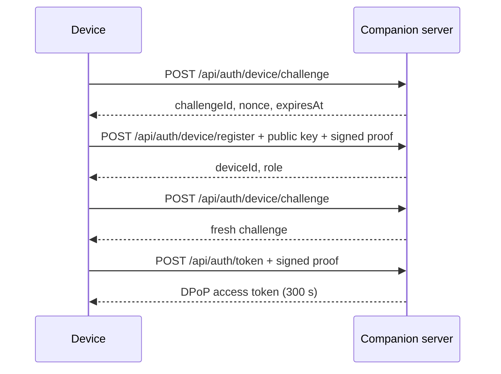

# Server & Authentication

<Status variant="beta" />

<TLDR>
  The canonical device API no longer treats a long-lived bearer token as the normal credential.
  A device registers a public key, signs a one-minute challenge, exchanges it for a five-minute
  DPoP-bound access token, and mints a 60-second single-use ticket for each WebSocket connection.
  Headless mode uses a separate loopback-only service token and never enters the device flow.
</TLDR>

## Listener boundary

The desktop-managed Companion listener uses loopback unless LAN access is enabled. The standalone
`cognia-server serve` entry point binds `0.0.0.0:27890` for deployment use; the development launcher
adds `--bind-loopback` when `pnpm dev:headless --local-debug` is selected. TLS is terminated in Rust,
request bodies are bounded, and middleware classifies the request before it reaches a handler.

| Route family | Credential |
| --- | --- |
| `/healthz`, `/livez`, `/readyz`, agent card | None |
| `/api/auth/device/challenge`, `/api/auth/device/register` | Signed device challenge plus invitation or configured OIDC authority |
| `/api/auth/token` | Registered device signature over the challenge |
| Canonical `/api/*` | `Authorization: DPoP <access-token>` plus matching `DPoP` proof header |
| Canonical `/ws/*` | Path-bound ticket from `POST /api/auth/socket-ticket` |
| `/internal/*`, `/ide/content*` | Loopback service token |
| Explicit `/api/v1/*`, `/ws/v1/*` | Deprecated released-client device JWT compatibility |

## Device bootstrap



Registration requires an invitation in single-user mode or the configured identity authority in
managed mode. A developer cannot bypass this boundary by presenting a Headless service token to a
public route.

## Calling canonical HTTP routes

Each protected request sends the five-minute access token and a signed proof bound to its token
identifier, HTTP method, and request path:

```http
POST /api/_rpc/session_list HTTP/1.1
Authorization: DPoP eyJ…
DPoP: eyJ…
Content-Type: application/json

{}
```

High-risk commands also follow the capability, approval, rate-limit, and idempotency policy stored
in `protocol/companion-commands.json`.

## WebSocket tickets

Call `POST /api/auth/socket-ticket` with a valid DPoP request and the target channel. The returned
ticket expires after 60 seconds, is single-use, and is bound to the intended socket path. Pass it as
the `ticket` query parameter; never put the DPoP access token in a WebSocket URL.

## Compatibility policy

The released v1 mobile client still uses a long-lived device JWT. The server therefore mounts only
the explicit compatibility routes documented in the public OpenAPI spec, including
`POST /api/v1/_rpc/{name}`, `GET /ws/v1/events`, and `GET /ws/v1/terminal`. They are marked
`deprecated` and must not be copied into new clients. Once the released client completes DPoP
onboarding, these aliases can follow the normal deprecation and removal process.

## Developer credentials

For renderer-free local debugging, prefer automatic process-scoped authentication:

```bash
pnpm dev:headless --local-debug --skip-build
```

The launcher forces a loopback bind and writes a temporary Apifox/Postman environment. It does not
disable authentication. Use `pnpm --silent dev:headless token` only when a 24-hour service JWT is
required across restarts. See [Headless service plane](./headless-service-plane).
