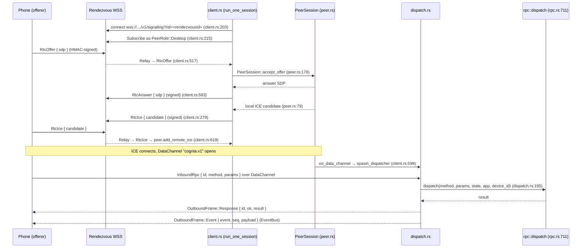

# WebRTC Signaling Plane

<Status variant="beta">beta · M-RTC</Status>

<TLDR>
  When a phone is on cellular — no LAN, no tunnel — it reaches the desktop over a **WebRTC
  DataChannel** instead of HTTPS ([ADR-0021](../../adr/0021-webrtc-datachannel-wan-transport)). The
  desktop is the **answerer**: `SignalingHub` (`signaling/mod.rs:108`) keeps one long-lived WSS client
  (`signaling/client.rs`) per paired device connected to a public rendezvous worker; when the phone's
  offer arrives, the client builds a `webrtc-rs` `PeerSession` (`signaling/peer.rs:64`), answers, and
  on DataChannel open spawns a pump (`signaling/dispatch.rs`) that routes inbound JSON-RPC through the
  **same** `rpc::dispatch` as HTTP and streams EventBus frames back. Every relayed envelope is
  HMAC-SHA256-signed with the pairing `rendezvous_secret` over canonical JSON and replay-checked.
</TLDR>

<StatGrid>
  <Stat label="DataChannel label" value="cognia.v1" hint="peer.rs:32 — ordered" />
  <Stat label="Desktop role" value="answerer" hint="phone is offerer" />
  <Stat label="Replay window" value="256" hint="per (role,seq)+(role,nonce) — envelope.rs:38" />
  <Stat label="Clock skew" value="±5 min" hint="envelope.rs:35" />
  <Stat label="Device tiers" value="5" hint="Offline/Awaiting/Negotiating/Connected/Failed" />
</StatGrid>

## Why a brokered DataChannel

LAN + mDNS works at home; a Cloudflared tunnel works when the user sets one up. Neither works for a
phone on cellular behind carrier NAT reaching a desktop behind home NAT. WebRTC solves NAT traversal
with ICE, but the two peers still need a **rendezvous** to exchange SDP offers/answers and ICE
candidates. Cognia hosts a tiny, untrusted relay (`signaling.cognia.cn`, the [signaling
server](../../ui/mobile-architecture/webrtc-transport#the-rendezvous-server)) that only forwards opaque,
HMAC-signed envelopes — it never sees plaintext or holds a credential.

## Module map

| Module | Role | Entry |
| --- | --- | --- |
| `signaling/mod.rs` | `SignalingHub` — process-wide registry, one client task per device, tier FSM, Tauri commands | `SignalingHub::new` (`:108`) |
| `signaling/client.rs` | long-lived rendezvous WSS client: subscribe, receive offer, build peer, relay answer/ICE, reconnect | `run_one_session` (`:194`) |
| `signaling/peer.rs` | `webrtc-rs` `RTCPeerConnection` answerer wrapper, fans callbacks to mpsc | `PeerSession::new` (`:64`) |
| `signaling/dispatch.rs` | DataChannel ↔ `rpc::dispatch` + EventBus pump | `spawn` (`:81`), inbound route (`:195`) |
| `signaling/envelope.rs` | canonical-JSON + HMAC-SHA256 sign/verify + replay LRU | `build_signed_envelope` (`:197`), `verify_signed_envelope` (`:234`) |

## The connection sequence



## The hub & client

`SignalingHub` (`mod.rs:108`) is a process-global registry. `companion_signaling_sync_devices`
(`mod.rs:589`) pushes the current paired-device list (each with its `rendezvousId` +
`rendezvousSecret`) from the WebView; the hub spawns or reaps one `client.rs` task per device.
`companion_signaling_configure` (`mod.rs:600`) sets the signaling URL and ICE servers — the default
is `DEFAULT_SIGNALING_URL = "wss://signaling.cognia.cn/v1/signaling"` (`mod.rs:51`) with Google +
Cloudflare STUN (`default_ice_servers`, `mod.rs:58`). Status commands: `companion_signaling_status`
(`mod.rs:617`), `companion_signaling_devices_status` (`mod.rs:633`), `companion_signaling_reconnect_device`
(`mod.rs:644`).

Each `client.rs` task (`run_one_session`, `:194`) connects out to the rendezvous, appends `?rid=` for
the worker's room routing (`append_rid`, `:203`), subscribes as `PeerRole::Desktop` (`:215`), and
handles relayed frames in a match (`:509-648`):

| Envelope kind | Handling | Where |
| --- | --- | --- |
| `RtcOffer` | reuse live peer on ICE-restart, else build a fresh `PeerSession`; reply `RtcAnswer` | `client.rs:517-609` |
| `RtcIce` | parse `body.candidate` → `add_remote_ice` | `client.rs:619-635` |
| `RtcClose` | tear down peer + dispatcher, tier → `Awaiting` | `client.rs:636-648` |
| `RtcAnswer` | desktop is always answerer → unexpected, log + drop | `client.rs:610-618` |
| `Hello` | log only | `client.rs:510-516` |

Reconnect backoff is `[1, 2, 4, 8, 16, 30, 60] s` (`client.rs:46`); a keepalive `Ping` goes out every
25 s (`client.rs:243`).

## The peer & the pump

`PeerSession` (`peer.rs:64`) wraps a `webrtc-rs` `RTCPeerConnection` configured as the answerer.
`accept_offer` (`peer.rs:176`) does `set_remote_description` → `create_answer` →
`set_local_description` and returns the answer SDP. The DataChannel label is pinned to
`DATACHANNEL_LABEL = "cognia.v1"` (`peer.rs:32`) and enforced in `on_data_channel` (`peer.rs:113-119`)
— a channel with any other label is ignored. Local ICE candidates fan out through an mpsc
(`peer.rs:79-93`), which `client.rs` wraps in signed `RtcIce` envelopes.

On first DataChannel open, `client.rs` calls `spawn_dispatcher(peer, data_rx, state, app, device_id)`
(`client.rs:599` → `dispatch.rs:81`). The pump:

- decodes `InboundRpc { id, method, params, idempotencyKey }` (`dispatch.rs:31`),
- routes it through `crate::companion_api::rpc::dispatch(method, params, state, app, device_id)`
  (`dispatch.rs:195`) — the identical entry point HTTP uses, so `CONTROL_COMMANDS` and idempotency
  (keyed `(device_id, key)`, `dispatch.rs:179`) apply unchanged,
- and emits `OutboundFrame::{Response, Event}` (`dispatch.rs:46-76`), the `Event` variant draining the
  same EventBus the WebSocket uses.

## The signed envelope

`signaling/envelope.rs` is the security boundary: the rendezvous relay is untrusted, so every frame is
authenticated end-to-end with the 32-byte `rendezvous_secret` minted at pairing.

- **Canonical JSON** keeps the bytes byte-identical to the TS twin
  ([`lib/signaling/envelope.ts`](../../ui/mobile-architecture/webrtc-transport#the-typescript-twin)) — sorted
  keys, integer-only numbers.
- **Sign** — `build_signed_envelope` (`:197`) drafts the envelope with an empty MAC, then HMAC-SHA256s
  the canonical bytes.
- **Verify** — `verify_signed_envelope` (`:234`) checks version, the `±5 min` clock-skew window
  (`REPLAY_CLOCK_SKEW_MS`, `:35`), and a constant-time MAC compare.
- **Replay** — `ReplayWindow::observe` (`:308`) tracks the last 256 (`REPLAY_LRU_CAPACITY`, `:38`)
  `(role, seq)` and `(role, nonce)` pairs per role, rejecting duplicates. A cross-implementation MAC
  test pin (`:374`) keeps Rust and TS from drifting.

## The device tier FSM

The hub publishes a per-device connection tier so the UI can show the transport in use:

```text
DeviceTier::{ Offline, Awaiting, Negotiating, Connected, Failed }   // mod.rs:493
```

`TierWriter` (`mod.rs:539`) pushes transitions; a reconnect throttle of `5 s`
(`RECONNECT_DEVICE_MIN_SPACING`, `mod.rs:44`) prevents flapping. On the client these map to the
`rtc-direct` / `rtc-relay` transport tiers shown in the [mobile transport
layer](../../ui/mobile-architecture/transport-layer#transport-tiers).

## Related pages

<Cards>
  <Card title="Server & authentication" href="./server-and-auth" description="Where the rendezvousId + rendezvousSecret tuple is minted, during pairing." />
  <Card title="Mobile: WebRTC transport" href="../../ui/mobile-architecture/webrtc-transport" description="The client offerer, the TS envelope twin, and the Cloudflare-Worker rendezvous server." />
  <Card title="RPC command manifest" href="./rpc-manifest" description="The dispatch the DataChannel pump reuses verbatim." />
</Cards>
