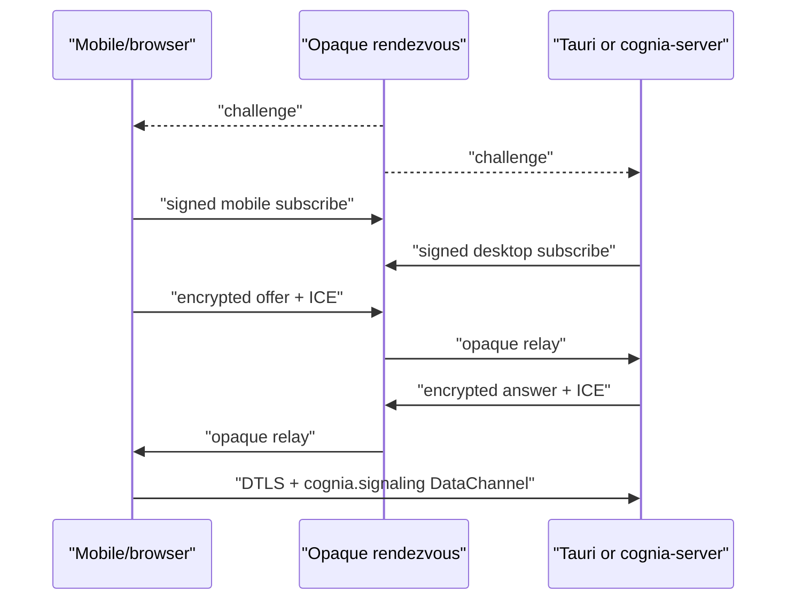

# Relay, WebRTC signaling and DataChannel

The same answerer runs in Tauri and in a freshly started `cognia-server`; it
does not depend on a renderer being present. Since ADR-0170 the rendezvous is
also the WAN transport: a session is open the moment both peers have said
`hello` over the relay, and the DataChannel is an upgrade negotiated on top.

## Components

| Module | Responsibility |
| --- | --- |
| `signaling/mod.rs` | `SignalingHub`, per-device task lifecycle, pairing rooms, configuration and recovery |
| `signaling/carrier.rs` | `DataCarrier`: the open DataChannel when there is one, the relay data lane otherwise |
| `signaling/pairing.rs` | Pairing rooms: a one-shot invitee key, the `pair.http` method, the four pairing routes driven in-process |
| `signaling/registration_store.rs` | SQLite source of truth for room descriptors and host key references |
| `signaling/client.rs` | challenge/subscription, encrypted SDP/ICE relay, deadlines, heartbeat and reconnect |
| `signaling/envelope.rs` | canonical fields, ECDSA/ECDH/HKDF/AES-GCM, epoch/sequence replay guard |
| `signaling/peer.rs` | `webrtc-rs` answerer and bounded ICE/DataChannel queues |
| `signaling/datachannel_framing.rs` | 32 KiB frames, 1 MiB messages, bounded chunk reassembly |
| `signaling/dispatch.rs` | RPC dispatch, durable idempotency, event resume/ack/replay/resync |

## Lifecycle

The `hello` envelope carries `relay: true` from both sides. From that frame on,
`EnvelopeKind::Data` envelopes on the `data` lane carry DataChannel frames
verbatim (RPC, `event` / `event-batch`, binary resources and their chunks) and
`dispatch.rs` consumes them through the same inbound queue. The offer, answer
and ICE exchange proceeds in the background; a DataChannel that opens promotes
the carrier and one that drops demotes it, without a reconnect and without
losing the event cursor. A Host that does not answer `relay: true` is an
older Host and the client behaves as before: DataChannel or nothing.

Pairing stores the host private role key in the native secret store and the
public `RoomDescriptor` in SQLite. Tauri imports any renderer-owned records
idempotently. Headless startup loads the same store and recreates every
answerer task before serving clients.

The server challenge is valid for five seconds. The subscribe proof binds
room, role, session, random epoch, issue time, challenge, and ephemeral P-256
ECDH public key to the role's ECDSA signature. There is one desktop and one
mobile session; a newer valid session replaces the older one.

## Pairing over the relay

An owner invitation (`cgnp4`) carries a pairing room: the rendezvous URL, a
`RoomDescriptor` whose mobile key is a one-shot P-256 key the Host just minted,
and that key's private half as a JWK. The Host sits in the room for the
invitation's lifetime. The invitee sends `pair.http` RPC frames
(`{ method, path, headers, body }`) over the data lane, and the Host answers
by calling its own axum router in-process against exactly four routes:
`/api/auth/config`, `/api/auth/device/challenge`, `/api/auth/device/register`
and `/api/auth/token`. Everything else is refused before it reaches the
router. The client probes the invitation's direct address for four seconds
first (`registerPairPayload`) and falls back to the relay path.

## Security boundary

SDP and ICE are AES-256-GCM ciphertext. Directional keys come from ephemeral
P-256 ECDH and HKDF-SHA-256. ECDSA P-256 authenticates the canonical
length-prefixed header plus ciphertext. The relay sees routing metadata but
cannot decrypt or re-label a valid sender.

The receiver rejects expired descriptors, clock-invalid frames, signature
failure, wrong roles, old epochs, duplicates, and sequence gaps outside the
bounded reorder window. No v1 parser or downgrade exists.

## Relay lane budgets

The server buckets `relay` frames by their `lane` field without decrypting
anything. The `signal` lane keeps the 20-frame bucket refilling at 10 per
second and the 8 KiB soft cap. The `data` lane has its own bucket of 256
frames refilling at 64 per second and a 64 KiB cap, which fits a 21 KiB
binary chunk after base64 and the envelope. Per-lane counters are exported as
`signaling_relay_frames_total{lane}` and `signaling_relay_bytes_total{lane}`.
Rejections keep the stable `rate_limited` and `frame_too_large` codes, and a
transport that is already open treats one dropped frame as that frame's own
timeout rather than a reason to reconnect.

## Data plane bounds

The ordered reliable `cognia.signaling` channel permits 32 concurrent RPCs. Physical
frames are capped at 32 KiB and logical messages at 1 MiB. Reassembly permits
eight messages and 4 MiB per peer with a 15-second deadline. Inbound peer
queues are bounded at 128 frames; pending ICE is bounded at 256 entries for 30
seconds and is applied only after the matching remote description.

RTC, the relay and HTTPS use the same command manifest, device rate limiter,
and durable idempotency ledger. Event consumers resume from a persistent global cursor,
ack delivered sequence numbers, and receive an explicit `resync_required`
when the 24-hour/10,000-frame replay window no longer covers the gap.

## Recovery

The signaling connection uses eight-second connect and five-second
challenge/subscribe deadlines, a 20-second heartbeat, a ten-second pong
deadline, and full-jitter bounded backoff. Negotiation state is epoch-bound so
stale async work cannot update a replacement peer. A missing mobile remains
`awaiting-peer`; it is not counted as a connection failure.
