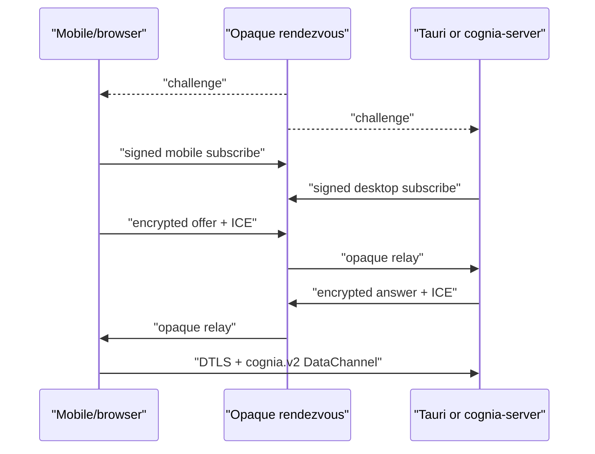

# WebRTC signaling and DataChannel

The same answerer runs in Tauri and in a freshly started `cognia-server`; it
does not depend on a renderer being present.

## Components

| Module | Responsibility |
| --- | --- |
| `signaling/mod.rs` | `SignalingHub`, per-device task lifecycle, configuration and recovery |
| `signaling/registration_store.rs` | SQLite source of truth for v2 room descriptors and host key references |
| `signaling/client.rs` | challenge/subscription, encrypted SDP/ICE relay, deadlines, heartbeat and reconnect |
| `signaling/envelope_v2.rs` | canonical fields, ECDSA/ECDH/HKDF/AES-GCM, epoch/sequence replay guard |
| `signaling/peer.rs` | `webrtc-rs` answerer and bounded ICE/DataChannel queues |
| `signaling/datachannel_framing.rs` | 32 KiB frames, 1 MiB messages, bounded chunk reassembly |
| `signaling/dispatch.rs` | RPC dispatch, durable idempotency, event resume/ack/replay/resync |

## Lifecycle

Pairing stores the host private role key in the native secret store and the
public `RoomDescriptorV2` in SQLite. Tauri imports any renderer-owned records
idempotently. Headless startup loads the same store and recreates every
answerer task before serving clients.

The server challenge is valid for five seconds. The subscribe proof binds
room, role, session, random epoch, issue time, challenge, and ephemeral P-256
ECDH public key to the role's ECDSA signature. There is one desktop and one
mobile session; a newer valid session replaces the older one.

## Security boundary

SDP and ICE are AES-256-GCM ciphertext. Directional keys come from ephemeral
P-256 ECDH and HKDF-SHA-256. ECDSA P-256 authenticates the canonical
length-prefixed header plus ciphertext. The relay sees routing metadata but
cannot decrypt or re-label a valid sender.

The receiver rejects expired descriptors, clock-invalid frames, signature
failure, wrong roles, old epochs, duplicates, and sequence gaps outside the
bounded reorder window. No v1 parser or downgrade exists.

## Data plane bounds

The ordered reliable `cognia.v2` channel permits 32 concurrent RPCs. Physical
frames are capped at 32 KiB and logical messages at 1 MiB. Reassembly permits
eight messages and 4 MiB per peer with a 15-second deadline. Inbound peer
queues are bounded at 128 frames; pending ICE is bounded at 256 entries for 30
seconds and is applied only after the matching remote description.

RTC and HTTPS use the same command manifest, device rate limiter, and durable
idempotency ledger. Event consumers resume from a persistent global cursor,
ack delivered sequence numbers, and receive an explicit `resync_required`
when the 24-hour/10,000-frame replay window no longer covers the gap.

## Recovery

The signaling connection uses eight-second connect and five-second
challenge/subscribe deadlines, a 20-second heartbeat, a ten-second pong
deadline, and full-jitter bounded backoff. Negotiation state is epoch-bound so
stale async work cannot update a replacement peer. A missing mobile remains
`awaiting-peer`; it is not counted as a connection failure.
