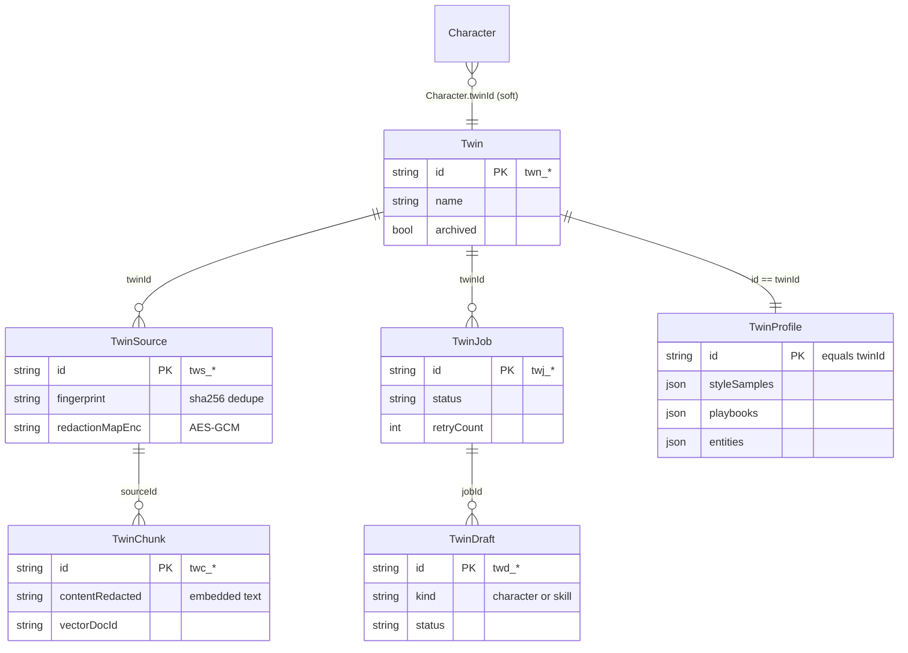

# Data model

<Status variant="stable" />

Everything in this subsystem is phrased in terms of the type model in `types/twin/index.ts` (572 lines)
and the six Dexie tables it backs. Read this page first.

## The seven type clusters



| Cluster | Key types (`types/twin/index.ts`) | Purpose |
| --- | --- | --- |
| **Sources** | `TwinSource` (L64), `TwinSourceKind` (L28), `TwinSourceFormat` (L34), `TwinSourceStatus` (L62) | Registry of every raw artifact ingested. 21 formats across document / chat / email / code families. |
| **Chunks** | `TwinChunk` (L148), `TwinChunkMetadata` (L130), `ChunkingStrategyId` (L111), `VectorBackend` (L123) | Sliced fragments + vector-store pointer (`vectorDocId`) + provenance. Holds both `content` (display) and `contentRedacted` (embedded). |
| **Profile** | `TwinProfile` (L270), `StyleSample` (L188), `Playbook` (L228), `ProfileEntity` (L245), `DecisionRecord` (L257) | The distilled 1:1-per-twin profile. Every sub-record carries a `pinned?` flag (re-distill protection). |
| **Drafts** | `TwinDraft` (L330), `TwinDraftPayload` (L300), `TwinDraftProvenance` (L312), `TwinDraftEvaluation` (L321) | Synthesised Character / Skill drafts awaiting review, with provenance + evaluator scores. |
| **Jobs** | `TwinJob` (L368), `TwinJobKind` (L356), `TwinJobStatus` (L358) | Durable ingest / distill / re-distill job state with `nextAttemptAt` (backoff) + `leaseExpiresAt` (crash recovery). |
| **Bindings** | `TwinSettings` (L425), `DEFAULT_TWIN_SETTINGS` (L445), `Twin` (L480), `TwinCronSettings` (L460) | The soft Character binding, per-twin cron, and the multi-twin registry row. |
| **Runtime config** | `TwinRuntimeSettings` (L541), `TwinRuntimeStorageConfig` (L502), `TwinRuntimeEmbeddingSettings` (L511), `TwinRuntimeRerankSettings` (L526) | Vector backend + embedding + distill LLM + reranker, stored as one settings row. |

### Source format families

`TwinSourceFormat` (`types/twin/index.ts:34-60`) is the union every importer and the ingest dispatcher key
off. The families line up with `lib/twin/ingest/dispatch.ts:55` (`KIND_BY_FORMAT`):

- **Document** → `markdown · pdf · docx · pptx · odt · odp · html · csv · epub · rtf · code` (routed to `lib/document/document-processor`).
- **Chat** → `chatgpt-export · claude-export · gemini-export · slack-export · lark-export · dingtalk-export · wechat-export`.
- **Email** → `mbox · eml`.
- **Code** → `git-repo`.

### Why a chunk stores text twice

```ts title="types/twin/index.ts:154-161"
  /**
   * Original chunk text (UI display, citation snippets). Kept alongside
   * `contentRedacted` so the workbench shows the user's own data while
   * embeddings/LLM calls always use the scrubbed version.
   */
  content: string
  /** PII-stripped version — fed to embed() and any LLM call. */
  contentRedacted: string
```

This split is the structural heart of the privacy model: the workbench renders `content`, but only
`contentRedacted` is embedded, stored in the remote vector payload, or shown to the distill agents. See the
[ingest pipeline](./ingest-pipeline) for how the pair is produced.

## The six Dexie tables

Declared on the `CogniaDB` class (`lib/db/schema.ts:140-145`). The twin tables were introduced at **schema
v14**; the `twins` registry row arrived at **v34** (`schema.ts:1138`); a `[twinId+fingerprint]` dedupe index
was added at **v58**. The current schema is **v70**.

```ts title="lib/db/schema.ts (twin index strings, current version)"
twins:       "&id, updatedAt, archived, createdAt",
twinSources: "&id, twinId, kind, format, status, fingerprint, [twinId+kind], [twinId+status]",
twinChunks:  "&id, twinId, sourceId, vectorDocId, [twinId+sourceId], [twinId+createdAt]",
twinProfile: "&id, twinId",
twinDrafts:  "&id, twinId, jobId, kind, status, [twinId+status], [twinId+kind]",
twinJobs:    "&id, twinId, status, queuedAt, [twinId+status], [twinId+kind]",
```

The compound indexes are not decorative — each one backs a hot query:

| Index | Backs |
| --- | --- |
| `twinSources.[twinId+status]` | "pending sources to queue" (`listTwinSourcesByTwinAndStatus`) |
| `twinSources.[twinId+fingerprint]` | re-ingest dedupe (`findTwinSourceByFingerprint`, v58) |
| `twinChunks.[twinId+sourceId]` | cascade delete + per-source listing |
| `twinChunks.[twinId+createdAt]` | the BM25 cache-invalidation signature (`getTwinChunksVersion`) |
| `twinDrafts.[twinId+status]` | the "needs review" queue |
| `twinJobs.[twinId+status]` | "in-flight" badges + the queued-job claim |

## The DB CRUD layer (`lib/db/twin-*.ts`)

Each table has a thin, typed accessor module. The runtime, pipelines, and UI **never** touch Dexie
directly — they go through these.

| Module | Notable entry points |
| --- | --- |
| `twins.ts` (231) | `createTwin` · `listTwins` · `renameTwin` · `cloneTwin` (metadata only) · `archiveTwin` · **`deleteTwin`** (cascade, L110) · `backfillTwinRegistryFromUsage` (registry backfill, L195) |
| `twin-sources.ts` (114) | `createTwinSource` · `listTwinSourcesByTwinAndStatus` · `listTwinSourcesByTwinAndKind` · **`findTwinSourceByFingerprint`** (L67, dedupe) · `getTwinSourcesByIds` (bulkGet) · `deleteTwinSource` (cascades chunks) |
| `twin-chunks.ts` (143) | `bulkCreateTwinChunks` · **`getTwinChunkByVectorDocId`** (L78, RAG hit → chunk) · `getTwinChunksByVectorDocIds` · `listTwinChunksByTwin` · **`getTwinChunksVersion`** (L115, BM25 cache key) · `deleteTwinChunksBySource` |
| `twin-profile.ts` (473) | `ensureTwinProfile` · `upsertStyleSamples` / `upsertPlaybooks` / `upsertEntities` (re-distill-safe, pin-preserving) · `backfillStyleSampleEmbeddings` · per-item `add*` / `update*` / `remove*` / `set*Pinned` for the persona browser |
| `twin-drafts.ts` (165) | `bulkCreateTwinDrafts` · **`listPendingTwinDraftsSortedByQuality`** (L83) · `markTwinDraftAccepted` / `Rejected` / `Edited` · `updateTwinDraftPayload` |
| `twin-jobs.ts` (272) | **`claimNextQueuedJob`** (L95, atomic) · `updateJobProgress` (lease refresh) · `completeJob` · `failJob` · `requeueJob` · `cancelJob` · `retryDeadLetterJob` |
| `twin-runtime-settings.ts` (93) | `getTwinRuntimeSettings` (default-merged) · `saveTwinRuntimeSettings` · `observeTwinRuntimeSettings` |

### Cascade delete

`deleteTwin` runs one transaction across all six twin tables **plus** `characters`, then does best-effort
post-commit cleanup of the scheduler and remote vector store:

```ts title="lib/db/twins.ts:132-156"
result.chunks  = await db.twinChunks.where("twinId").equals(id).delete()
result.sources = await db.twinSources.where("twinId").equals(id).delete()
result.drafts  = await db.twinDrafts.where("twinId").equals(id).delete()
result.jobs    = await db.twinJobs.where("twinId").equals(id).delete()
const profile = await db.twinProfile.where("twinId").equals(id).first()
if (profile) { await db.twinProfile.delete(profile.id); result.profileDeleted = true }
const characters = await db.characters.toArray()
for (const character of characters) {
  if (character.twinId !== id) continue
  await db.characters.update(character.id, (obj) => {
    const o = obj as unknown as Record<string, unknown>
    delete o.twinId; delete o.twinSettings
  })
  result.detachedCharacterIds.push(character.id)
}
await db.twins.delete(id)
```

Characters are scanned in memory (`twinId` is not indexed on `characters`); after the transaction commits,
`syncTwinCronToScheduler(id, undefined)` removes both cron rows (`twins.ts:168`) and
`store.deleteCollection(vectorCollectionName(id))` drops the remote vectors (`twins.ts:174`), both wrapped in
try/catch so a cleanup failure never blocks the local delete.

### Where runtime settings live

`TwinRuntimeSettings` is **not** its own table — it piggy-backs on the `settings` singleton table under
`id: "twin-runtime"` to avoid a schema bump (`twin-runtime-settings.ts:17`). `getTwinRuntimeSettings`
deep-merges the stored payload over `DEFAULT_TWIN_RUNTIME_SETTINGS` (re-merging `storage` / `embedding` /
`llm`), backfilling any field missing from an older release. The vector-backend default is computed at call
time — `native` (sqlite-vec) on Tauri, the web baseline `qdrant` in the browser:

```ts title="lib/db/twin-runtime-settings.ts:50"
const derivedVectorBackendDefault = () =>
  isTauri() ? "native" : DEFAULT_TWIN_RUNTIME_SETTINGS.storage.vectorBackend
```

## Next

<Cards>
  <Card title="Ingest pipeline" href="./ingest-pipeline" description="How twinSources become twinChunks — the 7-stage redact-first pipeline." />
  <Card title="Distill pipeline" href="./distill-pipeline" description="How twinChunks become twinProfile + twinDrafts." />
</Cards>
