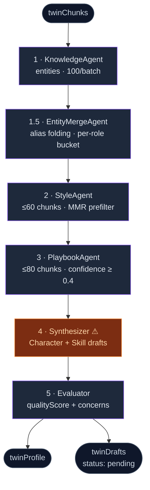

# Distill pipeline

<Status variant="stable" />

<TLDR>
  `runOrchestrator` (`lib/twin/distill/orchestrator.ts:92`) runs **six agents sequentially** —
  Knowledge → EntityMerge → Style → Playbook → Synthesizer → Evaluator — turning `twinChunks` into a
  `twinProfile` plus reviewable Character / Skill `twinDrafts`. Every agent calls through the `LlmClient`
  seam (`llm.ts:45`), each non-load-bearing agent is wrapped in `withTimeoutOrFallback`, and the synthesizer
  is the one hard dependency (a timeout there throws `SynthesizerError`).
</TLDR>

## The six agents

Despite the "T1…T5" labels in the source, execution is **fully sequential** — there is no `Promise.all`
fan-out. The orchestrator pings `onProgress` after each stage.



| # | Agent | Scope / caps | On failure |
| --- | --- | --- | --- |
| 1 | **KnowledgeAgent** (`knowledge-agent.ts:46`) | batched loop, `KNOWLEDGE_BATCH_SIZE = 100`; extracts `ProfileEntity[]` + per-chunk entity tags | fallback `{entities: [], perChunk: {}}` |
| 1.5 | **EntityMergeAgent** (`entity-merge-agent.ts:165`) | one LLM call per role bucket (5 roles); folds aliases; buckets `< 6` skip the LLM | fallback to unmerged bucket |
| 2 | **StyleAgent** (`style-agent.ts:46`) | ≤ 60 chunks; MMR prefilter when the pool is larger; emits `StyleSample[]` | fallback `{samples: []}` |
| 3 | **PlaybookAgent** (`playbook-agent.ts:76`) | ≤ 80 chunks, needs ≥ 3; **confidence floor 0.4** | fallback `{playbooks: []}` |
| 4 | **Synthesizer** (`synthesizer.ts:91`) | profile + last 30 chunks; 1 Character draft + 1 Skill per playbook ≥ 0.6 | **throws `SynthesizerError`** (hard) |
| 5 | **Evaluator** (`evaluator.ts:51`) | scores each draft from a "newcomer's POV"; `qualityScore` (default 0.5) + `concerns` + `suggestions` | fallback `{evaluations: {}}` |

The knowledge stage is a batch loop, each batch independently guarded so one slow batch can't sink the run:

```ts title="lib/twin/distill/orchestrator.ts:104-122"
for (let i = 0; i < chunks.length; i += KNOWLEDGE_BATCH_SIZE) {
  const batch = chunks.slice(i, i + KNOWLEDGE_BATCH_SIZE)
  const batchLabel = `knowledge-agent#${Math.floor(i / KNOWLEDGE_BATCH_SIZE)}`
  const { value, error } = await withTimeoutOrFallback(
    () => runKnowledgeAgent(llm, { chunks: batch }),
    batchLabel,
    { timeoutMs: agentTimeoutMs,
      fallback: { entities: [] as ProfileEntity[], perChunk: {} as Record<string, string[]> },
      onError: recordFailure },
  )
  allEntities.push(...value.entities)
  Object.assign(chunkEntityTags, value.perChunk)
```

The synthesizer is the one **load-bearing** stage. It is fed a *transient* profile (base profile + this run's
fresh style samples, playbooks and merged entities) so it always sees the freshest distillation even if some
agents fell back to empty, and a timeout there fails the whole job:

```ts title="lib/twin/distill/orchestrator.ts:193-213"
const transientProfile: TwinProfile = {
  ...profile,
  styleSamples: [...profile.styleSamples, ...styleResult.value.samples],
  playbooks: [...profile.playbooks, ...playbookResult.value.playbooks],
  entities: dedupeEntitiesByName([...profile.entities, ...mergedEntities]),
  updatedAt: Date.now(),
}
const recent = chunks.slice(-30)
let synthResult: Awaited<ReturnType<typeof runSynthesizer>>
try {
  synthResult = await withTimeout(
    runSynthesizer(llm, { profile: transientProfile, recentChunks: recent }),
    agentTimeoutMs, "synthesizer")
} catch (err) {
  throw new SynthesizerError(err instanceof Error ? err.message : String(err), err)
}
```

## The LlmClient seam

Every agent talks to the model through one tiny interface, so production wires a real client while tests
inject a mock that never touches the network:

```ts title="lib/twin/distill/llm.ts:45-59"
export interface LlmClient {
  complete(prompt: string, options?: LlmClientCallOptions): Promise<string>
  getUsageSnapshot?(): LlmUsageSnapshot
}
```

`complete` returns **raw text** — each agent parses its own JSON via `extractJson` (`llm.ts:188`), which tries
a fenced block first and falls back to a string-aware balanced-bracket walker. The production factory is
`createLlmClient` (`llm.ts:133`); it lazily builds an AI-SDK model (`@ai-sdk/anthropic` / openai / google /
mistral / cohere) and accumulates a usage snapshot. `createAnthropicLlmClient` (`llm.ts:177`) is a
deprecated alias kept for back-compat. `getUsageSnapshot` is optional — the orchestrator guards it with `?.`.

## Pin preservation across a re-distill

User pins (`pinned: true` on a style sample, playbook, entity, or decision) must survive a re-distill. The
mechanism is **split across two layers**:

1. **Entity pins bypass clustering** — inside `EntityMergeAgent`, pinned entities are filtered out of the
   bucket and passed through verbatim, so they are never renamed to a cluster canonical:

   ```ts title="lib/twin/distill/agents/entity-merge-agent.ts:180-189"
   // Pinned entities are user-curated — never cluster, rename, or fold them.
   const pinned = fullBucket.filter((e) => e.pinned)
   const bucket = fullBucket.filter((e) => !e.pinned)
   merged = [...merged, ...pinned]
   if (bucket.length < minBucket) { merged = [...merged, ...bucket]; continue }
   ```

2. **Content-dedupe + pin keep at write time** — the distill `job-runner` upserts (not appends) so a re-run
   de-dupes by content and preserves pins, via the `upsert*` DB helpers (`lib/db/twin-profile.ts`):

   ```ts title="lib/twin/distill/job-runner.ts:101-107"
   // Upsert (not append) so a re-distill de-dupes by content and preserves any
   // user-pinned style sample / playbook instead of multiplying the arrays.
   await upsertStyleSamples(job.twinId, result.styleSamples, { embeddingFn })
   await upsertPlaybooks(job.twinId, result.playbooks)
   if (result.entities.length > 0) { await upsertEntities(job.twinId, result.entities) }
   ```

## Two-tier PII defense

Distill is the path most likely to *re-introduce* PII, because the LLM can hallucinate a real-looking email
into a draft. Two independent guards catch it:

- **Persist-time (silent re-redact)** — the distill `job-runner` re-redacts synthesised draft payloads and the
  `voiceSummary` before they are written, logging a warning when it has to scrub.
- **Edit-time (deep scan, throws)** — when a reviewer edits a draft, `assertDraftBodyClean(payload)`
  (`draft-pii-guard.ts:54`) recurses through every field with `hasNoLeakingPiiDeep` so PII can't hide in a
  nested value; a leak throws `DraftPiiError`. `assertFieldsClean` (`draft-pii-guard.ts:82`) is the flat
  variant the persona editors use.

Placeholders like `<EMAIL_001>` are **not** flagged — the real value stays encrypted on
`twinSources.redactionMapEnc` and is only restored at accept time.

### Accept-time un-redaction

`unredact-draft.ts` restores placeholders to real values when a draft is accepted. `loadTwinUnredactMap`
(`unredact-draft.ts:54`) decrypts and merges every source's reverse map; `previewUnredact`
(`unredact-draft.ts:96`) lists the placeholders found in the draft (defaulting each to "keep"); and
`applyUnredactSelection` (`unredact-draft.ts:122`) splices the chosen originals back in JSON-safely. This is
the surface the [unredact dialog](./workbench-ui#drafts-tab--accept-flow) drives.

## Helpers

- **`with-timeout.ts`** is a re-export shim over `@/lib/utils/with-timeout`. `withTimeout` is a hard deadline
  that rejects; `withTimeoutOrFallback` returns `{ value, error }`, logging via `onError` and yielding a
  supplied fallback. The default agent timeout is 90 s.
- **`heuristics/style-prefilter.ts`** (`selectStyleCandidates`, L50) shrinks the StyleAgent's candidate pool
  to ~30 chunks with **TF-IDF informativeness + greedy MMR diversity** (`MMR_LAMBDA = 0.7`), applying a
  per-source penalty so one long document can't monopolise the samples. Bilingual stopwords (EN + Chinese).

## Next

<Cards>
  <Card title="Runtime" href="./runtime" description="How the distilled profile is used at send time." />
  <Card title="Jobs & scheduling" href="./jobs-and-scheduling" description="How a distill job is queued, claimed, and retried." />
</Cards>
