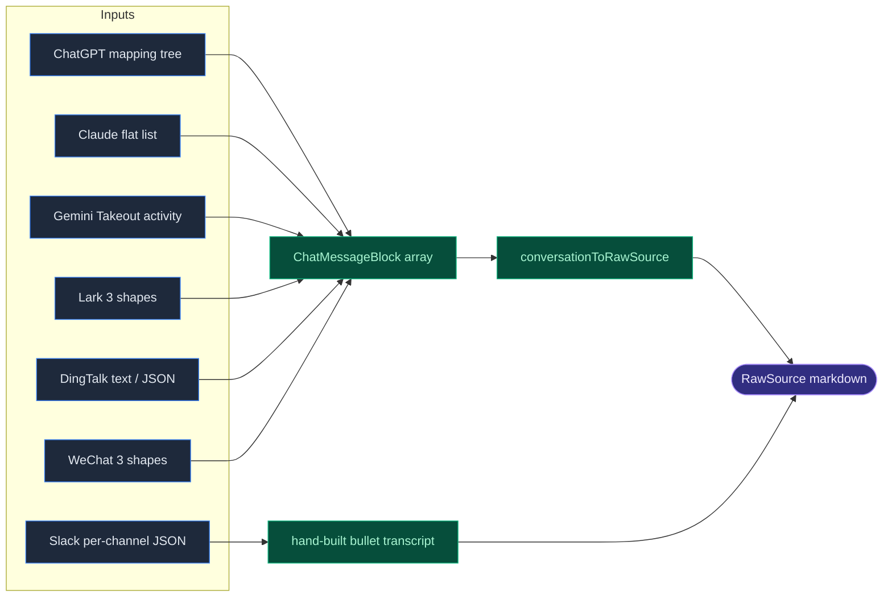

# Importers

<Status variant="stable" />

<TLDR>
  Importers (`lib/twin/importers/`) turn third-party exports into `RawSource[]` — the shape `parseSource`
  consumes. Every chat importer normalises its platform's quirky export into a canonical `ChatMessageBlock[]`
  and renders one markdown transcript via `conversationToRawSource`. Output is always `format: "markdown"`,
  except git-repo which emits `format: "code"`.
</TLDR>

## The shared contract

`chat-export/types.ts` defines the lowest-common-denominator message shape and the sink every chat importer
funnels into:

```ts title="lib/twin/importers/chat-export/types.ts:17-26"
export interface ChatMessageBlock {
  speaker: string
  timestamp?: number          // ms since epoch
  text: string
  threadId?: string           // Slack thread_ts / Lark·DingTalk thread root
  externalId?: string         // Slack ts, ChatGPT mapping id
}
```

`conversationToRawSource(input)` (`types.ts:114`) is the shared sink: it collects distinct speakers, computes
the timestamp range, builds `baseMetadata` (`speakers`, `timestamp`), and renders the blocks to a
heading-chunker-friendly markdown transcript via `blocksToMarkdown` (`types.ts:55`). It returns `null` for an
empty conversation.

```ts title="lib/twin/importers/chat-export/types.ts:114-131"
export function conversationToRawSource(input: ConversationToRawSourceInput): RawSource | null {
  if (input.blocks.length === 0) return null
  const speakers = collectSpeakers(input.blocks)
  const { earliest, latest } = timestampRange(input.blocks)
  const baseMetadata: TwinChunkMetadata = {
    speakers,
    ...(earliest !== undefined ? { timestamp: earliest } : {}),
    ...(latest !== undefined && latest !== earliest ? { timestampMax: latest } : {}),
    ...input.extraMetadata,
  }
  return {
    id: nextRawSourceId(input.twinId, input.label),
    filename: `${input.title}.md`,
    format: "markdown",
    text: blocksToMarkdown(input.title, input.blocks),
    baseMetadata,
  }
}
```

### No registry — the caller dispatches

`importers/index.ts` is a flat barrel re-export; there is **no dispatcher map**. The
[source uploader](./workbench-ui#sources--uploader) picks the importer by calling the exported shape
detectors when a dropped file's origin isn't obvious from its extension. The detector set is intentionally
asymmetric:

| Platform | Shape detector(s) | Uses shared sink? |
| --- | --- | --- |
| ChatGPT | `isChatgptExportShape` | yes |
| Claude | `isClaudeExportShape` | yes |
| Gemini | `isGeminiExportShape` | yes |
| Slack | *(none)* | **no — hand-built bullet list** |
| Lark | `isLarkExportShape` | yes |
| DingTalk | `isDingtalkTextShape` + `isDingtalkJsonShape` | yes |
| WeChat | `isWechatExportShape` | yes |

## Chat importers



- **ChatGPT** (`chatgpt.ts:128`) — `conversations.json` is a branchy `mapping` tree. `linearisePath`
  (`chatgpt.ts:77`) walks `current_node` ancestry up via `parent` with a cycle guard, then reverses — so
  regenerated turns (siblings) aren't double-counted. One `RawSource` per conversation.
- **Claude** (`claude.ts:68`) — flat `chat_messages` with `sender: "human" | "assistant"`; `pickText`
  prefers `content[].text`, falls back to `text`. One source per conversation.
- **Gemini** (`gemini.ts:76`) — Google Takeout `MyActivity.json`; each entry is one prompt+response →
  two blocks. Filters non-gemini products, strips `"Asked Gemini: "` prefixes. Emits **one** source for the
  whole activity log.
- **Slack** (`slack.ts:100`) — the only importer that bypasses the shared sink. Groups replies under their
  `thread_ts` root and renders an indented **bullet list**; `resolveDisplayName` (`slack.ts:77`) resolves
  user ids via an optional `userMap` → `user_profile` → `username` → `<@user>`.
- **Lark** (`lark.ts:148`) — accepts three shapes (official `chat_name`+`messages`, unofficial CLI
  `groupName`+`messages`, flat normalised array) and dispatches by structure.
- **DingTalk** (`dingtalk.ts:122`) — two formats: mobile plain text (`[YYYY-MM-DD HH:mm:ss] 昵称` headers,
  parsed by a stateful line accumulator) and desktop JSON; tries JSON first, falls back to text.
- **WeChat** (`wechat.ts:140`) — no official export, so three third-party shapes (chatlog CSV-rows,
  WechatExporter JSON with int message types where `1` = text, flat normalised). One source per chat.

A timestamp heuristic recurs across Lark / DingTalk / WeChat: a value `>= 1e12` is already milliseconds,
otherwise it is seconds × 1000.

## Code: git-repo

`parseGitRepo(options)` (`code-repo/git-repo.ts:50`) is the only importer that crosses into Rust. It delegates
to the Tauri command **`twin_parse_git_repo`** (libgit2 via the `git2` crate) — so `simple-git` is not in the
Next.js bundle. For non-Tauri callers it early-returns `[]`; on `invoke` failure it also returns `[]`
(graceful). Scoping (`maxCommits`, default 200; `author` filter) is enforced Rust-side, and the per-commit
diff is the `--stat` summary plus a unified patch **capped at 8 KB**.

Each commit becomes one `RawSource` with `format: "code"` and `metadata.commitSha`, rendered as markdown with
a fenced `diff` block (`renderCommit`, `git-repo.ts:89`).

## Email: mbox & eml

`parseMbox(content, options)` (`email/mbox.ts:27`) is a hand-rolled RFC-5322/4155 parser — no external
library. `splitOnMboxBoundary` (`mbox.ts:114`) splits on `From ` separator lines; `parseHeaders`
(`mbox.ts:99`) unfolds RFC-2822 continuation lines before splitting on the first colon. Each message becomes
one markdown `RawSource` (`# subject` + From/To/Date + body). There is **no** quoted-printable / base64 /
multipart decoding and **no** threading — each message is independent. `detectMbox` (`mbox.ts:134`) tests for a
`From ` line.

`parseEml(content, options)` (`email/eml.ts:14`) is a thin wrapper: it prepends a synthetic `From ` marker so a
single `.eml` routes through the same mbox header/body logic, then rewrites the ids/filenames to `_eml_`.

## Next

<Cards>
  <Card title="Ingest pipeline" href="./ingest-pipeline" description="What happens to a RawSource after an importer produces it." />
  <Card title="Workbench UI" href="./workbench-ui" description="The uploader that drives importer selection." />
</Cards>
