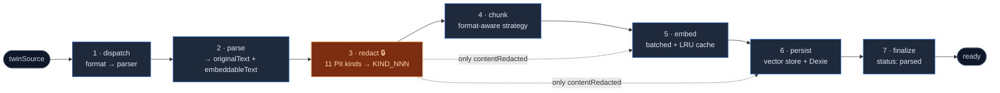

# Ingest pipeline

<Status variant="stable" />

<TLDR>
  `runIngestJob` (`lib/twin/ingest/job-runner.ts:104`) turns each registered `twinSource` into embedded
  `twinChunks`. Per source it runs **dispatch → parse → redact → chunk → embed → persist → finalize**.
  Redaction (stage 3) is the privacy red-line: only `contentRedacted` ever leaves the renderer. A per-source
  failure is non-fatal — the loop continues and the executor decides whether an all-failed run fails the job.
</TLDR>

## The seven stages

Implementation: `lib/twin/ingest/`. Orchestrator: `runIngestJob` (`job-runner.ts:104`). Progress is tracked
as `TOTAL_STAGES = 6` (`job-runner.ts:73`) — route + parse share one progress step, and finalize is pinned
at 99 (100 is reserved for the executor's `completeJob`).



The runner walks `rawSources` one at a time. Each source occupies a `1/N` band of the progress bar via a
fractional `stageBase` offset (`job-runner.ts:126`), so the Jobs tab shows smooth per-source progress.

```ts title="lib/twin/ingest/job-runner.ts:132-149 (the stage spine)"
// Stage 1+2 — dispatch + parse.
await progress(job.id, `parsing:${raw.filename}`, (stageBase + 1) / TOTAL_STAGES)
const parsed = await parseSource(raw)

// Stage 3 — redact PII.
await progress(job.id, `redacting:${raw.filename}`, (stageBase + 2) / TOTAL_STAGES)
const redaction = redactText(parsed.embeddableText, input.nameHints ?? [])

await updateTwinSource(row.id, { kind: parsed.kind, title: parsed.title, bytes: parsed.bytes, redacted: true })
row = (await getTwinSource(row.id)) as TwinSource

// Stage 4 — chunk.
await progress(job.id, `chunking:${raw.filename}`, (stageBase + 3) / TOTAL_STAGES)
```

### 1 · dispatch

`dispatchSource(format)` (`dispatch.ts:84`) is pure routing — given a `TwinSourceFormat` it returns
`{ kind, routesToDocumentProcessor, importerKey? }`. Document formats (`DOCUMENT_FORMATS`, `dispatch.ts:31`)
go to `lib/document/document-processor`; chat / email / code formats name an importer (see
[Importers](./importers)). Unknown formats throw. `detectSourceFormat(filename)` (`dispatch.ts:146`) maps a
file extension to a format for the uploader.

### 2 · parse

`parseSource(raw)` (`parse.ts:69`) produces a `ParsedSource` with two text fields: `originalText`
(byte-for-byte, PII-present) and `embeddableText` (the best-effort scrubbed-of-formatting subset that goes
into redaction). Binary documents route to `processDocumentAsync` (`mammoth` / `pdfjs-dist`), text documents
to `processDocument`, and importer families are `import()`-ed lazily and reduced to one markdown blob by
`collectImporterText` (`parse.ts:203`).

### 3 · redact — the privacy red-line

`redactText(text, nameHints)` (`redact.ts:227`) is the heart of the privacy model. It detects **11 PII
kinds** and replaces each with a `<KIND_NNN>` placeholder (zero-padded, 3 digits):

| Kind | Detection |
| --- | --- |
| `EMAIL` | RFC-loose regex |
| `PHONE` | CN mobile / E.164 / US patterns |
| `CN_ID` | 17 digits + checksum char |
| `BANK_CARD` | 13–19 digits, **Luhn-validated** |
| `NAME` | hint-driven (`nameHints` + preceding markers) |
| `IP_ADDR` | public IPv4 (loopback/private excluded) + IPv6 |
| `API_KEY` | known prefixes (`sk-`, `ghp_`, `AKIA`, `AIza`, …) + high-entropy after a hint word |
| `JWT` | three-segment `eyJ…` tokens |
| `PEM_KEY` | PEM block markers |
| `PASSPORT` | passport pattern |
| `DRIVER_LICENSE` | CN-hint-driven 12-digit |

The reverse map is built by `tokenize` (`redact.ts:209`), which reuses the same placeholder for repeat
occurrences of the same original (stable within a document):

```ts title="lib/twin/ingest/redact.ts:209-217"
function tokenize(state: RedactState, kind: PiiKind, original: string): string {
  const cached = state.reuse.get(original)
  if (cached) return cached
  state.counters[kind] += 1
  const placeholder = `<${kind}_${pad(state.counters[kind])}>`
  state.reuse.set(original, placeholder)
  state.map[placeholder] = { placeholder, original, kind }
  return placeholder
}
```

The **no-leak gate** `hasNoLeakingPii(text)` (`redact.ts:308`) is the post-redact assertion — it re-runs
every detector and returns `false` on the first leak.

<Callout type="info" title="How the gate is actually enforced">
  `hasNoLeakingPii` is **not** called inside the ingest runner. Cloud safety here is *structural*: the runner
  feeds only `redaction.redacted` text downstream, and only `contentRedacted` reaches the embedder
  (`embed.ts:48`) and the remote vector payload (`persist.ts:137`). The explicit `hasNoLeakingPii` /
  `hasNoLeakingPiiDeep` assertions guard the **distill** drafts and the shared-memory `publishEntry` path,
  where LLM-generated text could re-introduce PII. See [Distill pipeline](./distill-pipeline#two-tier-pii-defense).
</Callout>

After chunking, the original display text is rebuilt by **un-redacting the redacted chunk** rather than
offset-slicing the original — placeholder lengths shift character offsets, so a slice would be wrong:

```ts title="lib/twin/ingest/job-runner.ts:169-173"
const enriched = chunks.map((c) => ({
  ...c,
  contentRedacted: c.content,
  content: unredactText(c.content, redaction.map),
}))
```

### Reverse-map encryption

The PII↔placeholder map is encrypted before it touches `twinSources.redactionMapEnc`.
`redaction-key.ts` uses **AES-GCM-256** with a **raw 32-byte CSPRNG key** (no passphrase derivation) and a
12-byte random IV per encryption (`encryptRedactionMap`, `redaction-key.ts:255`). Storage is dual:

- **Tauri** — the key lives in the OS keyring (`namespace: "twin-redaction"`); never in IndexedDB.
- **Web** — the key is base64 in the Dexie `settings` row (colocated with data, but the map is still encrypted).

A SHA-256 **fingerprint** of the key is stored in Dexie in both modes. `getRedactionKey`
(`redaction-key.ts:177`) only bootstraps a fresh key on a genuine first run; if the key is missing but a
fingerprint exists, it throws `RedactionKeyMismatchError` rather than silently re-keying and orphaning every
existing map:

```ts title="lib/twin/ingest/redaction-key.ts:177-192"
export async function getRedactionKey(): Promise<CryptoKey> {
  let bytes = await readMasterKeyBytes()
  const storedFingerprint = await readStoredFingerprint()
  if (!bytes) {
    if (storedFingerprint) {
      throw new RedactionKeyMismatchError(
        "Twin redaction master key is missing but a key fingerprint is recorded — " +
          "the secret store is unavailable or the key was lost. ...")
    }
    bytes = randomBytes(32)
    await writeMasterKeyBytes(bytes)
    await writeStoredFingerprint(await fingerprintOf(bytes))
  }
```

### 4 · chunk

`prepareChunks(input)` (`chunk.ts:90`) picks a strategy from `FORMAT_TO_STRATEGY` (`chunk.ts:31`) — markdown
→ `heading`, code / git-repo → `code`, pdf → `smart`, chat / email → `paragraph`, csv → `fixed` — then
delegates to `chunkDocument` (`lib/ai/embedding/chunking`), which owns token limits and overlap. Token counts
use a `~4 chars/token` approximation (`chunk.ts:55`).

```ts title="lib/twin/ingest/chunk.ts:90-95"
export function prepareChunks(input: ChunkInput): PreparedChunk[] {
  const strategy = input.strategy ?? FORMAT_TO_STRATEGY[input.format] ?? "paragraph"
  const result = chunkDocument(input.redactedText, { ...input.options, strategy })
```

Re-ingest idempotency is not a content hash — it is the `deleteTwinChunksBySource` replace in persist (see
below); content-keyed reuse is the embed cache.

### 5 · embed

`embedRedactedChunks(redactedTexts, config)` (`embed.ts:48`) calls `generateEmbeddings`
(`lib/ai/embedding/embedding`) in batches of `DEFAULT_BATCH_SIZE = 64` (`embed.ts:32`). A module-local LRU
cache (5 000 entries, keyed `provider::model::text`, `embed.ts:44`) plus intra-call de-duplication avoids
re-embedding repeated text. There is **no retry/backoff in this layer** — a `generateEmbeddings` rejection
propagates to the runner's per-source catch.

### 6 · persist — remote-first double-write

`persistChunks` (`persist.ts:67`) writes the remote vector store **first**, then Dexie. The remote write is
the hard gate — if it throws, nothing is written locally, keeping the two stores from diverging:

```ts title="lib/twin/ingest/persist.ts:132-150"
await input.store.addDocuments(
  collection,
  rows.map((row, i) => ({
    id: row.vectorDocId,
    content: row.contentRedacted,
    metadata: { twinId: row.twinId, chunkId: row.id, sourceId: row.sourceId,
      contentPreview: row.contentRedacted.slice(0, 200) },
    embedding: input.embeddings[i],
  }))
)
await bulkCreateTwinChunks(rows)
```

Before writing, persist does an idempotent replace: it lists existing chunks for the source, deletes their
remote docs (tolerated on failure) and their Dexie rows, then inserts fresh ones — so a re-run never
duplicates. The collection name is `cognia_twin_<twinId>` (`vectorCollectionName`, `persist.ts:24`).

### 7 · finalize

`finalizeIngestRun` (`job-runner.ts:243`) touches `twinProfile.updatedAt` (refreshes the workbench stat
cards), pins job progress to 99, and returns a `failureSummary` whose `allFailed` flag tells the executor
whether an all-sources-failed run should fail the whole job.

## Failure model

A per-source error is caught and recorded (`updateTwinSource(..., status: "failed")`) but the loop continues
to the next source (`job-runner.ts:196-204`). The runner itself has **no lease refresh and no retry** — those
belong to the [job worker](./jobs-and-scheduling). The only signal it raises is `failureSummary.allFailed`,
which the worker upgrades to a job-level failure.

## URL ingest

`fetchUrlAsRawSource(url)` (`url-fetcher.ts:47`) fetches a URL with a 30 s `AbortController` timeout, extracts
a title from the HTML `<title>` or the URL, and `pickFormatForUrl` (`url-fetcher.ts:75`) returns `html` or
`markdown` based on content type — producing a `RawSource` the normal pipeline ingests.

## Next

<Cards>
  <Card title="Importers" href="./importers" description="What feeds parseSource — the chat / code / email importers." />
  <Card title="Distill pipeline" href="./distill-pipeline" description="What consumes the chunks this pipeline produces." />
</Cards>
