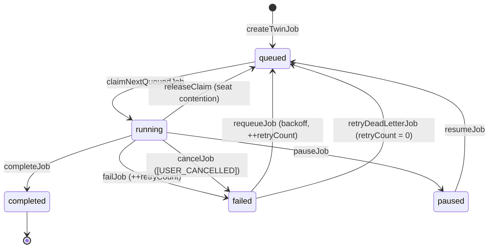
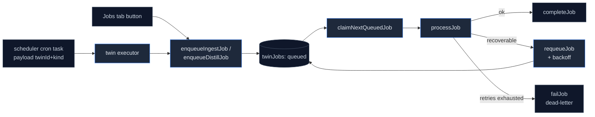

# Jobs & scheduling

<Status variant="stable" />

<TLDR>
  Ingest and distill both run as durable `twinJobs` rows. The worker (`lib/twin/job-worker.ts:284`) polls,
  claims the oldest eligible job atomically (`claimNextQueuedJob`, `twin-jobs.ts:95`), and routes it. Crash
  recovery is a **lease** (10 min TTL) — a `running` row with an expired lease is re-claimed. Transient
  failures retry with exponential backoff (`job-retry.ts`), dead-lettering after 3 attempts. A per-twin cron
  bridge (`cron-bridge.ts:93`) keeps schedules in sync with the scheduler.
</TLDR>

## Job lifecycle



`TwinJobStatus` is `queued | running | paused | completed | failed`. `requeueJob` and `failJob` both increment
`retryCount`; `releaseClaim` and `resumeJob` do not; `retryDeadLetterJob` resets it to 0 (`twin-jobs.ts`).

## The worker

`startJobWorker(config, twinId?)` (`job-worker.ts:284`) returns a handle (`pause` / `resume` / `pauseJob` /
`resumeJob` / `stop`) and runs a `setTimeout` poll loop (interval `max(500, pollIntervalMs ?? 2000)`). Each
tick claims one job and dispatches it, bounded by **per-kind concurrency caps** (`maxConcurrentIngest` /
`maxConcurrentDistill`, each min 1) tracked by in-flight `Set`s:

```ts title="lib/twin/job-worker.ts:305-326 (tickOnce)"
const job = await claimNextQueuedJob(twinId, (config.now ?? Date.now)())
if (!job) return
if (!seatsOpen(job.kind)) {
  await releaseClaim(job.id)   // seat contention != failure; no retry burn
  return
}
const tracker = job.kind === "ingest" ? inflightIngest : inflightDistill
tracker.add(job.id)
const promise = processJob(job.id, config)
  .catch((err) => { log.error("twin job-worker: tick error", err) })
  .finally(() => { tracker.delete(job.id); inflightAll.delete(promise) })
inflightAll.add(promise)
```

`processJob` (`job-worker.ts:103`) routes on `job.kind`: `"ingest"` → `runIngestJob`, `"distill"` /
`"re-distill"` → `runDistillJob` (an unknown kind, or distill with no configured LLM, fails immediately
without burning retries). An ingest whose `failureSummary.allFailed` is true is upgraded to a job failure.

<Callout type="info" title="No tab lock — the claim is the lock">
  There is no cross-tab mutex. The sole concurrency guard is the atomic transaction inside
  `claimNextQueuedJob` — the queued → running flip happens inside `db.transaction("rw", ...)`, so two workers
  can never claim the same row. In-process parallelism is bounded by the per-kind in-flight sets, not a lock.
</Callout>

## Atomic claim + lease recovery

`claimNextQueuedJob` selects eligible rows in one transaction: `queued` rows whose backoff (`nextAttemptAt`)
has elapsed, **plus** `running` rows whose `leaseExpiresAt` has passed (a crashed or closed worker), sorted
FIFO by `queuedAt`. The winner is flipped to `running` with a fresh 10-minute lease:

```ts title="lib/db/twin-jobs.ts:95-129 (abridged)"
return db.transaction("rw", db.twinJobs, async () => {
  const queued = await db.twinJobs.where("status").equals("queued").toArray()
  const stuck  = await db.twinJobs.where("status").equals("running").toArray()
  const eligible = [
    ...queued.filter((j) => (j.nextAttemptAt ?? 0) <= now),                     // backoff elapsed
    ...stuck.filter((j) => j.leaseExpiresAt !== undefined && j.leaseExpiresAt <= now), // crashed worker
  ].sort((a, b) => a.queuedAt - b.queuedAt)                                      // FIFO
  if (eligible.length === 0) return undefined
  const oldest = eligible[0]
  const claimed = { ...oldest, status: "running", phase: "starting",
    startedAt: Date.now(), leaseExpiresAt: now + LEASE_TTL_MS }
  await db.twinJobs.put(claimed)
  return claimed
})
```

A healthy job keeps its lease alive via `updateJobProgress` (`twin-jobs.ts:147`), which refreshes
`leaseExpiresAt` on every progress write. `running` rows with **no** lease are never reclaimed (the
`!== undefined` guard), so a job that hasn't started progressing is protected from a racing reclaim.

## Retry & dead-letter

`job-retry.ts` is pure math. `backoffMs(attempt)` is exponential with jitter, capped at 60 s; after
`MAX_RETRIES = 3` the job is dead-lettered:

```ts title="lib/twin/job-retry.ts:31-37"
export function backoffMs(attempt: number, random: () => number = Math.random): number {
  if (!Number.isFinite(attempt) || attempt < 1) return BASE_BACKOFF_MS   // 1000
  const exp = BASE_BACKOFF_MS * Math.pow(2, attempt - 1)                 // 1s, 2s, 4s...
  const capped = Math.min(MAX_BACKOFF_MS, exp)                           // cap 60s
  const jitter = Math.floor(random() * 500)                             // [0, 500ms)
  return capped + jitter
}
```

On a recoverable failure the worker computes `backoffMs(retryCount + 1)` and `requeueJob(id, now + wait)`;
once `shouldRetry(retryCount)` is false it `formatDeadLetter`s the message and `failJob`s. A dead-letter
message round-trips through `parseDeadLetter` so the Jobs tab can show the original error and attempt count.

## Per-twin cron

`syncTwinCronToScheduler(twinId, cron)` (`cron-bridge.ts:93`) reconciles a twin's `TwinCronSettings`
(`enabled`, `ingestSchedule`, `distillSchedule`, `timezone`) against the scheduler's task table. It owns two
task ids — `twin::<twinId>::ingest` and `twin::<twinId>::distill` — and, for each side, creates / updates /
deletes the scheduler task based on whether the schedule is enabled and the cron expression validates:

```ts title="lib/twin/cron/cron-bridge.ts:108-126 (ingest side)"
const ingestExpr = cron?.ingestSchedule?.trim() ?? ""
if (enabled && ingestExpr) {
  if (!validateCronExpression(ingestExpr).valid) {
    result.invalidExpressions.push(`ingest: ${ingestExpr}`)
  } else {
    const next = buildTask(twinId, "ingest", ingestExpr, cron?.timezone, existingIngest)
    if (existingIngest) { await schedulerDb.updateTask(next); result.ingest = "updated" }
    else { await schedulerDb.createTask(next); result.ingest = "created" }
  }
} else if (existingIngest) {
  await schedulerDb.deleteTask(ingestId); result.ingest = "deleted"
}
```

Each task is `type: "twin"` with `payload: { twinId, kind }`; the scheduler's twin executor reads that payload
and calls `enqueueIngestJob` / `enqueueDistillJob`, which mint the `queued` `twinJobs` row the worker then
claims. `CRON_PRESETS` (`cron-bridge.ts:152`) offers hourly / 6-hourly / daily-03:00 / weekly-Mon-09:00. The
cascade `deleteTwin` calls this with `undefined` to remove both tasks.

## End-to-end



## Next

<Cards>
  <Card title="Workbench UI" href="./workbench-ui" description="The Jobs tab and the cron card that drive these queues." />
  <Card title="Ingest pipeline" href="./ingest-pipeline" description="What an ingest job actually runs." />
</Cards>
