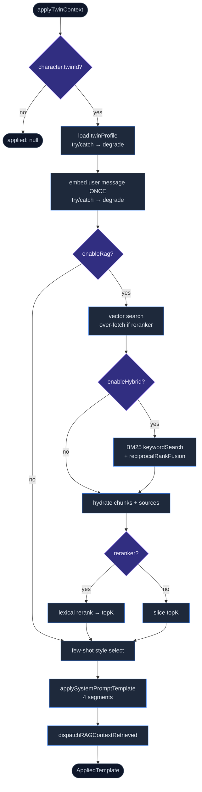

# Runtime

<Status variant="stable" />

<TLDR>
  `applyTwinContext` (`lib/twin/runtime/apply-twin-context.ts:170`) is the one send-time entry. For a
  twin-bound character it embeds the user message **once**, runs RAG (vector, optionally fused with BM25 via
  RRF, optionally over-fetched and lexically reranked), selects style few-shot samples, and assembles a
  four-segment system prompt. It **never throws** — every fallible I/O step is individually guarded and
  degrades to "less context" rather than breaking the chat. It is wired into `resolveSendOptions`
  (`lib/claude/build-options.ts:625`).
</TLDR>

## The send-time flow



All six `TwinSettings` are resolved once in `settingsFor(character)` (`apply-twin-context.ts:113`), each
defaulting via `?? DEFAULT_TWIN_SETTINGS.*`. The user message is embedded a single time and that one vector
feeds both the RAG and style passes — team chat skips even that by passing `precomputedQueryEmbedding`.

### Over-fetch + vector search

When a reranker is configured, retrieval over-fetches a wider candidate pool (default 3×) so the rerank pass
has something to re-order:

```ts title="lib/twin/runtime/apply-twin-context.ts:222-229"
const overFetch = deps.reranker?.overFetch ?? 3
const fetchLimit = deps.reranker
  ? Math.max(settings.ragTopK * overFetch, settings.ragTopK)
  : settings.ragTopK
const vectorHits = await deps.store.searchByEmbedding(collection, queryEmbedding, {
  limit: fetchLimit,
})
```

### Hybrid retrieval (BM25 + RRF)

When `enableHybrid` is on, a per-twin BM25 keyword search runs alongside the vector search and the two ranked
lists are fused with Reciprocal Rank Fusion. A BM25 failure degrades gracefully back to vector-only:

```ts title="lib/twin/runtime/apply-twin-context.ts:245-253"
const keywordHits = await keywordSearch(character.twinId, userMessage, fetchLimit)
const keywordWeight = Math.min(1, Math.max(0, settings.hybridKeywordWeight))
const fused = reciprocalRankFusion(
  [vectorHits.map((h) => ({ id: h.id, score: h.score })), keywordHits],
  [1 - keywordWeight, keywordWeight],
  60
)
orderedIds = fused.slice(0, fetchLimit).map((f) => f.id)
```

The BM25 index (`bm25-index.ts`) is a per-twin LRU cache (max 3 twins) over the shared `BM25Index`
(`lib/ai/rag/hybrid-search.ts`, `k1 = 1.2`, `b = 0.75`, CJK-aware tokeniser). It indexes `contentRedacted`,
the same text the embedder sees, so keyword and vector views stay consistent. Its cache key is
`getTwinChunksVersion` (count + latest `createdAt`), so an ingest invalidates it automatically. RRF combines
the lists as `Σ weight_i · 1/(k + rank + 1)` with `k = 60` (`reciprocalRankFusion`, `hybrid-search.ts:247`).

### Lexical rerank

If a reranker is configured and there are more candidates than `ragTopK`, the over-fetched pool is re-scored
and trimmed. The built-in lexical scorer blends the prior cosine score with query-term coverage:

```ts title="lib/twin/runtime/reranker.ts:147-157"
const queryTerms = tokenSet(query)
if (queryTerms.size === 0) return c.score
const contentTerms = tokenSet(c.content)
let covered = 0
for (const term of queryTerms) if (contentTerms.has(term)) covered += 1
const coverage = covered / queryTerms.size
return 0.7 * c.score + 0.3 * coverage   // 70% cosine, 30% keyword coverage
```

`rerank` (`reranker.ts:73`) races the scorers against a 1.5 s timeout and falls back to identity ordering on
any error — so a reranker hiccup never drops results, it just keeps the fused order.

### Style few-shot selection

`selectFewShotSamples` (`few-shot-selector.ts:70`) ranks style samples **per sample**: if a sample has a
cached embedding it scores by cosine to the query embedding, otherwise it falls back individually to token
overlap (or a length heuristic when there's no query text). So a single un-embedded sample doesn't disable
the whole pass — and a lazy backfill (`maybeBackfillStyleEmbeddings`, `apply-twin-context.ts:140`) fills the
missing embeddings in the background.

## The four-segment prompt

`applySystemPromptTemplate` (`system-prompt-template.ts:112`) joins up to four sections with `\n\n---\n\n`:

| # | Segment | Source | Cacheability |
| --- | --- | --- | --- |
| 1 | Base character prompt | `character.systemPrompt` | stable |
| 2 | Twin identity | `You are <name>` + voice summary + entity dictionary | stable (cache-friendly) |
| 3 | Relevant historical material | retrieved chunks (`contentRedacted`, with scores + cite instruction) | per-turn |
| 4 | Style examples | selected few-shot samples (verbatim originals) | per-turn |

Empty sections are skipped, so there are never dangling headings. Retrieved chunks render their
`contentRedacted` (not raw content), keeping the prompt consistent with what was embedded and indexed.

## Dependency injection

`applyTwinContext` takes its vector store, embedding config, and optional reranker via `deps`.
`tryBuildTwinDeps` (`build-deps.ts:14`) assembles them from `TwinRuntimeSettings` — it returns `undefined`
(no injection) unless the worker is enabled, an embedding API key exists, and the selected vector backend's
required fields are present. The reranker is only built when `settings.reranker.enabled` is set, defaulting to
the key-free `lexicalRerankScorer` with `overFetch: 3`.

## Where the runtime is invoked

```mermaid
sequenceDiagram
  participant Hook as use-claude-chat
  participant BO as resolveSendOptions
  participant RT as applyTwinContext
  Hook->>Hook: tryBuildTwinDeps() (twinHandshake, L1139)
  Hook->>BO: resolveSendOptions(ctx incl. twinDeps + twinUserMessage)
  BO->>RT: applyTwinContext(...) (build-options.ts:627)
  RT-->>BO: { applied, retrievedChunks, degraded }
  BO->>BO: baseSystem = applied.systemPrompt; twinReplacedBase = true
  BO-->>Hook: opts (incl. opts.twinContext)
  Hook->>Hook: turnComplete → mergeTwinSourcesIntoLastAssistant (L1460)
```

- **Chat (primary)** — `resolveSendOptions` (`build-options.ts:625-662`) calls `applyTwinContext` when the
  character is twin-bound and the caller supplied `twinDeps` + `twinUserMessage`. On `result.applied` it
  replaces `baseSystem` and sets `twinReplacedBase = true` (which suppresses the v2 persona section to avoid
  contradictory guidance). The whole block is wrapped in try/catch — failure keeps the original prompt. The
  retrieved context is stashed on `opts.twinContext` for the UI.
- **Chat hook handshake** — `use-claude-chat.ts:1139` builds the deps when there's a user message; at
  `turnComplete` (`use-claude-chat.ts:1460`) it attaches a Twin SourcesPart to the assistant message.
- **Workflow** — `lib/workflow/nodes/shared/twin-injector.ts:70` is the other invoker.

<Callout type="warn" title="Inject log is workflow-only">
  `recordTwinInject` (`inject-log.ts:38`) is an in-memory ring buffer (last 200) surfaced by the
  [inject-log card](./workbench-ui#settings-tab). Today the **only** producer is the workflow `twin-injector`;
  the chat send path does **not** record to it, so chat-side injections are not captured in that diagnostic
  view. Treat the card as workflow-focused until the chat path is wired in.
</Callout>

## Next

<Cards>
  <Card title="Distill pipeline" href="./distill-pipeline" description="How the profile this runtime reads is produced." />
  <Card title="Workbench UI" href="./workbench-ui" description="The settings that configure retrieval, and the inject-log view." />
</Cards>
