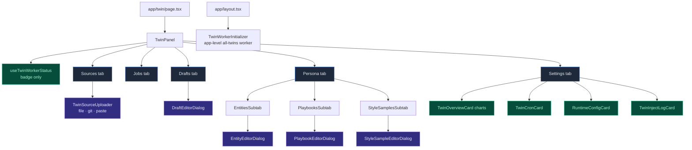

# Workbench UI

<Status variant="stable" />

<TLDR>
  The workbench (`components/twin/`, route `app/twin/page.tsx`) is the primary surface for the whole twin
  lifecycle. `TwinPanel` (`twin-panel.tsx:78`) resolves the active twin and renders **five** Radix tabs —
  Sources · Jobs · Drafts · Persona · Settings — and shows the worker badge via `useTwinWorkerStatus`. The
  job worker itself runs app-wide (see _Worker lifecycle_ below), not from the panel. The Overview, Cron, and
  Inject-log surfaces are **cards inside the Settings tab**, not top-level tabs.
</TLDR>

## Component tree



`TwinPanel` mirrors the active tab and twin to the URL (`?tab=`, `?twinId=`) and mounts the worker
unconditionally; a status badge shows whether the worker is active (and, if not, why):

```tsx title="components/twin/twin-panel.tsx:43-44 — the real tab set"
type TabKey = "sources" | "jobs" | "drafts" | "persona" | "settings"
const VALID_TABS: TabKey[] = ["sources", "jobs", "drafts", "persona", "settings"]
```

## Sources & uploader

The Sources tab (`twin-sources-tab.tsx:34`) lists registered sources (title, status badge, format, bytes,
chunk count, error) with per-row delete and a deep-link `?sourceId=` scroll/highlight. "Add source" mounts
`TwinSourceUploader` (`twin-source-uploader.tsx:492`), which has **three** input paths:

1. **File picker** — text + binary documents (binary parsed client-side via `processDocumentAsync`) and JSON
   chat-exports auto-dispatched through the importer shape detectors (`detectChatJsonImporter`,
   `twin-source-uploader.tsx:172`); mbox/eml fan out to many sources.
2. **Git repo** (Tauri only) — max-commits + author filter, `parseGitRepo` via the Tauri dialog.
3. **Paste text** — title + a format `Select` from `listSupportedFormats()` + content textarea.

All three write a `twinSource` with `status: "pending"` (fingerprinted by SHA-256). The uploader only
**registers** sources — the actual chunk ingest is triggered separately from the Jobs tab.

## Jobs tab

`twin-jobs-tab.tsx:27` exposes two queue buttons — "Queue ingest" (`enqueueIngestJob` over pending sources)
and "Queue distill" (`enqueueDistillJob`) — and a live row per job:

```tsx title="components/twin/twin-jobs-tab.tsx:33-41"
const queueIngest = async () => {
  const pending = await listTwinSourcesByTwinAndStatus(twinId, "pending")
  if (pending.length === 0) return
  await enqueueIngestJob({ twinId, sourceIds: pending.map((s) => s.id) })
}
const queueDistill = async () => {
  await enqueueDistillJob(twinId)
}
```

Each `JobRow` (`twin-jobs-tab.tsx:84`) shows a status badge (pulsing while running), kind + attempt badges, a
dead-letter badge (via `parseDeadLetter`), the live `<Progress>` bar, and a **Retry** action when the job has
failed (`retryFailedJob`). There is no pause/cancel control in the current UI even though the status enum
includes `paused`.

## Drafts tab — accept flow

`twin-drafts-tab.tsx:43` sorts pending drafts first, lowest `qualityScore` first. Each `DraftRow` shows kind,
status, a quality badge, the body, the evaluator's concerns / suggestions, and (when pending) Edit / Reject /
Accept actions. **Accept writes a real Character or Skill row**, then stamps the draft accepted with the new
id:

```tsx title="components/twin/twin-drafts-tab.tsx:126-148"
if (draft.payload.kind === "character") {
  const character = await createCharacter({
    name, description, avatarColor: "oklch(0.7 0.15 240)",
    systemPrompt: body, twinId: draft.twinId,
  })
  acceptedId = character.id
} else {
  const skill = await createSkill({ name, description, content: body })
  acceptedId = skill.id
}
await markTwinDraftAccepted(draft.id, acceptedId)
```

Editing a draft runs `assertDraftBodyClean` (the [edit-time PII guard](./distill-pipeline#two-tier-pii-defense))
before `updateTwinDraftPayload`. The standalone `UnredactDialog` (`unredact-dialog.tsx:62`) is the M2 surface
for restoring `<KIND_NNN>` placeholders to real values before a draft becomes a row (see
[accept-time un-redaction](./distill-pipeline#accept-time-un-redaction)).

## Persona tab

`twin-persona-tab.tsx:40` is a live view over `twinProfile` with three nested sub-tabs and count badges:

```tsx title="components/twin/twin-persona-tab.tsx:64-79 (abridged)"
<TabsList className="w-max">
  <TabsTrigger value="entities">{t("tabs.entities")}</TabsTrigger>
  <TabsTrigger value="playbooks">{t("tabs.playbooks")}</TabsTrigger>
  <TabsTrigger value="style">{t("tabs.styleSamples")}</TabsTrigger>
</TabsList>
<TabsContent value="entities"><EntitiesSubtab twinId={twinId} entities={safeProfile.entities} /></TabsContent>
<TabsContent value="playbooks"><PlaybooksSubtab twinId={twinId} playbooks={safeProfile.playbooks} /></TabsContent>
<TabsContent value="style"><StyleSamplesSubtab twinId={twinId} styleSamples={safeProfile.styleSamples} /></TabsContent>
```

Each sub-tab is searchable and sorts **pinned first** — entities by name, playbooks by confidence, style
samples by recency. Per-row pin / edit / delete write through the `twin-profile.ts` per-item helpers
(`setEntityPinned`, `updatePlaybook`, `removeStyleSample`, …). All three editor dialogs
(`EntityEditorDialog`, `PlaybookEditorDialog`, `StyleSampleEditorDialog`) are PII-gated via
`assertFieldsClean` and default manual additions to `pinned: true` — so a human edit always survives the next
re-distill.

## Settings tab

`twin-settings-tab.tsx:60` stacks a profile stats card and four cards:

- **`TwinOverviewCard`** (`twin-overview-card.tsx:73`) — recharts dashboard: 7-day chunk-growth area, source-kind pie, chunking-strategy bar, status row.
- **`TwinCronCard`** (`twin-cron-card.tsx:42`) — the enabled switch plus ingest/distill cron fields with a `CRON_PRESETS` picker and a human-readable preview; saving calls `updateTwin` then `syncTwinCronToScheduler`, and `CronTriggerInfo` reads the scheduler rows for last/next run.
- **`RuntimeConfigCard`** (`twin-settings-tab.tsx:101`) — the live `TwinRuntimeSettings` editor: worker-enabled + reranker switches, the embedding provider/model/key, the distill LLM, and the vector-store backend with per-backend fields (`native` shown only on Tauri, with open-folder / test-connection / reset-store actions). Saving calls `saveTwinRuntimeSettings`.
- **`TwinInjectLogCard`** (`twin-inject-log-card.tsx:30`) — the last 50 entries of the in-memory inject ring buffer (applied / skipped / degraded + chunk/sample/token counts). As noted in the [runtime page](./runtime), this is currently fed only by the workflow path.

## Worker lifecycle

The job worker is **app-level, not panel-level**. `TwinWorkerInitializer` (`twin-worker-initializer.tsx`)
is mounted once in `app/layout.tsx` (next to `SchedulerInitializer`) and calls `useBackgroundTwinWorker`,
which live-reads `TwinRuntimeSettings`, builds a twin-independent `JobWorkerConfig` via `buildTwinWorkerConfig`
(returning `null` — and thus no worker — when the worker is disabled, the vector config is incomplete, or the
LLM key is missing), and starts an **all-twins** worker (`startJobWorker(config)`, no `twinId` → drains every
twin's queue) that it stops on unmount:

```ts title="components/twin/use-twin-worker.ts (useBackgroundTwinWorker)"
useEffect(() => {
  if (!config) return
  const handle = startJobWorker(config)   // no twinId → all twins
  return () => { void handle.stop() }
}, [config])
```

This is what lets cron-enqueued ingest/distill jobs actually drain whenever the app is open — `twinJobs` is an
IndexedDB (renderer) table, so the scheduler's twin executor can only _enqueue_ into it; draining needs a live
renderer worker, and pinning that worker to the `/twin` page would mean a scheduled 03:00 ingest never ran
unless the workbench happened to be open.

The panel uses `useTwinWorkerStatus(twinId)` instead — a pure, side-effect-free derivation (it starts NO
worker, avoiding a second loop against the same queue) that returns `{ active, reasonKey? }` (reasons:
`noTwinSelected` / `disabled` / `incompleteConfig`) for the worker badge.

## Multi-twin switcher

`TwinSelector` (`twin-selector.tsx:94`) is the richer multi-twin manager — a dropdown with create / rename /
clone / archive / delete (driving `lib/db/twins.ts`) and an archived section. Note: `TwinPanel` itself uses a
plain inline `Select` for switching; `TwinSelector` is the fuller alternate surface for twin lifecycle
management.

## Next

<Cards>
  <Card title="Overview" href="./index" description="Back to the subsystem overview and module map." />
  <Card title="Data model" href="./data-model" description="The tables every tab reads and writes." />
</Cards>
