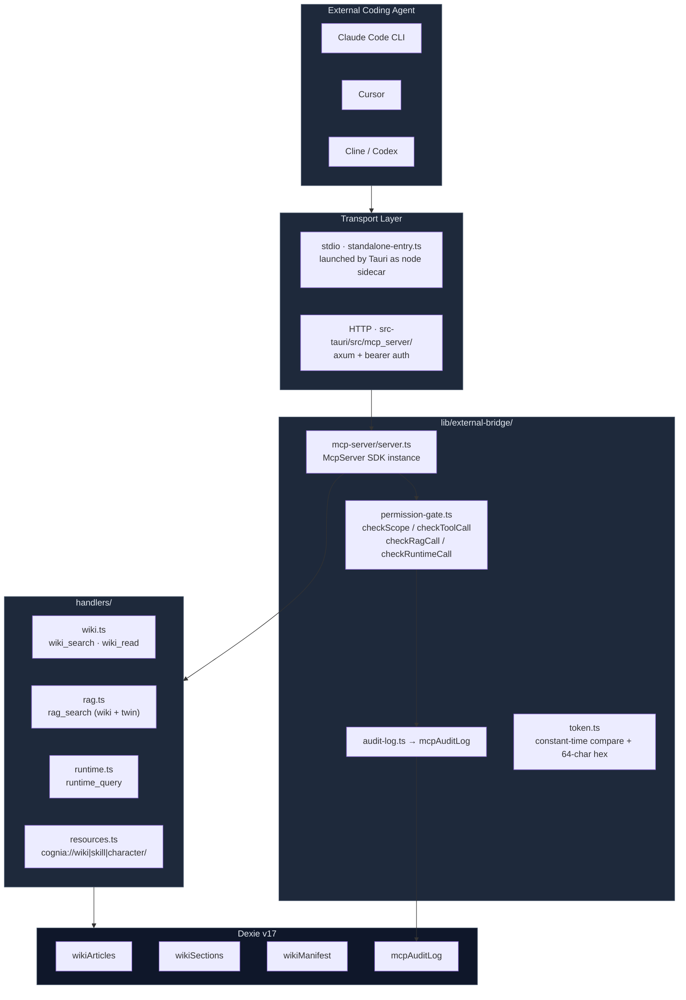

# External Bridge

<Status variant="stable">Phase 1 implemented · stdio + HTTP dual transport</Status>

<TLDR>
  External Bridge exposes Cognia's self-generated code wiki, RAG chunks, and runtime entities (skills / characters / twins / plugins / agent-teams) to external coding agents (Claude Code, Cursor, Cline, Codex) via the MCP protocol. Every call passes through a **permission-gate** and is checked against a whitelist. By default, only the `wiki:cognia` and `rag:cognia` public code scopes are enabled; all other scopes must be manually toggled in Settings. Every call writes a row to `mcpAuditLog` (capped at 5000 entries), so users can see exactly what the external agent queried under Settings → External Bridge. The stdio transport runs in a Node sidecar launched by Tauri; the HTTP transport is served by Tauri Rust (axum). Both paths reach the same `lib/external-bridge/` code.
</TLDR>

## When to Use

- Running Claude Code / Cursor inside an IDE and wanting it to "understand" Cognia's own code structure ("How does Cognia's twin distill pipeline work?").
- Exposing skills / characters already maintained in Cognia to Claude Code as readable resources (`cognia://skill/<id>` → SKILL.md).
- Letting external agents query Cognia's runtime entity inventory (`runtime_query`), e.g. "List all installed plugins."
- Reaching private context inside the user's digital twin via `rag_search` (scope=`twin`) — only available after the user **explicitly** enables `rag:twin`.

## When NOT to Use

- External agents writing into Cognia state (saving skills, writing notes) — Phase 4 will introduce inbound write tools such as `record_lesson` / `save_skill_draft`.
- Multi-machine / remote access — HTTP transport binds only to `127.0.0.1`, and the token is stored in plaintext in local IndexedDB without key management.
- Internal module self-queries — Cognia reading its own wiki should go directly through `lib/db/wiki-articles.ts`; the MCP server is for "external" use.

## Architecture



## Key Modules and File Paths

<Files>
  <Folder name="lib/external-bridge/" defaultOpen>
    <File name="types.ts" />
    <File name="permission-gate.ts" />
    <File name="audit-log.ts" />
    <File name="token.ts" />
    <File name="tauri-control.ts" />
    <Folder name="mcp-server/">
      <File name="server.ts" />
      <File name="transport-stdio.ts" />
      <File name="standalone-entry.ts" />
    </Folder>
    <Folder name="handlers/">
      <File name="wiki.ts" />
      <File name="rag.ts" />
      <File name="runtime.ts" />
      <File name="resources.ts" />
    </Folder>
  </Folder>
  <Folder name="types/wiki/">
    <File name="index.ts" />
  </Folder>
  <Folder name="lib/db/">
    <File name="wiki-articles.ts" />
    <File name="wiki-sections.ts" />
    <File name="wiki-manifest.ts" />
    <File name="mcp-audit-log.ts" />
  </Folder>
  <Folder name="components/settings/external-bridge/">
    <File name="external-bridge-section.tsx" />
    <File name="wiki-rebuild-card.tsx" />
  </Folder>
</Files>

| File | Responsibility |
| -------------------------------- | --------------------------------------------------------------------------------------------- |
| `types.ts` | Re-exports `BridgeScope` / `ExternalBridgeSettings` / `TOOL_TO_SCOPE` / `RUNTIME_ENTITY_TO_SCOPE` |
| `permission-gate.ts` | `checkScope` / `checkToolCall` / `checkRuntimeCall` / `checkRagCall` — single source of truth |
| `audit-log.ts` | `recordCall` wrapper → writes to `mcpAuditLog`; swallows Dexie failures without throwing |
| `token.ts` | 32-byte random hex token, `constantTimeEquals`, `parseBearerHeader` |
| `tauri-control.ts` | Four IPC wrappers: `startMcpServer` / `stopMcpServer` / `restartMcpServer` / `getMcpServerStatus` |
| `mcp-server/server.ts` | `buildMcpServer({ settingsGetter })` — registers four tools + three resource families + two guidance prompts |
| `mcp-server/standalone-entry.ts` | Node CLI entry; picks bridged / standalone settings source based on `COGNIA_BRIDGED` |
| `handlers/wiki.ts` | Token-overlap sorted `wiki_search` + full-text by slug `wiki_read` |
| `handlers/rag.ts` | Paragraph-level BM25-ish retrieval (dual path: wiki sections / twin chunks) |
| `handlers/runtime.ts` | List / read five runtime entity types; list omits fields to keep responses compact, get returns the full row |
| `handlers/resources.ts` | `cognia://wiki\|skill\|character/:id` URI parsing and reading |

## Permission Model

Permissions are the core of this subsystem. Ten scopes (`BridgeScope`) map one-to-one to toggles in the Settings UI:

| Scope | Default | Allowed Range |
| --------------------- | :--: | ------------------------------------------------- |
| `wiki:cognia` | ✅ | Read wiki articles generated from Cognia's own source code |
| `wiki:user-repo` | ❌ | Read wiki for user external repos (unlocks in Phase 3) |
| `rag:cognia` | ✅ | Paragraph-level RAG over Cognia source code |
| `rag:user-repo` | ❌ | Paragraph-level RAG over user external repos (Phase 3) |
| `rag:twin` | ❌ | RAG over user digital twin — involves private data, strongly defaults to OFF |
| `runtime:skills` | ❌ | List / read skills |
| `runtime:characters` | ❌ | List / read characters |
| `runtime:twins` | ❌ | List twin ids and their sources |
| `runtime:plugins` | ❌ | List / read installed plugins |
| `runtime:agent-teams` | ❌ | List / read agent teams |

Entry structure in `permission-gate.ts`:

```ts title="lib/external-bridge/permission-gate.ts"
export function checkScope(
  settings: ExternalBridgeSettings | undefined,
  scope: BridgeScope
): ScopeCheckResult {
  if (!settings) return { allowed: false, reason: "external bridge not configured" }
  if (!settings.enabled) return { allowed: false, reason: "external bridge disabled" }
  if (!settings.enabledScopes.includes(scope)) {
    return {
      allowed: false,
      reason: `scope '${scope}' not enabled — toggle it in Settings → External Bridge`,
    }
  }
  return { allowed: true }
}
```

Four helpers normalize different entry points to `checkScope`:

- `checkToolCall(settings, "wiki_search")` — looks up scope from the `TOOL_TO_SCOPE` table.
- `checkRuntimeCall(settings, "skill")` — looks up scope from `RUNTIME_ENTITY_TO_SCOPE`.
- `checkRagCall(settings, "twin")` — twin uses `rag:twin`; everything else uses `rag:cognia`.
- Unknown tool / unknown entity → directly rejected with `unknown tool` / `unknown runtime entity`.

## Data Flow

### A `wiki_search` Call

<Steps>
<Step>External agent sends a JSON-RPC `tools/call name=wiki_search` over stdio or HTTP.</Step>
<Step>The callback registered by `server.ts:registerWikiTools` receives the args.</Step>
<Step>`runWithGate` fetches `settingsGetter()` → obtains the current snapshot of `ExternalBridgeSettings`.</Step>
<Step>`checkToolCall(settings, "wiki_search")` → checks whether `wiki:cognia` is in `enabledScopes`.</Step>
<Step>If denied: `recordCall({ allowed: false, reason })` then returns an MCP envelope with `isError: true`; the external agent sees a human-readable error.</Step>
<Step>If allowed: calls `handlers/wiki.ts:wikiSearch` — which goes through `listAllWikiArticles` or `listWikiArticlesByScope`, ranks by token-overlap + pageRank, and returns the top K.</Step>
<Step>`recordCall({ allowed: true, latencyMs })` writes an audit row; the response is wrapped as `{ content: [{type:'text', text: JSON.stringify(...) }], structuredContent: {...} }` and returned.</Step>
</Steps>

### A `resources/read cognia://skill/<id>` Call

<Steps>
<Step>The SDK automatically parses the template from `ResourceTemplate("cognia://skill/{id}")`.</Step>
<Step>The registered read callback first fetches settings and checks the `runtime:skills` scope — if disabled, throws an error (the SDK converts it into a JSON-RPC error).</Step>
<Step>`parseResourceUri` splits `cognia://skill/xyz` into `{ kind: "skill", id: "xyz" }`.</Step>
<Step>`getSkill(id)` queries Dexie; missing entries throw not found.</Step>
<Step>`lib/claude/skills-io.ts:serializeSkill` serializes the result into SKILL.md format (YAML front-matter + body).</Step>
<Step>Returns `{ contents: [{ uri, mimeType: "text/markdown", text }] }` — Claude Code can render it directly.</Step>
</Steps>

## Database Tables (Dexie v17)

Four new tables, each with a dedicated CRUD module. See [Storage](../data/storage) for details.

| Table | Primary Key / Indexes | Purpose | CRUD File |
| -------------- | ----------------------------------------------- | -------------------------------------------------------- | ------------------------- |
| `wikiArticles` | `id` / `&slug` / `[scope+module]` / `pageRank` | One row per "module", containing full Markdown + embedding + sourceRefs | `lib/db/wiki-articles.ts` |
| `wikiSections` | `id` / `articleId` / `[articleId+sectionIndex]` | Small sections sliced from articles, used by `rag_search` and incremental rebuilds | `lib/db/wiki-sections.ts` |
| `wikiManifest` | `scope` (composite primary key) | Per-scope Merkle map + last build time + article count | `lib/db/wiki-manifest.ts` |
| `mcpAuditLog` | `id` / `ts` / `tool` / `allowed` | One row per MCP call; auto-prunes oldest 100 when exceeding 5000 | `lib/db/mcp-audit-log.ts` |

### `mcpAuditLog` Row Structure

```ts title="types/wiki/index.ts"
export interface McpAuditLogRow {
  id: string
  ts: number // epoch ms
  tool: string // tool or method name, e.g. "wiki_search" / "tools/list"
  scope: BridgeScope | "n/a" // n/a for protocol-level methods
  allowed: boolean // permission gate result
  latencyMs: number // handler dispatch → response written
  reason?: string // only when allowed=false
  errorMessage?: string // only when allowed=true but handler threw
}
```

The 5000-row cap is implemented in `lib/db/mcp-audit-log.ts:appendMcpAuditLog`, which calls `pruneOldest(5000` within the same transaction.

## MCP Tools and Resources

### Tools (Four)

| Tool | Required Scope | Input | Output Shape |
| --------------- | -------------------------- | -------------------------------------------------------- | ------------------------------------------ |
| `wiki_search` | `wiki:cognia` | `query` · `scope?` · `k? (1-20)` | `{ results: WikiSearchHit[], considered }` |
| `wiki_read` | `wiki:cognia` | `slug` | `WikiReadOutput \| { error }` |
| `rag_search` | `rag:cognia` or `rag:twin` | `query` · `scope?` · `twinId?` · `k? (1-30)` · `rerank?` | `{ chunks: RagSearchHit[], considered }` |
| `runtime_query` | `runtime:<entityType>` | `entityType` · `op (list\|get)` · `id?` · `filter?` | `RuntimeQueryOutput` |

When registering in `server.ts`, all tools receive `annotations: { readOnlyHint: true, destructiveHint: false, idempotentHint: true, openWorldHint: false }` — Phase 1 is read-only.

### Resources (Three URI Families)

- `cognia://wiki/<slug>` — text/markdown, full article text.
- `cognia://skill/<id>` — text/markdown, converted to SKILL.md by `serializeSkill`.
- `cognia://character/<id>` — application/json, the original character row.

Resources are also registered in `server.ts:registerResources`. The list path uses a "soft gate" (resources not in `enabledScopes` are hidden); the read path uses a "hard gate" (even if the URI is known, `checkScope` is enforced again).

### Guidance Prompts (Two)

- `cognia-howto` — "I want to browse the Cognia codebase; guide me in using your tools."
- `cognia-architecture` — A navigation prompt that breaks down Cognia's architecture by subsystem.

External agents can pull these texts via `prompts/get` and feed them into their own planning.

## Configuration and Extension Points

`AppSettings.externalBridge` is persisted in the Dexie `settings` table with the following structure:

```ts title="types/wiki/index.ts"
export interface ExternalBridgeSettings {
  enabled: boolean
  bearerToken?: string // 64-char hex (32 random bytes), required for HTTP transport
  enabledScopes: BridgeScope[] // whitelist
  httpPort?: number // last HTTP bound port (0 = OS-assigned)
  tokenRotatedAt?: number // ISO ms, for auditing
}
```

Steps to start an HTTP MCP server:

<Steps>
<Step>User clicks Generate token in Settings → writes to `externalBridge.bearerToken` (plaintext).</Step>
<Step>Check the desired scopes → writes to `externalBridge.enabledScopes`.</Step>
<Step>Click Start → frontend calls `tauri-control.ts:startMcpServer`.</Step>
<Step>Tauri Rust receives `mcp_server_start(port, token, settings_json, sidecar_path)`. See [MCP Server (Tauri)](./mcp-server-tauri) for details.</Step>
<Step>Rust launches the Node sidecar (`COGNIA_BRIDGED=1` + `COGNIA_BRIDGE_SETTINGS=<JSON>`); axum listens on `127.0.0.1:<port>`.</Step>
<Step>Returns the actually bound port (for OS-assigned cases); frontend writes it back to `httpPort`; UI shows "Running on 127.0.0.1:47920".</Step>
</Steps>

External agents can also take over the same code path via stdio: register `cognia-mcp.js` (the bundled output of `standalone-entry.ts`) as an MCP server in Claude Code / Cursor config, without starting Cognia's HTTP service.

## Related Subsystems

<Cards>
  <Card
    title="MCP Server (Tauri Side)"
    href="./mcp-server-tauri"
    description="src-tauri/src/mcp_server/ — axum + bearer auth + long-lived sidecar"
  />
  <Card
    title="MCP Server (Sidecar Side)"
    href="./mcp-server-sidecar"
    description="sidecar/a2ui-mcp.mjs + builtin-tools/ — a different kind of MCP server"
  />
  <Card
    title="Wiki Generator"
    href="./wiki-generator"
    description="lib/wiki/ — data source for wiki_search / wiki_read"
  />
  <Card
    title="A2UI System"
    href="./a2ui-system"
    description="A separate MCP pathway from External Bridge (UI drawing)"
  />
  <Card title="Employee Twin" href="./employee-twin" description="Source of chunks exposed by the rag:twin scope" />
  <Card title="Storage" href="./storage" description="Complete schema for the 4 new tables in Dexie v17" />
</Cards>

## Related ADR

- [ADR 0008 — External Bridge (LLM Wiki + MCP server)](../adr/0008-external-bridge) — full design rationale, reference comparisons (DeepWiki / claude-context), and roadmap by phase.

## Known Limitations / Open Questions

- **R1 (resolved)**: HTTP MCP server **cannot** live in an `app/api/mcp` route — Cognia's `next.config.ts:output:"export"` removes server runtime. Conclusion: HTTP must go through Tauri Rust.
- **R2 (tracking)**: When the Phase 2 npm plugin package is bundled as a standalone Node binary, Dexie in Node will need `fake-indexeddb` or a `better-sqlite3` adapter.
- **R3 (known cost)**: Full rebuild over ~150K LOC is estimated at $5–15 based on 8K input / 2K output tokens × module count. Settings UI adds a secondary confirmation; incremental rebuild is the default.
- **R7 (future mitigation)**: Wiki content is LLM-generated and carries prompt injection risk. Phase 4 inbound write tools default to OFF, and returned content will be wrapped in `<untrusted_content>`.
- **Token in plaintext**: `bearerToken` is stored in IndexedDB unencrypted; acceptable because IndexedDB is already user-local isolation. Must migrate to OS keyring when the bridge supports remote access.
- **`wiki_search` ranking**: Currently token-overlap + pageRank heuristic. Phase 2 switches to BM25 + vector cosine hybrid ranking.
- **`runtime_query entityType=twin`**: Phase 1 derives a deduplicated list by iterating `characters.twinId`. Phase 4 inbound write tools will introduce an explicit `twins` index table.
- **HTTP transport does not yet support SSE**: `POST /mcp/sse` returns 501; external agents must use `POST /mcp` single-request-single-response mode. SSE coming in Phase 2.
