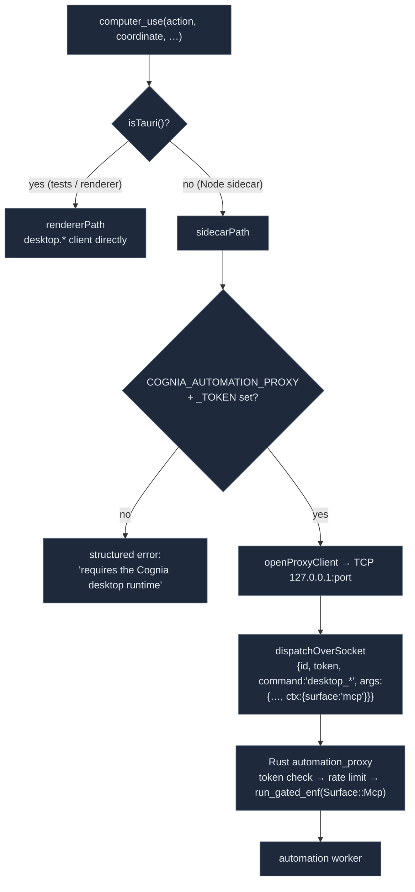

# Action tools

<Status variant="stable">Stable · `lib/external-bridge/handlers/{computer-use,connectors}.ts`</Status>

<TLDR>
  Two handlers form the action plane, both default-OFF. `computer_use` (`computer-use.ts:95`) drives the
  host desktop — screenshot / click / type / drag / scroll / keys — by opening a TCP socket to the
  Rust `automation_proxy`; the proxy forces every call through the same automation permission gate
  (`Surface::Mcp`) as in-app Computer Use, so the `mcp:computer-use` scope is necessary but not
  sufficient. The six `connectors_*` tools (`connectors.ts`) expose inbox introspection — list adapters,
  conversations, audit, drafts — and one write tool, `connectors_send_message`, which enqueues an AI
  reply through `runConnectorDigestTurn`, keeping the PII gate, policy resolver, idempotency cache, and
  outbound runner all in path.
</TLDR>

## `computer_use` — driving the desktop

The handler has two execution paths, chosen by `isTauri()` (`computer-use.ts:95`):



- **Renderer path** (`computer-use.ts:107`) — used by tests and any renderer mount; calls the
  `lib/automation/client` `desktop.*` API directly with `ctx = { surface: "mcp" }`.
- **Sidecar path** (`computer-use.ts:193`) — the production path. Reads `COGNIA_AUTOMATION_PROXY` +
  `COGNIA_AUTOMATION_PROXY_TOKEN` from the env; if either is missing it returns a clear structured error
  rather than failing silently (standalone npm mode is not yet supported).

### The proxy envelope

`openProxyClient` (`computer-use.ts:243`) late-imports `node:net`, opens one connection, and multiplexes
concurrent calls over it — each call gets a UUID `id` and its own pending callback, demuxed from the
newline-framed responses (`computer-use.ts:261-283`). Every envelope carries the shared-secret token and
a `desktop_<name>` command:

```ts title="lib/external-bridge/handlers/computer-use.ts:322"
function envelope(command: string, args: Record<string, unknown>): ProxyEnvelope {
  return { id: cryptoRandomId(), token, command, args: { ...args, ctx } }   // ctx = { surface: "mcp" }
}
```

The nine MCP `action` values map onto `desktop_*` commands: `screenshot → desktop_screenshot`,
`click → desktop_click`, `type → desktop_type`, `keys → desktop_keys`, `mouse_move →
desktop_mouse_move`, `drag → desktop_drag`, `scroll → desktop_scroll`, `hold_key → desktop_hold_key`,
`mouse_button → desktop_mouse_button`, plus `cursor_position → desktop_cursor_position`. A cached client
is reset to `null` on any error so the next call reconnects (e.g. after a sidecar restart).

<Callout type="warn" title="Two gates, not one">
  The `mcp:computer-use` MCP scope only lets the call leave the bridge. On the Rust side, the
  `automation_proxy` routes every non-probe command through `dispatcher::run_gated_enf` on
  `Surface::Mcp` — the same gate that governs in-app Computer Use — plus per-IP rate limiting and a
  bad-token lockout. In a headless context with no overlay, a `PerCall` consent tier resolves to deny.
  See [Transports → automation_proxy](./transports#automation-proxy).
</Callout>

## Inbox connector tools

Six tools (`connectors.ts`, 295 lines) sit behind two scopes: five read tools under
`inbox:connectors:read` and the single write tool under `inbox:connectors:send`.

| Tool | Reads / delegates to | Limits |
| --- | --- | --- |
| `connectors_list_adapters` | `db.adapterInstances` → `{id, type, displayName, enabled, defaultMode, muted, lastWhoamiAt}` | — |
| `connectors_list_conversations` | `db.sessions` + `conversationOverrides`, filter by adapterId/pinned/unread/archived | default 50, max 200 |
| `connectors_get_audit` | `listAuditRecent` (`lib/db/connector-audit`), optional conversationKey filter | default 100, max 500 |
| `connectors_export_audit` | `listAuditRecent` → `auditToCsv` / `auditToJson` (`lib/connectors/audit-export`) | default 500, max 5000 |
| `connectors_list_drafts` | `db.connectorDrafts`, 240-char text preview | — |
| `connectors_send_message` | `runConnectorDigestTurn` (`lib/connectors/scheduled-outbound`) | — |

The read tools are thin Dexie/aggregation queries: `connectors_list_conversations` computes `unread =
lastReadAt < session.updatedAt` and sorts by `updatedAt` desc; `connectors_list_drafts` extracts a
240-char preview from the draft segments.

### `connectors_send_message` — the one write path

This is the only action that mutates outside state. It refuses to invent a conversation: a pre-flight
checks for a bound `ChatSession` and returns a deterministic reason if none exists.

```ts title="lib/external-bridge/handlers/connectors.ts:264"
const sessions = await db.sessions
  .filter((s) => s.platformBinding?.conversationKey === input.conversationKey)
  .toArray()
if (sessions.length === 0) return { ok: false, reason: "session_missing" }
// otherwise delegate to the same AI loop the in-app digest uses:
const result = await runConnectorDigestTurn({
  adapterId: input.adapterId, conversationKey: input.conversationKey,
  characterId: input.characterId, prompt: input.prompt,
  sourceTaskId: input.sourceTaskId ?? "external-bridge",
})
```

```mermaid
sequenceDiagram
  participant Agent as External agent
  participant H as connectors_send_message
  participant DB as db.sessions
  participant Digest as runConnectorDigestTurn
  participant Loop as PII gate · policy · idempotency · outbound runner

  Agent->>H: { adapterId, conversationKey, prompt, characterId? }
  H->>DB: find session by platformBinding.conversationKey
  alt no session
    H-->>Agent: { ok:false, reason:"session_missing" }
  else session exists
    H->>Digest: runConnectorDigestTurn(... sourceTaskId="external-bridge")
    Digest->>Loop: safeSendPrompt → resolvePolicy → idempotency → enqueue
    Loop-->>Digest: result
    Digest-->>H: { success, output | error }
    H-->>Agent: { ok, detail | reason }
  end
```

Because it delegates to `runConnectorDigestTurn`, the **PII redaction** (`safeSendPrompt`), the policy
resolver, the idempotency cache, and the outbound runner all stay on the path — the external agent gets
exactly the same safety envelope as an in-app reply, tagged `sourceTaskId = "external-bridge"` in the
audit log. `SendMessageOutput` is `{ ok, reason? (session_missing | send_failed | …), detail? }`.

## Related

<Cards>
  <Card title="Transports" href="./transports" description="The automation_proxy that gates + rate-limits computer_use, and how its addr/token reach the sidecar." />
  <Card title="Platform Connectors" href="../platform-connectors" description="The ConnectorBus, adapters, and outbound runner behind the connectors_* tools." />
  <Card title="Permission model" href="./permission-model" description="The read/send scope split and the second automation gate." />
  <Card title="Computer Use" href="../sandbox" description="The automation worker + permission gate reused by computer_use." />
</Cards>
