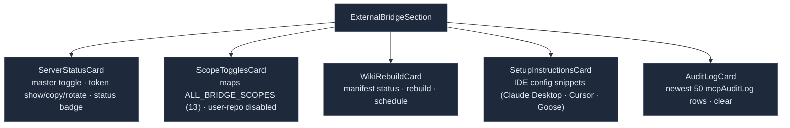

# Audit, storage & settings

<Status variant="stable">Stable · `audit-log.ts` · `lib/db/*` · `components/settings/external-bridge/`</Status>

<TLDR>
  Every gate decision — allow or deny — is recorded by `recordCall` (`audit-log.ts:38`) into the
  `mcpAuditLog` table, which self-prunes to its newest **5000** rows inside the same write transaction.
  Bearer tokens are 32-byte hex generated by `token.ts:generateToken` and compared in constant time. The
  subsystem owns **four Dexie v17 tables** (`wikiArticles`, `wikiSections`, `wikiManifest`, `mcpAuditLog`).
  The Settings UI (`external-bridge-section.tsx`) is a five-card surface — server status + token, the
  scope toggles (iterating all 13 scopes), the wiki rebuild card, IDE setup snippets, and a live audit-log
  viewer — backed by ~138 i18n keys under `settings.externalBridge`.
</TLDR>

## Audit log

`recordCall` is the thin policy wrapper every tool/resource path calls. It timestamps, maps the gate
result to a row, and **never throws** — a Dexie failure is logged and swallowed so auditing can't break a
working call:

```ts title="lib/external-bridge/audit-log.ts:40"
const row = await appendMcpAuditLog({
  ts: Date.now(),
  tool: input.tool,
  scope: input.scope,                                  // BridgeScope | "n/a"
  allowed: input.check.allowed,
  latencyMs: input.latencyMs,
  reason: input.check.allowed ? undefined : input.check.reason,
  errorMessage: input.errorMessage,                    // set when allowed but the handler threw
})
```

`appendMcpAuditLog` (`lib/db/mcp-audit-log.ts:27`) wraps the insert **and** the prune in a single
transaction:

```ts title="lib/db/mcp-audit-log.ts"
const AUDIT_CAP = 5000
// inside one rw transaction: add(row) → pruneOldest(AUDIT_CAP)
// pruneOldest deletes (total − keep) oldest rows by ts
```

`McpAuditLogRow` = `{ id, ts, tool, scope, allowed, latencyMs, reason?, errorMessage? }`. `listMcpAuditLog`
returns newest-first with optional `{ tool, deniedOnly, limit }` filters; `clearMcpAuditLog` empties it.
`scope` is `"n/a"` for protocol-level methods.

## Bearer token utilities

`token.ts` (75 lines) backs the HTTP transport's auth:

| Function | Behaviour |
| --- | --- |
| `generateToken()` | `toHex(randomBytes(TOKEN_BYTES))` → **64-char hex** (`TOKEN_BYTES = 32`) |
| `constantTimeEquals(a, b)` | XOR loop, early-out only on length mismatch — constant time on equal length |
| `verifyToken(stored, candidate)` | null-safe wrapper around the comparator |
| `parseBearerHeader(header)` | extracts the token from `Bearer <token>` via `/^Bearer\s+([A-Za-z0-9._\-]+)\s*$/` |

The token is generated on the frontend with `crypto.getRandomValues` and stored in IndexedDB in plaintext
(acceptable because IndexedDB is already user-local; revisit when the bridge supports remote access).
Rotation overwrites it in full and stamps `tokenRotatedAt`.

## Dexie v17 tables

Four tables, all declared in `lib/db/schema.ts` at `version(17)` (the DB is at v70 today; these tables
were pure additions and have not changed since):

```ts title="lib/db/schema.ts:861 (v17.stores)"
wikiArticles: "&id, &slug, scope, module, pageRank, generatedAt, [scope+module]",
wikiSections: "&id, articleId, [articleId+sectionIndex]",
wikiManifest: "&scope, lastBuildAt",
mcpAuditLog:  "&id, ts, tool, allowed, [tool+ts]",
```

| Table | Key / indexes | Purpose | CRUD |
| --- | --- | --- | --- |
| `wikiArticles` | `&id` · `&slug` · `[scope+module]` · `pageRank` | one row per module: Markdown + embedding + sourceRefs + fileHashes | `lib/db/wiki-articles.ts` |
| `wikiSections` | `&id` · `articleId` · `[articleId+sectionIndex]` | heading-rooted sections for `rag_search` | `lib/db/wiki-sections.ts` |
| `wikiManifest` | `&scope` · `lastBuildAt` | per-scope Merkle map + build metadata | `lib/db/wiki-manifest.ts` |
| `mcpAuditLog` | `&id` · `ts` · `tool` · `[tool+ts]` | one row per MCP call, capped 5000 | `lib/db/mcp-audit-log.ts` |

`wikiArticles` owns a **cascade delete**: `deleteWikiArticle` (`wiki-articles.ts:103`) and
`deleteAllWikiArticlesForScope` both wipe the article's `wikiSections` inside a transaction, keyed on the
unique `&slug` so a re-build cleanly replaces the old row.

## Settings UI

`components/settings/external-bridge/external-bridge-section.tsx` (~598 lines) mounts five cards:



- **ServerStatusCard** — toggles `externalBridge.enabled`; on enable it resolves the sidecar path
  (`~/.cognia/cognia-mcp.js`) and calls `startMcpServer(...)`, on disable `stopMcpServer()`. Shows / copies
  / rotates the bearer token (`generateToken` + `tokenRotatedAt`) and renders a live/idle/web badge.
- **ScopeTogglesCard** — maps `ALL_BRIDGE_SCOPES`, rendering one switch per scope with an i18n description
  (`scopeDescriptions.<scope>`); the two `user-repo` scopes are disabled (`PHASE_1_DISABLED_SCOPES`,
  `external-bridge-section.tsx:72`). Persists `enabledScopes` on change.
- **AuditLogCard** — `useLiveQuery(listMcpAuditLog({ limit: 50 }))` renders the newest 50 calls with a
  clear-confirm dialog wired to `clearMcpAuditLog`.

### Wiki rebuild card

`wiki-rebuild-card.tsx` (~361 lines) shows the current `wikiManifest` (scope, lastBuild, articleCount,
generator), a force-rebuild toggle, the schedule sub-form (off / daily / weekly / custom cron + force), and
the result box (added / changed / removed / unchanged / errors). `onRebuild` calls
`runWikiRebuild({ force })`; `onSaveSchedule` merges `wikiSchedule` into settings then
`syncWikiCronToScheduler(schedule)` (see [Wiki generator → Scheduled rebuilds](./wiki-generator#scheduled-rebuilds)).

All user-facing strings live under the `settings.externalBridge` i18n namespace (~138 keys across
`wikiIndex`, `server`, `scopes`/`scopeDescriptions`, `setup`, and `audit`) in both `en.json` and
`zh-CN.json`.

## Related

<Cards>
  <Card title="Permission model" href="./permission-model" description="The scope whitelist these toggles edit, and the gate that produces every audit row." />
  <Card title="Wiki generator" href="./wiki-generator" description="The pipeline the rebuild card drives and the tables it writes." />
  <Card title="Transports" href="./transports" description="startMcpServer / the lifecycle the server-status card calls." />
  <Card title="Storage" href="../../data/storage" description="The full Dexie schema the four bridge tables live in." />
</Cards>
