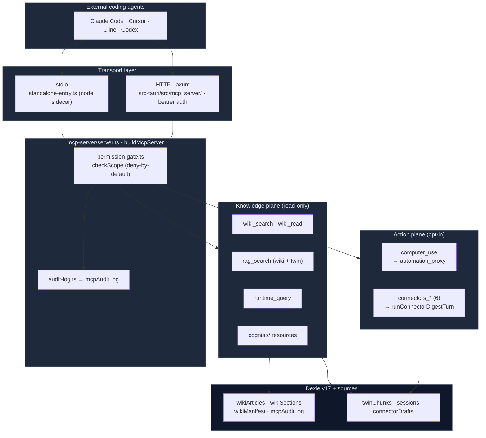

# External Bridge

<Status variant="stable">Stable · 13 scopes · stdio + HTTP · Dexie v17</Status>

<TLDR>
  External Bridge reverses Cognia's integration flow: instead of Cognia driving Claude Code / Cursor
  as subagents, it lets *those* agents read a window into Cognia over the **Model Context Protocol**.
  The surface is two-tiered — a **read-only knowledge plane** (generated code wiki, section-level RAG,
  runtime-entity inventory, URI resources) and a **gated action plane** (`computer_use` desktop driving,
  six inbox-connector tools). Every tool/resource call passes through `permission-gate.ts:checkScope`
  against a per-scope whitelist that is **deny-by-default** — only `wiki:cognia` + `rag:cognia` are ON
  for a fresh install — and writes one row to `mcpAuditLog` (capped 5000). The MCP server skeleton
  (`mcp-server/server.ts:buildMcpServer`) is transport-agnostic: a Node sidecar runs it over **stdio**,
  and the Tauri Rust side (`src-tauri/src/mcp_server/`, axum) serves the same sidecar over **HTTP** with
  bearer auth. `computer_use` is routed through a dedicated `automation_proxy` side-channel so it is
  gated + rate-limited by the same automation permission gate as in-app Computer Use.
</TLDR>

<StatGrid>
  <Stat label="Permission scopes" value="13" hint="2 ON by default (wiki:cognia · rag:cognia)" />
  <Stat label="MCP tools" value="11" hint="5 knowledge · 1 computer_use · 5+1 connectors" />
  <Stat label="URI resources" value="3" hint="cognia://wiki|skill|character" />
  <Stat label="Guidance prompts" value="2" hint="cognia-howto · cognia-architecture" />
  <Stat label="Transports" value="2" hint="stdio sidecar · axum HTTP (1 MiB)" />
  <Stat label="Dexie tables" value="4" hint="wikiArticles · wikiSections · wikiManifest · mcpAuditLog (v17)" />
</StatGrid>

## The asymmetry it closes

Before the bridge, Cognia had three asymmetric edges with the LLM-coding-agent ecosystem
([ADR-0008](../../adr/0008-external-bridge)):

1. **Outbound** — full ACP / OpenCode / Anthropic-SDK client coverage so Cognia can drive Claude Code,
   Cursor, Codex as subagents.
2. **In-process plugins** — the rich `lib/plugin/` system (tools / modes / hooks / marketplace).
3. **Inbound** — *nothing*. The user's daily Claude Code session was blind to everything Cognia had
   already distilled for them.

External Bridge is edge #3. It exposes a read-only window (and, behind explicit opt-in, a narrow action
window) so the agents the user runs *outside* Cognia can consult what Cognia knows.

## The two planes



The **knowledge plane** answers "how does Cognia work / what does it know" — grounded in the generated
wiki and the digital twin. The **action plane** answers "do something on my behalf" — drive the desktop,
or reply to an inbox conversation through the full AI loop. The two are split at the scope level so an
operator can grant deep introspection without ever enabling automated side effects.

## Where it lives

```
lib/external-bridge/
  types.ts              # BridgeScope re-exports + TOOL_TO_SCOPE + RUNTIME_ENTITY_TO_SCOPE
  permission-gate.ts    # checkScope + 4 per-entrypoint wrappers (the only source of truth)
  audit-log.ts          # recordCall → mcpAuditLog (swallows Dexie failures)
  token.ts              # 32-byte hex bearer + constant-time compare + Bearer header parse
  tauri-control.ts      # 4 IPC wrappers for the Rust HTTP lifecycle
  mcp-server/
    server.ts           # buildMcpServer — registers 11 tools + 3 resources + 2 prompts
    transport-stdio.ts  # createStdioTransport (SDK StdioServerTransport)
    standalone-entry.ts # node CLI; COGNIA_BRIDGED selects bridged vs standalone settings
  handlers/
    wiki.ts rag.ts runtime.ts resources.ts   # knowledge plane
    computer-use.ts connectors.ts            # action plane

src-tauri/src/mcp_server/
  mod.rs commands.rs http_server.rs sidecar.rs types.rs automation_proxy.rs

lib/wiki/               # the content producer for the knowledge plane (see Wiki Generator)
lib/db/{wiki-articles,wiki-sections,wiki-manifest,mcp-audit-log}.ts   # Dexie v17 CRUD
components/settings/external-bridge/   # the Settings surface
```

## Module map

<Cards>
  <Card title="Permission model" href="./permission-model" description="The 13 scopes, deny-by-default whitelist, checkScope + the four per-entrypoint wrappers, soft vs hard resource gating." />
  <Card title="MCP server" href="./mcp-server" description="buildMcpServer: the runWithGate envelope, how 11 tools / 3 resources / 2 prompts are registered, the SDK capabilities." />
  <Card title="Knowledge tools" href="./knowledge-tools" description="wiki_search ranking, rag_search (wiki token-overlap + twin BM25), runtime_query list/get, cognia:// resources." />
  <Card title="Action tools" href="./action-tools" description="computer_use over the automation_proxy side-channel, and the six inbox connector tools (read + send_message)." />
  <Card title="Transports" href="./transports" description="stdio sidecar + standalone-entry, the Rust/axum HTTP server, the long-lived serial sidecar, automation_proxy, tauri-control." />
  <Card title="Wiki generator" href="./wiki-generator" description="lib/wiki: Merkle-incremental walk → Twin chunker → 4 LLM sub-agents → wikiArticles/wikiSections, plus the cron schedule." />
  <Card title="Audit, storage & settings" href="./audit-and-settings" description="audit-log + the 5000-cap mcpAuditLog, the 4 Dexie v17 tables, token utilities, and the Settings UI." />
</Cards>

## Default posture

<Callout type="warn" title="Deny-by-default, opt-in everything sensitive">
  A fresh install enables only `wiki:cognia` + `rag:cognia` (`types/wiki/index.ts:93`,
  `DEFAULT_ENABLED_SCOPES`). The master switch `externalBridge.enabled` defaults to `false`, so neither
  transport spawns until the user turns it on. Twin RAG, every runtime-entity family, `computer_use`,
  and the inbox connectors are all OFF until explicitly toggled in Settings → External Bridge. The gate
  treats `undefined` settings as "all OFF", so a freshly-started sidecar fails closed.
</Callout>

## Related

<Cards>
  <Card title="ADR-0008" href="../../adr/0008-external-bridge" description="The original design rationale, DeepWiki / claude-context references, and the phased roadmap." />
  <Card title="Computer Use" href="../sandbox" description="The automation worker + permission gate that computer_use reuses through the proxy." />
  <Card title="Platform Connectors" href="../platform-connectors" description="The inbox / ConnectorBus / outbound runner that the connectors_* tools delegate to." />
  <Card title="Employee Twin" href="../employee-twin" description="The source of chunks exposed by the rag:twin scope." />
  <Card title="Storage" href="../../data/storage" description="The full Dexie v17 schema for the four bridge tables." />
</Cards>
